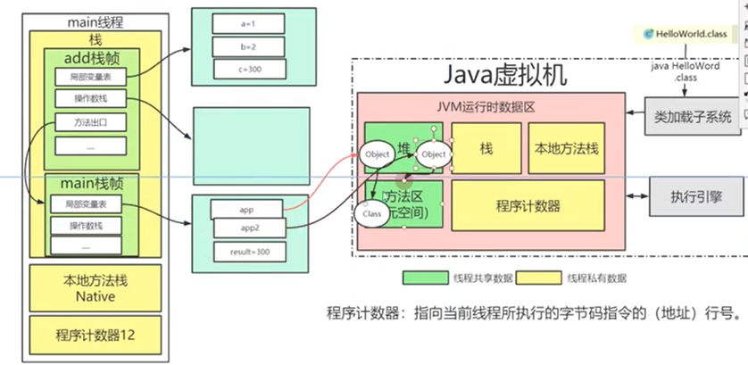
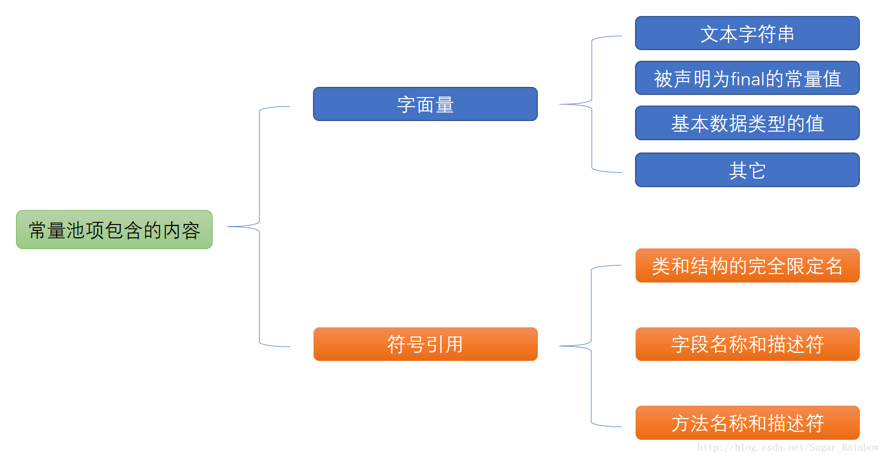
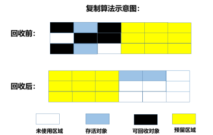

​	JVM屏蔽了与具体操作系统平台相关的信息，使Java程序只需生成在Java虚拟机上运行的目标代码（字节码）,就可以在多种平台上不加修改地运行。JVM在执行字节码时，实际上最终还是把字节码解释成具体平台上的机器指令执行。

# JVM组成

总共分为三大区域

- 类加载子系统
- 运行时数据区
- 执行引擎

## 线程共享

- **方法区：**用于存储虚拟机加载的类信息，常量，静态变量等数据
- **堆：**存放对象实例，所有的对象和数组都要在堆上分配。是JVM所管理的

### 方法区

方法区是一个概念，属于共享内存区域，规范为存储`已被虚拟机加载的类信息、常量、静态变量、即时编译器编译后的代码`等数据。虽然Java虚拟机规范把⽅法区描述为堆的⼀个逻辑部分，但 是它却有⼀个别名叫做 Non-Heap（⾮堆），⽬的应该是与 Java 堆区分开来。

#### ⽅法区和永久代的关系

> 《Java虚拟机规范》只是规定了有⽅法区这么个概念和它的作⽤，并没有规定如何去实现它。那 么，在不同的 JVM 上⽅法区的实现肯定是不同的了。 ⽅法区和永久代的关系很像Java中接⼝和类 的关系，类实现了接⼝，⽽永久代就是HotSpot虚拟机对虚拟机规范中⽅法区的⼀种实现⽅式。 也 就是说，永久代是HotSpot的概念，⽅法区是Java虚拟机规范中的定义，是⼀种规范，⽽永久代是⼀ 种实现，⼀个是标准⼀个是实现，其他的虚拟机实现并没有永久带这⼀说法。

#### 版本迭代：

- 在**JDK1.7之前**：永久代

  > 运行时常量池逻辑包含字符串常量池存放在方法区, 此时hotspot虚拟机对方法区的实现为**永久代**

  

- 在**JDK1.7**：永久代和堆

  > 字符串常量池被从方法区拿到了**堆**中, 这里没有提到运行时常量池,也就是说**字符串常量池**被单独拿到**堆**,**运行时常量池剩下的东西**还在**方法区**, 也就是hotspot中的**永久代**

  

- 在**JDK1.8**： 元空间和堆

  > hotspot移除了**永久代**用**元空间(Metaspace)**取而代之, 这时候**字符串常量池还在堆**, **运行时常量池还在方法区**, 只不过方法区的实现从永久代变成了元空间(Metaspace) ，元空间并不在虚拟机中，而是在本地内存(Direct Memory)

#### 为什么要将永久代(PermGen)替换为元空间(MetaSpace)呢?

整个永久代有⼀个 JVM 本身设置固定⼤⼩上线，⽆法进⾏调整，⽽元空间使⽤的是直接内存，受本机 可⽤内存的限制，并且永远不会得到`java.lang.OutOfMemoryError`。你可以使⽤ -XX： MaxMetaspaceSize 标志设置最⼤元空间⼤⼩，默认值为 unlimited，这意味着它只受系统内存的限 制。 -XX：MetaspaceSize 调整标志定义元空间的初始⼤⼩如果未指定此标志，则 Metaspace 将根 据运⾏时的应⽤程序需求动态地重新调整⼤⼩。 当然这只是其中⼀个原因，还有很多底层的原因，这⾥就不提了。

### 堆

Java 虚拟机所管理的内存中最⼤的⼀块，Java 堆是所有线程共享的⼀块内存区域，在虚拟机启动时创 建。此内存区域的唯⼀⽬的就是存放对象实例，⼏乎所有的对象实例以及数组都在这⾥分配内存。 Java 堆是垃圾收集器管理的主要区域，因此也被称作GC堆（`Garbage Collected Heap`）.从垃圾回收的 ⻆度，由于现在收集器基本都采⽤分代垃圾收集算法，所以Java堆还可以细分为：新⽣代和⽼年代：再 细致⼀点有：Eden空间、From Survivor、To Survivor空间等。进⼀步划分的⽬的是更好地回收内存， 或者更快地分配内存。

上图所示的 eden区、s0区、s1区都属于新⽣代，tentired 区属于⽼年代。⼤部分情况，对象都会⾸先 在 Eden 区域分配，在⼀次新⽣代垃圾回收后，如果对象还存活，则会进⼊ s0 或者 s1，并且对象的 年龄还会加 1(Eden区i>Survivor 区后对象的初始年龄变为1)，当它的年龄增加到⼀定程度（默认为15 岁），就会被晋升到⽼年代中。对象晋升到⽼年代的年龄阈值，可以通过参数 - XX:MaxTenuringThreshold 来设置。

## 常量池

## 线程私有

- **虚拟机栈：**Java方法执行的内存模型，存储局部变量表(包括成员变量，对象地址，即引用类型)，操作数栈，动态链接，方法出口信息。随线程创建和销毁
- **本地方法栈：**与虚拟机栈相似，不同点本地方法栈为native方法执行服务，虚拟机栈为虚拟机栈执行的Java方法服务
- **程序计数器：**当前线程所执行的行号指示器。是JVM内存区域最小的一块区域。执行字节码工作时就是利用程序计数器来选取下一条需要执行的字节码指令

### 虚拟机栈

与程序计数器⼀样，Java虚拟机栈也是线程私有的，它的⽣命周期和线程相同，描述的是 Java ⽅法执 ⾏的内存模型，每次⽅法调⽤的数据都是通过栈传递的。 

Java 内存可以粗糙的区分为堆内存（Heap）和栈内存(Stack),其中栈就是现在说的虚拟机栈，或者说 是虚拟机栈中局部变量表部分。 （实际上，Java虚拟机栈是由⼀个个**栈帧**组成，⽽每个栈帧中都拥 有：**局部变量表、操作数栈、动态链接、⽅法出⼝信息。**）

局部变量表主要存放了编译器可知的各种数据类型（boolean、byte、char、short、int、float、 long、double）、对象引⽤（reference类型，它不同于对象本身，可能是⼀个指向对象起始地址的引 ⽤指针，也可能是指向⼀个代表对象的句柄或其他与此对象相关的位置）。 

Java 虚拟机栈会出现两种异常：`StackOverFlowError` 和 `OutOfMemoryError`。

> - **StackOverFlowError**： 若Java虚拟机栈的内存⼤⼩不允许动态扩展，那么当线程请求栈的深度 超过当前Java虚拟机栈的最⼤深度的时候，就抛出StackOverFlowError异常。 
> - **OutOfMemoryError**： 若 Java 虚拟机栈的内存⼤⼩允许动态扩展，且当线程请求栈时内存⽤完 了，⽆法再动态扩展了，此时抛出OutOfMemoryError异常。 

Java 虚拟机栈也是线程私有的，每个线程都有各⾃的Java虚拟机栈，⽽且随着线程的创建⽽创建，随 着线程的死亡⽽死亡。 

扩展：那么⽅法/函数如何调⽤？ Java 栈可⽤类⽐数据结构中栈，Java 栈中保存的主要内容是栈帧，每⼀次函数调⽤都会有⼀个对应的 栈帧被压⼊Java栈，每⼀个函数调⽤结束后，都会有⼀个栈帧被弹出。 Java⽅法有两种返回⽅式： 

1. return 语句。 
2. 抛出异常。 

管哪种返回⽅式都会导致栈帧被弹出。

### 本地方法栈

和虚拟机栈所发挥的作⽤⾮常相似，区别是： 虚拟机栈为虚拟机执⾏ Java ⽅法 （也就是字节码）服 务，⽽本地⽅法栈则为虚拟机使⽤到的 Native ⽅法服务。 

在 HotSpot 虚拟机中和 Java 虚拟机栈合 ⼆为⼀。 本地⽅法被执⾏的时候，在本地⽅法栈也会创建⼀个栈帧，⽤于存放该本地⽅法的局部变量表、操作数 栈、动态链接、出⼝信息。 

⽅法执⾏完毕后相应的栈帧也会出栈并释放内存空间，也会出现 `StackOverFlowError` 和 `OutOfMemoryError` 两种异常。

### 程序计数器

程序计数器是⼀块较⼩的内存空间，可以看作是当前线程所执⾏的字节码的⾏号指示器。字节码解释器 ⼯作时通过改变这个计数器的值来选取下⼀条需要执⾏的字节码指令，分⽀、循环、跳转、异常处理、 线程恢复等功能都需要依赖这个计数器来完。 另外，为了线程切换后能恢复到正确的执⾏位置，每条线程都需要有⼀个独⽴的程序计数器，各线程之 间计数器互不影响，独⽴存储，我们称这类内存区域为“线程私有”的内存。

程序计数器主要有下⾯两个作⽤：

1. 字节码解释器通过改变程序计数器来依次读取指令，从⽽实现代码的流程控制，如：顺序执⾏、 选择、循环、异常处理。 
2. 在多线程的情况下，**程序计数器⽤于记录当前线程执⾏的位置**，从⽽当线程被切换回来的时候能 够知道该线程上次运⾏到哪⼉了。

需要注意的是，如果执⾏的是 **native** ⽅法，那么程序计数器记录的是 **undefined** 地址，只有执⾏的 是 Java 代码时程序计数器记录的才是下⼀条指令的地址。 所以，程序计数器私有主要是为了线程切换后能恢复到正确的执⾏位置。程序计数器是唯⼀⼀个不会出现 OutOfMemoryError 的内存区域，它的⽣命周期随着线程的创建 ⽽创建，随着线程的结束⽽死亡。

## 虚拟机栈和本地⽅法栈为什么是线程私有的?

- **虚拟机栈：** 每个 Java ⽅法在执⾏的同时会创建⼀个栈帧⽤于**存储局部变量表、操作数栈、常量池**引⽤等信息。从⽅法调⽤直⾄执⾏完成的过程，就对应着⼀个栈帧在 Java 虚拟机栈中⼊栈 和出栈的过程。 
- **本地⽅法栈：** 和虚拟机栈所发挥的作⽤⾮常相似，区别是： 虚拟机栈为虚拟机执⾏ Java ⽅法 （也就是字节码）服务，⽽本地⽅法栈则为虚拟机使⽤到的 Native ⽅法服务。 在 HotSpot 虚 拟机中和 Java 虚拟机栈合⼆为⼀。

所以，**为了保证线程中的局部变量不被别的线程访问到**，虚拟机栈和本地⽅法栈是线程私有的。

# 堆和栈的区别联系？

参考

> - https://www.cnblogs.com/weichunguang/p/wei6.html

Java把内存划分成两种：一种是栈内存，一种是堆内存。

## 作用

- **堆：**存放对象实例，所有的对象和数组都要在堆上分配。是JVM所管理的
- **栈：**Java方法执行的内存模型，存储局部变量表，操作数栈，动态链接，方法出口信息。随线程创建和销毁

## 私有或共享

- **堆：**内存中的对象对所有线程可见。堆内存中的对象可以被所有线程访问。线程共享
- **栈：**内存归属于单个线程，每个线程都会有一个栈内存，其存储的变量只能在其所属线程中可见，即栈内存可以理解成线程的私有内存。线程私有

## 异常错误

- **堆内存：**没有可用的空间存储生成的对象，JVM会抛出**java.lang.OutOfMemoryError**。
- **栈内存：**没有可用的空间存储方法调用和局部变量，JVM会抛出**java.lang.StackOverFlowError**。

## 空间大小

# GC(Garbage Collection)垃圾回收

参考

> - https://blog.csdn.net/laomo_bible/article/details/83112622

## 需要GC的区域

jvm 中，`程序计数器`、`虚拟机栈`、`本地方法栈`都是随线程而生随线程而灭，栈帧随着方法的进入和退出做入栈和出栈操作，实现了自动的内存清理，因此，我们的内存垃圾回收主要集中于 java `堆`和`方法区`中，在程序运行期间，这部分内存的分配和使用都是动态的。

## GC的对象

需要进行回收的对象就是已经没有存活的对象，判断一个对象是否存活常用的有两种办法：

> - **引用计数**：每个对象有一个引用计数属性，新增一个引用时计数加1，引用释放时计数减1，计数为0时可以回收。此方法简单，无法解决对象相互循环引用的问题，而且计数器需要维护，需要消耗，**所以很少用**。
>
> - **可达分析**：从GC Roots开始向下搜索，搜索所走过的路径称为引用链。当一个对象到GC Roots没有任何引用链相连时，则证明此对象是不可用的。不可达对象。在Java语言中，GC Roots包括：
>
>   > - 虚拟机栈中引用的对象。
>   > - 方法区中类静态属性实体引用的对象。
>   > - 方法区中常量引用的对象。
>   > - 本地方法栈中JNI引用的对象。

## 什么时候触发GC

- 程序调用`System.gc()`时可以触发
- 系统自身来决定GC触发的时机（根据`Eden`区和`From Space`区的内存大小来决定。当内存大小不足时，则会启动GC线程并停止应用线程）

GC又分为 `minor GC` 和 `Full GC` (也称为 `Major GC` )

### Minor GC触发条件

当Eden区满时，触发Minor GC。

### Full GC触发条件

- 调用System.gc时，系统建议执行Full GC，但是不必然执行
- 老年代空间不足
- 方法区空间不足
- 通过Minor GC后进入老年代的平均大小大于老年代的可用内存
- 由Eden区、From Space区向To Space区复制时，对象大小大于To Space可用内存，则把该对象转存到老年代，且老年代的可用内存小于该对象大小

## GC常用算法

- 标记-清除算法（Mark-Sweep）
- 标记-压缩算法
- 复制算法
- 分代收集算法。

目前主流的JVM（HotSpot）采用的是**分代收集算法**。

### 标记-清除算法

为每个对象存储一个标记位，记录对象的状态（活着或是死亡）。标记-清除算法执行分两阶段。

- **第一阶段标记**：从`引用根节点`开始标记所有被引用的对象，为每个对象更新标记位，检查对象是否死亡
- **第二阶段清除**：该阶段对死亡的对象进行清除，执行 GC 操作。遍历`整个堆`，把未标记的对象清除。此算法需要暂停整个应用，并且会产生内存碎片。

#### 优点

最大的优点是，标记—清除算法中每个活着的对象的引用只需要找到一个即可，找到一个就可以判断它为活的。此外，更重要的是，这个算法并不移动对象的位置。

#### 缺点

- 它的缺点就是效率比较低（递归与全堆对象遍历）：每个活着的对象都要在标记阶段遍历一遍；
- 释放空间不连续容易导致内存碎片：所有对象都要在清除阶段扫描一遍，因此算法复杂度较高。没有移动对象，导致可能出现很多碎片空间无法利用的情况，标记清除后会有大量的不连续的内存碎片，空间碎片太多就会导致无法分配较大对象，无法找到足够大的连续内存，而发生gc。
- 清除时会暂停应用。

### 标记-整理算法

标记-整理算法结合了`“标记-清除”`和`“复制”`两个算法的优点。也是分两阶段：

- **第一阶段标记**：该算法也将所有对象从`根节点`标记为`存活`和`死亡`两种状态
- **第二阶段**：在第二个阶段，该算法并没有直接对死亡的对象进行清理，而是将`所有存活的对象`整理一下压缩在一块，放到另一处空间，然后把剩下的所有对象全部清除。

#### 优点

该算法不会像`标记-清除`算法那样产生大量的碎片空间，避免了`内存碎片`，也避免了`复制`算法的`空间利用不足`问题。

#### 缺点

如果存活的对象过多，整理阶段将会执行较多复制操作，导致算法效率降低。

### 复制算法

该算法将内存平均分成两部分，然后每次只使用其中的一部分，当这部分内存满的时候，将内存中`所有存活的对象`复制到另一个内存中，然后将之前的内存清空，只使用这部分内存，循环下去。复制算法每次只处理正在使用中的对象，因此复制成本比较小，同时复制过去以后还能进行相应的内存整理，不会出现`“碎片”`问题。当然，此算法的缺点也是很明显的，就是`需要两倍内存空间`。

> 这个算法与`标记-整理算法`的区别在于，该算法不是在同一个区域复制，而是将所有存活的对象复制到另一个区域内。

#### 优点

不会出现内存碎片问题

#### 缺点

只有一半的内存空间能使用

### 分代收集算法

现在的虚拟机垃圾收集大多采用这种方式，它根据对象的生存周期，将堆分为：

- **新生代(Young)**：由于对象生存期短，每次回收都会有大量对象死去，空间较多，那么这时就采用`复制算法`

  > 例如：方法的局部变量引用的对象等

  

- **老年代(Tenure)**：老年代里的对象存活率较高，没有额外的空间进行分配担保，空间较少，所以可以使用`标记-整理` 或者 `标记-清除`。

  > 例如：缓存对象、单例对象等

  

- **永久代**：对象生成后几乎不灭的对象

  > 例如：加载过的类信息

堆大小=新生代+老年代；（新生代占堆空间的1/3、老年代占堆空间2/3）

#### 新生代

组成

- Eden（伊甸园）：这是对象最初诞生的区域，并且对大多数对象来说，这里是它们唯一存在过的区域。 

- Survivor（幸存者乐园）：从伊甸园幸存下来的对象会被挪到这里

  > - From Survivor
  > - To Survivor

比例：Eden ：From Survivor：To Survivor = `8：1：1`

新生代这样划分是为了更好的管理堆内存中的对象，方便GC算法---`复制算法`来进行垃圾回收。

JVM每次只会使用eden和其中一块survivor来为对象服务，所以无论什么时候，都会有一块survivor空间，因此新生代实际可用空间只有90%。

#### 为什么要有Survivor区

参考

> - https://www.jianshu.com/p/2caad185ee1f

为什么需要Survivor空间。我们看看如果没有 Survivor 空间的话，垃圾收集将会怎样进行：一遍新生代 Minor gc 过后，不管三七二十一，活着的对象全部进入老年代，即便它在接下来的几次 gc 过程中极有可能被回收掉。这样的话老年代很快被填满， Full GC 的频率大大增加。我们知道，老年代一般都会被规划成比新生代大很多，对它进行垃圾收集会消耗比较长的时间；如果收集的频率又很快的话，那就更糟糕了。基于这种考虑，虚拟机引进了“幸存区”的概念：如果对象在某次新生代 gc 之后任然存活，让它暂时进入幸存区；以后每熬过一次 gc ，让对象的年龄＋1，直到其年龄达到某个设定的值（比如15岁）， JVM 认为它很有可能是个“老不死的”对象，再呆在幸存区没有必要（而且老是在两个幸存区之间反复地复制也需要消耗资源），才会把它转移到老年代。

总之，设置Survivor空间的目的是让那些中等寿命的对象尽量在 Minor GC 时被干掉，最终在总体上减少虚拟机的垃圾收集过程对用户程序的影响。

#### 为什么有两个Survivor区

## Minor GC || Full GC(Major GC)

