​	JVM屏蔽了与具体操作系统平台相关的信息，使Java程序只需生成在Java虚拟机上运行的目标代码（字节码）,就可以在多种平台上不加修改地运行。JVM在执行字节码时，实际上最终还是把字节码解释成具体平台上的机器指令执行。

# 参考

> - https://blog.csdn.net/qq_41701956/article/details/81664921

# 1. JVM组成

总共分为三大区域

- 类加载子系统
- 运行时数据区
- 执行引擎

## 1.1 线程共享

- **方法区：**用于存储虚拟机加载的类信息，常量，静态变量等数据
- **堆：**存放对象实例，所有的对象和数组都要在堆上分配。是JVM所管理的

### 1.1.1 方法区

方法区是一个概念，属于共享内存区域，规范为存储`已被虚拟机加载的类信息、常量、静态变量、即时编译器编译后的代码`等数据。虽然Java虚拟机规范把⽅法区描述为堆的⼀个逻辑部分，但 是它却有⼀个别名叫做 Non-Heap（⾮堆），⽬的应该是与 Java 堆区分开来。

#### ⽅法区和永久代的关系

> 《Java虚拟机规范》只是规定了有⽅法区这么个概念和它的作⽤，并没有规定如何去实现它。那 么，在不同的 JVM 上⽅法区的实现肯定是不同的了。 ⽅法区和永久代的关系很像Java中接⼝和类 的关系，类实现了接⼝，⽽永久代就是HotSpot虚拟机对虚拟机规范中⽅法区的⼀种实现⽅式。 也 就是说，永久代是HotSpot的概念，⽅法区是Java虚拟机规范中的定义，是⼀种规范，⽽永久代是⼀ 种实现，⼀个是标准⼀个是实现，其他的虚拟机实现并没有永久带这⼀说法。

#### 版本迭代：

- 在**JDK1.7之前**：永久代

  > 运行时常量池逻辑包含字符串常量池存放在方法区, 此时hotspot虚拟机对方法区的实现为**永久代**

  

- 在**JDK1.7**：永久代和堆

  > 字符串常量池被从方法区拿到了**堆**中, 这里没有提到运行时常量池,也就是说**字符串常量池**被单独拿到**堆**,**运行时常量池剩下的东西**还在**方法区**, 也就是hotspot中的**永久代**

  

- 在**JDK1.8**： 元空间和堆

  > hotspot移除了**永久代**用**元空间(Metaspace)**取而代之, 这时候**字符串常量池还在堆**, **运行时常量池还在方法区**, 只不过方法区的实现从永久代变成了元空间(Metaspace) ，元空间并不在虚拟机中，而是在本地内存(Direct Memory)

#### 为什么要将永久代(PermGen)替换为元空间(MetaSpace)呢?

整个永久代有⼀个 JVM 本身设置固定⼤⼩上线，⽆法进⾏调整，⽽元空间使⽤的是直接内存，受本机 可⽤内存的限制，并且永远不会得到`java.lang.OutOfMemoryError`。你可以使⽤ -XX： MaxMetaspaceSize 标志设置最⼤元空间⼤⼩，默认值为 unlimited，这意味着它只受系统内存的限 制。 -XX：MetaspaceSize 调整标志定义元空间的初始⼤⼩如果未指定此标志，则 Metaspace 将根 据运⾏时的应⽤程序需求动态地重新调整⼤⼩。 当然这只是其中⼀个原因，还有很多底层的原因，这⾥就不提了。

### 1.1.2 堆

Java 虚拟机所管理的内存中最⼤的⼀块，Java 堆是所有线程共享的⼀块内存区域，在虚拟机启动时创 建。此内存区域的唯⼀⽬的就是存放对象实例，⼏乎所有的对象实例以及数组都在这⾥分配内存。 Java 堆是垃圾收集器管理的主要区域，因此也被称作GC堆（`Garbage Collected Heap`）.从垃圾回收的 ⻆度，由于现在收集器基本都采⽤分代垃圾收集算法，所以Java堆还可以细分为：新⽣代和⽼年代：再 细致⼀点有：Eden空间、From Survivor、To Survivor空间等。进⼀步划分的⽬的是更好地回收内存， 或者更快地分配内存。

上图所示的 eden区、s0区、s1区都属于新⽣代，tentired 区属于⽼年代。⼤部分情况，对象都会⾸先 在 Eden 区域分配，在⼀次新⽣代垃圾回收后，如果对象还存活，则会进⼊ s0 或者 s1，并且对象的 年龄还会加 1(Eden区i>Survivor 区后对象的初始年龄变为1)，当它的年龄增加到⼀定程度（默认为15 岁），就会被晋升到⽼年代中。对象晋升到⽼年代的年龄阈值，可以通过参数 - XX:MaxTenuringThreshold 来设置。

## 1.2 常量池

## 1.3 线程私有

- **虚拟机栈：**Java方法执行的内存模型，存储局部变量表(包括成员变量，对象地址，即引用类型)，操作数栈，动态链接，方法出口信息。随线程创建和销毁
- **本地方法栈：**与虚拟机栈相似，不同点本地方法栈为native方法执行服务，虚拟机栈为虚拟机栈执行的Java方法服务
- **程序计数器：**当前线程所执行的行号指示器。是JVM内存区域最小的一块区域。执行字节码工作时就是利用程序计数器来选取下一条需要执行的字节码指令

### 1.3.1 虚拟机栈

与程序计数器⼀样，Java虚拟机栈也是线程私有的，它的⽣命周期和线程相同，描述的是 Java ⽅法执 ⾏的内存模型，每次⽅法调⽤的数据都是通过栈传递的。 

Java 内存可以粗糙的区分为堆内存（Heap）和栈内存(Stack),其中栈就是现在说的虚拟机栈，或者说 是虚拟机栈中局部变量表部分。 （实际上，Java虚拟机栈是由⼀个个**栈帧**组成，⽽每个栈帧中都拥 有：**局部变量表、操作数栈、动态链接、⽅法出⼝信息。**）

无论是本地方法栈，还是虚拟机栈，都是线程私有的，当一个线程启动的时候，jvm就会给这个线程分配一个栈，然后每当你调用一个方法的时候，jvm就会往这个栈压入一个栈帧，方法调用完毕，栈帧出栈。注意，一个栈能容纳的栈帧是固定的，有默认的值，当然你也可以通过-Xss去调。但这个栈里面的引用所指向堆内存空间是可以扩展的。简而言之，一个栈的栈帧数目是确定的，而与该栈相关联的堆内存是可以动态扩展的，这些是前提。

局部变量表主要存放了编译器可知的各种数据类型（boolean、byte、char、short、int、float、 long、double）、对象引⽤（reference类型，它不同于对象本身，可能是⼀个指向对象起始地址的引 ⽤指针，也可能是指向⼀个代表对象的句柄或其他与此对象相关的位置）。 

Java 虚拟机栈会出现两种异常：`StackOverFlowError` 和 `OutOfMemoryError`。

> - **StackOverFlowError**： 若Java虚拟机栈的内存⼤⼩不允许动态扩展，那么当线程请求栈的深度 超过当前Java虚拟机栈的最⼤深度的时候，就抛出StackOverFlowError异常。 
> - **OutOfMemoryError**： 若 Java 虚拟机栈的内存⼤⼩允许动态扩展，且当线程请求栈时内存⽤完 了，⽆法再动态扩展了，此时抛出OutOfMemoryError异常。 

Java 虚拟机栈也是线程私有的，每个线程都有各⾃的Java虚拟机栈，⽽且随着线程的创建⽽创建，随 着线程的死亡⽽死亡。 

扩展：那么⽅法/函数如何调⽤？ Java 栈可⽤类⽐数据结构中栈，Java 栈中保存的主要内容是栈帧，每⼀次函数调⽤都会有⼀个对应的 栈帧被压⼊Java栈，每⼀个函数调⽤结束后，都会有⼀个栈帧被弹出。 Java⽅法有两种返回⽅式： 

1. return 语句。 
2. 抛出异常。 

管哪种返回⽅式都会导致栈帧被弹出。

### 1.3.2 本地方法栈

和虚拟机栈所发挥的作⽤⾮常相似，区别是： 虚拟机栈为虚拟机执⾏ Java ⽅法 （也就是字节码）服 务，⽽本地⽅法栈则为虚拟机使⽤到的 Native ⽅法服务。 

在 HotSpot 虚拟机中和 Java 虚拟机栈合 ⼆为⼀。 本地⽅法被执⾏的时候，在本地⽅法栈也会创建⼀个栈帧，⽤于存放该本地⽅法的局部变量表、操作数 栈、动态链接、出⼝信息。 

⽅法执⾏完毕后相应的栈帧也会出栈并释放内存空间，也会出现 `StackOverFlowError` 和 `OutOfMemoryError` 两种异常。

### 1.3.3 程序计数器

程序计数器是⼀块较⼩的内存空间，可以看作是当前线程所执⾏的字节码的⾏号指示器。字节码解释器 ⼯作时通过改变这个计数器的值来选取下⼀条需要执⾏的字节码指令，分⽀、循环、跳转、异常处理、 线程恢复等功能都需要依赖这个计数器来完。 另外，为了线程切换后能恢复到正确的执⾏位置，每条线程都需要有⼀个独⽴的程序计数器，各线程之 间计数器互不影响，独⽴存储，我们称这类内存区域为“线程私有”的内存。

程序计数器主要有下⾯两个作⽤：

1. 字节码解释器通过改变程序计数器来依次读取指令，从⽽实现代码的流程控制，如：顺序执⾏、 选择、循环、异常处理。 
2. 在多线程的情况下，**程序计数器⽤于记录当前线程执⾏的位置**，从⽽当线程被切换回来的时候能 够知道该线程上次运⾏到哪⼉了。

需要注意的是，如果执⾏的是 **native** ⽅法，那么程序计数器记录的是 **undefined** 地址，只有执⾏的 是 Java 代码时程序计数器记录的才是下⼀条指令的地址。 所以，程序计数器私有主要是为了线程切换后能恢复到正确的执⾏位置。程序计数器是唯⼀⼀个不会出现 OutOfMemoryError 的内存区域，它的⽣命周期随着线程的创建 ⽽创建，随着线程的结束⽽死亡。

## 1.4 虚拟机栈和本地⽅法栈为什么是线程私有的?

- **虚拟机栈：** 每个 Java ⽅法在执⾏的同时会创建⼀个栈帧⽤于**存储局部变量表、操作数栈、常量池**引⽤等信息。从⽅法调⽤直⾄执⾏完成的过程，就对应着⼀个栈帧在 Java 虚拟机栈中⼊栈 和出栈的过程。 
- **本地⽅法栈：** 和虚拟机栈所发挥的作⽤⾮常相似，区别是： 虚拟机栈为虚拟机执⾏ Java ⽅法 （也就是字节码）服务，⽽本地⽅法栈则为虚拟机使⽤到的 Native ⽅法服务。 在 HotSpot 虚 拟机中和 Java 虚拟机栈合⼆为⼀。

所以，**为了保证线程中的局部变量不被别的线程访问到**，虚拟机栈和本地⽅法栈是线程私有的。

## 1.5 对象的访问定位/引用机制(句柄池 | 直接指针)

### 1.5.1 通过句柄访问

使用对象时，通过栈上的 reference 数据来操作堆上的具体对象。Java 堆中会分配一块内存作为句柄池。reference 存储的是句柄地址。详情见图。

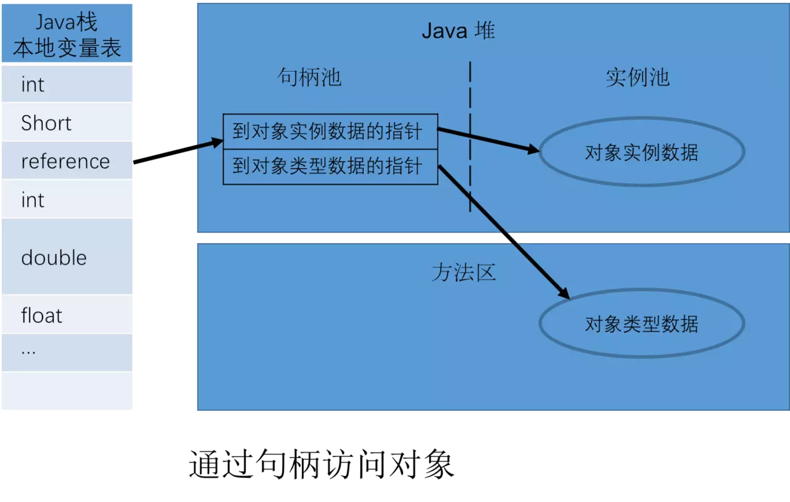

### 1.5.2 使用直接指针访问

### 1.5.3 比较

> - 使用句柄的最大好处是 `reference` 中存储的是稳定的句柄地址，在对象移动(GC)是只改变实例数据指针地址，`reference` 自身不需要修改。
> - 直接指针访问的最大好处是速度快，节省了一次指针定位的时间开销。
> - 如果是对象频繁 GC 那么句柄方法好，如果是对象频繁访问则直接指针访问好。

## 1.6 引用强度

| 名称   | 描述                                                         |
| ------ | ------------------------------------------------------------ |
| 强引用 | 类似于 `Object obj = new Object();` 创建的，只要强引用在就不回收。 |
| 软引用 | `SoftReference` 类实现软引用。在系统要发生内存溢出异常之前，将会把这些对象列进回收范围之中进行二次回收。 |
| 弱引用 | `WeakReference` 类实现弱引用。对象只能生存到下一次垃圾收集之前。在垃圾收集器工作时，无论内存是否足够都会回收掉只被弱引用关联的对象。 |
| 虚引用 | `PhantomReference` 类实现虚引用。无法通过虚引用获取一个对象的实例，为一个对象设置虚引用关联的唯一目的就是能在这个对象被收集器回收时有系统通知。 |

# 2. 堆和栈的区别联系？

参考

> - https://www.cnblogs.com/weichunguang/p/wei6.html

Java把内存划分成两种：一种是栈内存，一种是堆内存。

## 2.1 作用

- **堆：**存放对象实例，所有的对象和数组都要在堆上分配。是JVM所管理的
- **栈：**Java方法执行的内存模型，存储局部变量表，操作数栈，动态链接，方法出口信息。随线程创建和销毁

## 2.2 私有或共享

- **堆：**内存中的对象对所有线程可见。堆内存中的对象可以被所有线程访问。线程共享
- **栈：**内存归属于单个线程，每个线程都会有一个栈内存，其存储的变量只能在其所属线程中可见，即栈内存可以理解成线程的私有内存。线程私有

## 2.3 异常错误

- **堆内存：**没有可用的空间存储生成的对象，JVM会抛出**java.lang.OutOfMemoryError**。
- **栈内存：**没有可用的空间存储方法调用和局部变量，JVM会抛出**java.lang.StackOverFlowError**。

## 2.4 空间大小

# 3. GC(Garbage Collection)垃圾回收策略

参考

> - https://blog.csdn.net/laomo_bible/article/details/83112622

## 3.1 需要GC的区域

jvm 中，`程序计数器`、`虚拟机栈`、`本地方法栈`都是随线程而生随线程而灭，栈帧随着方法的进入和退出做入栈和出栈操作，实现了自动的内存清理，因此，我们的内存垃圾回收主要集中于 java `堆`和`方法区`中，在程序运行期间，这部分内存的分配和使用都是动态的。

## 3.2 GC的对象

参考

> - https://blog.csdn.net/u010253968/article/details/51160703

需要进行回收的对象就是已经没有存活的对象，判断一个对象是否存活常用的有两种办法：

> - **引用计数**
>
> - **可达分析**

### 3.2.1 引用计数

每个对象有一个引用计数属性，新增一个引用时计数加1，引用释放时计数减1，计数为0时可以回收。此方法简单，无法解决`对象相互循环引用`的问题，而且计数器需要维护，需要消耗，**所以主流的java虚拟机很少用**。

在这里，obj1中拿着对obj2的引用，obj2中拿着对obj1的引用。如果obj1要被回收，前提是obj2被先回收，这样才能释放对obj1的引用。但是反回过来，obj2要被回收的前提是obj1要被先回收。当build函数退出后，看起来垃圾回收管理似乎就始终无法回收这两个实际已经不再需要的对象。

垃圾回收机制究竟能否解决循环引用这一困境，带着这个疑问找了一些资料，找到了一个比较满意的解释。在《Java Platform Performance: Strategies and Tactics》这本书的附录A中有一处说明，这本书出自sun公司java团队员工，应该算比较权威的。其中有这样一段

> 可以简单的理解就是强引用并不能保证对象不被回收。垃圾回收机制除了检查对象是否被引用外，还要看对象是否被至少一个GC roots对象直接或者间接引用

所以，上面例子中两个循环引用的对象，虽然都存在一个强引用，但是不被任何`GC root`对象直接或者间接引用到(`可达性分析`)，垃圾回收机制能够发现这个问题。

### 3.2.2 可达性分析(主流算法)

从GC Roots开始向下搜索，搜索所走过的路径称为`引用链`。当一个对象到GC Roots没有任何引用链相连时，则证明此对象是不可用的。不可达对象。

在Java语言中，可作为 GC Roots 的对象：

> - 虚拟机栈中引用的对象。
> - 方法区中类静态属性实体引用的对象。
> - 方法区中常量引用的对象。
> - 本地方法栈中JNI(即一般说的 `Native` 方法) 引用的对象。

补充：`finalize()`方法

> `finalize()`是Object中的方法，当垃圾回收器将要回收对象所占内存之前被调用，即当一个对象在`可达性分析`后被虚拟机宣告死亡时会先调用它`finalize()`方法，让此对象处理它生前的最后事情（这个对象可以趁这个时机挣脱死亡的命运）

上面提到了判断死亡的依据，但被判断死亡后，还有生还的机会。
如何自我救赎：

> - 对象覆写了`finalize()`方法（这样在被判死后才会调用此方法，才有机会做最后的救赎）
> - 在`finalize()`方法中重新引用到"`GC  Roots`"链上（如把当前对象的引用this赋值给某对象的类变量/成员变量，重新建立可达的引用）

finalize() 方法只会被系统自动调用一次。虽然以上以对象救赎举例，但`finalize()`的作用往往被认为是用来做最后的资源回收。
基于在自我救赎中的表现来看，此方法有很大的不确定性（不保证方法中的任务执行完）而且运行代价较高。所以用来回收资源也不会有什么好的表现。

## 3.3 什么时候触发GC

- 程序调用`System.gc()`时可以触发
- 系统自身来决定GC触发的时机（根据`Eden`区和`From Space`区的内存大小来决定。当内存大小不足时，则会启动GC线程并停止应用线程）

GC又分为 `Minor GC` 和 `Full GC` (也称为 `Major GC` )

### 3.3.1 Minor GC触发条件

当Eden区满时，触发Minor GC。

### 3.3.2 Full GC触发条件

- 调用System.gc时，系统建议执行Full GC，但是不必然执行
- 老年代空间不足
- 方法区空间不足
- 通过Minor GC后进入老年代的平均大小大于老年代的可用内存
- 由Eden区、From Space区向To Space区复制时，对象大小大于To Space可用内存，则把该对象转存到老年代，且老年代的可用内存小于该对象大小

## 3.4 GC常用算法

- 标记-清除算法（Mark-Sweep）
- 标记-压缩算法
- 复制算法
- 分代收集算法。

目前主流的JVM（HotSpot）采用的是**分代收集算法**。

### 3.4.1 标记-清除算法

为每个对象存储一个标记位，记录对象的状态（活着或是死亡）。标记-清除算法执行分两阶段。

- **第一阶段标记**：从`引用根节点`开始标记所有被引用的对象，为每个对象更新标记位，检查对象是否死亡
- **第二阶段清除**：该阶段对死亡的对象进行清除，执行 GC 操作。遍历`整个堆`，把未标记的对象清除。此算法需要暂停整个应用，并且会产生内存碎片。

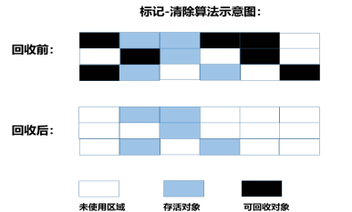

#### 优点

最大的优点是，标记—清除算法中每个活着的对象的引用只需要找到一个即可，找到一个就可以判断它为活的。此外，更重要的是，这个算法并不移动对象的位置。

#### 缺点

- **效率比较低（递归与全堆对象遍历）**：每个活着的对象都要在标记阶段遍历一遍；
- **释放空间不连续容易导致内存碎片**：所有对象都要在清除阶段扫描一遍，因此算法复杂度较高。没有移动对象，导致可能出现很多碎片空间无法利用的情况，标记清除后会有大量的不连续的内存碎片，空间碎片太多就会导致无法分配较大对象，无法找到足够大的连续内存，而发生gc。
- **清除时会暂停应用**。

### 3.4.2 标记-整理算法

标记-整理算法结合了`“标记-清除”`和`“复制”`两个算法的优点。也是分两阶段：

- **第一阶段标记**：该算法也将所有对象从`根节点`标记为`存活`和`死亡`两种状态
- **第二阶段**：在第二个阶段，该算法并没有直接对死亡的对象进行清理，而是将`所有存活的对象`整理一下压缩在一块，放到另一处空间，然后把剩下的所有对象全部清除。

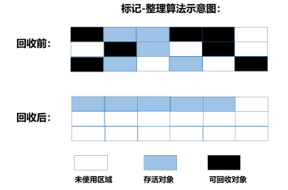

#### 优点

该算法不会像`标记-清除`算法那样产生大量的碎片空间，避免了`内存碎片`，也避免了`复制`算法的`空间利用不足`问题。

#### 缺点

如果存活的对象过多，整理阶段将会执行较多复制操作，导致算法效率降低。

### 3.4.3 复制算法

该算法将内存平均分成两部分，然后每次只使用其中的一部分，当这部分内存满的时候，将内存中`所有存活的对象`复制到另一个内存中，然后将之前的内存清空，只使用这部分内存，循环下去。复制算法每次只处理正在使用中的对象，因此复制成本比较小，同时复制过去以后还能进行相应的内存整理，不会出现`“碎片”`问题。当然，此算法的缺点也是很明显的，就是`需要两倍内存空间`。

> 这个算法与`标记-整理算法`的区别在于，该算法不是在同一个区域复制，而是将所有存活的对象复制到另一个区域内。

#### 优点

不会出现内存碎片问题

#### 缺点

空间利用率低，只有一半的内存空间能使用

### 3.4.4 分代收集算法

现在的虚拟机垃圾收集大多采用这种方式，它根据对象的生存周期，将堆分为：

- **新生代(Young)**：由于对象生存期短，每次回收都会有大量对象死去，空间较多，那么这时就采用`复制算法`

  > 例如：方法的局部变量引用的对象等

  

- **老年代(Tenure)**：老年代里的对象存活率较高，没有额外的空间进行分配担保，空间较少，所以可以使用`标记-整理` 或者 `标记-清除`。

  > 例如：缓存对象、单例对象等

  

- **永久代**：对象生成后几乎不灭的对象

  > 例如：加载过的类信息

堆大小=新生代+老年代；（新生代占堆空间的1/3、老年代占堆空间2/3）

#### 新生代

组成

- Eden（伊甸园）：这是对象最初诞生的区域，并且对大多数对象来说，这里是它们唯一存在过的区域。 

- Survivor（幸存者乐园）：从伊甸园幸存下来的对象会被挪到这里

  > - From Survivor
  > - To Survivor

比例：Eden ：From Survivor：To Survivor = `8：1：1`

新生代这样划分是为了更好的管理堆内存中的对象，方便GC算法---`复制算法`来进行垃圾回收。

JVM每次只会使用eden和其中一块survivor来为对象服务，所以无论什么时候，都会有一块survivor空间，因此新生代实际可用空间只有`90%`。

#### 为什么要有Survivor区

参考

> - https://www.jianshu.com/p/2caad185ee1f

为什么需要Survivor空间。我们看看如果没有 Survivor 空间的话，垃圾收集将会怎样进行：一遍新生代 Minor gc 过后，不管三七二十一，活着的对象全部进入老年代，即便它在接下来的几次 gc 过程中极有可能被回收掉。这样的话老年代很快被填满， Full GC 的频率大大增加。我们知道，老年代一般都会被规划成比新生代大很多，对它进行垃圾收集会消耗比较长的时间；如果收集的频率又很快的话，那就更糟糕了。基于这种考虑，虚拟机引进了“幸存区”的概念：如果对象在某次新生代 gc 之后任然存活，让它暂时进入幸存区；以后每熬过一次 gc ，让对象的年龄＋1，直到其年龄达到某个设定的值（比如15岁）， JVM 认为它很有可能是个“老不死的”对象，再呆在幸存区没有必要（而且老是在两个幸存区之间反复地复制也需要消耗资源），才会把它转移到老年代。

总之，设置Survivor空间的目的是让那些中等寿命的对象尽量在 Minor GC 时被干掉，最终在总体上减少虚拟机的垃圾收集过程对用户程序的影响。Survivor的存在意义，**就是减少被送到老年代的对象，进而减少Full GC的发生，Survivor的预筛选保证，只有经历16次Minor GC还能在新生代中存活的对象，才会被送到老年代。**

#### 为什么 Survivor 分区不能是 1 个？

答：回答这个问题有一个前提，就是新生代一般都采用复制算法进行垃圾收集。原始的复制算法是把一块内存一分为二，gc时把存活的对象从一块空间（From space）复制到另外一块空间（To space），再把原先的那块内存（From space）清理干净，最后调换 From space 和 To space 的逻辑角色（这样下一次 gc 的时候还可以按这样的方式进行）。

我们知道，在HotSpot虚拟机里， Eden 空间和 Survivor 空间默认的比例是 8:1 。我们来看看在只有一个 Survivor 空间的情况下，这个 8:1 会有什么问题。此处为了方便说明，我们假设新生代一共为 9 MB 。对象优先在 Eden 区分配，当 Eden 空间满 8 MB 时，触发第一次 Minor GC 。比如说有 0.5 MB 的对象存活，那这 0.5 MB 的对象将由 Eden 区向 Survivor 区复制。这次 Minor GC 过后， Eden 区被清理干净， Survivor 区被占用了 0.5 MB ，还剩 0.5 MB 。到这里一切都很美好，但问题马上就来了：从现在开始所有对象将会在这剩下的 0.5 MB 的空间上被分配，很快就会发现空间不足，于是只好触发下一次 Minor GC 。可以看出在这种情况下，当 Survivor 空间作为对象“出生地”的时候，很容易触发 Minor GC ，这种 8:1 的不对称分配不但没能在总体上降低 Minor GC 的频率，还会把 gc 的时间间隔搞得很不平均。把 Eden : Survivor 设成 1 : 1 也一样，每当对象总大小满 5 MB 的时候都必须触发一次 Minor GC ，唯一的变化是 gc 的时间间隔相对平均了。

上面的论述都是以“新生代使用复制算法”这个既定事实作为前提来讨论的。如果不是这样，比如说新生代采用“标记-清除”或者“标记-整理”算法来实现幸存对象的移动，好像确实是只需要一个 Survivor 就够了。至于主流的虚拟机实现为什么不考虑采用这种方式，我也不是很清楚，或许有实现难度、内存碎片或者执行效率方面的考虑吧。

#### 为什么有两个Survivor区

问题很清楚了，无论Eden和 Survivor 的比例怎么设置，在只有一个 Survivor 的情况下，总体上看在新生代空间满一半的时候就会触发一次 Minor GC 。那有没有提升的空间呢？比如说永远在新生代空间满 80% 的时候才触发 Minor GC ？

事实上是可以做到的：我们可以设两个Survivor空间（ From Survivor 和 To Survivor ）。比如，我们把 Eden : From Survivor : To Survivor 空间大小设成 8 : 1 : 1 ，对象总是在 Eden 区出生， From Survivor 保存当前的幸存对象， To Survivor 为空。一次 gc 发生后：

1）Eden 区活着的对象 ＋ From Survivor 存储的对象被复制到 To Survivor ；

2)清空 Eden 和 From Survivor ；

3)颠倒 From Survivor 和 To Survivor 的逻辑关系： From 变 To ， To 变 From 。

可以看出，只有在Eden空间快满的时候才会触发 Minor GC 。而 Eden 空间占新生代的绝大部分，所以 Minor GC 的频率得以降低。当然，使用两个 Survivor 这种方式我们也付出了一定的代价，如 10% 的空间浪费、复制对象的开销等。

## 3.5 Minor GC || Full GC(Major GC)

参考

> - https://cloud.tencent.com/developer/article/1336605

### 3.5.1 Minor GC

当分配内存在`Eden`区，Eden区满时会触发

#### Minor GC流程

1. 假设现在Heap内存大小为20M，其中年轻代为10M，老年代为10M，年轻代中Eden区6M，From区2M，To区2M，新创建的对象首先往Eden区分配，当再次分配一个对象，假设大小为1M，此时Eden区已经没有足够空间来给这个对象分配内存，如图所示：

   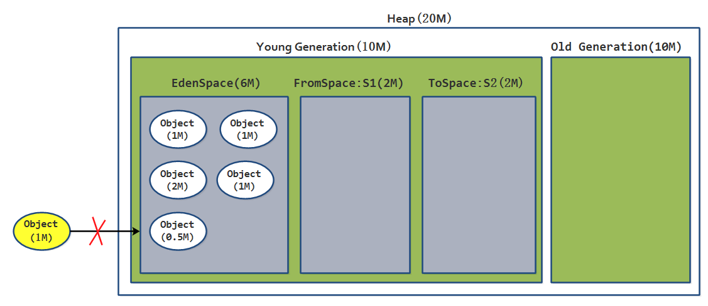

2. 这时候触发一次`Minor GC`，把`Eden`区的存活对象转移到`From`区，`非存活对象`进行清理，然后给新创建的对象分配空间，存入`Eden`区

   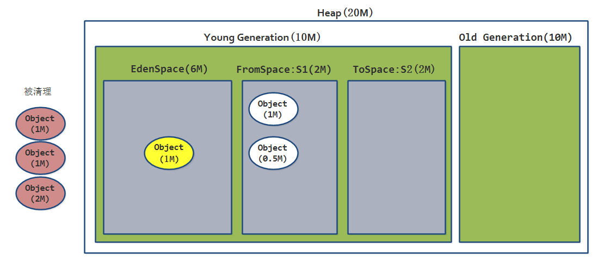

3. 随着分配对象的增多，`Eden`区的空间又不足了：

   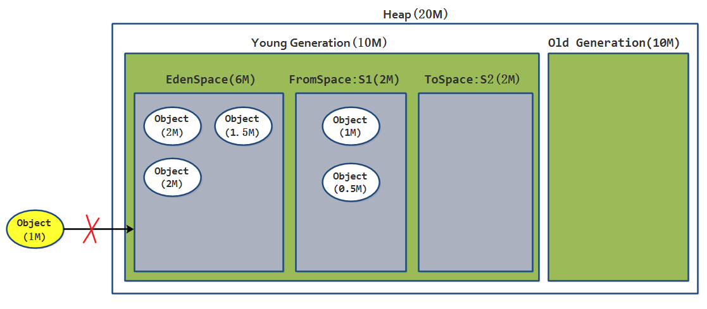

4. 这时候再触发一次`Minor GC`，清理掉`Eden`区和`S1`区的死亡对象，把`Eden`区和`S1`存活对象转移到`S2`区，然后再给新对象分配内存：

   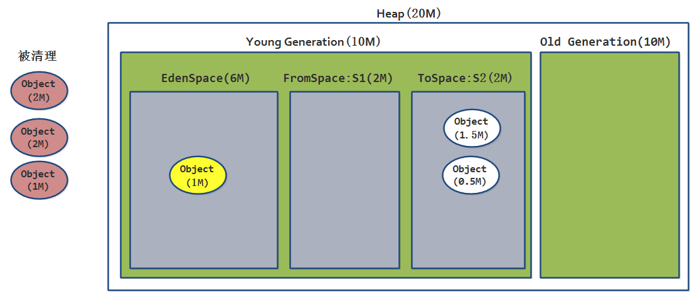

5. `From`区和`To`区是相对的关系，哪个区中有对象，哪个区就是`From`区，比如，再进行一次`Minor GC`，会把存活对象转移到`S1`区，再为转移之前，`S2`区是`From`区，`S1`区是`To`区，转移后，`S2`区中没有存活对象，变为`To`区，而`S1`区变为`From`区。如果存活的对象是从`Eden`区到`To Survivor`，那么将`Age`设为1，如果是`From Survivor`中移动过去，则`Age++`。

   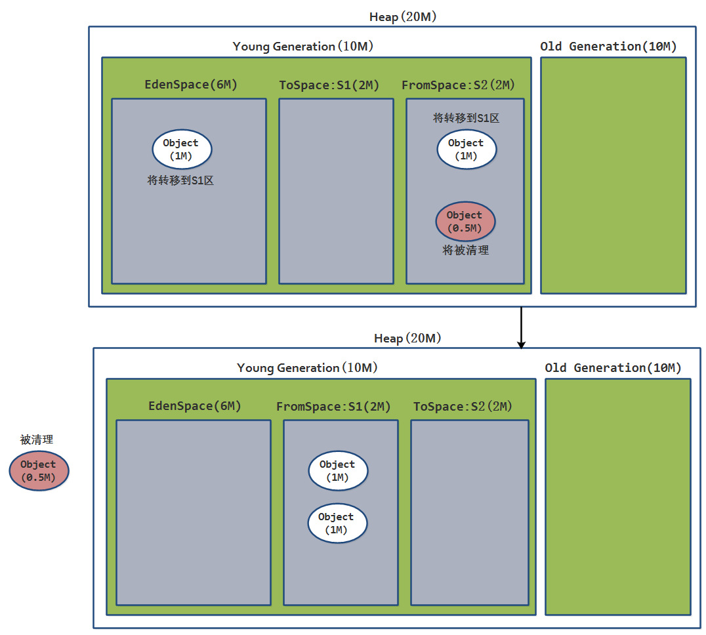

   

#### 对象进入老年代的4种情况

1. 假如进行Minor GC时发现，存活的对象在`ToSpace`区中存不下，那么把存活的对象存入老年代

   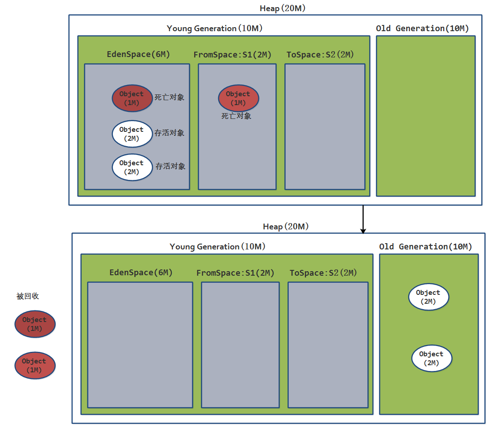

2. **大对象直接进入老年代**：假设新创建的对象很大，比如为5M(这个值可以通过`PretenureSizeThreshold`这个参数进行设置，默认3M)，那么即使`Eden区`有足够的空间来存放，也不会存放在`Eden区`，而是直接存入`老年代`

   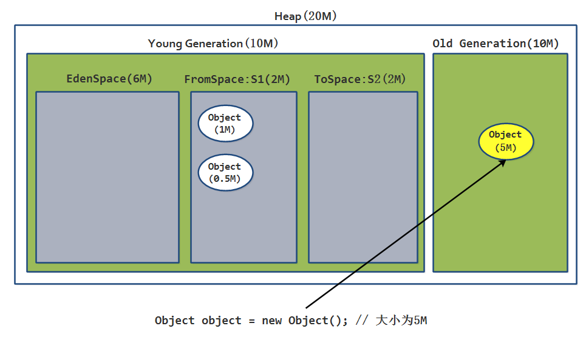

3. **长期存活的对象将进入老年代**：此外，如果对象在`Eden`出生并且经过1次`Minor GC`后仍然存活，并且能被`To区`容纳，那么将被移动到`To区`，并且把对象的年龄设置为`1`，对象没"熬过"一次`Minor GC`(没有被回收，也没有因为`To区`没有空间而被移动到`老年代`中)，年龄就`增加一岁`，当它的年龄增加到一定程度(默认`15岁`，也可以配置参数`-XX:MaxTenuringThreshold`)，就会被晋升到`老年代`中

4. **动态对象年龄判定**：还有一种情况，如果在`From空间`中，相同年龄所有对象的大小总和大于`From`和`To空间`总和的一半，那么年龄大于等于该年龄的对象就会被移动到`老年代`，而不用等到`15岁`(默认)：

   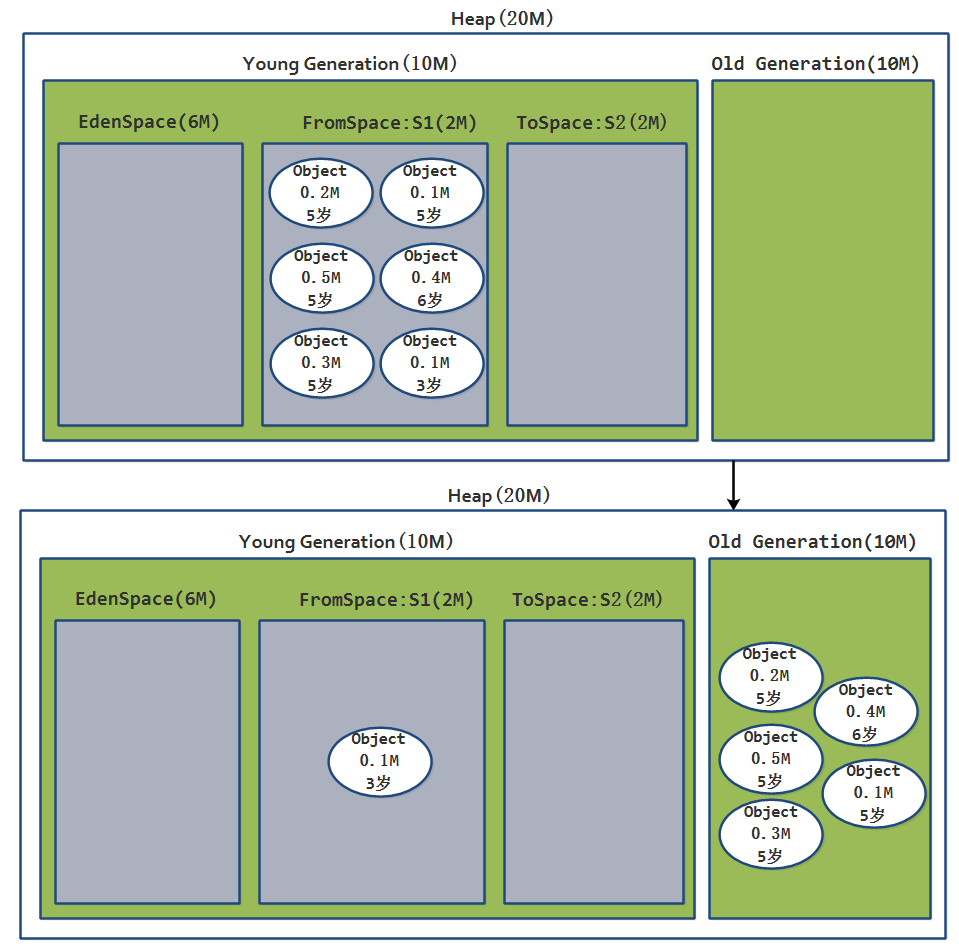

   

### 3.5.2 Full GC

当触发GC时，会有`STW`（Stop The World）,即会暂停程序，无法响应

触发条件：

- 调用`System.gc()`时，系统建议执行Full GC，但是不必然执行
- 老年代空间不足
- 方法区空间不足
- 通过Minor GC后进入老年代的平均大小大于老年代的可用内存
- 由Eden区、From Space区向To Space区复制时，对象大小大于To Space可用内存，则把该对象转存到老年代，且老年代的可用内存小于该对象大小

如果`Full GC`后还有无法给新创建的对象分配内存，或者无法移动那些需要进入`老年代`中的对象，那么`JVM`抛出`OutOfMemoryError`

### 3.5.3 空间分配担保

在发生`Minor GC`之前，虚拟机会先检查`老年代最大可用的连续空间`是否大于`新生代所有对象总空间`：

- 如果成立：那么`Minor GC`可以确保是`安全`的。

- 如果不成立：则虚拟机会查看`HandlerPromotionFailure`这个参数设置的值(`true`或`flase`)是否允许担保失败(如果这个值为true，代表着JVM说，我允许在这种条件下尝试执行`Minor GC`，出了事我负责)。如果允许，那么会继续检查`老年代最大可用的连续空间`是否大于`历次晋升到老年代对象的平均大小`，如果大于，将尝试进行一次`Minor GC`，尽管这次`Minor GC`是有风险的；如果小于，或者`HandlerPromotionFailure`为`false`，那么这次`Minor GC`将升级为`Full GC`

如果`老年代最大可用的连续空间`大于`历次晋升到老年代对象的平均大小`，那么在`HandlerPromotionFailure`为`true`的情况下，可以尝试进行一次`Minor GC`，但这是有风险的，如果本次将要晋升到老年代的对象很多，那么`Minor GC`还是无法执行，此时还得改为`Full GC`。

`HandlerPromotionFailure`为`true`时，如果某次需要转移到老年代中的对象确实很多，老年代无法容纳，那么也会先尝试进行一次`Minor GC`，`Minor GC`无法执行时再进行`Full GC`，这样虽然绕了圈子，但我们还是建议把这个参数设置为`true`，因为我们要尽量避免`Full GC`。

### 3.5.4 为什么要进行空间担保/风险是什么？

前面提到过，新生代使用复制收集算法，但是为了内存利用率。只使用其中一个Survivor空间来作为轮换备份，因此当出现大量对象在Minor GC后仍然存活的情况（最极端的情况是内存回收之后，新生代中所有的对象都存活），就需要老年代进行分配担保，把Survivor无法容纳的对象直接进入老年代。老年代要进行这样的担保，前提是老年代本身还有容纳这些对象的剩余空间，一共有多少对象存活下来在实际完成内存回收之前是无法明确知道的，所以只好取之前每一次回收晋升到老年代对象容量的平均大小值作为经验值，与老年代的剩余空间进行比较，决定是否进行Full GC来让老年代腾出更多空间。

取平均值进行比较其实仍然是一种动态概率的手段，也就是说，如果某次Minor GC存活后的对象突增，远远高于平均值的话，依然会导致担保失败。如果出现`HandlerPromotionFailure`失败，那就只好在失败后重新发起一次FULL GC。虽然担保失败时绕的圈子是最大的，但大部分情况下都还是将`HandlerPromotionFailure`开关打开，避免`Full GC`过于频繁。

# 4. 收集器

参考

> - https://blog.csdn.net/michaelgo/article/details/82226733
> - https://blog.csdn.net/u013030086/article/details/85065049

如果说收集算法是内存回收的方法论，垃圾收集器就是内存回收的具体实现

## 4.1 新生代垃圾收集器

| 名称               | 串行/并行/并发 | 回收算法 | 适用场景          | 可以与cms配合 |
| ------------------ | -------------- | -------- | ----------------- | ------------- |
| SerialGC           | 串行           | 复制     | 单cpu             | 是            |
| ParNewGC           | 并行           | 复制     | 多cpu             | 是            |
| ParallelScavengeGC | 并行           | 复制     | 多cpu且关注吞吐量 | 否            |

### 4.1.1 Serial New串行收集器-复制算法

Serial收集器是新生代`单线程收集器`。这是最早的新生代收集器，也是jdk1.5之前默认的收集器，它是基于复制算法实现

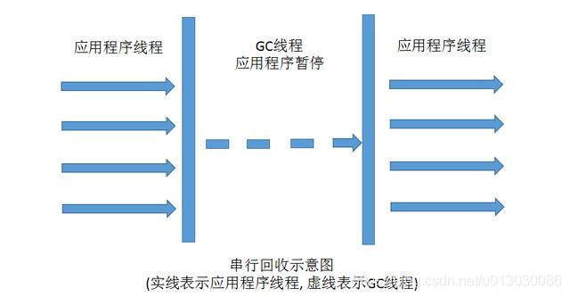

优缺点

> - **优点**：简单高效，算是最基本、发展历史最悠久的收集器。
> - **缺点**：由于`单线程`，它在进行垃圾收集时，`必须暂停其他所有的工作线程（STW）`，所以新生代不能太大，否则对于停顿来讲是比较影响交互响应的。

Serial收集器依然是虚拟机运行在`Client模式`下默认新生代收集器，对于运行在`Client模式下的虚拟机`来说是一个很好的选择。

### 4.1.2 ParNew收集器-复制算法

ParNew收集器是新生代`并行收集器`，其实就**是Serial收集器的多线程版本**。

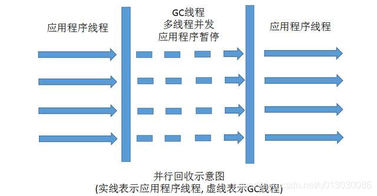

除了使用多线程进行垃圾收集之外，其余行为包括Serial收集器可用的所有控制参数、收集算法、Stop The World、对象分配规则、回收策略等都与Serial 收集器完全一样。

优缺点

> - **优点**：ParNew收集器是并行的，在多CPU的场景下会有比串行收集器更好的性能
> - **缺点**：需要注意的是，如果CPU数量为1个或者少于4个时，该种收集器的性能并不会比Serial要好。因为除去上下文切换，以及占用用户线程CPU时间片，导致用户线程被拖慢

### 4.1.3 Parallel Scavenge（并行回收）收集器-复制算法

这也是一种新生代垃圾收集器，PSYoungGen它采用的也是复制算法，它与前两种收集器最大的区别是，它关注的是`吞吐量`而不是`延迟`。也被称为是吞吐量优先的收集器

> 吞吐量=运行用户代码时间/(运行用户代码时间+垃圾收集时间)

主要使用场景：主要适合在后台运算而不是太多交互的任务，高吞吐量则可以最高效率的利用CPU时间,尽快的完成程序的运算任务。当然，如果想要降低停顿时间，相应的也会影响吞吐量

参数

| 名称                       | 描述                                                         |
| -------------------------- | ------------------------------------------------------------ |
| -XX:MaxGCPauseMillis       | 控制最大垃圾收集停顿时间。MaxGCPauseMillis参数允许的值是一个大于0的毫秒数，收集器将尽力保证内存回收花费的时间不超过设定值。不过大家不要异想天开地认为如果把这个参数的值设置得稍小一点就能使得系统的垃圾收集速度变得更快，GC停顿时间缩短是以牺牲`吞吐量`和`新生代空间`来换取的：系统把新生代调小一些，收集300MB新生代肯定比收集500MB快吧，这也直接导致垃圾收集发生得更频繁一些，原来10秒收集一次、每次停顿100毫秒，现在变成5秒收集一次、每次停顿70毫秒。停顿时间的确在下降，但吞吐量也降下来了 |
| -XX:GCTimeRatio            | 设置吞吐量大小。GCTimeRatio参数的值应当是一个大于0小于100的整数，也就是垃圾收集时间占总时间的比率，相当于是吞吐量的倒数。如果把此参数设置为19，那允许的最大GC时间就占总时间的5%（即1 /（1+19）），默认值为99，就是允许最大1%（即1 /（1+99））的垃圾收集时间 |
| -XX:+UseAdaptiveSizePolicy | 自适应策略开关。是一个开关参数，当这个参数打开之后，就不需要手工指定新生代的大小（-Xmn）、Eden与Survivor区的比例（-XX:SurvivorRatio）、晋升老年代对象年龄（-XX:PretenureSizeThreshold）等细节参数了，虚拟机会根据当前系统的运行情况收集性能监控信息，动态调整这些参数以提供最合适的停顿时间或最大的吞吐量，这种调节方式称为GC自适应的调节策略（GC Ergonomics） |

## 4.2 老年代垃圾收集器

| 名称        | 串行/并行/并发             | 回收算法 | 适用场景              |
| ----------- | -------------------------- | -------- | --------------------- |
| SerialOldGC | 串行                       | 标记整理 | 单cpu                 |
| ParNewOldGC | 并行                       | 标记整理 | 多cpu                 |
| CMS         | 并发，几乎不会暂停用户线程 | 标记清除 | 多cpu且与用户线程共存 |

### 4.2.1 Serial Old串行收集器-标记整理算法

Serial Old是Serial收集器的老年代版本，它同样是一个`单线程(串行)收集器`，使用标记整理算法。这个收集器的主要意义也是在于给**Client模式下的虚拟机使用**。

如果在Server模式下，主要两大用途：

> - 在JDK1.5以及之前的版本中与`Parallel Scavenge`收集器搭配使用
> - 作为CMS收集器的后备预案，在并发收集发生Concurrent Mode Failure时使用

### 4.2.2 Parallel Old 收集器-标记整理算法

Parallel Old 是**Parallel Scavenge收集器的老年代版本**，使用多线程和“标记-整理”算法。这个收集器在1.6中才开始提供。这个是`Serial`的多线程版本，同样的使用了`标记-整理`算法。但是如果CPU数量少的话性能一样不好。但是现在无论是PC还是server CPU数量都不再是性能瓶颈限制了，所以目前它跟`Parallel Scavenge`的配合是吞吐量优先场景的优先收集器选择。

### 4.2.3 CMS 收集器-标记清除算法

CMS(Concurrent Mark Sweep)收集器是一种`以获取最短回收停顿时间为目标`的收集器。

目前很大一部分的Java应用集中在互联网站或者B/S系统的服务端上，这类应用尤其重视服务器的响应速度，希望系统停顿时间最短，以给用户带来较好的体验。CMS收集器就非常符合这类应用的需求。

CMS收集器是基于“`标记-清除`”算法实现的，它的运作过程相对前面几种收集器来说更复杂一些，整个过程分为4个步骤：

> - 初始标记
> - 并发标记
> - 重新标记
> - 并发清除

其中，`初始标记`、`重新标记`这两个步骤仍然需要“`Stop The World`”。

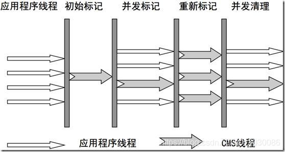

优点：

> - 并发收集：能够全局上与用户线程并发执行。是第一款真正意义上的并发收集器。
> - 低停顿

缺点：

> - CMS收集器对`CPU资源非常敏感`：CPU个数少于4个时，CMS对于用户程序的影响就可能变得很大，为了应付这种情况，虚拟机提供了一种称为“增量式并发收集器”的CMS收集器变种。
> - CMS收集器无法处理`浮动垃圾`：由于清除的时候是`并发清除`的，这时候用户态产生的垃圾必然无法在本次收集过程中收集掉。也就会产生`浮动垃圾`。可能出现“Concurrent Mode Failure”失败而导致另一次Full GC的产生。在JDK1.5的默认设置下，**CMS收集器当老年代使用了68%的空间后就会被激活**。
> - CMS是基于“标记-清除”算法实现的收集器，会有大量`空间碎片`产生：空间碎片过多，可能会出现老年代还有很大空间剩余，但是无法找到足够大的连续空间来分配当前对象，不得不提前出发`FullGC`。对于空间碎片，CMS提供了`-XX:+UseCMSCompactAtFullCollection`参数，应用于在FULL GC后再进行一个碎片整理过程。`-XX:CMSFullGCsBeforeCompaction`,多少次不压缩的full gc后来一次带压缩的。

## 4.3 新生代和老年代收集器

### 4.3.1 G1收集器-标记整理算法

`JDK1.7`后全新的回收器, 用于取代CMS收集器。是比前面的更优秀，真正有突破的一款垃圾收集器。

其实在G1中还是保留了分代的概念，但是实际上已经在`新生代`和`老年代`中没有物理隔离了。在G1中，内存空间被分割成一个个的`Region`区，所谓`新生代`和`老年代`，都是由一个个`region`组成的。同时G1也不需要跟别的收集器一起配合使用，自己就可以搞定所有内存区域。整体上来讲不是一个分代收集器，是一个`通吃收集器`。这也是JVM内存管理和垃圾收集的一个发展趋势。从后面`zgc`中我们可以更清晰的看到这个变化。

G1收集器的优势：

> - 独特的分代垃圾回收器,分代GC: 分代收集器, 同时兼顾`年轻代`和`老年代`
> - 使用分区算法, 不要求Eden, 年轻代或老年代的空间都连续
> - 并行性: 回收期间, 可由多个线程同时工作, 有效利用多核cpu资源
> - 空间整理: 回收过程中, 会进行适当对象移动, 减少空间碎片
> - 可预见性: G1可选取部分区域进行回收, 可以缩小回收范围, 减少全局停顿

G1收集器的步骤

共四个步骤：

> 1. 初始标记（它标记了从GC Root开始直接可达的对象）：与CMS第一步骤差不多
> 2. 并发标记（从GC Roots开始对堆中对象进行`可达性分析`，找出存活对象）：这个过程时间比较久，分析`GC Root`到所有对象的`可达性分析`。如果从`GC Root`节点开始遍历所有对象会比较耗时，实际上JVM也不是这么做的。JVM是使用`Remembered Set`保存了对象引用的调用信息，在可达性分析的时候只需要同时遍历`remembered set`就好了，不需要从根节点开始挨个遍历。
> 3. 最终标记（标记那些在并发标记阶段发生变化的对象，将被回收）：由于并发标记阶段，用户线程仍然在工作，会对标记产生一些偏差，这时候需要通过remembered set log来记录这些改变，在这个阶段将改变合并到remembered set中。完成最终标记。
> 4. 筛选回收（首先对各个`Regin`的`回收价值`和`成本`进行`排序`，根据用户所期待的GC停顿时间指定回收计划，回收一部分`Region`）：通过标记整理的算法，根据用户配置的回收时间，和维护的优先级列表，优先收集价值最大的region。收集阶段是基于标记-整理和复制算法实现。

### 4.3.2 ZGC收集器

zgc是`jdk11`中要发布的最新垃圾收集器。完全没有分代的概念，先说下它的优点吧，官方给出的是`无碎片`，`时间可控`，`超大堆`。

> 与标记对象的传统算法相比，ZGC在指针上做标记，在访问指针时加入Load Barrier（读屏障），比如当对象正被GC移动，指针上的颜色就会不对，这个屏障就会先把指针更新为有效地址再返回，也就是，永远只有单个对象读取时有概率被减速，而不存在为了保持应用与GC一致而粗暴整体的Stop The World。

具体参考

> - https://blog.csdn.net/michaelgo/article/details/82226733
> - https://mp.weixin.qq.com/s/KUCs_BJUNfMMCO1T3_WAjw