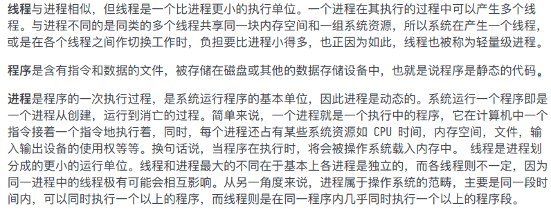

#  线程、程序、进程的基本概念




# Java多线程的四种实现方式

参考

> - https://www.cnblogs.com/felixzh/p/6036074.html
> - 


**无返回值**，run()返回为void

- 继承Thread类：**重写run()方法**
- 实现Runnable接口：如果自己的类已经extends另一个类，就无法直接**extends Thread**，此时，可以实现一个Runnable接口，**重写run方法**，实现Runnable接口的实现类的实例对象作为Thread构造函数的target

**有返回值**，通过Callable接口，就要实现call方法，这个方法的返回值是Object

- 实现**Callable**接口通过**FutureTask**包装器来创建Thread线程
- 线程池，使用**ExecutorService**、Callable、Future实现有返回结果的多线程


## 继承Thread类创建线程

		Thread类本质上是实现了Runnable接口的一个实例，代表一个线程的实例。启动线程的唯一方法就是通过Thread类的start()实例方法。start()方法是一个native方法，它将启动一个新线程，并执行run()方法。这种方式实现多线程很简单，通过自己的类直接extend Thread，并复写run()方法，就可以启动新线程并执行自己定义的run()方法。例如：

```java
public class MyThread extends Thread {  
　　public void run() {  
　　 System.out.println("MyThread.run()");  
　　}  
}  
 
MyThread myThread1 = new MyThread();  
MyThread myThread2 = new MyThread();  
myThread1.start();  
myThread2.start();
```


## 实现Runnable接口

实现run方法，接口的实现类的实例作为**Thread**的**target**作为参数传入带参的**Thread**构造函数，通过调用**start()**方法启动线程。适用于已经有继承的父类无法继承Thread类的时候

```java
public class ThreadDemo02 {
 
    public static void main(String[] args){ 
        System.out.println(Thread.currentThread().getName());
        Thread t1 = new Thread(new MyThread());
        t1.start(); 
    }
}
 
class MyThread implements Runnable{
    @Override
    public void run() {
        // TODO Auto-generated method stub
        System.out.println(Thread.currentThread().getName()+"-->我是通过实现接口的线程实现方式！");
    }   
}
```


## 实现Callable接口通过FutureTask包装器来创建Thread线程

- 创建Callable接口的实现类 ，并实现Call方法 
- 创建Callable实现类的实现，使用FutureTask类包装Callable对象，该FutureTask对象封装了Callable对象的Call方法的返回值 
- 使用FutureTask对象作为Thread对象的target创建并启动线程 
- 调用FutureTask对象的get()来获取子线程执行结束的返回值

```java
public class ThreadDemo03 {
 
    /**
     * @param args
     */
    public static void main(String[] args) {
        // TODO Auto-generated method stub
 
      	//实例化一个Callable类
        Callable<Object> oneCallable = new Tickets<Object>();
      
      	//使用FutureTask包装器包装Callable对象
        FutureTask<Object> oneTask = new FutureTask<Object>(oneCallable); 
      
      	//将FutureTask对象作为target形参并调用Thread的构造函数实例化一个Thread对象
        Thread t = new Thread(oneTask); 
      
        System.out.println(Thread.currentThread().getName()); 
      
        t.start();
    }
}
 
class Tickets<Object> implements Callable<Object>{ 
    //重写call方法
    @Override
    public Object call() throws Exception {
        // TODO Auto-generated method stub
        System.out.println(Thread.currentThread().getName()+"-->我是通过实现Callable接口通过FutureTask包装器来实现的线程");
        return null;
    }   
}
```


## 通过线程池创建线程

ExecutorService、Callable都是属于Executor框架。返回结果的线程是在JDK1.5中引入的新特征，还有Future接口也是属于这个框架，有了这种特征得到返回值就很方便了。 
通过分析可以知道，他同样也是实现了Callable接口，实现了Call方法，所以有返回值。这也就是正好符合了前面所说的两种分类

执行Callable任务后，可以获取一个Future的对象，在该对象上调用get就可以获取到Callable任务返回的Object了。get方法是阻塞的，即：线程无返回结果，get方法会一直等待。

```java
public class ThreadDemo05{
 
    private static int POOL_NUM = 10;     //线程池数量
 
    /**
     * @param args
     * @throws InterruptedException 
     */
    public static void main(String[] args) throws InterruptedException {
        // TODO Auto-generated method stub
        ExecutorService executorService = Executors.newFixedThreadPool(5);  
        for(int i = 0; i<POOL_NUM; i++)  
        {  
            RunnableThread thread = new RunnableThread();
 
            //Thread.sleep(1000);
            executorService.execute(thread);  
        }
        //关闭线程池
        executorService.shutdown(); 
    }   
 
}
 
class RunnableThread implements Runnable  
{     
    @Override
    public void run()  
    {  
        System.out.println("通过线程池方式创建的线程：" + Thread.currentThread().getName() + " ");  
 
    }  
}  
```


# Java线程池


## 线程池执行流程