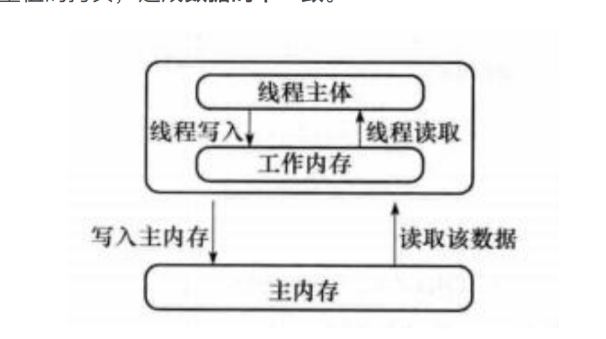

#  线程、程序、进程的基本概念


# Java多线程的四种实现方式

参考

> - https://www.cnblogs.com/felixzh/p/6036074.html
> - 


**无返回值**，run()返回为void

- 继承Thread类：**重写run()方法**
- 实现Runnable接口：如果自己的类已经extends另一个类，就无法直接**extends Thread**，此时，可以实现一个Runnable接口，**重写run方法**，实现Runnable接口的实现类的实例对象作为Thread构造函数的target

**有返回值**，通过Callable接口，就要实现call方法，这个方法的返回值是Object

- 实现**Callable**接口通过**FutureTask**包装器来创建Thread线程
- 线程池，使用**ExecutorService**、Callable、Future实现有返回结果的多线程


## 继承Thread类创建线程

		Thread类本质上是实现了Runnable接口的一个实例，代表一个线程的实例。启动线程的唯一方法就是通过Thread类的start()实例方法。start()方法是一个native方法，它将启动一个新线程，并执行run()方法。这种方式实现多线程很简单，通过自己的类直接extend Thread，并复写run()方法，就可以启动新线程并执行自己定义的run()方法。例如：

```java
public class MyThread extends Thread {  
　　public void run() {  
　　 System.out.println("MyThread.run()");  
　　}  
}  
 
MyThread myThread1 = new MyThread();  
MyThread myThread2 = new MyThread();  
myThread1.start();  
myThread2.start();
```


## 实现Runnable接口

实现run方法，接口的实现类的实例作为**Thread**的**target**作为参数传入带参的**Thread**构造函数，通过调用**start()**方法启动线程。适用于已经有继承的父类无法继承Thread类的时候

```java
public class ThreadDemo02 {
 
    public static void main(String[] args){ 
        System.out.println(Thread.currentThread().getName());
        Thread t1 = new Thread(new MyThread());
        t1.start(); 
    }
}
 
class MyThread implements Runnable{
    @Override
    public void run() {
        // TODO Auto-generated method stub
        System.out.println(Thread.currentThread().getName()+"-->我是通过实现接口的线程实现方式！");
    }   
}
```


## 实现Callable接口通过FutureTask包装器来创建Thread线程

- 创建Callable接口的实现类 ，并实现Call方法 
- 创建Callable实现类的实现，使用FutureTask类包装Callable对象，该FutureTask对象封装了Callable对象的Call方法的返回值 
- 使用FutureTask对象作为Thread对象的target创建并启动线程 
- 调用FutureTask对象的get()来获取子线程执行结束的返回值

```java
public class ThreadDemo03 {
 
    /**
     * @param args
     */
    public static void main(String[] args) {
        // TODO Auto-generated method stub
 
      	//实例化一个Callable类
        Callable<Object> oneCallable = new Tickets<Object>();
      
      	//使用FutureTask包装器包装Callable对象
        FutureTask<Object> oneTask = new FutureTask<Object>(oneCallable); 
      
      	//将FutureTask对象作为target形参并调用Thread的构造函数实例化一个Thread对象
        Thread t = new Thread(oneTask); 
      
        System.out.println(Thread.currentThread().getName()); 
      
        t.start();
    }
}
 
class Tickets<Object> implements Callable<Object>{ 
    //重写call方法
    @Override
    public Object call() throws Exception {
        // TODO Auto-generated method stub
        System.out.println(Thread.currentThread().getName()+"-->我是通过实现Callable接口通过FutureTask包装器来实现的线程");
        return null;
    }   
}
```


## 通过线程池创建线程

ExecutorService、Callable都是属于Executor框架。返回结果的线程是在JDK1.5中引入的新特征，还有Future接口也是属于这个框架，有了这种特征得到返回值就很方便了。 
通过分析可以知道，他同样也是实现了Callable接口，实现了Call方法，所以有返回值。这也就是正好符合了前面所说的两种分类

执行Callable任务后，可以获取一个Future的对象，在该对象上调用get就可以获取到Callable任务返回的Object了。get方法是阻塞的，即：线程无返回结果，get方法会一直等待。

```java
public class ThreadDemo05{
 
    private static int POOL_NUM = 10;     //线程池数量
 
    /**
     * @param args
     * @throws InterruptedException 
     */
    public static void main(String[] args) throws InterruptedException {
        // TODO Auto-generated method stub
        ExecutorService executorService = Executors.newFixedThreadPool(5);  
        for(int i = 0; i<POOL_NUM; i++)  
        {  
            RunnableThread thread = new RunnableThread();
 
            //Thread.sleep(1000);
            executorService.execute(thread);  
        }
        //关闭线程池
        executorService.shutdown(); 
    }   
 
}
 
class RunnableThread implements Runnable  
{     
    @Override
    public void run()  
    {  
        System.out.println("通过线程池方式创建的线程：" + Thread.currentThread().getName() + " ");  
 
    }  
}  
```


# Java线程池


## 线程池执行流程


# synchronized 关键字


## 三种使用方式

- 修饰实例方法，作用于当前对象实例加锁，进入同步代码前要获得当前对象实例的锁
- 修饰静态方法，作用于当前类对象加锁，进入同步代码前要获得当前类对象的锁 。也就是给当前类加锁，会作
  用于类的所有对象实例，因为静态成员不属于任何一个实例对象，是类成员（ static 表明这是该类的一个静态
  资源，不管new了多少个对象，只有一份，所以对该类的所有对象都加了锁）。所以如果一个线程A调用一个实
  例对象的非静态 synchronized 方法，而线程B需要调用这个实例对象所属类的静态 synchronized 方法，是允
  许的，不会发生互斥现象，因为访问静态 synchronized 方法占用的锁是当前类的锁，而访问非静态
  synchronized 方法占用的锁是当前实例对象锁。
- 修饰代码块，指定加锁对象，对给定对象加锁，进入同步代码库前要获得给定对象的锁。 和 synchronized 方
  法一样，synchronized(this)代码块也是锁定当前对象的。synchronized 关键字加到 static 静态方法和
  synchronized(class)代码块上都是是给 Class 类上锁。这里再提一下：synchronized关键字加到非 static 静态
  方法上是给对象实例上锁。

## Synchronized在JDK 1.8做了哪些优化


# volatile关键字

参考

> - [Java并发编程：volatile关键字解析](https://www.cnblogs.com/dolphin0520/p/3920373.html)
> - [Java面试官最常问的volatile关键字](https://www.cnblogs.com/java1024/p/9031560.html)


## 两大特性

- 保证了不同线程对该变量操作的**内存可见性**
- 禁止指令重排序


## Java内存模型与volatile

​		在 **JDK1.2** 之前，Java的内存模型实现总是从主存（即共享内存）读取变量，是不需要进⾏特别的注意 的。⽽在当前的 Java 内存模型下，线程可以把变量保存本地内存（⽐如机器的寄存器）中，⽽不是直 接在主存中进⾏读写。**这就可能造成⼀个线程在主存中修改了⼀个变量的值，⽽另外⼀个线程还继续使 ⽤它在寄存器中的变量值的拷⻉，造成数据的不⼀致**。




要解决这个问题，就需要把变量声明为**volatile**，这就指示 JVM，这个变量是不稳定的，每次使⽤它都 到主存中进⾏读取。 说⽩了， **volatile 关键字的主要作⽤就是保证变量的可⻅性然后还有⼀个作⽤是防⽌指令重排序。**


## 并发编程的三个重要特性

1. **原⼦性 :** ⼀个的操作或者多次操作，要么所有的操作全部都得到执⾏并且不会收到任何因素的 ⼲扰⽽中断，要么所有的操作都执⾏，要么都不执⾏。 **synchronized 可以保证代码⽚段的原⼦性。** 
2. **可⻅性 ：**当⼀个变量对共享变量进⾏了修改，那么另外的线程都是⽴即可以看到修改后的最新 值。 **volatile 关键字可以保证共享变量的可⻅性。**
3. **有序性 ：**代码在执⾏的过程中的先后顺序，Java 在编译器以及运⾏期间的优化，代码的执⾏顺序未必就是编写代码时候的顺序。 **volatile 关键字可以禁⽌指令进⾏重排序优化。**


## 内存可见性

