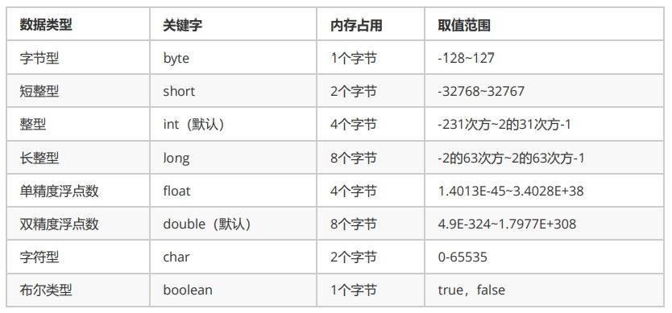
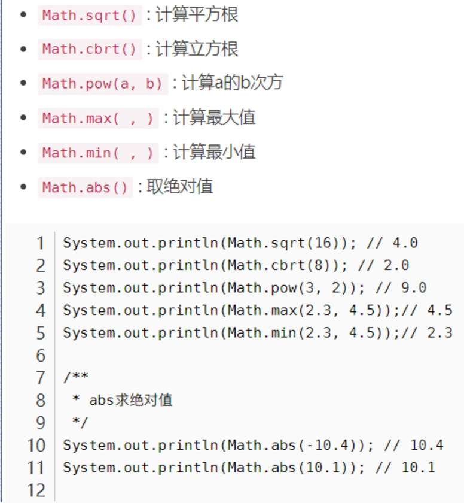
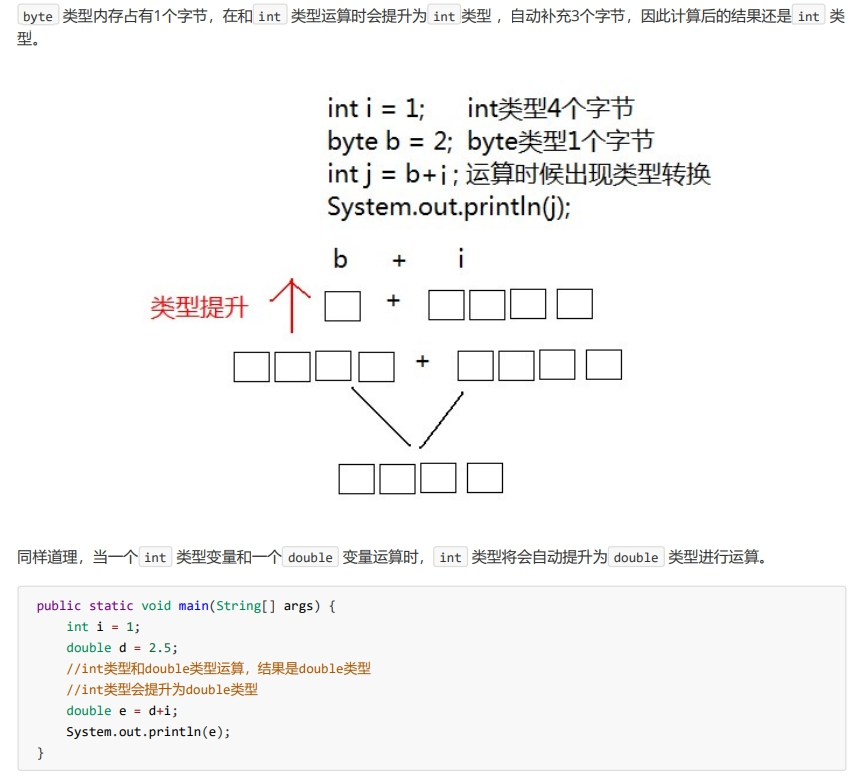

# 1 Java基本程序设计结构


## 1.1 数据类型

Java的数据类型分为两大类： 

- **基本数据类型**：包括 整数 、 浮点数 、 字符 、 布尔 。 

- **引用数据类型**：包括 类 、 数组 、 接口 。

  




### 1.1.1 整型

整型用于表示没有小数部分的数值， 它允许是负数。Java 提供了 4 种整型，具体内容如下


### 1.1.2 浮点类型

浮点类型用于表示有小数部分的数值。在 Java 中有两种浮点类型


​		double 表示这种类型的数值精度是 float 类型的两倍（有人称之为双精度数值)。**绝大部分应用程序都采用 double 类型**。在很多情况下，f**loat 类型的精度很难满足需求**。实际上，只 有很少的情况适合使用 float 类型，例如，需要单精度数据的库， 或者需要存储大量数据。 float 类型的数值有一个后缀 F 或 f (例如，3.14F。) 没有后缀 F 的浮点数值（如 3.14 ) 默 认为 double 类型。当然，也可以在浮点数值后面添加后缀 D 或 d (例如，3.14D) 。


### 1.1.3 char类型

​		char 类型原本用于表示单个字符。不过，现在情况已经有所变化。 如今，有些 Unicode 字符可以用一个 chai•值描述，另外一些 Unicode 字符则需要两个 char 值。有关的详细信息请 阅读下一节。 char 类型的字面量值要用单引号括起来。例如：W 是编码值为 65 所对应的字符常量。 它与 "A" 不同，"A" 是包含一个字符 A 的字符串, char 类型的值可以表示为十六进制值，其 范围从 \u0000 到 \Uffff。例如：W2122 表示注册符号 ( ), \u03C0 表示希腊字母 it。 除了转义序列 \u 之外， 还有一些用于表示特殊字符的转义序列， 请参看表 3-3。所有这 些转义序列都可以出现在加引号的字符字面量或字符串中。例如，’ \02丨22' 或 "1 110\11”。转 义序列 \u还可以出现在加引号的字符常量或字符串之外（而其他所有转义序列不可以）。例 如： public static void main(String\u005B\ u00SD args) 就完全符合语法规则， \u005B 和 \u005D 是 [ 和 ] 的编码


### 1.1.3 boolean类型

boolean (布尔）类型有两个值：false 和 true, 用来判定逻辑条件 整型值和布尔值之间 不能进行相互转换。


## 1.2 运算符


### 1.2.1 算术运算符


Java中，整数使用以上运算符，无论怎么计算，也不会得到小数。


++ 运算，变量自己增长1。反之， -- 运算，变量自己减少1，用法与 ++ 一致。 

- 独立运算： 

  - 变量在独立运算时， 前++ 和 后++ 没有区别 。 
  - 变量 前++ ：例如 ++i 。 
  - 变量 后++ ：例如 i++ 。

- 混合运算： 

  - 和其他变量放在一起， 前++ 和 后++ 就产生了不同。 

    

  - 变量 前++ ：变量a自己加1，将加1后的结果赋值给b，也就是说a先计算。a和b的结果都是2。

    


在 Java 中，使用算术运算符 + 、-、 * 、/ 表示加、减、 乘、除运算。 **当参与 / 运算的两个 操作数都是整数时， 表示整数除法；否则， 表示浮点除法**。 整数的求余操作（有时称为取模) 用 ％ 表示。例如，15/2 等于 ，7 15%2 等于 1 , 15.0/2 等于 7.50 需要注意， 整数被 0 除将会产生一个异常， 而浮点数被 0 除将会得到无穷大或 NaN 结果。


### 1.2.2 赋值运算符


### 1.2.3 比较运算符


### 1.2.4 逻辑运算符


### 1.2.5 三元运算符

**三元运算符格式：**

```
数据类型 变量名 = 布尔类型表达式？结果1：结果2
```


**三元运算符计算方式：**

- 布尔类型表达式结果是true，三元运算符整体结果为结果1，赋值给变量。
- 布尔类型表达式结果是false，三元运算符整体结果为结果2，赋值给变量。


### 1.2.6 数学函数与常量Math

在 Math类中，包含了各种各样的数学函数。在编写不同类别的程序时，可能需要的函数也不同。




```java
/**
         *Math.sqrt()//计算平方根
         *Math.cbrt()//计算立方根
         *Math.pow(a, b)//计算a的b次方
         *Math.max( , );//计算最大值
         *Math.min( , );//计算最小值
         */
 
        System.out.println(Math.sqrt(16));   //4.0
        System.out.println(Math.cbrt(8));    //2.0
        System.out.println(Math.pow(3,2));     //9.0
        System.out.println(Math.max(2.3,4.5));//4.5
        System.out.println(Math.min(2.3,4.5));//2.3
 
        /**
         * abs求绝对值
         */
        System.out.println(Math.abs(-10.4));    //10.4
        System.out.println(Math.abs(10.1));     //10.1
 
        /**
         * ceil天花板的意思，就是返回大的值
         */
        System.out.println(Math.ceil(-10.1));   //-10.0
        System.out.println(Math.ceil(10.7));    //11.0
        System.out.println(Math.ceil(-0.7));    //-0.0
        System.out.println(Math.ceil(0.0));     //0.0
        System.out.println(Math.ceil(-0.0));    //-0.0
        System.out.println(Math.ceil(-1.7));    //-1.0
 
        /**
         * floor地板的意思，就是返回小的值
         */
        System.out.println(Math.floor(-10.1));  //-11.0
        System.out.println(Math.floor(10.7));   //10.0
        System.out.println(Math.floor(-0.7));   //-1.0
        System.out.println(Math.floor(0.0));    //0.0
        System.out.println(Math.floor(-0.0));   //-0.0
 
        /**
         * random 取得一个大于或者等于0.0小于不等于1.0的随机数
         */
        System.out.println(Math.random());  //小于1大于0的double类型的数
        System.out.println(Math.random()*2);//大于0小于1的double类型的数
        System.out.println(Math.random()*2+1);//大于1小于2的double类型的数
 
        /**
         * rint 四舍五入，返回double值
         * 注意.5的时候会取偶数    异常的尴尬=。=
         */
        System.out.println(Math.rint(10.1));    //10.0
        System.out.println(Math.rint(10.7));    //11.0
        System.out.println(Math.rint(11.5));    //12.0
        System.out.println(Math.rint(10.5));    //10.0
        System.out.println(Math.rint(10.51));   //11.0
        System.out.println(Math.rint(-10.5));   //-10.0
        System.out.println(Math.rint(-11.5));   //-12.0
        System.out.println(Math.rint(-10.51));  //-11.0
        System.out.println(Math.rint(-10.6));   //-11.0
        System.out.println(Math.rint(-10.2));   //-10.0
 
        /**
         * round 四舍五入，float时返回int值，double时返回long值
         */
        System.out.println(Math.round(10.1));   //10
        System.out.println(Math.round(10.7));   //11
        System.out.println(Math.round(10.5));   //11
        System.out.println(Math.round(10.51));  //11
        System.out.println(Math.round(-10.5));  //-10
        System.out.println(Math.round(-10.51)); //-11
        System.out.println(Math.round(-10.6));  //-11
        System.out.println(Math.round(-10.2));  //-10
```


## 1.3 数据类型转换

Java程序中要求参与的计算的数据，必须要保证数据类型的一致性，如果数据类型不一致将发生类型的转换。

- 自动（隐式）类型转换：从小类型到大类型，不需要强制转换符
- 强制类型转换：从大类型到小类型，需要强制转换符实现强制转换，强制转换符：（需要转换成的类型）变量


### 1.3.1 自动（隐式）转换

**从小类型到大类型，不需要强制转换符**


**转换原理图解**

​	byte 类型内存占有1个字节，在和 int 类型运算时会提升为 int 类型 ，自动补充3个字节，因此计算后的结果还是 int 类 型。



**转换规则**

​		范围小的类型向范围大的类型提升， byte、short、char 运算时直接提升为 int 。


### 1.3.2 强制（显示）转换


**转换原理图解**


**强烈注意**


### 1.3.3 ASCII编码表


```java
public static void main(String[] args) {
	//字符类型变量
	char c = 'a';
	int i = 1;
	//字符类型和int类型计算
	System.out.println(c+i);//输出结果是98
}
```


