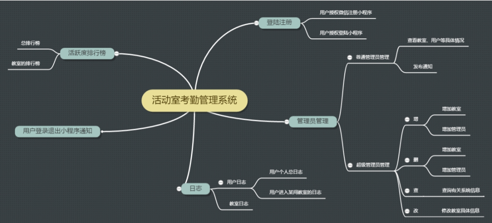
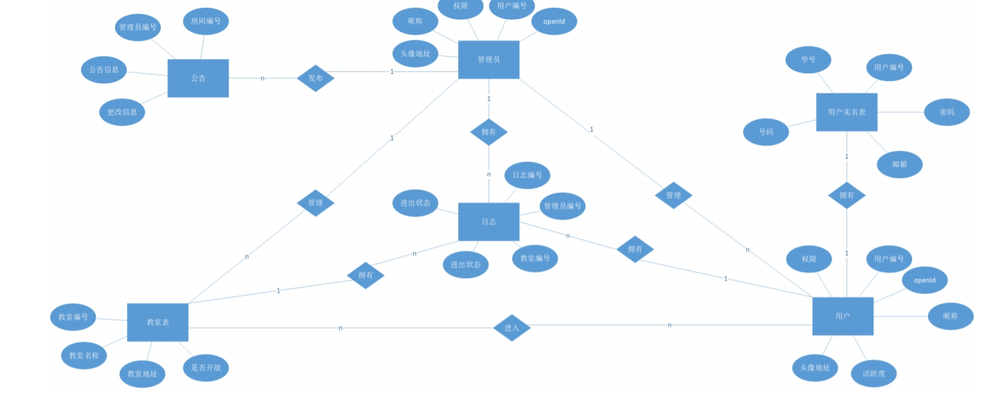
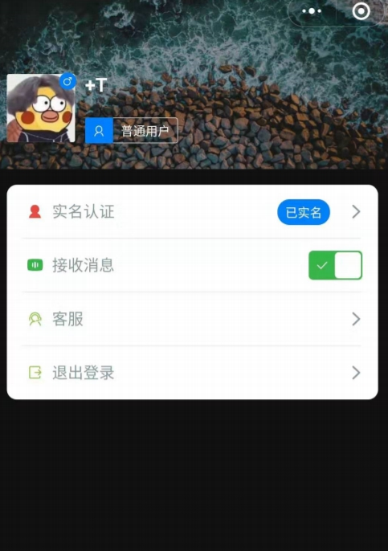
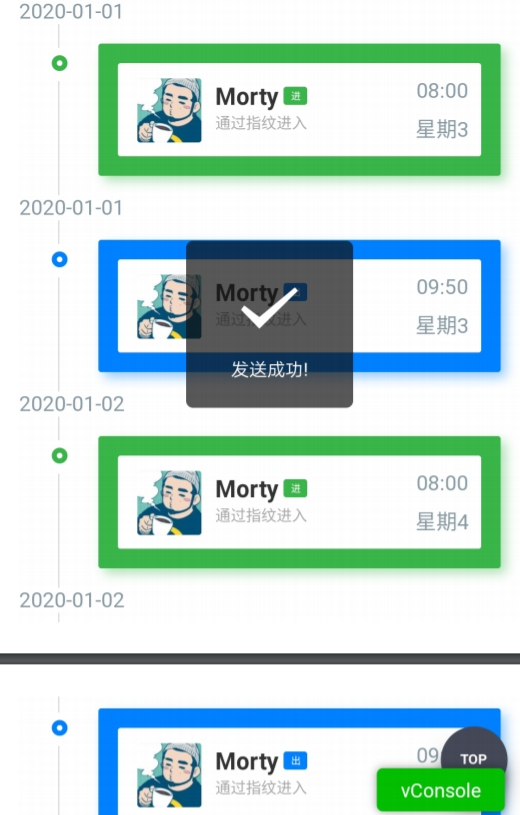
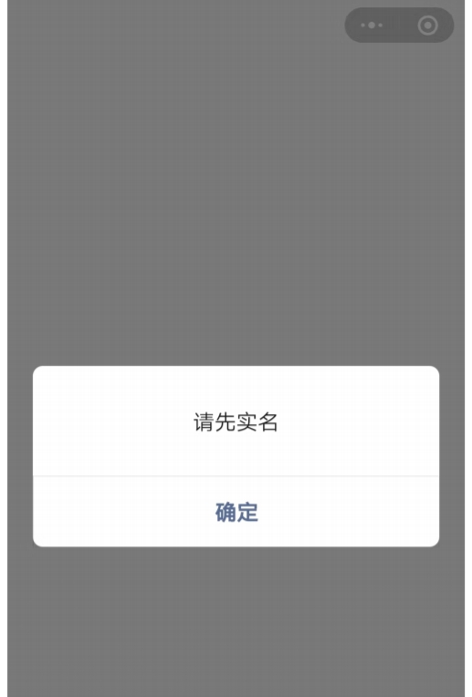
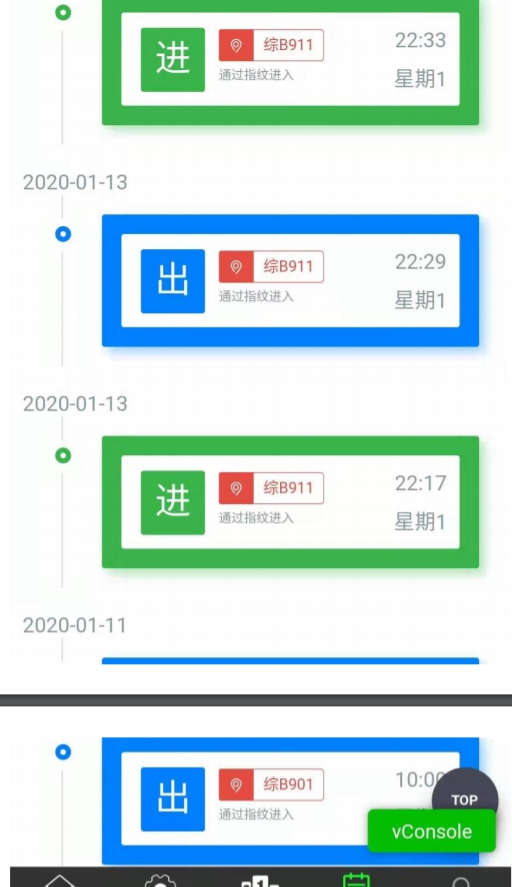
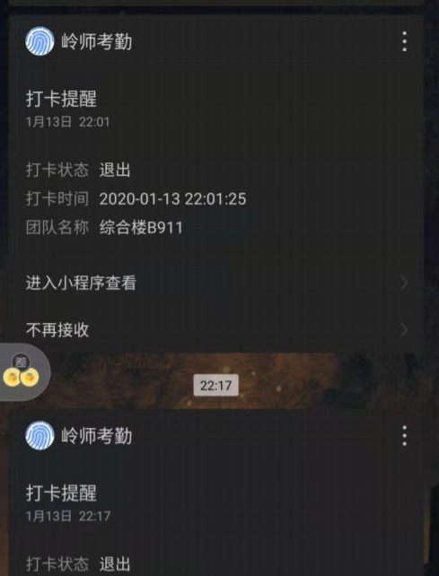
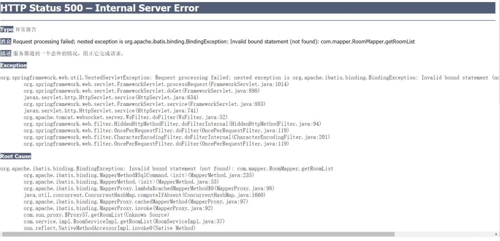
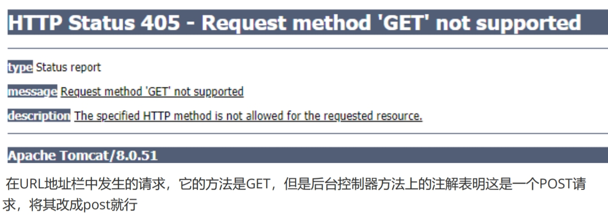

#  	          活动室指纹考勤管理系统

成员：陈龙

网页端浏览：

项目Github地址：

### 一、需求分析  

#### 1.需求分析  

 1.管理方面：近几年来，随着大学生社团活动的丰富，社团活动室的管理问题也日益明显。社团活动室通常是自由**开放管理**方式，会员可**自由进出**活动室学习，很难对其会员的**活跃度**、**实时在场**人员情况等进行管理，而在社团进行换届和招新的期间，人员**变动**很**频繁**，会员信息更新工作量大。本项目通过指纹和人脸识别多种识别方式，实时记录存储登记会员每一次的进出时间，从而实现出勤时间的自动统计，自动将会员的活跃时长按月和周实时显示在小程序端，还能实时显示当前在活动室的成员及其联系方式，社团负责人可随时联系在活动室的会员。

2.安全方面：智能指纹及人脸识别好在“智能、安全、便捷”，十分适用于社团活动室等的人员流动记录管理，不会出现人工记录的繁琐，又免除了必须携带钥匙或门禁卡的麻烦，普通钥匙或门禁卡管理方式**容易丢失或复制**，造成安全隐患。而传统密码锁的话时间一长也容易泄露，不适用于人流量大的社团活动室。另外指纹识别对环境和打卡人员皮肤的要求都很高，当空气干燥、皮肤脏、蜕皮等情况就无法识别，这时候就可以用人脸识别进行打卡，多种打卡方式**容错率更高**。所以社团活动室将采用指纹及人脸识别**两种方式结合**来进行社团活动室的管理。 

#### 2.思维导图




### 二、数据库结构

#### 1.ER图



#### 2.表结构（7个表）

**wxuser表**

| 名称     | 类型        | 是否为空 | 主键 | 备注          |
| -------- | ----------- | -------- | ---- | ------------- |
| uId      | int(11)     | 否       | 是   | 自动增长      |
| openId   | varchar(30) | 否       |      | 微信号        |
| nickName | varchar(20) | 否       |      | 微信昵称      |
| avatrUrl | text        | 否       |      | 头像地址      |
| activity | int(11)     | 是       |      | 进入房间      |
| sSuper   | int(11)     | 否       |      | 权限，默认为1 |


**realname表**

| 名称     | 类型        | 是否为空 | 主键 | 备注   |
| -------- | ----------- | -------- | ---- | ------ |
| uId      | int(11)     | 否       |      | 用户ID |
| sId      | varchar(20) | 否       | 是   | 学号   |
| password | varchar(30) | 否       |      | 密码   |
| pNumber  | varchar(20) | 否       |      | 号码   |
| email    | varchar(30) | 否       |      | 邮箱   |

**time表**

| 名称 | 类型    | 是否为空 | 主键 | 备注         |
| ---- | :------ | -------- | ---- | ------------ |
| uId  | int(11) | 否       |      | 用户ID       |
| rId  | int(11) | 否       |      | 进过的房间ID |
| time | int(11) | 否       |      | 活跃时间     |

**room表**

| 名称    | 类型        | 是否为空 | 主键 | 备注          |
| ------- | ----------- | -------- | ---- | ------------- |
| rId     | int(11)     | 否       | 是   | 自动增长      |
| rName   | varchar(20) | 否       |      | 教室名        |
| address | varchar(50) | 否       |      | 教室位置      |
| del     | int(11)     |          |      | 状态，默认为1 |


**roomAdmin表**

| 名称  | 类型     | 是否为空 | 主键 | 备注          |
| ----- | -------- | -------- | ---- | ------------- |
| rId   | int(11)  |          |      | 教室编号      |
| uId   | int(11)  |          |      | 管理员编号    |
| aDate | datetime |          |      | 通知消息      |
| del   | int(11)  |          |      | 状态，默认为1 |

**roomNotice表**

| 名称   | 类型     | 是否为空 | 主键 | 备注     |
| ------ | -------- | -------- | ---- | -------- |
| rId    | int(11)  |          |      | 房间编号 |
| uId    | int(11)  |          |      | 用户ID   |
| notice | text     |          |      | 公告信息 |
| cDate  | datetime |          |      | 更改信息 |

**Log表**

| 名称  | 类型    | 是否为空 | 主键 | 备注       |
| ----- | ------- | -------- | ---- | ---------- |
| lId   | int(11) | 否       | 是   | 自动增长   |
| uId   | int(11) | 否       |      | 管理员编号 |
| rId   | int(11) | 否       |      | 教室编号   |
| state | int(11) | 否       |      | 进出状态   |
| lDate | date    | 否       |      | 进出时间   |

### 三、组员工作划分

陈龙：负责wxuser表realname表，Log表的后台功能实现，包括增删查改等功能；小程序前端的开发实现；服务器的部署


罗家晓：负责roomadmin，room表后台功能的实现，包括增删查改等功能的实现；小程序前端的开发实现。


吴佳涛：负责roomnotice，time表后台功能的实现，包括增删查改功能的实现；数据库表的设计与修改。


### 四、代码整合工具

   小组采用Github工具进行整合，每天做完项目后各自将自己的代码提交到自己的分支上，然后在主分支进行整合，每天项目开发前拉取昨晚整合好的代码。

##### 工程目录


### 五、POM.xml

```xml
<?xml version="1.0" encoding="UTF-8"?>

<project xmlns="http://maven.apache.org/POM/4.0.0" xmlns:xsi="http://www.w3.org/2001/XMLSchema-instance"
  xsi:schemaLocation="http://maven.apache.org/POM/4.0.0 http://maven.apache.org/xsd/maven-4.0.0.xsd">
  <modelVersion>4.0.0</modelVersion>

  <groupId>org.example</groupId>
  <artifactId>attendance</artifactId>
  <version>1.0-SNAPSHOT</version>
  <packaging>war</packaging>

  <name>attendance Maven Webapp</name>
  <!-- FIXME change it to the project's website -->
  <url>http://www.example.com</url>

  <properties>
    <project.build.sourceEncoding>UTF-8</project.build.sourceEncoding>
    <maven.compiler.source>1.7</maven.compiler.source>
    <maven.compiler.target>1.7</maven.compiler.target>
    <spring.version>5.2.2.RELEASE</spring.version>
    <mysql.version>5.1.47</mysql.version>
    <mybatis.version>3.5.3</mybatis.version>
    <junit.version>4.12</junit.version>
    <mybatis.gen.version>1.4.0</mybatis.gen.version>
    <slf4j.version>1.7.6</slf4j.version>
    <mybatis.spring.version>2.0.3</mybatis.spring.version>
    <aspectjweaver.version>1.9.1</aspectjweaver.version>
  </properties>

  <dependencies>
    <dependency>
      <groupId>com.fasterxml.jackson.core</groupId>
      <artifactId>jackson-databind</artifactId>
      <version>2.9.5</version>
    </dependency>
    <!-- https://mvnrepository.com/artifact/com.fasterxml.jackson.core/jackson-core -->
    <dependency>
      <groupId>com.fasterxml.jackson.core</groupId>
      <artifactId>jackson-core</artifactId>
      <version>2.9.5</version>
    </dependency>
    <!-- https://mvnrepository.com/artifact/com.fasterxml.jackson.core/jackson-annotations -->
    <dependency>
      <groupId>com.fasterxml.jackson.core</groupId>
      <artifactId>jackson-annotations</artifactId>
      <version>2.9.5</version>
    </dependency>
    <dependency>
      <groupId>mysql</groupId>
      <artifactId>mysql-connector-java</artifactId>
      <version>${mysql.version}</version>
    </dependency>
    <dependency>
      <groupId>org.springframework</groupId>
      <artifactId>spring-webmvc</artifactId>
      <version>${spring.version}</version>
    </dependency>
    <dependency>
      <groupId>org.springframework</groupId>
      <artifactId>spring-jdbc</artifactId>
      <version>${spring.version}</version>
    </dependency>
    <dependency>
      <groupId>org.springframework</groupId>
      <artifactId>spring-tx</artifactId>
      <version>${spring.version}</version>
    </dependency>
    <dependency>
      <groupId>org.mybatis</groupId>
      <artifactId>mybatis</artifactId>
      <version>${mybatis.version}</version>
    </dependency>
    <dependency>
      <groupId>junit</groupId>
      <artifactId>junit</artifactId>
      <version>${junit.version}</version>
    </dependency>
    <!-- https://mvnrepository.com/artifact/org.mybatis.generator/mybatis-generator-core -->
    <dependency>
      <groupId>org.mybatis.generator</groupId>
      <artifactId>mybatis-generator-core</artifactId>
      <version>${mybatis.gen.version}</version>
    </dependency>
    <dependency>
      <groupId>org.slf4j</groupId>
      <artifactId>slf4j-log4j12</artifactId>
      <version>${slf4j.version}</version>
    </dependency>
    <!-- https://mvnrepository.com/artifact/org.mybatis/mybatis-spring -->
    <dependency>
      <groupId>org.mybatis</groupId>
      <artifactId>mybatis-spring</artifactId>
      <version>${mybatis.spring.version}</version>
    </dependency>
    <dependency>
      <groupId>org.aspectj</groupId>
      <artifactId>aspectjweaver</artifactId>
      <version>${aspectjweaver.version}</version>
    </dependency>
    <!-- https://mvnrepository.com/artifact/commons-fileupload/commons-fileupload -->
    <dependency>
      <groupId>commons-fileupload</groupId>
      <artifactId>commons-fileupload</artifactId>
      <version>1.4</version>
    </dependency>
    <!-- https://mvnrepository.com/artifact/commons-io/commons-io -->
    <dependency>
      <groupId>commons-io</groupId>
      <artifactId>commons-io</artifactId>
      <version>2.6</version>
    </dependency>


  </dependencies>

  <build>
    <finalName>attendance</finalName>
    <pluginManagement><!-- lock down plugins versions to avoid using Maven defaults (may be moved to parent pom) -->
      <plugins>
        <plugin>
          <artifactId>maven-clean-plugin</artifactId>
          <version>3.1.0</version>
        </plugin>
        <!-- see http://maven.apache.org/ref/current/maven-core/default-bindings.html#Plugin_bindings_for_war_packaging -->
        <plugin>
          <artifactId>maven-resources-plugin</artifactId>
          <version>3.0.2</version>
        </plugin>
        <plugin>
          <artifactId>maven-compiler-plugin</artifactId>
          <version>3.8.0</version>
        </plugin>
        <plugin>
          <artifactId>maven-surefire-plugin</artifactId>
          <version>2.22.1</version>
        </plugin>
        <plugin>
          <artifactId>maven-war-plugin</artifactId>
          <version>3.2.2</version>
        </plugin>
        <plugin>
          <artifactId>maven-install-plugin</artifactId>
          <version>2.5.2</version>
        </plugin>
        <plugin>
          <artifactId>maven-deploy-plugin</artifactId>
          <version>2.8.2</version>
        </plugin>
      </plugins>
    </pluginManagement>
  </build>
</project>

```

##### web.xml

```xml
<!DOCTYPE web-app PUBLIC
        "-//Sun Microsystems, Inc.//DTD Web Application 2.3//EN"
        "http://java.sun.com/dtd/web-app_2_3.dtd" >

<web-app>
  <display-name>Archetype Created Web Application</display-name>


  <!--注册springmvc的serlvet，即前端控制器，处理请求-->
  <servlet>
    <servlet-name>springmvc</servlet-name>
    <!--servlet-class中的值是spring-webmvc包提供的类，即前端控制器，用于控制所有请求 -->
    <servlet-class>org.springframework.web.servlet.DispatcherServlet</servlet-class>
    <init-param>
      <param-name>contextConfigLocation</param-name>
      <!---加载配置-->
      <param-value>classpath:application-context.xml</param-value>
    </init-param>
  </servlet>

  <servlet-mapping>
    <!--        3.编写Controller-->
    <!--        4.在application-context.xml开启扫描-->
    <!--        5.配置视图解析器-->
    <servlet-name>springmvc</servlet-name>
    <!--url-pattern（重点）中有3个值，分别为/、 /*、 *.action -->
    <url-pattern>/</url-pattern>
  </servlet-mapping>

  <welcome-file-list>
    <welcome-file>ChenLong.jsp</welcome-file>
    <welcome-file>login.jsp</welcome-file>
  </welcome-file-list>


</web-app>

```


### 六、配置文件

##### 1.application-context.xml

```xml
<?xml version="1.0" encoding="UTF-8"?>
<beans xmlns="http://www.springframework.org/schema/beans"
       xmlns:xsi="http://www.w3.org/2001/XMLSchema-instance"
       xmlns:p="http://www.springframework.org/schema/p"
       xmlns:c="http://www.springframework.org/schema/c"
       xmlns:context="http://www.springframework.org/schema/context"
       xmlns:mybatis="http://mybatis.org/schema/mybatis-spring"
       xsi:schemaLocation="http://www.springframework.org/schema/beans
        				   https://www.springframework.org/schema/beans/spring-beans.xsd
        				   http://www.springframework.org/schema/context
        				   https://www.springframework.org/schema/context/spring-context.xsd
        				   http://mybatis.org/schema/mybatis-spring
        				   http://mybatis.org/schema/mybatis-spring.xsd

http://mybatis.org/schema/mybatis-spring ">

    <!--引入jdbc.properties-->
    <context:property-placeholder location="classpath:jdbc.properties"/>
    <!--    添加注解支持-->
    <context:annotation-config/>
    <!--    扫描bean-->
    <context:component-scan base-package="com"/>

<!--    <bean id="transactionManager" class="org.springframework.jdbc.datasource.DataSourceTransactionManager">-->
<!--        <property name="dataSource" ref="dataSource"></property>-->
<!--    </bean>-->

    <import resource="spring-mybatis.xml"/>
    <import resource="spring-mvc.xml"/>
    <import resource="spring-tx.xml"/>


    <bean id="dataSource" class="org.springframework.jdbc.datasource.DriverManagerDataSource">
        <property name="driverClassName" value="${driver}"/>
        <property name="url" value="${url}"/>
        <property name="username" value="${user}"/>
        <property name="password" value="${password}"/>
    </bean>

</beans>
```

##### 2.jdbc.properties

```xml
driver:com.mysql.jdbc.Driver
url:jdbc:mysql://localhost:3306/attendance?useUnicode=true&amp;characterEncoding=utf8
user:root
password:123456
```

##### 3.log4j.xml

```xml
<?xml version="1.0" encoding="UTF-8" ?>
<!DOCTYPE log4j:configuration SYSTEM "log4j.dtd">
<log4j:configuration
        xmlns:xsi="http://www.w3.org/2001/XMLSchema-instance" xmlns:log4j=""
        xsi:schemaLocation="http://jakarta.apache.org/log4j/ ">
    <appender name="console" class="org.apache.log4j.ConsoleAppender">
        <param name="Target" value="System.out"/>
        <layout class="org.apache.log4j.PatternLayout">
            <param name="ConversionPattern" value="[CateringLog] %d{yyyy-MM-dd HH:mm:ss,SSS} %-5p %c - %m%n"/>
        </layout>
    </appender>
    <appender class="org.apache.log4j.RollingFileAppender" name="file">
        <param name="File" value="d:/companyProject/logs/catering.log"/>
        <param name="Append" value="true"/>
        <param name="MaxFileSize" value="1024KB"/>
        <param name="MaxBackupIndex" value="5"/>
        <layout class="org.apache.log4j.PatternLayout">
            <param name="ConversionPattern" value="[CateringLog] %d{yyyy-MM-dd HH:mm:ss,SSS} %-5p %c - %m%n"/>
        </layout>
    </appender>
    <root>
        <priority value="debug"/>
        <appender-ref ref="console"/>
        <appender-ref ref="file"/>
    </root>
    <!--通过<logger></logger>的定义可以将各个包中的类日志输出到不同的日志文件中-->
    <logger name="org.springframework">
        <level value="ERROR"/>
    </logger>
    <logger name="org.mybatis.spring">
        <level value="ERROR"/>
    </logger>
    <logger name="net.sf.ehcache">
        <level value="ERROR"/>
    </logger>
    <logger name="com.mchange.v2">
        <level value="ERROR"/>
    </logger>
    <logger name="java.sql">
        <level value="debug"/>
    </logger>
</log4j:configuration>
```

##### 4.mybatis-config.xml

```xml
<?xml version="1.0" encoding="UTF-8" ?>
<!DOCTYPE configuration
        PUBLIC "-//mybatis.org//DTD Config 3.0//EN"
        "http://mybatis.org/dtd/mybatis-3-config.dtd">
<configuration>
    <settings>
        <setting name="mapUnderscoreToCamelCase" value="true"/>
        <setting name="logImpl" value="STDOUT_LOGGING" />
    </settings>

    <typeAliases>
        <package name="com.pojo"/>
    </typeAliases>

    <mappers>
        <package name="com.mapper"/>
    </mappers>
</configuration>

```

##### 5.spring-mvc.xml

```xml
<?xml version="1.0" encoding="UTF-8"?>
<beans xmlns="http://www.springframework.org/schema/beans"
       xmlns:xsi="http://www.w3.org/2001/XMLSchema-instance"
       xmlns:mvc="http://www.springframework.org/schema/mvc"
       xsi:schemaLocation="http://www.springframework.org/schema/beans
                           http://www.springframework.org/schema/beans/spring-beans.xsd
        				   http://www.springframework.org/schema/mvc
        				   https://www.springframework.org/schema/mvc/spring-mvc.xsd
                           ">
<!--    <bean class="org.springframework.web.servlet.view.InternalResourceViewResolver">-->
<!--        <property name="prefix" value="/WEB-INF/pages/"></property>-->
<!--        <property name="suffix" value=".jsp"></property>-->
<!--    </bean>-->
    <!--会引起一个严重的后果，controller中的所有url全部是404-->
    <!--    <mvc:view-controller path="/test" view-name="success"></mvc:view-controller>-->
    <!--告诉springmvc，自己映射的请求就自己处理，不能处理的请求就交给tomcat-->
    <mvc:default-servlet-handler />

    <!--将springmvc，功能全开-->
    <mvc:annotation-driven conversion-service="convertService" />
    <bean id="convertService" class="org.springframework.format.support.FormattingConversionServiceFactoryBean"/>
</beans>
```

##### 6.spring-mybatis.xml

```xml
<?xml version="1.0" encoding="UTF-8"?>
<beans xmlns="http://www.springframework.org/schema/beans"
       xmlns:xsi="http://www.w3.org/2001/XMLSchema-instance"
       xmlns:mybatis="http://mybatis.org/schema/mybatis-spring" xmlns:jdbc="http://www.springframework.org/schema/jdbc"
       xsi:schemaLocation="http://www.springframework.org/schema/beans
                           http://www.springframework.org/schema/beans/spring-beans.xsd
        				   http://mybatis.org/schema/mybatis-spring
        				   http://mybatis.org/schema/mybatis-spring.xsd http://www.springframework.org/schema/jdbc http://www.springframework.org/schema/jdbc/spring-jdbc.xsd">
    <bean id="sqlSessionFactory" class="org.mybatis.spring.SqlSessionFactoryBean">
        <property name="dataSource" ref="dataSource" />
        <property name="configLocation" value="classpath:mybatis-config.xml"></property>
    </bean>
    <mybatis:scan base-package="com.mapper"/>
</beans>

```

##### 7.spring-tx.xml

```xml
<?xml version="1.0" encoding="UTF-8"?>
<beans xmlns="http://www.springframework.org/schema/beans"
       xmlns:xsi="http://www.w3.org/2001/XMLSchema-instance"
       xmlns:tx="http://www.springframework.org/schema/tx"
       xmlns:aop="http://www.springframework.org/schema/aop"
       xmlns:jdbc="http://www.springframework.org/schema/jdbc"
       xsi:schemaLocation="http://www.springframework.org/schema/beans
                           http://www.springframework.org/schema/beans/spring-beans.xsd
        				   http://www.springframework.org/schema/tx
        				   https://www.springframework.org/schema/tx/spring-tx.xsd
        				   http://www.springframework.org/schema/aop
        				   https://www.springframework.org/schema/aop/spring-aop.xsd http://www.springframework.org/schema/jdbc http://www.springframework.org/schema/jdbc/spring-jdbc.xsd">
    <!--配置事务-->
    <bean id="transactionManager" class="org.springframework.jdbc.datasource.DataSourceTransactionManager">
        <property name="dataSource" ref="dataSource"/>
    </bean>
    <!--开启事务注解-->
    <tx:annotation-driven transaction-manager="transactionManager"/>
    <!--配置事务通知-->
    <tx:advice id="txAdvice" transaction-manager="transactionManager">
        <tx:attributes>
            <tx:method name="*" propagation="REQUIRED"/>
        </tx:attributes>
    </tx:advice>
    <!--事务AOP处理-->
    <aop:config>
        <!--切入点-->
        <aop:pointcut id="pcuser" expression="execution(* com.service.*.*(..))"/>
        <!--通知-->
        <aop:advisor advice-ref="txAdvice" pointcut-ref="pcuser"></aop:advisor>
    </aop:config>
    <jdbc:embedded-database id="dataSource"/>
</beans>
```


### 七、相关代码

##### 1.controller包

###### homeController.java

```java
package com.controller;

import com.service.LogService;
import com.service.TimeService;
import com.service.WxUserService;
import org.springframework.beans.factory.annotation.Autowired;
import org.springframework.web.bind.annotation.RequestMapping;
import org.springframework.web.bind.annotation.RestController;

import java.text.ParseException;
import java.text.SimpleDateFormat;
import java.util.Date;
import java.util.HashMap;
import java.util.Map;

/**
 * @ClassName: homeController
 * @Description: 用于首页数据的调用
 * @author: 陈龙
 * @date: 2020/1/12  22:25
 * “欢迎您，我的无上至尊”
 */
@RestController
@RequestMapping("/home")
public class homeController {
    @Autowired
    private WxUserService wxUserService;

    @Autowired
    private LogService logService;

    @Autowired
    private TimeService timeService;

    @RequestMapping("/home")
    public Map<String,Object> inRoom(Integer uId, Integer rId, Integer state, String lDate) throws ParseException {
        /*
         * 1.获取此人在的教室，有就返回此教室日志，没有返回的也是空（uId不为空rid为空时）
         * 2.如果uid和rid不为空说明要进入教室，就更新微信用户表的uid并返回此教室日志
         * 3.quit为true时为退出，为空时处理其他
         *
         *
         * */
        System.out.println("uId="+uId);
        System.out.println("rId="+rId);
        System.out.println("state="+state);
        System.out.println("lDate="+lDate);
        Map<String,Object> inRoom = new HashMap<>();
        /*退出教室，置为空*/
        if(state!=null){
            if(state==0) {
                /*离开教室*/
                System.out.println("离开教室");

//
                wxUserService.updateRoom(uId, null);
                logService.addLog(uId, rId, state, lDate);

                /*计算在这个教室时长*/
                SimpleDateFormat simpleDateFormat = new SimpleDateFormat("YYYY-MM-dd HH:mm:ss");
                Date endTime = simpleDateFormat.parse(lDate);

                System.out.println((logService.getEntryTime(uId, rId)).get("lDate"));


                Map<String,Object> maxDate = logService.getEntryTime(uId, rId);
                System.out.println(maxDate.get("lDate"));

                Date startTime = simpleDateFormat.parse(String.valueOf(maxDate.get("lDate")));
                System.out.println("startTime="+startTime);

                if (startTime != null) {
                    System.out.println("xxxx");
                    long start = startTime.getTime();
                    long end = endTime.getTime();
                    long result = (end - start)/(60*1000);
                    int time = (int)result;
                    System.out.println("time="+time);
                /*如果time表没这个记录就增加，有就更新*/
                if (timeService.checkExist(uId, rId) == null) {
                    System.out.println("不存在time，要插入");
                    timeService.updateOrAddTime(uId,rId,time,null);
                } else {
                    System.out.println("存在time，要更新");
                    timeService.updateOrAddTime(uId,rId,time,1);

                }
            }
                inRoom.put("success","退出成功");
                return inRoom;
            }else if(state==1){/*进入教室*/
                System.out.println("进入教室");

                logService.addLog(uId,rId,state,lDate);
                wxUserService.updateRoom(uId,rId);


            }
        } else if(state==null){/*页面加载获取教室返回空或教师日志等信息*/

            rId = wxUserService.getOnlineRoom(uId);
            if(rId==null){
                inRoom.put("roomLog",null);
                return inRoom;
            }
        }

        System.out.println("法身了");


        inRoom.put("roomLog",logService.getLog(null,rId,null));


        return inRoom;
    }

    @RequestMapping("/test")
    public String test() throws ParseException {
        String lDate = "2020-01-13 10:23:31" ;
        String lDate2 = "2020-01-13 10:25:31" ;
        SimpleDateFormat simpleDateFormat = new SimpleDateFormat("YYYY-MM-dd HH:mm:ss");
        Date startTime = simpleDateFormat.parse(lDate);
        Date endTime = simpleDateFormat.parse(lDate2);

        long start = startTime.getTime();
        long end = endTime.getTime();
        long result = end-start;
        System.out.println("相减为"+result);
        String fuck = "相差"+result/(60*1000)+"分钟";

        return fuck;

    }


}

```

###### LogController.java

```xml
package com.controller;

import com.pojo.Log;
import com.service.LogService;
import org.springframework.beans.factory.annotation.Autowired;
import org.springframework.web.bind.annotation.GetMapping;
import org.springframework.web.bind.annotation.RequestMapping;
import org.springframework.web.bind.annotation.RestController;

import java.util.HashMap;
import java.util.List;
import java.util.Map;

/**
 * @ClassName: LogController
 * @Description: TODO
 * @author: 陈龙
 * @date: 2020/1/8  0:52
 * “欢迎您，我的无上至尊”
 */
@RestController
@RequestMapping("/log")
public class LogController {
    @Autowired
    private LogService logService;

    @GetMapping(value= "/getLog")
    public Map<String,Object> getLog(Integer uId,Integer rId){
        /*
        * 1.根据uId和rid差某个人在某个教室日志
        * 2.根据uId差某个人所有日志
        * 3.根据sId查某间教室日志
        * 4.根据uId差某个人去过的教室（groupby）
        * 返回的是多表查询*/
        System.out.println("rid="+rId);
        System.out.println("uId="+uId);
        Map<String,Object> logMap = new HashMap<>();
        logMap.put("logList",logService.getLog(uId,rId,null));
        if(uId!=null&&rId==null) {
            logMap.put("roomList", logService.getLog(uId, rId, 1));
        }

        return logMap;
    }
}

```

###### RealNameController.java

```java
package com.controller;

import com.pojo.RealName;
import com.service.RealNameService;
import org.springframework.beans.factory.annotation.Autowired;
import org.springframework.web.bind.annotation.RequestMapping;
import org.springframework.web.bind.annotation.RestController;

import java.util.HashMap;
import java.util.Map;

/**
 * @ClassName: RealNameController
 * @Description: TODO
 * @author: 陈龙
 * @date: 2020/1/10  19:37
 * “欢迎您，我的无上至尊”
 */

@RestController
@RequestMapping("/realName")
public class RealNameController {
    @Autowired
    private RealNameService realNameService;


    @RequestMapping("/tieRealName")
    public Map<String,Object> login(String uId, String sId, String password, String email) {
        /*
            实名绑定，todo邮箱认证
         *
         * */

        Map<String,Object> msg = new HashMap<>();
        RealName realName = new RealName(sId,password,email);
        RealName getRealName = realNameService.getBySidAndPwd(realName);
        System.out.println(getRealName);
        if(getRealName==null){
            System.out.println("不存在或密码错误");
//            不存在或账号密码错误
            msg.put("success","noExist");
        }else if(getRealName.getuId()!=null){
//            已绑定
            msg.put("success","tied");
        }else if(getRealName!=null&&getRealName.getuId()==null){
//            未绑定且账密正确
            msg.put("success",realNameService.tieUid(uId,sId));
        }


        return msg;

    }

    @RequestMapping("/getRealName")
    public Map<String,Object> getByUid(String uId){
        System.out.println(uId);
        Map<String,Object> msg = new HashMap<>();
        msg.put("realNameInfo",realNameService.getByUid(uId));
        return msg;
    }
}

```

###### RoomAdminController.java

```java
/**
 * Copyright (C), 2015-2020, XXX有限公司
 * FileName: RoomAdminController
 * Author:   19399
 * Date:     2020/1/9 19:13
 * Description: 教室管理
 * History:
 * <author>          <time>          <version>          <desc>
 * 作者姓名           修改时间           版本号              描述
 */
package com.controller;

import com.pojo.Room;
import com.pojo.RoomAdmin;
import com.service.RoomAdminService;
import com.service.RoomService;
import org.springframework.beans.factory.annotation.Autowired;
import org.springframework.ui.Model;
import org.springframework.web.bind.annotation.DeleteMapping;
import org.springframework.web.bind.annotation.GetMapping;
import org.springframework.web.bind.annotation.PathVariable;
import org.springframework.web.bind.annotation.PostMapping;
import org.springframework.web.bind.annotation.RequestMapping;
import org.springframework.web.bind.annotation.RequestMethod;
import org.springframework.web.bind.annotation.RestController;

import java.util.HashMap;
import java.util.List;
import java.util.Map;

/**
 * 〈一句话功能简述〉<br> 
 * 〈教室管理〉
 *
 * @author 19399
 * @create 2020/1/9
 * @since 1.0.0
 */
@RestController
@RequestMapping("/RoomAdmin")
public class RoomAdminController {
    @Autowired
    private RoomAdminService roomAdminService;

    @RequestMapping(value = "/roomAdminList")
    public Map<String,Object> getRoomAdminList(RoomAdmin roomAdmin) {
        Map<String,Object> roomAdminMap=new HashMap<>();
        List<RoomAdmin> list = roomAdminService.getRoomAdminList(roomAdmin);
        roomAdminMap.put("list",list);
        return roomAdminMap;
    }
    @GetMapping(value = "/roomAdminListByRId/{rId}")
    public Map<String,Object> getRoomAdminListByRId(@PathVariable Integer rId, Model model) {
        Map<String,Object> roomAdminList=new HashMap<>();
        System.out.println(rId);
        List<RoomAdmin> list = roomAdminService.getRoomAdminListByRId(rId);
        model.addAttribute("roomAdmin", list);
        roomAdminList.put("list",list);
        return roomAdminList;
    }
    @GetMapping(value = "/roomAdminListByUId/{uId}")
    public Map<String,Object> getRoomAdminListByUId(@PathVariable Integer uId, Model model) {
        Map<String,Object> roomAdminList1=new HashMap<>();
        System.out.println(uId);
        List<RoomAdmin> list1 = roomAdminService.getRoomAdminListByUId(uId);
        model.addAttribute("roomAdmin1", list1);
        roomAdminList1.put("list",list1);
        return roomAdminList1;
    }
    @RequestMapping(value = "/add", method = RequestMethod.GET)
    public String addRoom(RoomAdmin roomAdmin, Model model) {
        if((roomAdminService.getRoomAdminListByRId(roomAdmin.getrId())!=null)&&(roomAdminService.getRoomAdminListByUId(roomAdmin.getuId())!=null)){
            model.addAttribute("msg", "该管理员已管理该间教室");
            return "error";
        }
        boolean result=roomAdminService.addRoomAdmin(roomAdmin);
        if(result) {
            System.out.println("添加成功");
            return "success";
        }
        else {
            System.out.println("添加失败");
            return "error";
        }
    }

    @DeleteMapping(value = "/delete")
    public void deleteRoom(Integer rId,Integer uId, Model model) {
        roomAdminService.deleteRoomById(rId,uId);
    }

    @PostMapping(value = "/addRoomAdmin")
    public String addRoomAdmin(RoomAdmin roomAdmin) {
        boolean result=roomAdminService.addRoomAdmin(roomAdmin);
        if(result) {
            System.out.println("删除成功");
            return "success";
        }
        else {
            System.out.println("删除失败");
            return "error";
        }
    }
}


```


###### RoomController.java

```java
package com.controller;

import com.pojo.Room;
import com.service.RoomService;
import org.springframework.beans.factory.annotation.Autowired;
import org.springframework.web.bind.annotation.RequestMapping;
import org.springframework.web.bind.annotation.RestController;

import java.util.HashMap;
import java.util.Map;

/**
 * @ClassName: RoomController
 * @Description: TODO
 * @author: 陈龙
 * @date: 2020/1/12  23:33
 * “欢迎您，我的无上至尊”
 */
@RestController
@RequestMapping("/room")
public class RoomController {
    @Autowired
    private RoomService roomService;

    @RequestMapping("/room")
    public Map<String,Object> getRoomList(){
        Map<String,Object> msg = new HashMap<>();
        Room room = new Room();
        msg.put("roomList",roomService.getRoomList(room));
        return msg;
    }
}

```

###### RoomNoticeController.java

```java
package com.controller;


import com.pojo.RoomNotice;
import com.service.RoomNoticeService;
import org.apache.ibatis.annotations.Param;
import org.springframework.beans.factory.annotation.Autowired;
import org.springframework.web.bind.annotation.*;

import java.text.SimpleDateFormat;
import java.util.*;

@RestController
@RequestMapping("/roomNotice")
public class RoomNoticeController {
    @Autowired
    private RoomNoticeService roomNoticeService;
    //通过rid查询教室公告
    @GetMapping(value= "/getRoomNoticeByRid/{rid}")
    public Map<String,Object> getRoomNoticeByRid(@PathVariable Integer rid){
        System.out.println("通过"+rid+"查询课室公告");
        Map<String,Object> RoomNoticeMap = new HashMap<>();
        List<RoomNotice> RoomNoticeList = roomNoticeService.getRoomNoticeByRid(rid);
        RoomNoticeMap.put("roomNoticeList",RoomNoticeList);
        return RoomNoticeMap;
    }

    //通过uid查询教室公告
    @GetMapping(value= "/getRoomNoticeByUid/{uid}")
    public Map<String,Object> getRoomNoticeByUid(@PathVariable Integer uid){
        System.out.println("通过"+uid+"查询课室公告");
        Map<String,Object> RoomNoticeMap = new HashMap<>();
        List<RoomNotice> RoomNoticeList = roomNoticeService.getRoomNoticeByUid(uid);
        RoomNoticeMap.put("roomNoticeList",RoomNoticeList);
        return RoomNoticeMap;
    }

    //查询所有课室公告
    @GetMapping(value= "/getAllRoomNotice")
    public Map<String,Object> getAllRoomNotice(){
        System.out.println("执行了查询所有课室公告的方法");
        Map<String,Object> RoomNoticeMap = new HashMap<>();
        List<RoomNotice> RoomNoticeList = roomNoticeService.getAllRoomNotice();
        RoomNoticeMap.put("roomNoticeList",RoomNoticeList);
        return RoomNoticeMap;
    }

    //通过页面表单插入一条教室公告，插入没有约束
    @RequestMapping(value= "/insertRoomNotice")
    public String insertRoomNotice(RoomNotice bean){
        System.out.println("执行了插入一条课室公告的方法");
        //Map<String,Object> RoomNoticeMap = new HashMap<>();
        boolean result = roomNoticeService.insertRoomNotice(bean);
        if(result)
        {
            System.out.println("插入成功");
            return "index.jsp";
        }
        else{
            System.out.println("插入失败");
            return "error.jsp";
        }
    }

    //更新一条课室公告。自动生成修改时间
    @RequestMapping(value= "/updateRoomNotice")
    public String updateRoomNotice(Integer rId, Integer uId, String notice){
        System.out.println("执行了更新一条课室公告的方法");
        Calendar calendar= Calendar.getInstance();
        SimpleDateFormat dateFormat= new SimpleDateFormat("yyyy-MM-dd :hh:mm:ss");
        System.out.println("第一种获取日期方式："+dateFormat.format(calendar.getTime()));
        Date cDate =  new Date();
        System.out.println("第二种获取日期方式："+cDate);//自动生成时间
        boolean result = roomNoticeService.updateRoomNotice(rId,uId,notice,cDate);
        System.out.println(result);
        return "result";
    }

}

```


###### TimeController.java

```java
package com.controller;

import com.service.TimeService;
import com.service.WxUserService;
import org.springframework.beans.factory.annotation.Autowired;
import org.springframework.web.bind.annotation.RequestMapping;
import org.springframework.web.bind.annotation.RestController;

import java.util.HashMap;
import java.util.Map;

/**
 * @ClassName: TimeController
 * @Description: TODO
 * @author: 陈龙
 * @date: 2020/1/11  23:52
 * “欢迎您，我的无上至尊”
 */
@RestController
@RequestMapping("/time")
public class TimeController {
    @Autowired
    private TimeService timeService;

    @RequestMapping("/getAllUserTime")
    public Map<String,Object> getAllUserTime(){
        Map<String,Object> msg = new HashMap<>();
        msg.put("allUserTime",timeService.getAllUserTime());
        return msg;
    }
}

```

###### WxUserController.java

```java
package com.controller;

import com.pojo.WxUser;
import com.service.LogService;
import com.service.WxUserService;
import org.springframework.beans.factory.annotation.Autowired;
import org.springframework.ui.Model;
import org.springframework.web.bind.annotation.RequestMapping;
import org.springframework.web.bind.annotation.RequestMethod;
import org.springframework.web.bind.annotation.RestController;

import java.util.Date;
import java.util.HashMap;
import java.util.List;
import java.util.Map;

/**
 * @ClassName: WxUserController
 * @Description: TODO
 * @author: 陈龙
 * @date: 2020/1/5  21:42
 * “欢迎您，我的无上至尊”
 */
@RestController
@RequestMapping("/wxUser")
public class WxUserController {
   @Autowired
   private WxUserService wxUserService;

    @Autowired
    private LogService logService;


    @RequestMapping("/login")
    public Map<String,Object> login(String avatarUrl,String openId,String nickName) {
        /*
         * 1.验证数据库有没此用户，就添加，并返回是新用户(用于前端提示实名注册)
         * 2.如果是老用户，就更新，返回老用户（提示欢迎回来）
         *
         * */

        Map<String,Object> wxUserMap = new HashMap<>();
        WxUser wxUser = new WxUser(openId,nickName,avatarUrl);
        System.out.println(wxUser);
        wxUser.toString();


        if(wxUserService.getUserByUidOrOpenid(wxUser)==null){
            wxUserMap.put("success",wxUserService.insertWxUser(wxUser));
        }else{
            wxUserMap.put("success",null);
        }
        wxUserMap.put("wxUserInfo",wxUserService.getUserByUidOrOpenid(wxUser));

        return wxUserMap;

    }


    @RequestMapping(value = "/users", method = RequestMethod.GET)
    public String getOnlineUser(Integer rId, Model model) {

        int count;
        count = wxUserService.getOnlineUser(rId);
        model.addAttribute("count", count);
        return "index";
    }

    @RequestMapping(value = "/list",method = RequestMethod.GET)
    public String getAllWxUser(Model model) {

        List<WxUser> list = wxUserService.getAllWxUser();
        model.addAttribute("list", list);
        return "AllWxUser";//前端页面

    }

    @RequestMapping(value ="/edit",method = RequestMethod.POST)
    public void updateWxUser(Integer rid, Integer uId, Model model) {
        boolean result = wxUserService.updateWxUser(rid, uId);
        if (result == true) {
            model.addAttribute("item");
        } else {
            model.addAttribute("msg", "更新失败");
        }
    }

    @RequestMapping(value ="/test")
    public String test(){
        return "fuck";
    }


}

```


##### 2.mapper包

###### LogMapper.java

```java
package com.mapper;

import com.pojo.Log;
import com.pojo.Time;
import org.apache.ibatis.annotations.Mapper;
import org.apache.ibatis.annotations.Param;
import org.springframework.stereotype.Repository;

import java.util.Date;
import java.util.List;
import java.util.Map;

@Mapper
@Repository
public interface LogMapper {
//    在退出时返回进入时的时间
    Map<String,Object> getEntryTime(@Param("uId")Integer uId, @Param("rId")Integer rId);
//    添加日志
    boolean addLog(@Param("uId")Integer uId, @Param("rId")Integer rId,
                   @Param("state")Integer state, @Param("lDate")String lDate) ;
    //动态获取log
    List<Map<String,Object>> getLog(@Param("uId") Integer uId, @Param("rId") Integer rId, @Param("room") Integer room);
//    根据教室rid获取教室日志,如果没有rid就查找全部
    List<Log> getLogByRid(Integer rid);
//    获取我去过的教室根据uid
    List<Integer> getMyRoomByUid(Integer uid);
//    根据uid和rid获取我在某个教室的日志
    List<Log> getMyRoomLog(Integer uid, Integer rid);


}

```

###### RealNameMapper.java

```java
package com.mapper;

import com.pojo.RealName;
import org.apache.ibatis.annotations.Mapper;
import org.apache.ibatis.annotations.Param;
import org.springframework.stereotype.Repository;

@Mapper
@Repository
public interface RealNameMapper {
//    根据学号和密码返回
     RealName getBySidAndPwd(RealName realName);

//     绑定微信用户到学号
    boolean tieUid(@Param("uId") String uId, @Param("sId") String sId);

//    根据uid返回除密码外的实名信息
    RealName getByUid(String uid);
}

```

###### RoomAdminMapper.java

```java
package com.mapper;

import com.pojo.Room;
import com.pojo.RoomAdmin;
import org.apache.ibatis.annotations.Mapper;
import org.springframework.stereotype.Repository;

import java.util.List;

/**
 * @ClassName: RoomAdminMapper
 * @Description: TODO
 * @author: 陈龙
 * @date: 2020/1/7  23:44
 * “欢迎您，我的无上至尊”
 */

@Mapper
@Repository
public interface RoomAdminMapper {
    /*
    用户与教室的中间表
    增加管理员管理某个教室
    关联删除，删除某个教室的某个管理员
       删除，把del置为0
       根据*rid与room表联系，一对多/
       查询所有管理员及他管理的教室
     */
    List<RoomAdmin> getRoomAdminList(RoomAdmin roomAdmin);//搜索

    boolean addRoomAdmin(RoomAdmin roomAdmin);//为某间教室添加管理员

    boolean deleteRoomById(Integer rId,Integer uId);//删除

    List<RoomAdmin> getRoomAdminListByRId(Integer rId);//根据rId搜索roomadmin

    List<RoomAdmin> getRoomAdminListByUId(Integer uId);//根据uId搜索roomadmin

}

```

###### RoomMapper.java

```java
package com.mapper;

import com.pojo.Room;
import org.apache.ibatis.annotations.Mapper;
import org.springframework.stereotype.Repository;

import java.util.List;

@Mapper
@Repository
public interface RoomMapper {
    /**
     * 获取教室列表
     * @param room
     */
    List<Room> getRoomList(Room room);
    /**
     * 根据Id获取供应商
     * @param rId
     */
   /* Room getRoomById(Integer rId);
    *//**增加*//*
    boolean addRoom(Room room);
    *//**删除供应商*//*
    boolean deleteRoom(Integer rId);
    *//**编辑*//*
    boolean updateRoom(Room room);
    //一对多查询
    List<Room> selectRoomById(Integer rId);//在房间表中根据rId联立查询*/
}

```

###### RoomNoticeMapper.java

```java
package com.mapper;


import org.apache.ibatis.annotations.Mapper;
import org.apache.ibatis.annotations.Param;
import org.springframework.stereotype.Repository;
import com.pojo.RoomNotice;

import java.util.Date;
import java.util.List;

@Mapper
@Repository
public interface RoomNoticeMapper {
    //    根据教室rid获取教室公告,
    List<RoomNotice> getRoomNoticeByRid(Integer rid);

    //    根据教室Uid获取教室公告,
    List<RoomNotice> getRoomNoticeByUid(Integer Uid);

    //   查询所有教室公告的信息
    List<RoomNotice> getAllRoomNotice();

    //   根据rid插入一条课室公告
    Boolean insertRoomNotice(RoomNotice bean );

    //   更新一条课室公告
    boolean updateRoomNotice(@Param("rId") Integer rid, @Param("uId") Integer uid, @Param("notice") String notice, @Param("cDate") Date cDate);
}

```

###### TimeMapper.java

```java
package com.mapper;

import com.pojo.Time;
import org.apache.ibatis.annotations.Mapper;
import org.springframework.stereotype.Repository;

import java.util.List;
import java.util.Map;

/**
 * @ClassName: TimeMapper
 * @Description: TODO
 * @author: 陈龙28
 * @date: 2020/1/8  22:
 * “欢迎您，我的无上至尊”
 */
@Mapper
@Repository
public interface TimeMapper {

    //  查询所有活跃度
    List<Time> getTime();

    //  根据uid查询所有房间的活跃度
    List<Time> getTimeByUid(Integer uid);

    //  对累计活跃度进行降序排行-
    List<Time> getAllTime();

    //  根据uid查询累计活跃度
    Time getAllTimeByUid(Integer uid);
}

```

###### WxUserMapper.java

```java
package com.mapper;

import com.pojo.WxUser;
import org.apache.ibatis.annotations.Mapper;
import org.apache.ibatis.annotations.Param;
import org.springframework.stereotype.Repository;

import java.util.List;
import java.util.Map;

/**
 * @ClassName: UserMapper
 * @Description: TODO
 * @author: 陈龙
 * @date: 2020/1/5  20:54
 * “欢迎您，我的无上至尊”
 */
@Mapper
@Repository
public interface WxUserMapper {


//    根据uid获取此人所在教室
    Integer getOnlineRoom(@Param("uId") Integer uId);
//    更新用户表的在线教室，rid为空就置为空，否则更新
    boolean updateRoom(@Param("uId")Integer uId,@Param("rId")Integer rId);
//    获取某个人在哪个教室，并获取这个教室的日志
    List<Map<String,Object>> isInRoom(@Param("uId") Integer uId);

    List<WxUser> getAllWxUser();

//    根据uid或openid获取用户信息,此方法1为通过uid查询，2为通过openid查询
    WxUser getUserByUidOrOpenid(WxUser wxUser);

//    插入微信用户
    boolean insertWxUser(WxUser wxUser);


    List<WxUser> getWxUserList();

    int getOnlineUser(Integer rid);

    boolean updateWxUser(Integer rid, Integer uId);
}

```


##### 3.pojo包

###### log.java

```java
package com.pojo;

import java.util.Date;

/**
 * @ClassName: Log
 * @Description: TODO
 * @author: 陈龙
 * @date: 2020/1/5  20:43
 * “欢迎您，我的无上至尊”
 */

public class Log {

/*    -- 日志表
    create table log(
            lId int primary key,
            uId int not null,
            rId int not null,
            state int not null,
            lDate date not null
    );*/

    private Integer lId;
    private Integer uId;
    private Integer rId;
//    1为进，0为出
    private Integer state;
    private Date lDate;

    public Integer getlId() {
        return lId;
    }

    public void setlId(Integer lId) {
        this.lId = lId;
    }

    public Integer getUid() {
        return uId;
    }

    public void setUid(Integer uId) {
        this.uId = uId;
    }

    public Integer getrId() {
        return rId;
    }

    public void setrId(Integer rId) {
        this.rId = rId;
    }

    public Integer getState() {
        return state;
    }

    public void setState(Integer state) {
        this.state = state;
    }

    public Date getlDate() {
        return lDate;
    }

    public void setlDate(Date lDate) {
        this.lDate = lDate;
    }

    public Log(Integer lId, Integer uId, Integer rId, Integer state, Date lDate) {
        this.lId = lId;
        this.uId = uId;
        this.rId = rId;
        this.state = state;
        this.lDate = lDate;
    }

    @Override
    public String toString() {
        return "Log{" +
                "lId=" + lId +
                ", uId=" + uId +
                ", rId=" + rId +
                ", state=" + state +
                ", lDate=" + lDate +
                '}';
    }
}

```

###### RealName.java

```java
package com.pojo;

/**
 * @ClassName: RealName
 * @Description: TODO
 * @author: 陈龙
 * @date: 2020/1/5  20:10
 * “欢迎您，我的无上至尊”
 */
public class RealName {
/*    -- 实名表
    create table realName(
            uId int,
            sId varchar(20) primary key,
    password varchar(30) not null,
    pNumber varchar(20) unique not null,
    email varchar(30) unique not null

            );*/

    private Integer uId;
    private String sId;
    private String password;
    private String pNumber;
    private String email;

    public Integer getuId() {
        return uId;
    }

    public void setuId(Integer uId) {
        this.uId = uId;
    }

    public String getsId() {
        return sId;
    }

    public void setsId(String sId) {
        this.sId = sId;
    }

    public String getPassword() {
        return password;
    }

    public void setPassword(String password) {
        this.password = password;
    }

    public String getpNumber() {
        return pNumber;
    }

    public void setpNumber(String pNumber) {
        this.pNumber = pNumber;
    }

    public String getEmail() {
        return email;
    }

    public void setEmail(String email) {
        this.email = email;
    }

    public RealName(Integer uId, String sId, String password, String pNumber, String email) {
        this.uId = uId;
        this.sId = sId;
        this.password = password;
        this.pNumber = pNumber;
        this.email = email;
    }

    public RealName( String sId, String password, String email) {
        this.sId = sId;
        this.password = password;
        this.email = email;
    }

    public RealName() {
    }

    @Override
    public String toString() {
        return "RealName{" +
                "uId=" + uId +
                ", sId='" + sId + '\'' +
                ", password='" + password + '\'' +
                ", pNumber='" + pNumber + '\'' +
                ", email='" + email + '\'' +
                '}';
    }
}

```

###### Room.java

```java
package com.pojo;

import java.util.List;

/**
 * @ClassName: Room
 * @Description: TODO
 * @author: 陈龙
 * @date: 2020/1/5  20:12
 * “欢迎您，我的无上至尊”
 */
public class Room {

/*    -- 教室表
    create table room(
            rId int primary key,
            rName varchar(20) not null,
    address varchar(50) not null
            );*/

    private Integer rId;
    private String rName;
    private String address;
    private Integer del;

    public Room() {

    }

    public Integer getrId() {
        return rId;
    }

    public void setrId(Integer rId) {
        this.rId = rId;
    }

    public String getrName() {
        return rName;
    }

    public void setrName(String rName) {
        this.rName = rName;
    }

    public String getAddress() {
        return address;
    }

    public void setAddress(String address) {
        this.address = address;
    }

    public Integer getDel() {
        return del;
    }

    public void setDel(Integer del) {
        this.del = del;
    }

   /* public List<WxUser> getWxUsers() {
        return wxUser;
    }

    public void setWxUsers(List<WxUser> wxUsers) {
        this.wxUser = wxUser;
    }*/

    public Room(Integer rId, String rName, String address, Integer del) {
        this.rId = rId;
        this.rName = rName;
        this.address = address;
        this.del = del;
    }

    @Override
    public String toString() {
        return "Room{" +
                "rId=" + rId +
                ", rName='" + rName + '\'' +
                ", address='" + address + '\'' +
                ", del=" + del +
                ", ";
    }
}

```

###### RoomAdmin.java

```java
package com.pojo;

import java.util.Date;

/**
 * @ClassName: RoomAdmin
 * @Description: TODO
 * @author: 陈龙
 * @date: 2020/1/5  20:20
 * “欢迎您，我的无上至尊”
 */
public class RoomAdmin {
    /*-- 教室管理员表
    create table roomAdmin(
            rId int,
            uId int,
            aDate datetime,
            del int
    );*/

    private Integer rId;
    private Integer uId;
    private Date aDate;
    private Integer del;

    public Integer getrId() {
        return rId;
    }

    public void setrId(Integer rId) {
        this.rId = rId;
    }

    public Integer getuId() {
        return uId;
    }

    public void setuId(Integer uId) {
        this.uId = uId;
    }

    public Date getaDate() {
        return aDate;
    }

    public void setaDate(Date aDate) {
        this.aDate = aDate;
    }

    public Integer getDel() {
        return del;
    }

    public void setDel(Integer del) {
        this.del = del;
    }

    public RoomAdmin(Integer rId, Integer uId, Date aDate, Integer del) {
        this.rId = rId;
        this.uId = uId;
        this.aDate = aDate;
        this.del = del;
    }

    @Override
    public String toString() {
        return "RoomAdmin{" +
                "rId=" + rId +
                ", uId=" + uId +
                ", aDate=" + aDate +
                ", del=" + del +
                '}';
    }
}

```

###### RoomNotice.java

```java
package com.pojo;

import org.springframework.format.annotation.DateTimeFormat;

import java.util.Date;

/**
 * @ClassName: RoomNotice
 * @Description: TODO
 * @author: 陈龙
 * @date: 2020/1/7  23:39
 * “欢迎您，我的无上至尊”
 */
public class RoomNotice {
 

    private Integer rId;
    private Integer uId;
    private String notice;
    @DateTimeFormat(pattern="yyyy-MM-dd")
    private Date cDate;

    public Integer getrId() {
        return rId;
    }

    public void setrId(Integer rId) {
        this.rId = rId;
    }

    public Integer getuId() {
        return uId;
    }

    public void setuId(Integer uId) {
        this.uId = uId;
    }

    public String getNotice() {
        return notice;
    }

    public void setNotice(String notice) {
        this.notice = notice;
    }

    public Date getcDate() {
        return cDate;
    }

    public void setcDate(Date cDate) {
        this.cDate = cDate;
    }

    public RoomNotice(Integer rId, Integer uId, String notice, Date cDate) {
        this.rId = rId;
        this.uId = uId;
        this.notice = notice;
        this.cDate = cDate;
    }

    @Override
    public String toString() {
        return "RoomAdmin{" +
                "rId=" + rId +
                ", uId=" + uId +
                ", notice='" + notice + '\'' +
                ", cDate=" + cDate +
                '}';
    }
}

```

###### Time.java

```java
package com.pojo;

/**
 * @ClassName: Time
 * @Description: TODO
 * @author: 陈龙
 * @date: 2020/1/8  22:26
 * “欢迎您，我的无上至尊”
 */
public class Time {
    private Integer uId;
    private Integer rId;
    private Integer time;

    public Integer getUid() {
        return uId;
    }

    public void setUid(Integer uId) {
        this.uId = uId;
    }

    public Integer getrId() {
        return rId;
    }

    public void setrId(Integer rId) {
        this.rId = rId;
    }

    public Integer getTime() {
        return time;
    }

    public void setTime(Integer time) {
        this.time = time;
    }

    public Time(Integer uId, Integer rId, Integer time) {
        this.uId = uId;
        this.rId = rId;
        this.time = time;
    }
}

```

###### WxUser.java

```java
package com.pojo;

/**
 * @ClassName: User
 * @Description: TODO
 * @author: 陈龙
 * @date: 2020/1/5  19:48
 * “欢迎您，我的无上至尊”
 */
public class WxUser {
/*    *//*用户微信表*//*
    create table wxUser(
            uId int AUTO_INCREMENT primary key,
            openId varchar(50) not null,
    nickName varchar(20) ,
    avatarUrl text,
    activity int DEFAULT 0,
    sSuper int DEFAULT 1
            );*/


    private Integer uId;
    private String openId;
    private String nickName;
    private String avatarUrl;
    private String rId;
    private Integer sSuper;

    public Integer getuId() {
        return uId;
    }

    public void setuId(Integer uId) {
        this.uId = uId;
    }

    public String getOpenId() {
        return openId;
    }

    public void setOpenId(String openId) {
        this.openId = openId;
    }

    public String getNickName() {
        return nickName;
    }

    public void setNickName(String nickName) {
        this.nickName = nickName;
    }

    public String getAvatarUrl() {
        return avatarUrl;
    }

    public void setAvatarUrl(String avatarUrl) {
        this.avatarUrl = avatarUrl;
    }

    public String getrId() {
        return rId;
    }

    public void setrId(String rId) {
        this.rId = rId;
    }

    public Integer getsSuper() {
        return sSuper;
    }

    public void setsSuper(Integer sSuper) {
        this.sSuper = sSuper;
    }

    public WxUser(String openId, String nickName, String avatarUrl) {
        this.openId = openId;
        this.nickName = nickName;
        this.avatarUrl = avatarUrl;
    }

    @Override
    public String toString() {
        return "WxUser{" +
                "uId=" + uId +
                ", openId='" + openId + '\'' +
                ", nickName='" + nickName + '\'' +
                ", avatarUrl='" + avatarUrl + '\'' +
                ", rId='" + rId + '\'' +
                ", sSuper=" + sSuper +
                '}';
    }
}

```


##### 4.service

**impl下的impl**

###### LogServiceImpl.java

```java
/**
 * Copyright (C), 2015-2020, XXX有限公司
 * FileName: LogServiceImpl
 * Author:   19399
 * Date:     2020/1/7 8:35
 * Description: 1
 * History:
 * <author>          <time>          <version>          <desc>
 * 作者姓名           修改时间           版本号              描述
 */
package com.service.impl;

import com.mapper.LogMapper;
import com.pojo.Log;
import com.pojo.Time;
import com.service.LogService;
import org.springframework.beans.factory.annotation.Autowired;
import org.springframework.stereotype.Service;

import java.util.Date;
import java.util.List;
import java.util.Map;

/**
 * 〈一句话功能简述〉<br> 
 * 〈1〉
 *
 * @author 19399
 * @create 2020/1/7
 * @since 1.0.0
 */
@Service
public class LogServiceImpl implements LogService {

    @Autowired
    private LogMapper logMapper;


    @Override
    public Map<String,Object> getEntryTime(Integer uId, Integer rId) {
        return logMapper.getEntryTime(uId,rId);
    }

    @Override
    public boolean addLog(Integer uId, Integer rId, Integer state, String lDate) {
        return logMapper.addLog(uId,rId,state,lDate);
    }

    @Override
    public List<Map<String,Object>> getLog(Integer uId, Integer rId, Integer room) {
        return logMapper.getLog(uId,rId,room);
    }

    @Override
    //    根据教室rid获取教室进出
    public List<Log> getLogByRid(Integer rid){
        return  logMapper.getLogByRid(rid);
    }
    @Override
    //    获取我去过的教室根据uid
    public List<Integer> getMyRoomByUid(Integer uid){
        return  logMapper.getMyRoomByUid(uid);
    }
    @Override
    //    根据uid和rid获取我在某个教室的日志
    public List<Log> getMyRoomLog(Integer uid, Integer rid){
        return  logMapper.getMyRoomLog(uid,rid);
    }


}


```

###### RealNameServiceImpl.java

```java
/**
 * Copyright (C), 2015-2020, XXX有限公司
 * FileName: RealNameImpl
 * Author:   19399
 * Date:     2020/1/7 8:36
 * Description: 实名
 * History:
 * <author>          <time>          <version>          <desc>
 * 作者姓名           修改时间           版本号              描述
 */
package com.service.impl;

import com.mapper.RealNameMapper;
import com.pojo.RealName;
import com.service.RealNameService;
import org.springframework.beans.factory.annotation.Autowired;
import org.springframework.stereotype.Service;

/**
 * 〈一句话功能简述〉<br> 
 * 〈实名〉
 *
 * @author 19399
 * @create 2020/1/7
 * @since 1.0.0
 */
@Service
public class RealNameServiceImpl implements RealNameService {
    @Autowired
    private RealNameMapper realNameMapper;

    @Override
    public RealName getBySidAndPwd(RealName realName){
        return  realNameMapper.getBySidAndPwd(realName);
    }

    @Override
    public boolean tieUid(String uId,String sId){
        return  realNameMapper.tieUid(uId,sId);
    }

    @Override
    public RealName getByUid(String uId){
        return realNameMapper.getByUid(uId);
    }

}


```

###### RoomAdminServiceImpl.java

```java
package com.service.impl;

import com.mapper.RoomAdminMapper;
import com.pojo.RoomAdmin;
import com.service.RoomAdminService;
import org.springframework.beans.factory.annotation.Autowired;
import org.springframework.stereotype.Service;

import java.util.List;

/**
 * @ClassName: RoomAdminServiceImpl
 * @Description: TODO
 * @author: 陈龙
 * @date: 2020/1/8  0:04
 * “欢迎您，我的无上至尊”
 */
@Service
public class RoomAdminServiceImpl implements RoomAdminService {
    @Autowired
    RoomAdminMapper roomAdminMapper;

    @Override
    public List<RoomAdmin> getRoomAdminList(RoomAdmin roomAdmin) {
        return roomAdminMapper.getRoomAdminList(roomAdmin);
    }

    @Override
    public boolean addRoomAdmin(RoomAdmin roomAdmin) {
        return roomAdminMapper.addRoomAdmin(roomAdmin);
    }

    @Override
    public boolean deleteRoomById(Integer rId, Integer uId) {
        return roomAdminMapper.deleteRoomById(rId,uId);
    }

    @Override
    public List<RoomAdmin> getRoomAdminListByRId(Integer rId) {
        return roomAdminMapper.getRoomAdminListByRId(rId);
    }

    @Override
    public List<RoomAdmin> getRoomAdminListByUId(Integer uId) {
        return roomAdminMapper.getRoomAdminListByUId(uId);
    }

}

```

###### RoomNoticeServiceImpl.java

```java
/**
 * Copyright (C), 2015-2020, XXX有限公司
 * FileName: RoomAdminImpl
 * Author:   19399
 * Date:     2020/1/7 8:37
 * Description: 房间管理
 * History:
 * <author>          <time>          <version>          <desc>
 * 作者姓名           修改时间           版本号              描述
 */
package com.service.impl;

import com.mapper.RoomNoticeMapper;
import com.pojo.RoomNotice;
import org.springframework.beans.factory.annotation.Autowired;
import org.springframework.stereotype.Service;
import com.pojo.RoomAdmin;
import com.service.RoomNoticeService;

import java.util.Date;
import java.util.List;

/**
 * 〈通过rid或uid查询教室公告信息〉<br>
 * 〈房间管理〉
 *
 * @author 佳涛
 * @create 2020/1/9
 * @since 1.2.0
 */
@Service
public class RoomNoticeServiceImpl implements RoomNoticeService {

    @Autowired
    RoomNoticeMapper roomNoticeMapper;
    //Service的Mapper调用
    @Override
    public List<RoomNotice> getRoomNoticeByRid(Integer rid) {

        return roomNoticeMapper.getRoomNoticeByRid(rid);
    }

    @Override
    public List<RoomNotice> getRoomNoticeByUid(Integer uid) {

        return roomNoticeMapper.getRoomNoticeByUid(uid);
    }

    @Override
    public List<RoomNotice> getAllRoomNotice() {

        return roomNoticeMapper.getAllRoomNotice();
    }

    @Override
    public boolean insertRoomNotice(RoomNotice bean) {
        return roomNoticeMapper.insertRoomNotice(bean);
    }

    @Override
    public boolean updateRoomNotice(Integer rid, Integer uid, String notice, Date cDate) {
        return roomNoticeMapper.updateRoomNotice(rid,  uid, notice, cDate);
    }
}


```

###### RoomServiceImpl.java

```java
/**
 * Copyright (C), 2015-2020, XXX有限公司
 * FileName: RoomImpl
 * Author:   19399
 * Date:     2020/1/7 8:37
 * Description: 教室
 * History:
 * <author>          <time>          <version>          <desc>
 * 作者姓名           修改时间           版本号              描述
 */
package com.service.impl;

import com.mapper.RoomMapper;
import org.springframework.beans.factory.annotation.Autowired;
import org.springframework.stereotype.Service;
import com.pojo.Room;
import com.service.RoomService;

import java.util.List;

/**
 * 〈一句话功能简述〉<br> 
 * 〈教室〉
 *
 * @author 19399
 * @create 2020/1/7
 * @since 1.0.0
 */
@Service
public class RoomServiceImpl implements RoomService {

    @Autowired
    RoomMapper roomMapper;
    @Override
    public List<Room> getRoomList(Room room) {
        return roomMapper.getRoomList(room);
    }

    @Override
    public Room getRoomById(Integer rId) {
        return roomMapper.getRoomById(rId);
    }

    @Override
    public boolean addRoom(Room room) {
        return roomMapper.addRoom(room);
    }


    @Override
    public boolean deleteRoom(Integer rId) {
        return roomMapper.deleteRoom(rId);
    }

    @Override
    public boolean updateRoom(Room room) {
        return roomMapper.updateRoom(room);
    }

    @Override
    public List<Room> selectRoomById(Integer rId) {
        return roomMapper.selectRoomById(rId);
    }

}


```

###### TimeServiceImpl.java

```java
package com.service.impl;

import com.mapper.RoomNoticeMapper;
import com.mapper.TimeMapper;
import com.pojo.RoomNotice;
import com.pojo.Time;
import com.service.RoomNoticeService;
import com.service.TimeService;
import org.springframework.beans.factory.annotation.Autowired;
import org.springframework.stereotype.Service;

import java.util.List;
import java.util.Map;

/**
 * @ClassName: TimeServiceImpl
 * @Description: TODO
 * @author: 陈龙
 * @date: 2020/1/8  22:29
 * “欢迎您，我的无上至尊”
 */
@Service
public class TimeServiceImpl implements TimeService {
    @Autowired
    TimeMapper timeMapper;
    //Service的Mapper调用

    @Override
    public List<Time> getTimeByUid(Integer uid) {

        return timeMapper.getTimeByUid(uid);
    }

    @Override
    public List<Time> getTime() {
        return timeMapper.getTime();
    }

    @Override
    public Time getAllTimeByUid(Integer uid) {

        return timeMapper.getAllTimeByUid(uid);
    }

    @Override
    public List<Time> getAllTime() {
        return timeMapper.getAllTime();
    }


}

```

###### WxUserServiceImpl.java

```java
package com.service.impl;

import com.mapper.WxUserMapper;
import com.pojo.WxUser;
import com.service.WxUserService;
import org.springframework.beans.factory.annotation.Autowired;
import org.springframework.stereotype.Service;

import java.util.List;
import java.util.Map;

/**
 * @ClassName: WxUserServiceImpl
 * @Description: TODO
 * @author: 陈龙
 * @date: 2020/1/5  21:40
 * “欢迎您，我的无上至尊”
 */
@Service
public class WxUserServiceImpl implements WxUserService {

    @Autowired
    private WxUserMapper wxUserMapper;


    @Override
    public Integer getOnlineRoom(Integer uId) {
        return wxUserMapper.getOnlineRoom(uId);
    }

    @Override
    public List<Map<String, Object>> isInRoom(Integer uId) {
        return wxUserMapper.isInRoom(uId);
    }

    @Override
    public boolean updateRoom(Integer uId, Integer rId) {
        return wxUserMapper.updateRoom(uId,rId);
    }

    @Override
    public List<WxUser> getAllWxUser() {
        return wxUserMapper.getAllWxUser();
    }


    @Override
    public WxUser getUserByUidOrOpenid(WxUser wxUser){
        return wxUserMapper.getUserByUidOrOpenid(wxUser);
    }

    @Override
    public boolean insertWxUser(WxUser wxUser) {
        return wxUserMapper.insertWxUser(wxUser);
    }


    @Override
    public List<WxUser> getWxUserList() {
        return wxUserMapper.getWxUserList();
    }

    @Override
    public int getOnlineUser(int rid) {
        return wxUserMapper.getOnlineUser(rid);
    }

    @Override
    public boolean updateWxUser(Integer rid, Integer uId) {
        return wxUserMapper.updateWxUser(rid,uId);
    }
}

```

**service**'**类代码**

###### LogService.java

```java
package com.service;

import com.pojo.Log;
import com.pojo.Time;

import java.util.Date;
import java.util.List;
import java.util.Map;


public interface LogService {

    Map<String,Object> getEntryTime(Integer uId, Integer rId);
    boolean addLog(Integer uId, Integer rId, Integer state, String lDate);
    List<Map<String,Object>> getLog(Integer uId, Integer rId, Integer room);
    //    根据教室rid获取教室进出
    List<Log> getLogByRid(Integer rid);
    //    获取我去过的教室根据uid
    List<Integer> getMyRoomByUid(Integer uid);
    //    根据uid和rid获取我在某个教室的日志
    List<Log> getMyRoomLog(Integer uid, Integer rid);
}

```

###### RealNameService.java

```java
package com.service;

import com.pojo.RealName;


public interface RealNameService {
    RealName getBySidAndPwd(RealName realName);
    boolean tieUid(String uId, String sId);
    RealName getByUid(String uId);
}

```

###### RoomAdminService.java

```java
package com.service;

import com.pojo.RoomAdmin;

import java.util.List;

/**
 * @ClassName: RoomAdminService
 * @Description: TODO
 * @author: 陈龙
 * @date: 2020/1/7  23:52
 * “欢迎您，我的无上至尊”
 */
public interface RoomAdminService {
    List<RoomAdmin> getRoomAdminList(RoomAdmin roomAdmin);

    boolean addRoomAdmin(RoomAdmin roomAdmin);//添加管理员

    boolean deleteRoomById(Integer rId,Integer uId);//删除

    List<RoomAdmin> getRoomAdminListByRId(Integer rId);

    List<RoomAdmin> getRoomAdminListByUId(Integer uId);
}

```

###### RoomNoticeService.java

```java
package com.service;


import com.pojo.RoomNotice;

import java.util.Date;
import java.util.List;

public interface RoomNoticeService {
    //    根据教室rid获取教室公共等信息
    List<RoomNotice> getRoomNoticeByRid(Integer rid);

    //    获取用户uid获取用户发布过的课室公告
    List<RoomNotice> getRoomNoticeByUid(Integer uid);

    //   查询所有教室公告的信息
    List<RoomNotice> getAllRoomNotice();

    //   插入一条新的公告，从页面获取参数
    boolean insertRoomNotice(RoomNotice bean);

    //   更新一条课室公告，从页面获取参数
    boolean updateRoomNotice(Integer rid, Integer uid, String notice, Date cDate);
}

```

###### RoomService.java

```java
package com.service;

import com.mapper.RoomMapper;
import com.pojo.Room;

import java.util.List;

public interface RoomService {
    List<Room> getRoomList(Room room);

    /**
     * 根据Id获取供应商
     *
     * @param rId
     * @return
     */
    Room getRoomById(Integer rId);

    /**
     * 增加
     *
     * @param room
     */
    boolean addRoom(Room room);

    /**
     * 删除供应商
     */
    boolean deleteRoom(Integer rId);

    /**
     * 编辑供应商
     *
     * @param room
     */
    boolean updateRoom(Room room);
    //多对多查询
    List<Room> selectRoomById(Integer rId);
}

```

###### TimeService.java

```java
package com.service;


import com.pojo.Time;

import java.util.List;
import java.util.Map;

/**
 * @ClassName: TimeService
 * @Description: TODO
 * @author: 陈龙
 * @date: 2020/1/8  22:29
 * “欢迎您，我的无上至尊”
 */
public interface TimeService {

    //  查询所有活跃度
    List<Time> getTime();

    //    根据uid查询所有房间活跃度
    List<Time> getTimeByUid(Integer uid);

    //  对累计活跃度进行降序排行-
    List<Time> getAllTime();

    //    根据uid统计累计活跃度
    Time getAllTimeByUid(Integer uid);
}

```

###### WxUserService.java

```java
package com.service;

import com.pojo.WxUser;

import java.util.List;

/**
 * @ClassName: WxUserService
 * @Description: TODO
 * @author: 陈龙
 * @date: 2020/1/5  21:28
 * “欢迎您，我的无上至尊”
 */
public interface WxUserService {
    List<WxUser> getAllWxUser();
    List<WxUser> getWxUserList();
    int getOnlineUser(int rid);
    boolean updateWxUser(Integer rid,Integer uId);
}

```


##### 5.resource下的com.mapper的xml

###### LogMapper.xml

```xml
<?xml version="1.0" encoding="UTF-8"?>
<!DOCTYPE mapper PUBLIC "-//mybatis.org//DTD Mapper 3.0//EN" "http://mybatis.org/dtd/mybatis-3-mapper.dtd">
<mapper namespace="com.mapper.LogMapper">
    <select id="getLogByRid" resultType="log" >
        select * from log where rid=#{rid} order by lDate desc
<!--        <if test="rid != null">-->
<!--            where rid=#{rid}-->
<!--        </if>-->
<!--        order by lDate desc-->
    </select>
<!--    <select id="getMyRoomByUid" >-->
<!--       select rid from log where uid=#{uid} group by rid-->
<!--    </select>-->
    <select id="getMyRoomLog" >
       select * from log where uid=#{uid} and rid=#{rid} order by lDate desc
    </select>

    <resultMap id="logDetail" type="map">
        <id column="lId" property="lId"></id>
        <result column="rId" property="rId"/>
        <result column="uId" property="uId"/>
        <result column="state" property="state"/>
        <result column="lDate" property="lDate"/>
        <result column="rName" property="rName"/>
        <result column="address" property="address"/>
        <result column="del" property="del"/>
        <result column="nickName" property="nickName"/>
        <result column="avatarUrl" property="avatarUrl"/>
    </resultMap>
    <select id="getLog" resultMap="logDetail">
        select w.avatarUrl,w.nickName,l.*,r.rName,r.address,r.del from wxUser w,log l,room r where l.rId = r.rId and w.uId = l.uId
        <choose>
            <!--    某人在某间教室日志 -->
            <when test="uId != null and rId != null">
                and   l.uId = #{uId} and l.rId = #{rId}
            </when>
            <!--    查找全部日志 -->
            <when test="uId == null and rId == null">
                and  1
            </when>
<!--    查找某个人所有日志 -->
            <when test="uId != null and room==null">
                and  l.uId = #{uId}
            </when>
<!--    查找某个人去过的教室，用group by去重教室 -->
            <when test="uId != null and room!=null">
                and   l.uId = #{uId} group by l.rId
            </when>
<!--    查找某间教室的所有日志 -->

            <when test="rId != null and room==null">
                and  l.rId = #{rId}
            </when>
            <otherwise>

            </otherwise>
        </choose>

    </select>

    <insert id="addLog">
        INSERT into log(uId,rId,state,lDate) VALUE (#{uId},#{rId},#{state},#{lDate});
    </insert>

    <resultMap id="EntryTime" type="map">
        <id column="lId" property="lId"></id>
        <result column="max(lDate)" property="lDate"/>
    </resultMap>

    <select id="getEntryTime" resultMap="EntryTime">
        select lId,max(lDate) from log where uId=#{uId} and rId=#{rId} and state = 1
    </select>


</mapper>

```

###### RealNameMapper.xml

```xml
<?xml version="1.0" encoding="UTF-8"?>
        <!DOCTYPE mapper PUBLIC "-//mybatis.org//DTD Mapper 3.0//EN" "http://mybatis.org/dtd/mybatis-3-mapper.dtd">

<mapper namespace="com.mapper.RealNameMapper">
        <select id="getBySidAndPwd" resultType="RealName" >
                select * from realName where sId=#{sId} and password =#{password}
        </select>

        <update id="tieUid">
                update realName set uId = #{uId} where sId = #{sId}
        </update>

        <select id="getByUid" resultType="RealName" >
                select * from realName where uId=#{uId}
        </select>
</mapper>
```

###### RoomAdminMapper.xml

```xml
<?xml version="1.0" encoding="UTF-8"?>
<!DOCTYPE mapper PUBLIC "-//mybatis.org//DTD Mapper 3.0//EN" "http://mybatis.org/dtd/mybatis-3-mapper.dtd">
<mapper namespace="com.mapper.RoomAdminMapper">
    <resultMap type="com.pojo.RoomAdmin" id="resultRoomAdminList">
        <result column="rId" property="rId"/>
        <result column="uId" property="uId"></result>
        <result column="aDate" property="aDate"/>
        <result column="del" property="del"/>
    </resultMap>
    <select id="getRoomAdminList" resultMap="resultRoomAdminList">
        select * from RoomAdmin
    </select>
    <select id="getRoomAdminListByRId" resultMap="resultRoomAdminList">
select * from RoomAdmin where rId=#{rId}
    </select>
    <select id="getRoomAdminListByUId" resultMap="resultRoomAdminList">
select * from RoomAdmin where uId=#{uId}
    </select>
    <insert id="addRoomAdmin">
insert into RoomAdmin
        <trim prefix="(" suffix=")" suffixOverrides=",">
            <if test="rId != null">
                rId,
            </if>
            <if test="uId != null">
                uId,
            </if>
            <if test="aDate != null">
                aDate,
            </if>
            <if test="del != null">
                del,
            </if>
        </trim>
        values
        <trim prefix="(" suffix=")" suffixOverrides=",">
            <if test="rId != null">
                #{rId},
            </if>
            <if test="uId != null">
                #{uId},
            </if>
            <if test="aDate != null">
                #{aDate},
            </if>
            <if test="del != null">
                #{del},
            </if>
        </trim>
    </insert>
    <delete id="deleteRoomById">
delete from RoomAdmin where rId=#{rId} and uId=#{uId}
    </delete>

</mapper>
```

###### RoomMapper.xml

```xml
<?xml version="1.0" encoding="UTF-8"?>
<!DOCTYPE mapper PUBLIC "-//mybatis.org//DTD Mapper 3.0//EN" "http://mybatis.org/dtd/mybatis-3-mapper.dtd">
<mapper namespace="com.mapper.RoomMapper">
<!--    <resultMap type="com.pojo.Room" id="resultRoomList">-->
<!--        <result column="rId" property="rId"></result>-->
<!--        <result column="rName" property="rName"/>-->
<!--        <result column="address" property="address"/>-->
<!--        <result column="del" property="del"/>-->
<!--    </resultMap>-->
    <select id="getRoomList" resultType="Room">
        select * from room
        <if test="rId!=null">
            where rId=#{rId}
        </if>

        <if test="rId==null">
            where del = 1
        </if>
    </select>

   <!-- <select id="getRoomById" resultType="Room">
        select * from room where rId=#{rId}
    </select>
    <insert id="addRoom">
        insert into room values (#{rId},#{rName},#{address},#{del})
    </insert>
    <delete id="deleteRoom">
        delete from room where rId=#{rId}
    </delete>
    <update id="updateRoom">
        update room set rName=#{rName},address=#{address},del=#{del} where rId=#{rId}
    </update>
    <resultMap id="detailRoom" type="Room">&lt;!&ndash;一对多关联查询  &ndash;&gt;
        <id property="rId" column="rId"/>
        <result property="rName" column="rName"/>
        <result property="address" column="address"/>
        <result property="del" column="del"/>
        <collection property="wxUser"  ofType="WxUser">
            <id column="uId" property="uId"/>
            <result column="openId" property="openId"/>
            <result column="nickName" property="nickName"/>
            <result column="avatrUrl" property="avatrUrl"/>
            <result column="activity" property="activity"/>
            <result column="sSuper" property="sSuper"/>
        </collection>
    </resultMap>
    <select id="selectRoomById" resultMap="detailRoom">
select a.rId,rName,address,c.uId,nickName,sSuper
from room a,roomadmin b,wxuser c
where b.rId=a.rId and c.uId=b.uId and a.rId=#{rId}
</select>-->
</mapper>
```

###### RoomNoticeMapper.xml

```xml
<?xml version="1.0" encoding="UTF-8"?>
<!DOCTYPE mapper PUBLIC "-//mybatis.org//DTD Mapper 3.0//EN" "http://mybatis.org/dtd/mybatis-3-mapper.dtd">
<mapper namespace="com.mapper.RoomNoticeMapper">
    <select id="getRoomNoticeByRid" resultType="RoomNotice">
        select * from roomnotice where rId=#{rid}
    </select>
    <select id="getRoomNoticeByUid" resultType="RoomNotice">
        select * from roomnotice where uId=#{uid}
    </select>
    <select id="getAllRoomNotice" resultType="RoomNotice">
        select * from roomnotice
    </select>

    <insert id="insertRoomNotice">
        insert into roomnotice values(#{rId},#{uId},#{notice},#{cDate})
    </insert>

    <update id="updateRoomNotice">
       update roomnotice set notice=#{notice},cDate=#{cDate},uId = #{uId} where rId=#{rId}
    </update>

    <delete id="deleteRoomNotice">
        delete from roomnotice where cDate=#{cdate}
    </delete>

</mapper>
```

###### TimeMapper.xml

```xml
<?xml version="1.0" encoding="UTF-8"?>
        <!DOCTYPE mapper PUBLIC "-//mybatis.org//DTD Mapper 3.0//EN" "http://mybatis.org/dtd/mybatis-3-mapper.dtd">
<mapper namespace="com.mapper.TimeMapper">
<!--查询所有活跃度-->
<select id="getTime" resultType="Time">
        select * from time
    </select>
<!--通过uid，查找用户的所有房间的活跃度-->
<select id="getTimeByUid" resultType="Time">
        select * from time where uId = #{uid}
    </select>
<!--查询所有用户去过的房间的累计活跃度,降序排行输出,rid属性可忽略-->
<select id="getAllTime" resultType="Time">
       select uId,rId,sum(time) from time group BY uId
 </select>
<!--通过uid，统计所有房间的活跃度-->
<select id="getAllTimeByUid" resultType="Time">
       select uId,rId,sum(time) from time where uId = #{uid}
</select>
</mapper>
```

###### WxUserMapper.xml

```xml
<?xml version="1.0" encoding="UTF-8"?>
<!DOCTYPE mapper PUBLIC "-//mybatis.org//DTD Mapper 3.0//EN" "http://mybatis.org/dtd/mybatis-3-mapper.dtd">
<mapper namespace="com.mapper.WxUserMapper">

    <select id="getAllWxUser" resultType="WxUser">
        select * from wxUser
    </select>


    <select id="getUserByUidOrOpenid" resultType="WxUser" parameterType="WxUser">
        select * from wxUser where
        <choose>
            <when test="uId != null and openId == null">
                uId = #{uId}
            </when>
            <when test="openId!= null and uId == null">
                openId = #{openId}
            </when>
            <otherwise>

            </otherwise>
        </choose>
    </select>


    <insert id="insertWxUser">
        INSERT into wxUser(openId,nickName,avatarUrl) value (
        #{openId},#{nickName},#{avatarUrl}
        )
    </insert>


<!--    <resultMap id="theRoom" type="map">-->
<!--        <result column="rId" property="rId"/>-->
<!--        <result column="rName" property="rName"/>-->
<!--        <result column="address" property="address"/>-->
<!--        <result column="lId" property="lId"/>-->
<!--        <result column="uId" property="uId"/>-->
<!--        <result column="state" property="state"/>-->
<!--        <result column="lDate" property="lDate"/>-->
<!--        <result column="avatarUrl" property="avatarUrl"/>-->
<!--        <result column="nickName" property="nickName"/>-->
<!--    </resultMap>-->
<!--    <select id="isInRoom" resultMap="theRoom">-->
<!--        select w.avatarurl,w.nickName ,r.*,l.* from wxUser w,room r,log l-->
<!--        where w.uid=#{uId} and w.rid = r.rid and w.rid = l.rid-->
<!--        order by lDate desc-->
<!--    </select>-->


    <update id="updateRoom">
        update wxUser set
        <if test="rId==null">
            rId = null
        </if>
        <if test="rId!=null">
            rId = #{rId}
        </if>
        where uId = #{uId}
    </update>

    <select id="getOnlineRoom" resultType="int">
        select rId from wxUser where uId=#{uId}
    </select>


    <select id="getOnlineUser" resultType="int">
        select count(*) from wxUser where rid=?
    </select>
    <update id="updateWxUser" >
        update  wxUser set rid=? where uid=?
    </update>
</mapper>
```


### 八、小程序代码

###### 1.首页页面(第一页)

```vue
<view style="position: fixed;width: 100%;z-index: 100;">
    <view class="bg-img bg-mask flex align-center" style="background-image:url(https://ossweb-img.qq.com/../images/大三下实训期末作业//lol/web201310/skin/big10006.jpg);height: 400upx;">
     <view class="padding-xl text-white">
      <view class=" text-sl text-bold">
       {{roomLog[0].rName}}
      </view>
      <view class="padding-xs text-lg">
       在线人数:20人
      </view>
      <button class="cu-btn lg green" @click="exitRoom">
       <view class="cuIcon-exit"></view>
      </button>
     </view>
    </view>
   </view>

   <view style="position: absolute;top: 400upx;;width: 100%;">

    <view class="cu-timeline " v-for="(item,index) in roomLog" :key="index">
     <view class="text-grey text-lg">{{item.lDate | getYMD}}</view>
     <view class="cu-item " :class="item.state==1?'text-green':'text-blue'">
      <view class="shadow-blur content" :class="item.state==1?'bg-green':'bg-blue'">
       <view class="cu-list menu-avatar radius">
        <view class="cu-item">
         <view class="cu-avatar radius lg" :style="{backgroundImage:'url('+item.avatarUrl+')'}"></view>
         <view class="content">
          <view>
           <view class="text-bold text-xl text-black">{{item.nickName}}</view>
           <view class="cu-tag radius sm " :class="item.state==1?'bg-green':'bg-blue'">{{item.state==1?'进':'出'}}</view>
          </view>
          <view class="text-gray text-sm flex">
           <view class="text-cut"> 通过指纹进入</view>
          </view>

         </view>
         <view class="action">
          <view class="text-grey text-lg">{{item.lDate | getHm}}</view>
          <view class="text-grey text-lg">星期{{item.lDate | getDay}}</view>
         </view>
        </view>

       </view>
      </view>
     </view>
    </view>
   </view>
```

###### 2.首页方法调用

```js
 const util = require('../../components/zwy/util/util.js');
 import clickCircle from '../../components/zwy/clickCircle.vue';
 import moment from 'moment'

 export default {
  components: {
   clickCircle
  },
  data() {
   return {
    roomLog: {},
    userInfo: {},
    isX: 999, //放在store统一管理
    isY: 999, //放在store统一管理
    toView: '',
    showPicker: true,
    pickRoomList: [],
    chooseRoom: "",
    MsgInfo: {}


   }
  },
  onShow() {

   console.log(moment().format('YYYY-MM-DD HH:mm:ss'));
   this.isLogin()

   if (!this.userInfo.realNameInfo) {

    uni.showModal({
     title: "请先实名",
     showCancel: false,
     success: function(res) {
      if (res.confirm) {
       console.log("确定了啊")
       uni.switchTab({
        url: "/pages/profile/profile"
       })
      }

     }
    })
   } else {
    this.getRoom()
    this.getRoomList()
   }
  },
  // 转化毫秒时间戳为日期格式
  filters: {
   getYMD: function(value) {
    return moment(value).format('YYYY-MM-DD')
   },
   getHm: function(value) {
    return moment(value).format('HH:mm')
   },
   getDay: function(value) {
    return moment(value).format('E')
   },
   getLength: function(value) {
    return value.length
   }
  },
  methods: {

   conClick(e) {
    this.$refs.clickCircle.conClick(e);
   },
   toTop() {
    this.toView = ''
    setTimeout(() => {
     this.toView = 'top' + this.currentTab
    }, 10)
   },
   // 判断登录
   isLogin() {
    this.userInfo = global.isLogin();
    console.log(this.userInfo)
    if (!this.userInfo) {
     uni.showModal({
      title: "请先登录",
      showCancel: false,
      success: function(res) {
       if (res.confirm) {
        console.log("确定了啊")
        uni.switchTab({
         url: "/pages/profile/profile"
        })
       }

      }
     })
    }
   },
   getRoom() {
    var that = this;
    uni.request({
     url: "http://47.100.59.153:8080/attendance/home/home",
     data: {
      "uId": that.userInfo.uId,
      "rId": "",
      "state": "",
      "lDate": ""
     },
     success(res) {
      console.log(res.data)
      that.
```

###### 3.登陆拦截方法

```vue
<template>
 <view class="container" @click="conClick">
  <clickCircle ref="clickCircle"></clickCircle>
  <cu-custom bgColor="bg-blue">
  </cu-custom>
  <view></view>
  <!-- <home></home> -->
  <button @click="addGlobal">值为{{this.wxUserInfo}}</button>
  <navigator url="../home/home">跳转</navigator>
  
  <view class="cu-modal show" v-if="!userInfo">
    <view class="cu-dialog">
      </view>
   <navigator url="../profile/profile">
      <button class="cu-btn block bg-green lg shadow" >清先登录</button>
   </navigator>
    </view>
  </view>
  
  
 </view>
</template>

<script>
 import clickCircle from '../../components/zwy/zwy-clickCircle.vue';
 import home from '../../pages/home/home.vue'
 export default {
  components: {
   clickCircle,
   home
  },
  data() {
   return {
    userInfo:[]
   };
  },
  onLoad() {
   this.isLogin();
   this.springTest();
  },
  methods: {
   // 判断登录
   isLogin(){
    var isLogin = global.isLogin();
    console.log(isLogin)
    if(!isLogin){
     uni.showModal({
      title:"未登录",
      success:function(){
       uni.navigateTo({
        url:"/pages/profile/profile"
       })
      }
     })
    }this.userInfo=uni.getStorageSync("userInfo")
   },
   
   // 调用springboot接口实例
   springTest(){
    uni.request({
     url:"http://localhost:8080/attendencyMiniprogram/log/getLogByRid/1",
     success(res){
      console.log(res.data)
     }
    })
   },
   
   conClick(e) {
    this.$refs.clickCircle.conClick(e);
   },
   addGlobal(){
    console.log(this.wxUserInfo)
    if(!this.wxUserInfo){
     this.wxUserInfo=1
    }
    
    this.wxUserInfo++
   }
  }
 }
</script>
```

###### 4.日志方法调用

```vue
<!-- 我的教室详细日志 -->
  <view class="cu-modal" :class="modalName=='logDetail'?'show':''">

   <view class="cu-dialog">

    <view class="cu-bar bg-white justify-end">
     <view class="content">我在{{myRoomLog[0].rName}}的日志</view>
     <view class="action" @tap="hideModal">
      <text class="cuIcon-roundclose text-red text-xxl"></text>
     </view>
    </view>

    <!-- 我的教室详细日志 -->
    <scroll-view style="height: 800upx;" scroll-y="true">
     <view v-for="(item,index) in myRoomLog" :key="index">
      <view class="cu-timeline padding-sm">
       <view class="text-grey ">{{item.lDate | getYMD}}</view>
       <view class="cu-item " :class="item.state==1?'text-green':'text-blue'">
        <view class="shadow-blur content" :class="item.state==1?'bg-green':'bg-blue'">
         <view class="cu-list menu-avatar radius">
          <view class="cu-item">
           <view class="cu-avatar lg radius " :class="item.state==1?'bg-green':'bg-blue'">{{item.state==1?'进':'出'}}</view>
           <view class="content">
            <view class="cu-capsule radius">
             <view class="cu-tag bg-red text-sm">
              <text class="cuIcon-location"></text>
             </view>
             <view class="cu-tag line-red  text-sm">{{item.rName}}</view>
            </view>
            <view class="text-grey text-xs">通过指纹进入</view>


           </view>
           <view class="action">
            <view class="text-grey text-lg">{{item.lDate | getHm}}</view>
            <view class="text-grey text-lg">星期{{item.lDate | getDay}}</view>
           </view>
          </view>

         </view>
        </view>
       </view>
      </view>
     </view>

     <view class="text-gray card-menu padding-sm">共{{this.myRoomLog | getLength}}条日志</view>
    </scroll-view>
   </view>

  </view>

 </view>

</template>
```

###### 5.调用后台数据实现获取进出教室日志

```js
onShow() {
   this.isLogin()
   if (this.userInfo && this.userInfo.realNameInfo != null) {
    this.getLog()
   } else if (this.userInfo && this.userInfo.realNameInfo == null) {
    uni.showModal({
     title: "请先实名",
     showCancel: false,
     success: function(res) {
      if (res.confirm) {
       console.log("确定了啊")
       uni.switchTab({
        url: "/pages/profile/profile"
       })
      }

     }
    })
   }

  },
  methods: {
   conClick(e) {
    this.$refs.clickCircle.conClick(e);
   },
   // 判断登录
   isLogin() {
    this.userInfo = global.isLogin();
    console.log(this.userInfo)
    if (!this.userInfo) {
     uni.showModal({
      title: "请先登录",
      showCancel: false,
      success: function(res) {
       if (res.confirm) {
        console.log("确定了啊")
        uni.switchTab({
         url: "/pages/profile/profile"
        })
       }

      }
     })
    }
   },

   getLog() {
    var that = this;

    uni.request({
     url: "http://47.100.59.153:8080/attendance/log/getLog",
     data: {
      "uId": that.userInfo.uId,
      "rId": ""
     },
     success(res) {
      console.log(res.data)
      that.myLogList = res.data.logList
      // for(let i = 0;i<that.myLogList.length;i++){
      //  that.myLogList[i].lDate = moment(res.data.logList[0].lDate).format('YYYY-MM-DD-dd HH:mm:ss')
      // }    
      that.roomList = res.data.roomList
      that.list[0] = that.myLogList.reverse()
      that.list[1] = that.roomList.reverse()
      console.log(that.list)
      uni.showToast({
       title: "获取日志成功"
      })

     }
    })


   },
   // 获取我的教室日志详细信息
   getMyRoomDetail(rId) {
    console.log(rId)
    var that = this
    if (that.userInfo.uId && rId) {
     uni.request({
      url: "http://47.100.59.153:8080/attendance/log/getLog",
      data: {
       "uId": that.userInfo.uId,
       "rId": rId
      },
      success(res) {
       console.log(res)
       that.myRoomLog = res.data.logList.reverse()
       uni.showToast({
        title: "获取成功"
       })

      }
     })
    } else {
     uni.showToast(
```

###### 6.登陆授权

```js
export default {
  data() {
   return {
    userInfo:[]
   }
  },
  methods: {
   getuserinfo: function(res) {
    if (!res.detail.iv) {
     uni.showToast({
      title: "求求你授权吧"
     })
     return false;
    }
    console.log(res)
    this.userInfo=res.detail.userInfo
    // 调用云函数获取openid
    wx.cloud.callFunction({
     name: 'login',
     data: {},
     success: res => {
      console.log('[云函数] [login] user openid: ', res.result.openid)
      this.userInfo.openid = res.result.openid
      uni.setStorageSync("userInfo",this.userInfo)
      console.log(uni.getStorage("userInfo"))
      uni.navigateTo({
       url:"../index/index"
      })
     },
     fail: err => {
      console.error('[云函数] [login] 调用失败', err)
     },
    })
   }

  }
 }
```

###### 7.超级管理员页面（第二页）

```vue
<view @click="conClick">
  <clickCircle ref="clickCircle"></clickCircle>

    <scroll-view scroll-y class="page">
     
     <swiper class="card-swiper round-dot"  :indicator-dots="true" :circular="true"
      :autoplay="true" interval="5000" duration="500" @change="cardSwiper" indicator-color="#8799a3"
      indicator-active-color="#0081ff">
      <swiper-item v-for="(item,index) in swiperList" :key="index" :class="cardCur==index?'cur':''">
       <view class="swiper-item">
        <image :src="item.url" mode="aspectFill" v-if="item.type=='image'"></image>
        <video :src="item.url" autoplay loop muted :show-play-btn="false" :controls="false" objectFit="cover" v-if="item.type=='video'"></video>
       </view>
      </swiper-item>
     </swiper>
     
    <view class="nav-list">
     <navigator hover-class="none" :url="'/pages/charge/' + item.name" class="nav-li" navigateTo :class="'bg-'+item.color"
      :style="[{animation: 'show ' + ((index+1)*0.2+1) + 's 1'}]" v-for="(item,index) in elements" :key="index">
      <view class="nav-title">{{item.title}}</view>
      <view class="nav-name">{{item.name}}</view>
      <text :class="'cuIcon-' + item.cuIcon"></text>
     </navigator>
    </view>
    </scroll-view> 
 </view>
```

###### 8.管理员添加方法实现

```js
<script>
 export default {
  data() {
   return {
    index: -1,
    
    
    multiIndex: [0, 0, 0 ],
    time: '12:01',
    date: '2018-12-25',
    
    modalName: null,
    textareaAValue: '',
    textareaBValue: ''
   };
  },
  submit:function(e){
   var that = this;
       console.log(e.detail.value)
       let rId = e.detail.value.rId
       let uId = e.detail.value.uId
       let del = e.detail.value.del
   
   
       if ((!rId || !uId) || !del) {
        // this.onTowast("请填写完整")
        uni.showToast({
         title: "请填写完整",
         icon: "none"
        })
        return false
       }
       uni.request({
        url: "http://localhost:8080/attendance/Room/add",
        data: {
         "rId": that.userInfo.rId,
         "uId": e.detail.value.uId,
         "del": e.detail.value.del,
         "address":e.detail.value.address
        },
        success(res) {
         let title = "";
   
         console.log(res.data.success)
         let msg = res.data.success;
      
         uni.showToast({
          title: title,
          icon: "none"
         })
         that.successNotify(title)
        }
       })
  },
  methods: {
   PickerChange(e) {
    this.index = e.detail.value
   },
   MultiChange(e) {
    this.multiIndex = e.detail.value
   },
   MultiColumnChange(e) {
    let data = {
     multiArray: this.multiArray,
     multiIndex: this.multiIndex
    };
    data.multiIndex[e.detail.column] = e.detail.value;
   
   },
   TimeChange(e) {
    this.time = e.detail.value
   },
   DateChange(e) {
    this.date = e.detail.value
   },
   
  
  }
 }
</script>
```


###### 9.管理员更新页面

```vue
<template>
 <view>
  <cu-custom bgColor="bg-gradual-pink" :isBack="true">
   <block slot="backText">返回</block>
   <block slot="content">更改</block>
  </cu-custom>
  <form bindsubmit='submit' bindreset='reset' bindtap='click'>
   <view class="cu-form-group margin-top">
    <view class="title">房间编号</view>
    <picker mode="selector" :value="Index" :range="Room" :range-key="rName" :data-selecthx="Room[fj_index].name" @change="change" >
          <view class="picker">
       {{Room[fj_index].name}}
        </view>
    </picker>
   </view>
   <view class="cu-form-group">
    <view class="title">管理员编号</view>
    <input placeholder="请输入管理员编号" name="uId"></input>
   </view>
   
   <view class="cu-form-group">
    <view class="title">是否开放</view>
    <input placeholder="输入是或否" name="del"></input>
   </view>
  
   <!-- #ifndef MP-ALIPAY -->
  
   <!-- #endif -->
 
  
  <button form-type='submit' @click="submit">提交</button>
  <button form-type="reset" @click="reset">重置</button>
  </form>
 </view>
</template>
```

实现

```js
<script>
 export default {
  data() {
   return {
    index: -1,
    multiIndex: [0, 0, 0 ],
    time: '12:01',
    date: '2018-12-25',
    
    modalName: null,
    textareaAValue: '',
    textareaBValue: ''
   };
  },
  onLoad: function () {
       var that = this;
  
       wx.request({
        url: "http://localhost:8080/attendance/Room/roomList",
        data: {
          Room: []  //参数
        },
        header: {
          "Content-Type": 'application/json'
        },
        method: "POST",
        success: function (res) {
          that.setData({
   
                Room: res.data.data.exp_hx,  //把json数据赋值给变量pic_array_hx
  }) } }) },
  methods: {
   
   PickerChange(e) {
    this.index = e.detail.value
   },
   
   TimeChange(e) {
    this.time = e.detail.value
   },
   DateChange(e) {
    this.date = e.detail.value
   },
   change(e)
   {
    this.Index = e.detail
    
   },
  
  }
 }
</script>
```

###### 

###### 10.排行榜页面

```vue
<view @click="conClick" v-if="userInfo.realNameInfo">
  <clickCircle ref="clickCircle"></clickCircle>

  <view class="space" >
   <block v-if="AllUserTime">
    <view class="bg-img bg-mask flex align-center" :style="{backgroundImage:'url('+AllUserTime[0].avatarUrl+')'}" style="height: 500upx;">
     <view class="padding-xl text-white">

      <view class="flex   align-center">
       <view class="cu-avatar radius " :style="{backgroundImage:'url('+AllUserTime[0].avatarUrl+')'}"></view>
       <view class="padding-sm text-xxl text-bold">
        {{AllUserTime[0].nickName}}占领了今天的封面
       </view>
      </view>

      <view class="padding-xs text-lg">
       总时长:{{AllUserTime[0].time|TimeToString}}
      </view>
     </view>
    </view>


    <view class="cu-list menu-avatar ">
     <block v-for="(item,index) in AllUserTime" :key="index">
      <view v-if="item.uId==userInfo.uId" class="cu-item bg-black">
       <view class="cu-avatar radius lg" :style="{backgroundImage:'url('+item.avatarUrl+')'}">
        <view class="cu-tag badge lg">{{index+1}}</view>
       </view>
       <view class="content">
        <view class="text-black text-bold text-xxl">{{item.nickName}}</view>

       </view>
       <view class="action">
        <view class="text-orange text-bold text-xl">{{item.time|TimeToString}}</view>
       </view>
       <view class="move">
        <view class="bg-grey">置顶</view>
        <view class="bg-red">关注</view>
       </view>
      </view>
     </block>
    </view>


    <view class="cu-list menu-avatar ">
     <view class="cu-item " style="border:10rpx" :class="modalName=='move-box-'+ index?'move-cur':''" v-for="(item,index) in AllUserTime"
      :key="index" @touchstart="ListTouchStart" @touchmove="ListTouchMove" @touchend="ListTouchEnd" :data-target="'move-box-' + index">

      <view class="cu-avatar radius lg" :style="{backgroundImage:'url('+item.avatarUrl+')'}">
       <view class="cu-tag badge green">{{index+1}}</view>
      </view>
      <view class="content">
       <view class="text-black text-bol
```

方法实现

```js
onShow() {
   this.isLogin()
   if (this.userInfo.uId != null) {
    this.getAllUserTime()
   }else if (this.userInfo &&this.userInfo.realNameInfo==null){
    uni.showModal({
     title: "请先实名",
     showCancel: false,
     success: function(res) {
      if (res.confirm) {
       console.log("确定了啊")
       uni.switchTab({
        url: "/pages/profile/profile"
       })
      }

     }
    })
   }

  },
  filters: {
   TimeToString: function(value) {
    var hour = Math.round(value / 60)
    var minute = value % 60
    if (hour < 10) {
     hour = "0" + hour + ":"
    } else {
     hour = hour + ":"
    }
    if (minute < 10) {
     minute = "0" + minute
    }

    return hour + minute
   }
  },
  methods: {
   conClick(e) {
    this.$refs.clickCircle.conClick(e);
   },
   // 判断登录
   isLogin() {
    this.userInfo = global.isLogin();
    console.log(this.userInfo)
    if (!this.userInfo) {
     uni.showModal({
      title: "请先登录",
      showCancel: false,
      success: function(res) {
       if (res.confirm) {
        console.log("确定了啊")
        uni.switchTab({
         url: "/pages/profile/profile"
        })
       }

      }
     })
    }
   },
   getAllUserTime() {
    var that = this;
    uni.request({
     url: "http://47.100.59.153:8080/attendance/time/getAllUserTime",
     success(res) {
      console.log(res.data)
      that.AllUserTime = res.data.allUserTime
      console.log(that.AllUserTime)
     }
    })
   },
   // ListTouch触摸开始
   ListTouchStart(e) {
    this.listTouchStart = e.touches[0].pageX
   },

   // ListTouch计算方向
   ListTouchMove(e) {
    this.listTouchDirection = e.touches[0].pageX - this.listTouchStart > 0 ? 'right' : 'left'
   },

   // ListTouch计算滚动
   ListTouchEnd(e) {
    if (this.listTouchDirection == 'left') {
     this.modalName = e.currentTarget.dataset.target
    } else {
     this.modalName = null
    }
    this.listTouchDirection = null
   }
  }
```


###### 11.实名页面

```vue
<view @click="conClick">
  <!-- 登录模块 -->
  <!--   <cu-custom bgColor="bg-gradual-pink" v-if="!userInfo">
   <block slot="content">登录模块</block>
  </cu-custom> -->
  <clickCircle ref="clickCircle"></clickCircle>
  <view class="space">


  <view class="cu-modal show" v-if="!userInfo">
   <view class="cu-dialog">
    <van-button v-if="!userInfo" icon="file" type="primary" size="large" open-type="getUserInfo" @getuserinfo="getUserinfo">微信一键登录</van-button>
   </view>
  </view>

  <van-notify id="van-notify"></van-notify>


  <!-- 用户显示界面 -->
  <!-- 'https://i.loli.net/2019/11/16/HOnxavlZ2z5Kfri.jpg' -->

  <view v-if="userInfo" class="bg-img bg-mask flex align-end" style="background-image: url('https://i.loli.net/2019/11/16/HOnxavlZ2z5Kfri.jpg');height: 400upx;">
   <view class="bg-shadeCenter padding  flex  align-start">
    <!-- #ifdef MP-WEIXIN -->
    <!-- {{userInfo.avatarUrl}} -->
    <view class="cu-avatar xl radius" :style="{backgroundImage:'url('+userInfo.avatarUrl+')'}">
     <view class="cu-tag badge" :class="userInfo.gender==1?'cuIcon-male bg-blue':'cuIcon-female bg-pink'">
     </view>
    </view>
    <!-- #endif -->

    <view class="grid col-1">
     <view class=" padding-left-sm radius text-bold text-white text-xl">{{userInfo.nickName}}</view>
     <view class="cu-capsule radius padding-sm padding-top-lg">
      <view class="cu-tag bg-blue xl">
       <text class="cuIcon-people "></text>
      </view>
      <view class="cu-tag line-white xl " v-if="userInfo.sSuper==0">
       超管
      </view>
      <view class="cu-tag line-white xl " v-else>
       普通用户
      </view>
     </view>
    </view>
   </view>
  </view>


  <!-- 小菜单 -->

  <view class="cu-list menu card-menu margin-top sm-border" v-if="userInfo">
   <view class="cu-item arrow" @tap="showModal" data-target="realName">

    <view class="content">
     <text class="cuIcon-peoplefill text-red text-xl "></text>
     <text class="text-grey">实名认证</text>
    </view>
    <view class="action">
     <view class="cu-tag round bg-blue" v-if="userInfo.realNa
```

**方法实现**

```js
getRealName() {
    var that = this;

    console.log("that.userInfo.uId=" + this.userInfo)
    uni.request({
     url: "http://47.100.59.153:8080/attendance/realName/getRealName",
     data: {
      "uId": that.userInfo.uId
     },
     success(res) {
      console.log(res.data)
      that.realNameInfo = res.data.realNameInfo
      that.userInfo.realNameInfo = res.data.realNameInfo

      uni.setStorageSync("userInfo", that.userInfo)
      that.userInfo = uni.getStorageSync("userInfo")

     }
    })
   },

   getUserinfo: function(res) {
    var that = this;
    if (!res.detail.iv) {
     uni.showToast({
      title: "求求你授权吧"
     })
     return false;
    }
    console.log(res)
    that.userInfo = res.detail.userInfo
    // 调用云函数获取openid
    wx.cloud.callFunction({
     name: 'login',
     data: {},
     success: res => {
      console.log('[云函数] [login] user openid: ', res.result.openid)
      that.userInfo.openid = res.result.openid
      that.switchMsg = true
      that.userInfo.switchMsg = true


      that.getUidAndSuper()
      // console.log("that.userInfo.sSper:::"+that.userInfo.sSper)
      // that.getRealName()
      // uni.setStorageSync("userInfo", that.userInfo)
     },
     fail: err => {
      console.error('[云函数] [login] 调用失败', err)
     }
    })

   },


   realNameSubmit: function(e) {
    var that = this;
    console.log(e.detail.value)
    let sId = e.detail.value.sId
    let pwd = e.detail.value.pwd
    let email = e.detail.value.email


    if ((!sId || !pwd) || !email) {
     // this.onTowast("请填写完整")
     uni.showToast({
      title: "请填写完整",
      icon: "none"
     })
     return false
    }
    uni.request({
     url: "http://47.100.59.153:8080/attendance/realName/tieRealName",
     data: {
      "uId": that.userInfo.uId,
      "sId": e.detail.value.sId,
      "password": e.detail.value.pwd,
      "email": e.detail.value.email
     },
     success(res) {
      let title = "";

      console.log(res.data.success)
      let msg = res.data.success;
      if (msg == "tied") {
       titl
```


### 九、效果演示

登陆后未在小程序上实名过会先提醒实名才能看到功能



实名后会显示已实名



实名后模拟指纹进入课室





实名后可查看其他页面


模拟微信步数的排行榜页面


可查看自己进出的日志


可提供打开提醒服务



接收消息后可接收小程序发来的提醒通知

### 十、遇到的问题及解决

#### 1.idea无法部署web项目

​    当web项目部署到tomcat时，war部署和war exoloded部署都无法用tomcat启动项目，一直报404错误，在tomcat的webapps目录下也没有找到项目文件，在配置了war和war exoloded的输出路径后也不行，最后换了tomcat7之后才可以，tomcat8.5的跟自己的运行环境不匹配

#### 2.部署到服务器后无法找到表

   当项目部署到服务器上运行方法后，无法找到表，因而演示时无法用服务器演示



windows上的MySQL默认不区分表名大小写，服务器上的MySQL区别表名大小写，在java后台的表名是小写的，MySQL里写的是大写的，因此服务器上运行方法时找不到表而报错，把表名改统一后就可以在服务器运行了。

#### 3.Mybatis注解错误

问题：Mybatis注解的时候，总是遇到错误Type interface com.souvi.ibatis.xxxMapper is  not known to the MapperRegistry

解决：使用注解要先注册

#### 4.访问出现500错误



我们的xml文件要被写入tatget文件夹，就得放在resources文件夹下面才可以被当做资源加入target文件夹中，才不会报找不到mapper.xml文件错误

#### 5.405方法“GET”不支持


 在URL地址栏中发生的请求，它的方法是GET，但是后台控制器方法上的注解表明这是一个POST请求，将其改成post就行

#### 