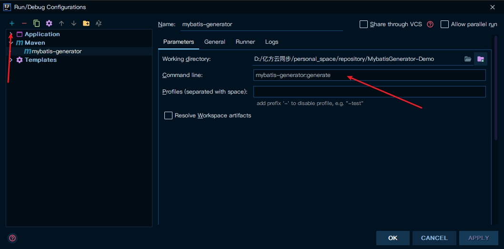

# 1. 参考

> - http://mybatis.org/generator/index.html
> - https://blog.csdn.net/for_my_life/article/details/51228098?utm_medium=distribute.pc_relevant.none-task-blog-title-1&spm=1001.2101.3001.4242
> - 视频：https://www.bilibili.com/video/av78230600/


# 2. Demo


通过已经搭建好的项目创建，连接数据库并修改`mybatisGenerator.xml`后Run即可

> - Github：https://github.com/LifeAlsoIsGG/MybatisGenerator-Demo


# 3. 配置`pom.xml`


```xml
        <dependency>
            <groupId>org.mybatis.generator</groupId>
            <artifactId>mybatis-generator-core</artifactId>
            <version>1.3.2</version>
        </dependency>

<build>
        <plugins>
            <plugin>
                <groupId>org.mybatis.generator</groupId>
                <artifactId>mybatis-generator-maven-plugin</artifactId>
                <version>1.3.2</version>
                <configuration>
                    <configurationFile>src/main/resources/mybatisGenerator.xml</configurationFile>
                    <verbose>true</verbose>
                    <overwrite>true</overwrite>
                </configuration>
                <executions>
                    <execution>
                        <id>Generate MyBatis Artifacts</id>
                        <goals>
                            <goal>generate</goal>
                        </goals>
                    </execution>
                </executions>
                <dependencies>
                    <dependency>
                        <groupId>org.mybatis.generator</groupId>
                        <artifactId>mybatis-generator-core</artifactId>
                        <version>1.3.2</version>
                    </dependency>
                    <dependency>
                        <groupId>mysql</groupId>
                        <artifactId>mysql-connector-java</artifactId>
                        <scope>runtime</scope>
                        <version>5.1.47</version>
                    </dependency>
                </dependencies>
            </plugin>
        </plugins>
    </build>
```


# 4. 配置`mybatisGenerator.xml`


参考

> - https://blog.csdn.net/for_my_life/article/details/51228098?utm_medium=distribute.pc_relevant.none-task-blog-title-1&spm=1001.2101.3001.4242
> - 视频：https://www.bilibili.com/video/av78230600/


通过已经搭建好的项目创建，连接数据库并修改`mybatisGenerator.xml`后Run即可

> - Github：https://github.com/LifeAlsoIsGG/MybatisGenerator-Demo


在resources下创建`mybatisGenerator.xml`


```xml
<?xml version="1.0" encoding="UTF-8"?>
<!DOCTYPE generatorConfiguration
        PUBLIC "-//mybatis.org//DTD MyBatis Generator Configuration 1.0//EN"
        "http://mybatis.org/dtd/mybatis-generator-config_1_0.dtd">

<generatorConfiguration>
    <context id="DB2Tables" targetRuntime="MyBatis3">

        <!-- optional，旨在创建class时，对注释进行控制 -->
        <commentGenerator>
                <property name="suppressDate" value="true"/>
                <!-- 是否去除自动生成的注释 true：是 ： false:否 -->
                <property name="suppressAllComments" value="true"/>
        </commentGenerator>

        <!--jdbc数据库连接 -->
        <jdbcConnection driverClass="com.mysql.jdbc.Driver"
                        connectionURL="jdbc:mysql://localhost:3306/database"
                        userId="root"
                        password="root">
        </jdbcConnection>

        <!-- 默认false，把JDBC DECIMAL 和 NUMERIC 类型解析为 Integer，
        为true时把JDBC DECIMAL和NUMERIC类型解析为java.math.BigDecimal -->
        <javaTypeResolver >
            <property name="forceBigDecimals" value="false" />
        </javaTypeResolver>

        <!-- Model模型生成器,用来生成含有主键key的类，记录类 以及查询Example类
            targetPackage     指定生成的model生成所在的包名
            targetProject     指定在该项目下所在的路径
        -->
        <javaModelGenerator targetPackage="com.lifeisgg.springboot_demo.entity" targetProject="src/main/java">
            <!-- 是否允许子包，即targetPackage.schemaName.tableName -->
            <property name="enableSubPackages" value="true" />
            <!-- 是否对model添加 构造函数 -->
            <property name="constructorBased" value="false"/>
            <!-- 是否对类CHAR类型的列的数据进行trim操作 -->
            <property name="trimStrings" value="true" />
        </javaModelGenerator>

        <!--Mapper映射文件生成所在的目录 为每一个数据库的表生成对应的SqlMap文件 -->
        <sqlMapGenerator targetPackage="mapper"  targetProject="src/main/resources">
            <property name="enableSubPackages" value="true" />
        </sqlMapGenerator>

        <!-- 客户端代码，生成易于使用的针对Model对象和XML配置文件 的代码
                type="ANNOTATEDMAPPER",生成Java Model 和基于注解的Mapper对象
                type="MIXEDMAPPER",生成基于注解的Java Model 和相应的Mapper对象
                type="XMLMAPPER",生成SQLMap XML文件和独立的Mapper接口
        -->
        <javaClientGenerator type="XMLMAPPER" targetPackage="com.lifeisgg.springboot_demo.mapper"  targetProject="src/main/java">
            <property name="enableSubPackages" value="true" />
        </javaClientGenerator>

        <table schema="labManagement_demo" tableName="user" domainObjectName="User" />

    </context>
</generatorConfiguration>
```


# 5. 配置Run mybatis-generator


点击右上角`Edit Configuration`




点击Run后会生成三个文件夹，以表User为例子

> - entity
>
>   > - User.java
>   > - UserExample.java
>
> - mapper
>
>   > - UserMapper
>
> - resources/mapper
>
>   > - UserMapper.xml


之后自己创建`Service`，`ServiceImpl`，`Controller`即可，也可以用`EasyCode`插件创建