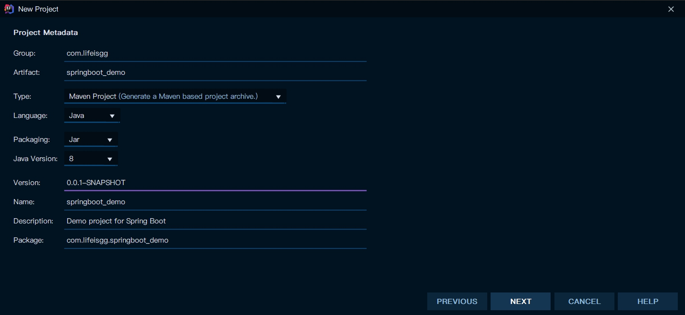
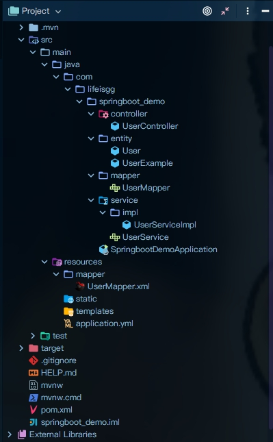

# 1. 使用阿里云镜像作为初始源创建


1. 选择Spring initializr
2. 选择来源链接：https://start.aliyun.com/


# 2. 项目信息





# 3. 选择依赖


# 4. 配置application.yml(更新中)

在`resources`文件夹下删除`application.properties`,并创建`application.yml`

application.yml基本配置如下

```yml
spring:
  application:
    name: springboot_demo
  datasource:
    username: root
    password: root
    url: jdbc:mysql://localhost:3306/attendance_demo
    driver-class-name: com.mysql.jdbc.Driver


#指定端口号
server:
  port: 8001
```


# 5. 配置pom.xml依赖(更新中)

参考

> - [springboot之依赖集锦pom.xml（更新中）](https://blog.csdn.net/IT_lyd/article/details/76423290?utm_medium=distribute.pc_relevant_t0.none-task-blog-BlogCommendFromMachineLearnPai2-1.channel_param&depth_1-utm_source=distribute.pc_relevant_t0.none-task-blog-BlogCommendFromMachineLearnPai2-1.channel_param)


## 5.1 springboot相关


```xml
		<!-- springboot相关 -->
		<!-- springboot 基础包 -->
		<dependency>
			<groupId>org.springframework.boot</groupId>
			<artifactId>spring-boot-starter</artifactId>
		</dependency>
 
		<!-- springboot 测试包 -->
		<dependency>
			<groupId>org.springframework.boot</groupId>
			<artifactId>spring-boot-starter-test</artifactId>
			<scope>test</scope>
		</dependency>
 
		<!-- springboot web包 -->
		<dependency>
		  <groupId>org.springframework.boot</groupId>
			<artifactId>spring-boot-starter-web</artifactId>
		</dependency>

		<!--spring-boot-starter-security-->
    <dependency>
      <groupId>org.springframework.boot</groupId>
      <artifactId>spring-boot-starter-security</artifactId>
     </dependency>
    <dependency>
      <groupId>org.springframework.security</groupId>
      <artifactId>spring-security-test</artifactId>
      <scope>test</scope>
    </dependency>

     <!-- spring aop -->
    <dependency>
      <groupId>org.springframework.boot</groupId>
      <artifactId>spring-boot-starter-aop</artifactId>
    </dependency>


		<!-- springboot web开发thymeleaf模板 -->
		<dependency>
			<groupId>org.springframework.boot</groupId>
			<artifactId>spring-boot-starter-thymeleaf</artifactId>
		</dependency>


		<!-- springboot工具 修改代码后不需重启即生效 -->
		<dependency>
			<groupId>org.springframework</groupId>
			<artifactId>springloaded</artifactId>
		</dependency>

		<!--devtools热部署-->
        <dependency>
            <groupId>org.springframework.boot</groupId>
            <artifactId>spring-boot-devtools</artifactId>
            <optional>true</optional>
            <scope>true</scope>
        </dependency>

<build>
        <plugins>
            <plugin>
                <groupId>org.springframework.boot</groupId>
                <artifactId>spring-boot-maven-plugin</artifactId>
                <configuration>
                    <fork>true</fork>
                </configuration>
            </plugin>
        </plugins>
    </build>


```


## 5.2 数据库相关

```xml
    <properties>
      <java.version>1.8</java.version>
      <mybatis.version>2.1.2</mybatis.version>
    </properties>

				<!-- 数据库相关 -->

				<!-- mysql驱动 -->
        <dependency>
            <groupId>mysql</groupId>
            <artifactId>mysql-connector-java</artifactId>
        </dependency>

        <!-- jdbc连接工具 -->
        <dependency>
            <groupId>org.springframework.boot</groupId>
            <artifactId>spring-boot-starter-jdbc</artifactId>
        </dependency>

				<!--mybatis-->
        <dependency>
            <groupId>org.mybatis.spring.boot</groupId>
            <artifactId>mybatis-spring-boot-starter</artifactId>
            <version>${mybatis.version}</version>
        </dependency>

        <!-- page helper -->
        <dependency>
            <groupId>com.github.pagehelper</groupId>
            <artifactId>pagehelper-spring-boot-starter</artifactId>
            <version>1.2.10</version>
        </dependency>

        <!-- redis -->
        <dependency>
            <groupId>org.springframework.boot</groupId>
            <artifactId>spring-boot-starter-data-redis</artifactId>
        </dependency>

<!-- mybatis逆向工程 -->
<!-- https://mvnrepository.com/artifact/org.mybatis.generator/mybatis-generator-core -->
				<dependency>
    				<groupId>org.mybatis.generator</groupId>
    				<artifactId>mybatis-generator-core</artifactId>
    				<version>1.3.7</version>
				</dependency>
```


## 5.3 工具相关

```xml
    <properties>
      <java.version>1.8</java.version>
      <swagger.version>2.9.2</swagger.version>
      <userAgentUtils.version>1.21</userAgentUtils.version>
    </properties>


				<!-- 工具类 -->
				<!-- 日志管理 log4j -->
        <dependency>
            <groupId>org.springframework.boot</groupId>
            <artifactId>spring-boot-starter-log4j</artifactId>
        </dependency>

				<!-- fastjson -->
        <dependency>
            <groupId>com.alibaba</groupId>
            <artifactId>fastjson</artifactId>
            <version>1.2.15</version>
        </dependency>

        <!-- lombok -->
        <dependency>
            <groupId>org.projectlombok</groupId>
            <artifactId>lombok</artifactId>
        </dependency>


        <!-- simpleEmail -->
        <dependency>
            <groupId>org.springframework.boot</groupId>
            <artifactId>spring-boot-starter-mail</artifactId>
        </dependency>

        <!-- easyexcel -->
        <dependency>
            <groupId>com.alibaba</groupId>
            <artifactId>easyexcel</artifactId>
            <version>2.2.6</version>
        </dependency>

        <!-- 获取客户端信息 -->
        <dependency>
            <groupId>eu.bitwalker</groupId>
            <artifactId>UserAgentUtils</artifactId>
            <version>${userAgentUtils.version}</version>
        </dependency>


				<!--Swagger依赖-->
        <dependency>
            <groupId>io.springfox</groupId>
            <artifactId>springfox-swagger2</artifactId>
            <version>${swagger.version}</version>
        </dependency>
        <dependency>
            <groupId>io.springfox</groupId>
            <artifactId>springfox-swagger-ui</artifactId>
            <version>${swagger.version}</version>
        </dependency>

        <!-- fastdfs -->
        <dependency>
            <groupId>com.luhuiguo</groupId>
            <artifactId>fastdfs-spring-boot-starter</artifactId>
            <version>0.2.0</version>
        </dependency>
```


# 6. Mybatis逆向工程快速搭建

参考

> - http://mybatis.org/generator/index.html
> - https://blog.csdn.net/for_my_life/article/details/51228098?utm_medium=distribute.pc_relevant.none-task-blog-title-1&spm=1001.2101.3001.4242
> - 视频：https://www.bilibili.com/video/av78230600/


## 6.1 配置`pom.xml`

```xml
        <dependency>
            <groupId>org.mybatis.generator</groupId>
            <artifactId>mybatis-generator-core</artifactId>
            <version>1.3.2</version>
        </dependency>

<build>
        <plugins>
            <plugin>
                <groupId>org.mybatis.generator</groupId>
                <artifactId>mybatis-generator-maven-plugin</artifactId>
                <version>1.3.2</version>
                <configuration>
                    <configurationFile>src/main/resources/mybatisGenerator.xml</configurationFile>
                    <verbose>true</verbose>
                    <overwrite>true</overwrite>
                </configuration>
                <executions>
                    <execution>
                        <id>Generate MyBatis Artifacts</id>
                        <goals>
                            <goal>generate</goal>
                        </goals>
                    </execution>
                </executions>
                <dependencies>
                    <dependency>
                        <groupId>org.mybatis.generator</groupId>
                        <artifactId>mybatis-generator-core</artifactId>
                        <version>1.3.2</version>
                    </dependency>
                    <dependency>
                        <groupId>mysql</groupId>
                        <artifactId>mysql-connector-java</artifactId>
                        <scope>runtime</scope>
                        <version>5.1.47</version>
                    </dependency>
                </dependencies>
            </plugin>
        </plugins>
    </build>
```


## 6.2 配置`mybatisGenerator.xml`


参考

> - https://blog.csdn.net/for_my_life/article/details/51228098?utm_medium=distribute.pc_relevant.none-task-blog-title-1&spm=1001.2101.3001.4242
> - 视频：https://www.bilibili.com/video/av78230600/


通过已经搭建好的项目创建，连接数据库并修改`mybatisGenerator.xml`后Run即可

> - Github：https://github.com/LifeAlsoIsGG/MybatisGenerator-Demo


在resources下创建`mybatisGenerator.xml`


```xml
<?xml version="1.0" encoding="UTF-8"?>
<!DOCTYPE generatorConfiguration
        PUBLIC "-//mybatis.org//DTD MyBatis Generator Configuration 1.0//EN"
        "http://mybatis.org/dtd/mybatis-generator-config_1_0.dtd">

<generatorConfiguration>
    <context id="DB2Tables" targetRuntime="MyBatis3">

        <!-- optional，旨在创建class时，对注释进行控制 -->
        <commentGenerator>
                <property name="suppressDate" value="true"/>
                <!-- 是否去除自动生成的注释 true：是 ： false:否 -->
                <property name="suppressAllComments" value="true"/>
        </commentGenerator>

        <!--jdbc数据库连接 -->
        <jdbcConnection driverClass="com.mysql.jdbc.Driver"
                        connectionURL="jdbc:mysql://localhost:3306/database"
                        userId="root"
                        password="root">
        </jdbcConnection>

        <!-- 默认false，把JDBC DECIMAL 和 NUMERIC 类型解析为 Integer，
        为true时把JDBC DECIMAL和NUMERIC类型解析为java.math.BigDecimal -->
        <javaTypeResolver >
            <property name="forceBigDecimals" value="false" />
        </javaTypeResolver>

        <!-- Model模型生成器,用来生成含有主键key的类，记录类 以及查询Example类
            targetPackage     指定生成的model生成所在的包名
            targetProject     指定在该项目下所在的路径
        -->
        <javaModelGenerator targetPackage="com.lifeisgg.springboot_demo.entity" targetProject="src/main/java">
            <!-- 是否允许子包，即targetPackage.schemaName.tableName -->
            <property name="enableSubPackages" value="true" />
            <!-- 是否对model添加 构造函数 -->
            <property name="constructorBased" value="false"/>
            <!-- 是否对类CHAR类型的列的数据进行trim操作 -->
            <property name="trimStrings" value="true" />
        </javaModelGenerator>

        <!--Mapper映射文件生成所在的目录 为每一个数据库的表生成对应的SqlMap文件 -->
        <sqlMapGenerator targetPackage="mapper"  targetProject="src/main/resources">
            <property name="enableSubPackages" value="true" />
        </sqlMapGenerator>

        <!-- 客户端代码，生成易于使用的针对Model对象和XML配置文件 的代码
                type="ANNOTATEDMAPPER",生成Java Model 和基于注解的Mapper对象
                type="MIXEDMAPPER",生成基于注解的Java Model 和相应的Mapper对象
                type="XMLMAPPER",生成SQLMap XML文件和独立的Mapper接口
        -->
        <javaClientGenerator type="XMLMAPPER" targetPackage="com.lifeisgg.springboot_demo.mapper"  targetProject="src/main/java">
            <property name="enableSubPackages" value="true" />
        </javaClientGenerator>

        <table schema="labManagement_demo" tableName="user" domainObjectName="User" />

    </context>
</generatorConfiguration>
```


## 6.3 配置Run mybatis-generator


点击右上角`Edit Configuration`


点击Run后会生成三个文件夹，以表User为例子

> - entity
>
>   > - User.java
>   > - UserExample.java
>
> - mapper
>
>   > - UserMapper
>
> - resources/mapper
>
>   > - UserMapper.xml


之后自己创建`Service`，`ServiceImpl`，`Controller`即可，也可以用`EasyCode`插件创建


# 7. 最终基本项目结构


> - **Controller**
>
>   > - UserController.java
>
> - **Service**
>
>   > - UserService.java
>   >
>   > - **ServiceImpl**
>   >
>   >   > - UserServiceImpl.java
>
> - **entity**
>
>   > - User.java
>   > - UserExample.java
>
> - **mapper**
>
>   > - UserMapper.java
>
> - **resources/mapper**
>
>   > - UserMapper.xml





## 7.1 UserController.java

要加注解`@RestController`，`@RequestMapping("")`

```java
/**
 * (User)表控制层
 *
 * @author makejava
 * @since 2020-10-02 22:45:46
 */
@RestController
@RequestMapping("user")
public class UserController {
    @Resource
    private UserService userService;

    @RequestMapping("/user")
    public int getCount(){
        return userService.countUser();
    }
}
```


## 7.2 UserService.java

```java
/**
 * (User)表服务接口
 *
 * @author makejava
 * @since 2020-10-02 22:45:42
 */
public interface UserService {

    int countUser();

}
```


## 7.3 UserServiceImpl.java


要加注解`@Service("")`

```java
@Service("userService")
public class UserServiceImpl implements UserService {
    @Resource
    private UserMapper userMapper;

    @Override
    public int countUser() {
        UserExample userExample = new UserExample();
        return userMapper.countByExample(userExample);
    }
}
```


## 7.4 User.java

```java
@Data
public class User {
    private Integer uid;

    private String phone;

    private String email;

    private String realname;

    private String password;

    private Integer level;
}
```


## 7.5 UserExample.java


## 7.6 UserMapper.java


要加`@Mapper`，否则会报错mybatis找不到mapper

```java
@Mapper
public interface UserMapper {
    int countByExample(UserExample example);

    int deleteByExample(UserExample example);

    int deleteByPrimaryKey(Integer uid);

    int insert(User record);

    int insertSelective(User record);

    List<User> selectByExample(UserExample example);

    User selectByPrimaryKey(Integer uid);

    int updateByExampleSelective(@Param("record") User record, @Param("example") UserExample example);

    int updateByExample(@Param("record") User record, @Param("example") UserExample example);

    int updateByPrimaryKeySelective(User record);

    int updateByPrimaryKey(User record);
}
```


## 7.7 UserMapper.xml

```java
<?xml version="1.0" encoding="UTF-8" ?>
<!DOCTYPE mapper PUBLIC "-//mybatis.org//DTD Mapper 3.0//EN" "http://mybatis.org/dtd/mybatis-3-mapper.dtd" >
<mapper namespace="com.lifeisgg.springboot_demo.mapper.UserMapper" >
  <resultMap id="BaseResultMap" type="com.lifeisgg.springboot_demo.entity.User" >
    <!--
      WARNING - @mbggenerated
      This element is automatically generated by MyBatis Generator, do not modify.
      This element was generated on Fri Oct 02 22:21:49 CST 2020.
    -->
    <id column="uid" property="uid" jdbcType="INTEGER" />
    <result column="phone" property="phone" jdbcType="VARCHAR" />
    <result column="email" property="email" jdbcType="VARCHAR" />
    <result column="realName" property="realname" jdbcType="VARCHAR" />
    <result column="password" property="password" jdbcType="VARCHAR" />
    <result column="level" property="level" jdbcType="INTEGER" />
  </resultMap>
```

