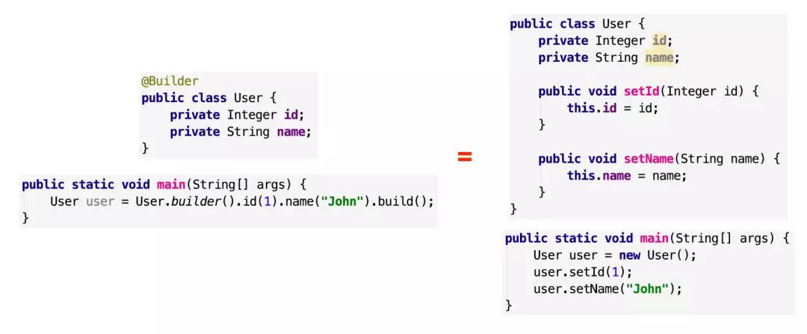

# 参考

> - https://www.jianshu.com/p/2543c71a8e45


# 1. 引入依赖

```xml
        <!-- lombok -->
        <dependency>
            <groupId>org.projectlombok</groupId>
            <artifactId>lombok</artifactId>
            <scope>provided</scope>
        </dependency>
```


# 2. IDEA下载插件Lombok


# 3. 常用注解

作用于实体类上


| 注解名                   | 描述                                                         |
| ------------------------ | ------------------------------------------------------------ |
| **@Data**                | 包含@Getter/@Setter，@ToString，@EqualsAndHashCode，@RequiredArgsConstructor |
| @Getter/@Setter          | 作用类上，生成所有成员变量的getter/setter方法                |
| @ToString                | 重写 `toString()` 方法。通过of显示某些，通过exclude排除某些。@ToString(of = {"uid"}, exclude = {"password"}) |
| @EqualsAndHashCode       | 自动生成 `equals(Object other)` 和 `hashcode()` 方法，可以透过 exclude 排除，也可以使用 of 指定某些字段 |
| @NoArgsConstructor       | 生成一个没有参数的构造器                                     |
| @AllArgsConstructor      | 生成一个包含所有参数的构造器。一定要加上一个空的无参构造函数。 |
| @RequiredArgsConstructor | 生成一个包含 "特定参数" 的构造器，特定参数指的是那些有加上 `final` 修饰词的变量们 |
| @NonNull                 | 主要作用于成员变量和参数中，标识不能为空，否则抛出空指针异常 |
| @Builder                 | 作用于类上，将类转变为建造者模式                             |
| @Value                   | 会把所有的变量都设成 `final`，其他类似`@Data`但是没有`@Setter`，适合加在值不希望被改变的类上 |


## @Builder

自动生成流式 set 值写法，从此之后再也不用写一堆 setter 





注意，虽然只要加上 `@Builder` 注解，我们就能够用流式写法快速设定对象的值，但是 setter 还是必须要写不能省略的，因为 Spring 或是其他框架有很多地方都会用到对象的 getter/setter 对他们取值/赋值

所以通常是 @Data 和 @Builder 会一起用在同个类上，既方便我们流式写代码，也方便框架做事


属性`toBuilder=true`

修改实体，要求实体上添加@Builder(toBuilder=true)

```java
userInfo = userInfo.toBuilder()
        .name("OK")
        .email("xxx")
        .build();
```


## @Value

也是整合包，但是他会把所有的变量都设成 final 的，其他的就跟 @Data 一样，等于同时加了以下注解

- @Getter (注意没有setter)
- @ToString
- @EqualsAndHashCode
- @RequiredArgsConstructor


上面那个 @Data 适合用在 POJO 或 DTO 上，而这个 @Value 注解，则是适合加在值不希望被改变的类上，像是某个类的值当创建后就不希望被更改，只希望我们读它而已，就适合加上 @Value 注解，也就是 @Value for immutable class

另外注意一下，此 lombok 的注解 @Value 和另一个 Spring 的注解 @Value 撞名，在 import 时不要 import 错了