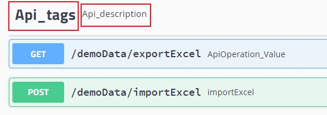
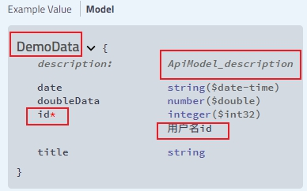

# 参考

> - https://blog.csdn.net/u014231523/article/details/54562695
> - https://leongfeng.github.io/2017/02/20/springboot-springfox-swagger2markup-spring-restdoc/
> - 官方wiki：https://github.com/swagger-api/swagger-core/wiki/Annotations


# 引入依赖

```xml
				<!--Swagger依赖-->
        <dependency>
            <groupId>io.springfox</groupId>
            <artifactId>springfox-swagger2</artifactId>
            <version>2.9.2</version>
        </dependency>
        <dependency>
            <groupId>io.springfox</groupId>
            <artifactId>springfox-swagger-ui</artifactId>
            <version>2.9.2</version>
        </dependency>
```


# 配置SwaggerConfiguration

创建`SwaggerConfiguration.java`配置类


加注解

> - @Configuration
> - @EnableSwagger2

```java
@Configuration
@EnableSwagger2
public class SwaggerConfig {
//                    .apis(RequestHandlerSelectors.basePackage("com.lifeisgg.springboot_demo.controller"))
    public Docket buildDocket(){
        return new Docket(DocumentationType.SWAGGER_2)
                .apiInfo(apiInfo())
                .select()
                //.apis(RequestHandlerSelectors.basePackage("com.lifeisgg.springboot_demo.controller"))
                .paths(PathSelectors.any())
                .build()
                //是否将参数显示在请求后面
                .enableUrlTemplating(true);

    }

    private ApiInfo apiInfo(){
        return new ApiInfoBuilder()
                .title("SpringbootDemo")
                .description("SpringbootDemo-Swagger2")
                .termsOfServiceUrl("localhost:8001")
                .contact(new Contact("Chen Long", "https://wiki.lifeisgg.online/", "1138312802@qq.com"))
                .version("Beta")
                .license("MIT")
                .licenseUrl("")
                .build();

    }
}
```


输入http://localhost:8001/swagger-ui.html#/即可访问


# 常用注解


| 注解                 | 描述                                         |
| -------------------- | -------------------------------------------- |
| @Api()               | 用于controller类上                           |
| @ApiOperation()      | 用于controller类中的请求方法                 |
| @ApiParam()          | 用于请求中的参数说明                         |
| @ApiImplicitParam()  | 用于请求方法中的参数说明，不过写在请求方法上 |
| @ApiImplicitParams() | 里面可以包含多个@ApiImplicitParam()          |
| @ApiModel()          | 写在实体类上，描述和重命名实体类             |
| @ApiModelProperty()  | 写在实体类属性上，描述，重命名，示例等       |
| @ApiResponses()      | 用于请求方法上，描述某个返回码               |
| @ApiIgnore()         | 作用于类，方法，属性上，使其忽略             |


## @Api()：描述Controller类

作用于`controller`类上

属性说明

| 属性        | 描述                                                       |
| ----------- | ---------------------------------------------------------- |
| tags        | 分组，在类上多个时会复制多个controller。也可以当做名字使用 |
| description | 小标题描述，已弃用，默认为controller类名                   |
| value       |                                                            |


例如

```java
@RestController
@RequestMapping("demoData")
@Api(value="Api_value",description="Api_description",tags={"Api_tags"})
public class DemoDataController {
}
```




## @ApiOperation()：描述请求方法

作用于controller类中的`请求方法`上


| 属性   | 描述                                         |
| ------ | :------------------------------------------- |
| value  | 表示标题，如果有多个值则会复制多个controller |
| notes  | 方法内容                                     |
| tags   | 分组                                         |
| hidden | 默认为`false`，`true`时隐藏                  |


例如

```java
@GetMapping("/exportExcel")
@ApiOperation(value="ApiOperation_Value",notes="ApiOperation_Notes")
public void exportExcel() throws IOException {
  
}
```


## @ApiParam()：参数

作用于controller类中的`请求方法形参上`上。用于方法，参数，字段说明，表示对参数的添加元数据（说明或是否必填等） 


> 注意，作用于参数时，在Swagger中会要求输入body类型(GET和HEAD无法接受BODY类型)。不想使用body可以在参数前加注解`@RequestParam`。或者直接使用注解`@ApiImplicitParam()`


| 属性     | 描述     |
| -------- | :------- |
| name     | 参数名   |
| value    | 参数说明 |
| required | 是否必填 |


例如

```java
public void exportExcel(@ApiParam(name="param",value="ApiParam_value",required=true) String param){

 }
```

`name`可以省略


## @ApiImplicitParams()

作用于`请求方法`上，对参数进行说明，包含多个`@ApiImplicitParam`


例如

```java
@ApiImplicitParams({
    @ApiImplicitParam(name = "name", value = "User's name", required = true, dataType = "string", paramType = "query"),
    @ApiImplicitParam(name = "email", value = "User's email", required = false, dataType = "string", paramType = "query"),
    @ApiImplicitParam(name = "id", value = "User ID", required = true, dataType = "long", paramType = "query")
  })
 public void doPost(HttpServletRequest request, HttpServletResponse response) throws ServletException, IOException {...}
```


## @ApiModel()：实体类

作用于实体类上

| 属性        | 描述       |
| ----------- | :--------- |
| value       | 实体类名称 |
| description | 实体类描述 |


### @ApiModelProperty：实体类参数上

| 属性     | 描述     |
| -------- | :------- |
| value    | 参数描述 |
| example  | 举例     |
| hidden   | 是否显示 |
| required | 是否必填 |


例如

```java
@ApiModel(value = "ApiModel_value", description = "ApiModel_description")
public class DemoData {
    @ApiModelProperty(value="用户名id",required = true)
    private Integer id;
}
```





## @ApiResponses：返回码描述

作用于请求方法。设置返回码和响应的描述信息，`@ApiResponses`可以设置多个`@ApiResponse`

例如

```java
@ApiResponses(value = { @ApiResponse(code = 400, message = "Invalid ID supplied"),
   @ApiResponse(code = 404, message = "Pet not found") })
```


## @ApiIgnore：忽略类或方法或实体类属性

可作用于类，方法和实体类属性上