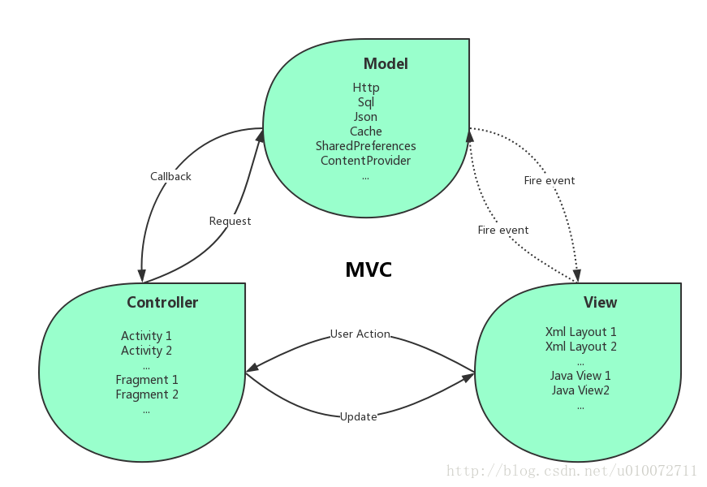
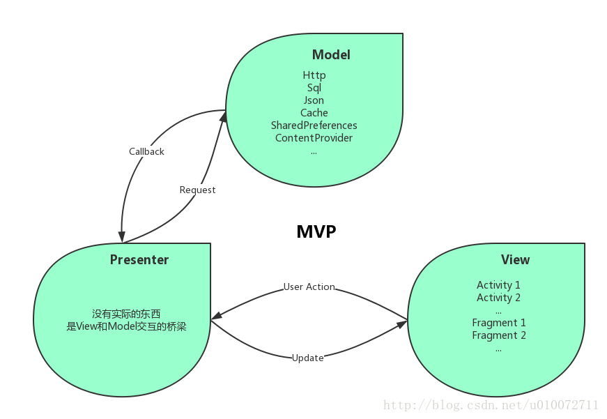

# 1. 什么是MVC

MVC即`Model-View-Controller`，将应用按照`Model（模型）`、`View（视图）`、`Controller（控制）`这样的方式分离。把较为复杂的web应用分成逻辑清晰的几部分，基于请求驱动指的就是使用`请求-响应模型`。是为了简化开发，减少出错。还是为了组内开发人员之间的配合。总之就是一种分层工作的办法。

-   `视图(View)`：是应用程序中处理数据显示的部分，代表用户交互界面，对于Web应用来说，可以是HTML，也可能是jsp、XML和Applet等。一个应用可能有很多不同的视图，MVC设计模式对于视图的处理仅限于视图上数据的采集和处理，以及用户的请求，而不包括在视图上的业务流程的处理。业务流程的处理交予模型(Model)处理。
-   `模型(Model)`：是应用程序中用于处理应用程序数据逻辑的部分，是业务的处理以及业务规则的制定。通常模型对象负责在数据库中存取数据模型接受视图请求的数据，并返回最终的处理结果。业务模型的设计是MVC最主要的核心。MVC设计模式告诉我们，把应用的模型按一定的规则抽取出来，抽取的层次很重要，抽象与具体不能隔得太远，也不能太近。MVC并没有提供模型的设计方法，而只是组织管理这些模型，以便于模型的重构和提高重用性。
-   `控制(Controller)`：是应用程序中处理用户交互的部分，可以理解为从用户接收请求, 将模型与视图匹配在一起，共同完成用户的请求。划分控制层的作用也很明显，它清楚地告诉你，它就是一个分发器，选择什么样的模型，选择什么样的视图，可以完成什么样的用户请求。控制层并不做任何的数据处理。

# 2. 什么是MVP[Android]

MVP即`Model-View-Presenter`

# 3. MVC和MVP的区别

MVP与MVC有着一个重大的区别：在MVP中View并不直接使用Model，它们之间的通信是通过Presenter (MVC中的Controller)来进行的，所有的交互都发生在Presenter内部，而在MVC中View会直接从Model中读取数据而不是通过 Controller。

- Presenter与Controller都扮演了逻辑层的角色，但是Presenter层的功能相对更复杂，因为他负责和View的双向交互，Controller只是单向的中介。因为Presenter是从View层抽离出来的，通常和View是一对一的关系，而Controller是面向业务的，往往是单例模式或者提供静态方法。
- MVP中View和Model是不能进行通信的，虽然加重了P层的负担，但是有利于维护View层和Model层，如果条件允许，我们还可以对Presenter进一步拆分，来弥补Presenter负担过重的问题。
- MVC中View和Model层可以直接交互，虽然方便了两者之间的交互，但是耦合性相对较高。

# 4. 什么是SpringMVC

Spring MVC是一个基于Java的实现了MVC设计模式的请求驱动类型的轻量级Web框架，通过把`模型(Model)`，`视图(View)`，`控制器(Controller)`分离，将web层进行职责解耦，把复杂的web应用分成逻辑清晰的几部分，简化开发，减少出错，方便组内开发人员之间的配合。Spring MVC 下我们⼀般把后端项⽬分为 Service层 （处理业务）、Dao层（数据库操作）、Entity层（实体类）、Controller层(控制层，返回数据给前台 ⻚⾯)。

# 5. SpringMVC的优点

- 可以支持各种视图技术,而不仅仅局限于JSP；
- 与Spring框架集成（如IoC容器、AOP等）；
- 清晰的角色分配：前端控制器(dispatcherServlet) , 请求到处理器映射（handlerMapping), 处理器适配器（HandlerAdapter), 视图解析器（ViewResolver）。
- 支持各种请求资源的映射策略。

# 6. SpringMVC组件

- `DispatcherServlet`：前端控制器。也称为中央控制器，它是整个请求响应的控制中心，组件的调用由它统一调度。有了他就减少了其他组件之间的耦合度。
- `HandlerMapping`：处理器映射器。它根据用户访问的 URL 映射到对应的后端处理器 Handler。也就是说它知道处理用户请求的后端处理器，但是它并不执行后端处理器，而是将处理器告诉给中央处理器。
- `HandlerAdapter`：处理器适配器。根据传过来不同类型的`Hadnle`它调用后端处理器中的方法，返回逻辑视图 `ModelAndView` 对象给`DispatcherServlet`。
- `ViewResolver`：视图解析器。将 `ModelAndView` 逻辑视图解析为具体的视图（如 JSP）。
- `Handler`：后端处理器。对用户具体请求进行处理，也就是我们编写的 `Controller` 类。需要程序员开发

# 7. SpringMVC工作流程

> 1. 用户向服务端发送一次请求，这个请求会先到前端控制器`DispatcherServlet`(也叫中央控制器)。
>
> 2. `DispatcherServlet`接收到请求后会调用`HandlerMapping`处理器映射器来，根据配置或注解获取不同的`Handle`，并返回给`DispatcherServlet`。由此得知，该请求该由哪个`Controller`来处理（并未调用Controller，只是得知）
>
> 3. `DispatcherServlet`调用`HandlerAdapter`处理器适配器，告诉处理器适配器应该要去执行哪个`Controller`
>
> 4. `HandlerAdapter`处理器适配器去执行`Controller`并得到`ModelAndView`(数据和视图)，并层层返回给`DispatcherServlet`
>
> 5. `DispatcherServlet`将`ModelAndView`交给`ViewReslover`视图解析器解析，然后返回真正的视图`View`。
>
> 6. `DispatcherServlet`将模型数据填充到视图中
>
> 7. `DispatcherServlet`将结果响应给用户
>

# 8. Spring控制器是什么设计模式，有什么问题，为什么是这个模式

是**单例模式**，所以在多线程访问的时候有线程安全问题不要用同步会影晌性能的。解决方案是在控制器里面不能写字段成员变量。使用单例模式是为了性能（无需频繁初始化），同时也没有必要使用多例模式。万一必须要定义一个非静态成员变量时候，则通过注解`@Scope("prototype")`，将其设置为多例模式