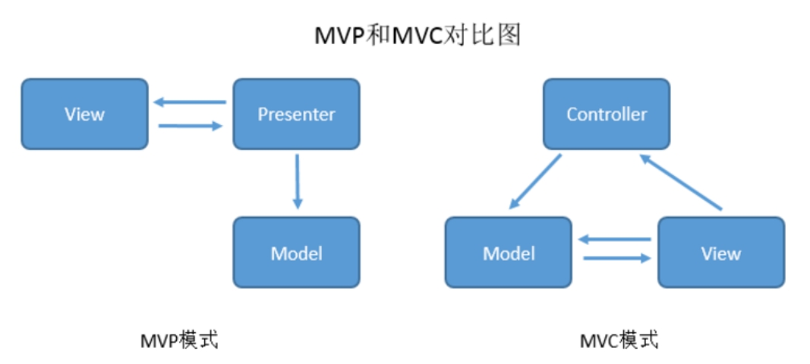

# 1. 什么是MVC


MVC即`Model-View-Controller`，将应用按照`Model（模型）`、`View（视图）`、`Controller（控制）`这样的方式分离。把较为复杂的web应用分成逻辑清晰的几部分，基于请求驱动指的就是使用`请求-响应模型`。是为了简化开发，减少出错。还是为了组内开发人员之间的配合。总之就是一种分层工作的办法。


-   `视图(View)`：是应用程序中处理数据显示的部分，代表用户交互界面，对于Web应用来说，可以是HTML，也可能是jsp、XML和Applet等。一个应用可能有很多不同的视图，MVC设计模式对于视图的处理仅限于视图上数据的采集和处理，以及用户的请求，而不包括在视图上的业务流程的处理。业务流程的处理交予模型(Model)处理。
-   `模型(Model)`：是应用程序中用于处理应用程序数据逻辑的部分，是业务的处理以及业务规则的制定。通常模型对象负责在数据库中存取数据模型接受视图请求的数据，并返回最终的处理结果。业务模型的设计是MVC最主要的核心。MVC设计模式告诉我们，把应用的模型按一定的规则抽取出来，抽取的层次很重要，抽象与具体不能隔得太远，也不能太近。MVC并没有提供模型的设计方法，而只是组织管理这些模型，以便于模型的重构和提高重用性。
-   `控制(Controller)`：是应用程序中处理用户交互的部分，可以理解为从用户接收请求, 将模型与视图匹配在一起，共同完成用户的请求。划分控制层的作用也很明显，它清楚地告诉你，它就是一个分发器，选择什么样的模型，选择什么样的视图，可以完成什么样的用户请求。控制层并不做任何的数据处理。


# 2. 什么是MVP[Android]


MVP即`Model-View-Presenter`


# 3. MVC和MVP的区别





MVP与MVC有着一个重大的区别：在MVP中View并不直接使用Model，它们之间的通信是通过Presenter (MVC中的Controller)来进行的，所有的交互都发生在Presenter内部，而在MVC中View会直接从Model中读取数据而不是通过 Controller。


- Presenter与Controller都扮演了逻辑层的角色，但是Presenter层的功能相对更复杂，因为他负责和View的双向交互，Controller只是单向的中介。因为Presenter是从View层抽离出来的，通常和View是一对一的关系，而Controller是面向业务的，往往是单例模式或者提供静态方法。
- MVP中View和Model是不能进行通信的，虽然加重了P层的负担，但是有利于维护View层和Model层，如果条件允许，我们还可以对Presenter进一步拆分，来弥补Presenter负担过重的问题。
- MVC中View和Model层可以直接交互，虽然方便了两者之间的交互，但是耦合性相对较高。


# 4. 什么是SpringMVC


Spring MVC是一个基于Java的实现了MVC设计模式的请求驱动类型的轻量级Web框架，通过把`模型(Model)`，`视图(View)`，`控制器(Controller)`分离，将web层进行职责解耦，把复杂的web应用分成逻辑清晰的几部分，简化开发，减少出错，方便组内开发人员之间的配合。Spring MVC 下我们⼀般把后端项⽬分为 Service层 （处理业务）、Dao层（数据库操作）、Entity层（实体类）、Controller层(控制层，返回数据给前台 ⻚⾯)。


# 5. SpringMVC的优点


- 可以支持各种视图技术,而不仅仅局限于JSP；
- 与Spring框架集成（如IoC容器、AOP等）；
- 清晰的角色分配：前端控制器(dispatcherServlet) , 请求到处理器映射（handlerMapping), 处理器适配器（HandlerAdapter), 视图解析器（ViewResolver）。
- 支持各种请求资源的映射策略。


# 6. SpringMVC组件


- `DispatcherServlet`：前端控制器。也称为中央控制器，它是整个请求响应的控制中心，组件的调用由它统一调度。有了他就减少了其他组件之间的耦合度。
- `HandlerMapping`：处理器映射器。它根据用户访问的 URL 映射到对应的后端处理器 Handler。也就是说它知道处理用户请求的后端处理器，但是它并不执行后端处理器，而是将处理器告诉给中央处理器。
- `HandlerAdapter`：处理器适配器。根据传过来不同类型的`Hadnle`它调用后端处理器中的方法，返回逻辑视图 `ModelAndView` 对象给`DispatcherServlet`。
- `ViewResolver`：视图解析器。将 `ModelAndView` 逻辑视图解析为具体的视图（如 JSP）。
- `Handler`：后端处理器。对用户具体请求进行处理，也就是我们编写的 `Controller` 类。需要程序员开发


# 7. SpringMVC工作流程


1. 用户向服务端发送一次请求，这个请求会先到前端控制器`DispatcherServlet`(也叫中央控制器)。

   

2. `DispatcherServlet`接收到请求后会调用`HandlerMapping`处理器映射器来，根据配置或注解获取不同的`Handle`，并返回给`DispatcherServlet`。由此得知，该请求该由哪个`Controller`来处理（并未调用Controller，只是得知）

   

3. `DispatcherServlet`调用`HandlerAdapter`处理器适配器，告诉处理器适配器应该要去执行哪个`Controller`

   

4. `HandlerAdapter`处理器适配器去执行`Controller`并得到`ModelAndView`(数据和视图)，并层层返回给`DispatcherServlet`

   

5. `DispatcherServlet`将`ModelAndView`交给`ViewReslover`视图解析器解析，然后返回真正的视图`View`。

   

6. `DispatcherServlet`将模型数据填充到视图中

   

7. `DispatcherServlet`将结果响应给用户


# SpringMVC注解原理


注解本质是一个继承了 Annotation的特殊接口,其具体实现类是Java运行时生成的动态代理类。我们通过反射获取注解时,返回的是Java运行时生成的动态代理对象。通过代理对象调用自定义注解的方法,会最终调用AnnotationInvocationHandler的 invoke方法。该方法会从 membervalues这个Map中索引出对应的值。而 membervalues的来源是Java常量池


​     Controller类使用继承@Component注解的方法，将其以单例的形式放入spring容器，如果仔细看的话会发现每个注解里面都有一个默认的value()方法，它的作用是为当前的注解声明一个名字，一般默认为类名，然后spring会通过配置文件中的context:component-scan的配置，进行如下操作：

- 使用asm技术扫描.class文件，并将包含@Component及元注解为@Component的注解@Controller、@Service、@Repository或者其他自定义的的bean注册到beanFactory中，
- 然后spring在注册处理器
- 实例化处理器，然后将其放到beanPostFactory中，然后我们就可以在类中进行使用了。
- 创建bean时，会自动调用相应的处理器进行处理。


# 9. SpringMVC常用注解


参考

> - https://www.cnblogs.com/leskang/p/5445698.html


- **@Controller**

  > `@Controller`注解在类上，表明这个类是Spring MVC里的`Controller`，将其声明为Spring的一个Bean，`DispatchServlet`会自动扫描注解了此注解的类，并将Web请求映射到注解了`@RequestMapping`的方法上，需要注意的是，在Spring MVC声明控制器Bean的时候，只能使用@Controller。


- **@RestController**

  > `@RestController`是一个组合注解，组合了`@Controller`和`@ResponseBody`，意味着当只开发一个和页面交互数据的控制的时候，需要使用此注解。 若没有此注解，要想实现上述功能，则需自己在代码中加`@Controller`和`@ResponseBody`两个注解。


- **@RequestMapping**

  > `@RequestMapping`注解是用来映射Web请求（访问路径和参数）、处理类和方法的。它可以注解在类和方法上。注解在方法上的`@RequestMapping`路径会继承注解在类上的路径，`@RequestMapping`支持Servlet的request和response作为参数，也支持对它们的媒体类型进行配置。

  

- **@ResponseBody**

  > `@ResponseBody`支持将返回值放在`response`体内，而不是返回一个页面。我们很多机遇`Ajax`的程序，可以以此注解返回数据而不是返回页面；此注解可以放在返回值或者方法上。

- **@RequestBody**

  > `@RequestBody`允许`request`的参数在`request`体中，而不是在直接链接在地址后面。此注解放在参数前。

  

- **@PathVariable**

  > `@PathVariable` 用来接收路径参数，如`/news/001`,可接收001作为参数，此注解放置在参数前。

  

- **@Resource和@Autowired**

  > @Resource和@Autowired都是做bean的注入时使用，其实@Resource并不是Spring的注解，它的包是javax.annotation.Resource，需要导入，但是Spring支持该注解的注入。

  

- **@Repository**

  > 用于注解dao层，在daoImpl类上面注解。


## 8.1 @Controller控制器

在SpringMVC 中，控制器Controller 负责处理由DispatcherServlet 分发的请求，它把用户请求的数据经过业务处理层处理之后封装成一个Model ，然后再把该Model 返回给对应的View 进行展示。在SpringMVC 中提供了一个非常简便的定义Controller 的方法，你无需继承特定的类或实现特定的接口，只需使用@Controller 标记一个类是Controller ，然后使用@RequestMapping 和@RequestParam 等一些注解用以定义URL 请求和Controller 方法之间的映射，这样的Controller 就能被外界访问到。此外Controller 不会直接依赖于`HttpServletRequest` 和`HttpServletResponse` 等HttpServlet 对象，它们可以通过Controller 的方法参数灵活的获取到。

@Controller 用于标记在一个类上，使用它标记的类就是一个SpringMVC Controller 对象。分发处理器将会扫描使用了该注解的类的方法，并检测该方法是否使用了@RequestMapping 注解。@Controller 只是定义了一个控制器类，而使用@RequestMapping 注解的方法才是真正处理请求的处理器。单单使用@Controller 标记在一个类上还不能真正意义上的说它就是SpringMVC 的一个控制器类，因为这个时候Spring 还不认识它。那么要如何做Spring 才能认识它呢？这个时候就需要我们把这个控制器类交给Spring 来管理。


## 8.2 @RestController

可以发现，`@RestController`注解里面包含了`@Controller`注解和@`ResponseBody`注解，`@ResponseBody` 注解是将返回的数据结构转换为 `JSON` 格式，所以说可以这么理解：@RestController = @Controller + @ResponseBody ，省了很多事，我们使用 @RestController 之后就不需要再使用 @Controller 了。


## 8.3 @RequestMapping请求映射

RequestMapping是一个用来处理请求地址映射的注解，可用于类或方法上。用于类上，表示类中的所有响应请求的方法都是以该地址作为父路径。`@RequestMapping`注解是用来映射Web请求（访问路径和参数）、处理类和方法的。它可以注解在类和方法上。注解在方法上的`@RequestMapping`路径会继承注解在类上的路径，`@RequestMapping`支持Servlet的`request`和`response`作为参数，也支持对它们的媒体类型进行配置。


### 属性

- value， method

  > - value：   指定请求的实际地址，指定的地址可以是URI Template 模式。value 可以省略不写
  > - method： 指定请求的method类型， GET、POST、PUT、DELETE等；默认为GET。不用每次在 @RequestMapping 注解中加 method 属性来指定，上面的 GET 方式请求可以直接使用 @GetMapping("/get") 注解，效果一样。相应地，PUT 方式、POST 方式和 DELETE 方式对应的注解分别为 `@PutMapping`、`@PostMapping` 和 `DeleteMapping`。


- consumes，produces

  > - consumes： 指定处理请求的提交内容类型（Content-Type），例如application/json, text/html;
  > - produces:  指定返回的内容类型，仅当request请求头中的(Accept)类型中包含该指定类型才返回；如 produces = “application/json; charset=UTF-8”


- params，headers

  > - params： 指定request中必须包含某些参数值是，才让该方法处理。
  > - headers： 指定request中必须包含某些指定的header值，才能让该方法处理请求。


## 8.4 @ResponseBody

作用： 该注解用于将Controller的方法返回的对象，通过适当的HttpMessageConverter转换为指定格式后，写入到`Response`对象的`body`数据区。

使用时机：返回的数据不是`html`标签的页面，而是其他某种格式的数据时（如`json`、`xml`等）使用；


## 8.5 @RequestBody

RequestBody 注解用于接收前端传来的实体，接收参数也是对应的实体，比如前端通过 JSON 提交传来两个参数 username 和 password，此时我们需要在后端封装一个实体来接收。在传递的参数比较多的情况下，使用 @RequestBody 接收会非常方便。


## 8.6 @PathVariable

@PathVariable 注解主要用来获取 URL 参数，Spring Boot 支持 Restfull 风格的 URL，比如一个 GET 请求携带一个参数 id，我们将 id 作为参数接收，可以使用 @PathVariable 注解。如下：


```java
@Controller  
public class TestController {  
     @RequestMapping(value="/user/{userId}/roles/{roleId}",method = RequestMethod.GET)  
     public String getLogin(@PathVariable("userId") String userId,  
         @PathVariable("roleId") String roleId){  
         System.out.println("User Id : " + userId);  
         System.out.println("Role Id : " + roleId);  
         return "hello";  
     }  
     @RequestMapping(value="/product/{productId}",method = RequestMethod.GET)  
     public String getProduct(@PathVariable("productId") String productId){  
           System.out.println("Product Id : " + productId);  
           return "hello";  
     }  
     @RequestMapping(value="/javabeat/{regexp1:[a-z-]+}",  
           method = RequestMethod.GET)  
     public String getRegExp(@PathVariable("regexp1") String regexp1){  
           System.out.println("URI Part 1 : " + regexp1);  
           return "hello";  
     }  
}
```


## 8.7 @RequestParam

@RequestParam 注解顾名思义，也是获取请求参数的，主要用于在SpringMVC后台控制层获取参数，类似一种request.getParameter("name")。上面我们介绍了 @PathValiable 注解也是获取请求参数的，那么 @RequestParam 和 @PathVariable 有什么不同呢：


@PathValiable 是从 URL 模板中获取参数值，类似Restfull

```java
http://localhost:8080/user/{id}
```


@RequestParam 是从 Request 里获取参数值，即这种风格的 URL：

```java
http://localhost:8080/user?id=1
```


### 属性

defaultValue = "0", required = false, value = "isApp"；


- **required**：true 表示该参数必须要传，否则就会报 404 错误，false 表示可有可无。
- **defaultValue**：表示设置默认值
- **value**:值表示接受的传入的参数类型


## 8.8 @Resource和@Autowired

@Resource和@Autowired都是做bean的注入时使用，其实@Resource并不是Spring的注解，它的包是javax.annotation.Resource，需要导入，但是Spring支持该注解的注入。


### 不同点


@Resources按名字，是JDK的；@Autowired按类型，是Spring的。

- @Autowired注解是按类型装配依赖对象，默认情况下它要求依赖对象必须存在，如果允许null值，可以设置它required属性为false。
- @Resource注解和@Autowired一样，也可以标注在字段或属性的setter方法上，但它默认按名称装配。名称可以通过@Resource的name属性指定，如果没有指定name属性，当注解标注在字段上，即默认取字段的名称作为bean名称寻找依赖对象，当注解标注在属性的setter方法上，即默认取属性名作为bean名称寻找依赖对象。 


### @Autowired

@Autowired为Spring提供的注解，需要导入包`org.springframework.beans.factory.annotation.Autowired`;只按照byType注入。

```java
public class TestServiceImpl {
    // 下面两种@Autowired只要使用一种即可
    @Autowired
    private UserDao userDao; // 用于字段上
    
    @Autowired
    public void setUserDao(UserDao userDao) { // 用于属性的方法上
        this.userDao = userDao;
    }
}
```


### @Resource

@Resource默认按照`ByName`自动注入，由J2EE提供，需要导入包javax.annotation.Resource。@Resource有两个重要的属性：`name`和`type`，而Spring将@Resource注解的name属性解析为bean的名字，而type属性则解析为bean的类型。所以，如果使用name属性，则使用byName的自动注入策略，而使用type属性时则使用byType自动注入策略。如果既不制定name也不制定type属性，这时将通过反射机制使用byName自动注入策略。

```java
public class TestServiceImpl {
    // 下面两种@Resource只要使用一种即可
    @Resource(name="userDao")
    private UserDao userDao; // 用于字段上
    
    @Resource(name="userDao")
    public void setUserDao(UserDao userDao) { // 用于属性的setter方法上
        this.userDao = userDao;
    }
}
```

注：最好是将@Resource放在setter方法上，因为这样更符合面向对象的思想，通过set、get去操作属性，而不是直接去操作属性。


@Resource装配顺序：

1. 如果同时指定了name和type，则从Spring上下文中找到唯一匹配的bean进行装配，找不到则抛出异常。
2. 如果指定了name，则从上下文中查找名称（id）匹配的bean进行装配，找不到则抛出异常。
3. 如果指定了type，则从上下文中找到类似匹配的唯一bean进行装配，找不到或是找到多个，都会抛出异常。
4. 如果既没有指定name，又没有指定type，则自动按照byName方式进行装配；如果没有匹配，则回退为一个原始类型进行匹配，如果匹配则自动装配。

@Resource的作用相当于@Autowired，只不过@Autowired按照byType自动注入。


# 9. Spring控制器是什么设计模式，有什么问题，为什么是这个模式

是**单例模式**，所以在多线程访问的时候有线程安全问题不要用同步会影晌性能的。解决方案是在控制器里面不能写字段成员变量。使用单例模式是为了性能（无需频繁初始化），同时也没有必要使用多例模式。万一必须要定义一个非静态成员变量时候，则通过注解`@Scope("prototype")`，将其设置为多例模式