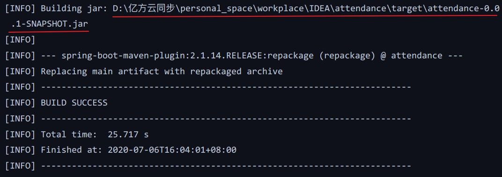
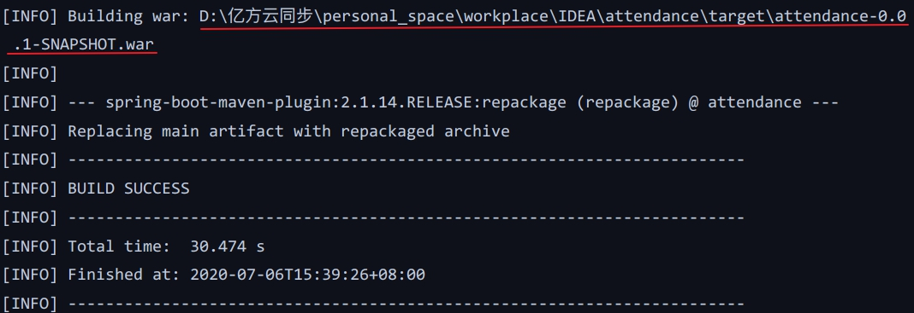

# 第一种:打包为jar包


## 1.pom.xml配置

在**pom.xml**里面配置如下

```xml
<package>jar</package>
```


## 2.打包为jar包


点击右边的**Maven**的**clean**，**package**后并运行会打包成**jar**包在**target**下


打包成功后的路径如下




## 3.查看要使用的服务器端口是否被占用

```shell
lsof -i tcp:8885
```


上方是已经运行的springboot项目在8885端口

如果端口被占用，就需要杀死进程(也可用于关闭spirngboot项目)，但建议一开始就寻找空端口并在springboot项目配置

```shell
kill -9 18689 #进程PID
```


## 4.将jar包上传到服务器并运行下面Linux命令永久启动

```shell
nohup java -jar XXX.jar >/dev/null 2>&1 &
```

> 如果仅仅是用java命令运行jar包，在退出远程连接时项目会关闭


## 5.将域名指向端口号

可以配置在**80**端口这样默认域名访问，不需要通过后面加端口号


> TODO:指定在其它端口使用域名指向


# 第二种:打包为war包


## 1.pom.xml配置


```xml
<package>war</package>

<!-- 找到spring-boot-starter-web依赖节点 -->
<dependency>
    <groupId>org.springframework.boot</groupId>
    <artifactId>spring-boot-starter-web</artifactId>
    <!-- 移除嵌入式tomcat插件 -->
    <exclusions>
        <exclusion>
            <groupId>org.springframework.boot</groupId>
            <artifactId>spring-boot-starter-tomcat</artifactId>
        </exclusion>
    </exclusions>
</dependency>

<!-- 添加tomcat依赖 -->
<dependency>
 <groupId>org.springframework.boot</groupId>
 <artifactId>spring-boot-starter-tomcat</artifactId>
 <scope>provided</scope>
</dependency>

```


## 2.修改启动类，并重写初始化方法


```java
@SpringBootApplication
public class Application extends SpringBootServletInitializer {

    public static void main(String[] args) {
        SpringApplication.run(Application.class, args);
        System.out.println("ヾ(◍°∇°◍)ﾉﾞ    bootdo启动成功      ヾ(◍°∇°◍)ﾉﾞ\n" +
                " ______                    _   ______            \n" +
                "|_   _ \\                  / |_|_   _ `.          \n" +
                "  | |_) |   .--.    .--. `| |-' | | `. \\  .--.   \n" +
                "  |  __'. / .'`\\ \\/ .'`\\ \\| |   | |  | |/ .'`\\ \\ \n" +
                " _| |__) || \\__. || \\__. || |, _| |_.' /| \\__. | \n" +
                "|_______/  '.__.'  '.__.' \\__/|______.'  '.__.'  ");
    }

    @Override
    protected SpringApplicationBuilder configure(SpringApplicationBuilder builder) {
        // 注意这里要指向原先用main方法执行的Application启动类
        return builder.sources(Application.class);
    }
}
```


## 3.打包为war包

与上面相同


打包成功后的路径如下




## 4.上传到服务器上的Tomcat里的webapps即可

这时候可以用域名指向项目而无需指定端口

