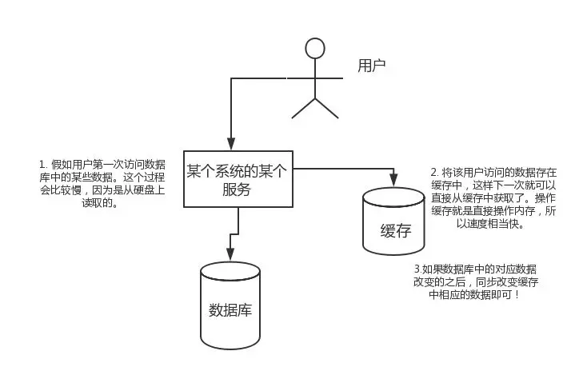

Redis学习笔记


# 参考

> - [redis 总结——重构版](https://mp.weixin.qq.com/s?__biz=Mzg2OTA0Njk0OA==&mid=2247484858&idx=1&sn=8e222ea6115e0b69cac91af14d2caf36&chksm=cea24a71f9d5c367148dccec3d5ddecf5ecd8ea096b5c5ec32f22080e66ac3c343e99151c9e0&token=1082669959&lang=zh_CN&scene=21#wechat_redirect)
> - https://www.cnblogs.com/jasontec/p/9699242.html


# 简介

简单来说 redis 就是⼀个数据库，不过与传统数据库不同的是 redis 的数据是存在内存中的，所以读 写速度⾮常快，因此 redis 被⼴泛应⽤于缓存⽅向。另外，redis 也经常⽤来做`分布式锁`。redis 提 供了多种数据类型来⽀持不同的业务场景。除此之外，redis ⽀持事务 、持久化、LUA脚本、LRU驱动 事件、多种集群⽅案。


# 为什么要用 redis /为什么要用缓存

主要从“`高性能`”和“`高并发`”这两点来看待这个问题。


## 高性能

假如用户第一次访问数据库中的某些数据。这个过程会比较慢，因为是从硬盘上读取的。将该用户访问的数据存在数缓存中，这样下一次再访问这些数据的时候就可以直接从缓存中获取了。操作缓存就是直接操作内存，所以速度相当快。如果数据库中的对应数据改变的之后，同步改变缓存中相应的数据即可！





## 高并发

直接操作缓存能够承受的请求是远远大于直接访问数据库的，所以我们可以考虑把数据库中的部分数据转移到缓存中去，这样用户的一部分请求会直接到缓存这里而不用经过数据库。


# 常⻅数据结构以及使⽤场景分析


| 数据结构 | 常用命令 |
| -------- | -------- |
|          |          |
|          |          |
|          |          |
|          |          |
|          |          |


## String 

> 常⽤命令: set,get,decr,incr,mget 等。


String数据结构是简单的key-value类型，value其实不仅可以是String，也可以是数字。 常规keyvalue缓存应⽤； 常规计数：微博数，粉丝数等。


## Hash 

> 常⽤命令： hget,hset,hgetall 等。

hash 是⼀个 string 类型的 field 和 value 的映射表，hash 特别适合⽤于存储对象，后续操作的时 候，你可以直接仅仅修改这个对象中的某个字段的值。 ⽐如我们可以 hash 数据结构来存储⽤户信 息，商品信息等等。⽐如下⾯我就⽤ hash 类型存放了我本⼈的⼀些信息：

```json
key=JavaUser293847
value={
 “id”: 1,
 “name”: “SnailClimb”,
 “age”: 22,
 “location”: “Wuhan, Hubei”
}
```


## List 

> 常⽤命令: lpush,rpush,lpop,rpop,lrange等 


list 就是链表，Redis list 的应⽤场景⾮常多，也是Redis最重要的数据结构之⼀，⽐如微博的关注 列表，粉丝列表，消息列表等功能都可以⽤Redis的 list 结构来实现。 Redis list 的实现为⼀个双向链表，即可以⽀持反向查找和遍历，更⽅便操作，不过带来了部分额外 的内存开销。 另外可以通过 lrange 命令，就是从某个元素开始读取多少个元素，可以基于 list 实现分⻚查询，这 个很棒的⼀个功能，基于 redis 实现简单的⾼性能分⻚，可以做类似微博那种下拉不断分⻚的东⻄ （⼀⻚⼀⻚的往下⾛），性能⾼。


## Set

> 常⽤命令： sadd,spop,smembers,sunion 等 


set 对外提供的功能与list类似是⼀个列表的功能，特殊之处在于 set 是可以⾃动排重的。 当你需要存储⼀个列表数据，⼜不希望出现重复数据时，set是⼀个很好的选择，并且set提供了判断某 个成员是否在⼀个set集合内的重要接⼝，这个也是list所不能提供的。可以基于 set 轻易实现交集、 并集、差集的操作。 ⽐如：在微博应⽤中，可以将⼀个⽤户所有的关注⼈存在⼀个集合中，将其所有粉丝存在⼀个集合。 Redis可以⾮常⽅便的实现如共同关注、共同粉丝、共同喜好等功能。这个过程也就是求交集的过程， 具体命令如下：


```json
sinterstore key1 key2 key3 将交集存在key1内
```


## Sorted Set 

> 常⽤命令： zadd,zrange,zrem,zcard等 


和set相⽐，sorted set增加了⼀个权重参数score，使得集合中的元素能够按score进⾏有序排列。 举例： 在直播系统中，实时排⾏信息包含直播间在线⽤户列表，各种礼物排⾏榜，弹幕消息（可以理 解为按消息维度的消息排⾏榜）等信息，适合使⽤ Redis 中的 Sorted Set 结构进⾏存储。


# Redis过期时间

Redis中有个设置时间过期的功能，即对存储在 redis 数据库中的值可以设置⼀个过期时间。作为⼀个 缓存数据库，这是⾮常实⽤的。如我们⼀般项⽬中的 token 或者⼀些登录信息，尤其是短信验证码都 是有时间限制的，按照传统的数据库处理⽅式，⼀般都是⾃⼰判断过期，这样⽆疑会严重影响项⽬性 能。


我们 set key 的时候，都可以给⼀个 expire time，就是过期时间，通过过期时间我们可以指定这个 key 可以存活的时间。 


如果假设你设置了⼀批 key 只能存活1个⼩时，那么接下来1⼩时后，redis是怎么对这批key进⾏删除 的？ 


> - 定期删除：redis默认是每隔 100ms 就随机抽取⼀些设置了过期时间的key，检查其是否过期， 如果过期就删除。注意这⾥是随机抽取的。为什么要随机呢？你想⼀想假如 redis 存了⼏⼗万 个 key ，每隔100ms就遍历所有的设置过期时间的 key 的话，就会给 CPU 带来很⼤的负载！ 
> - 惰性删除 ：定期删除可能会导致很多过期 key 到了时间并没有被删除掉。所以就有了惰性删 除。假如你的过期 key，靠定期删除没有被删除掉，还停留在内存⾥，除⾮你的系统去查⼀下那 个 key，才会被redis给删除掉。这就是所谓的惰性删除，也是够懒的哈！ 但是仅仅通过设置过期时间还是有问题的。我们想⼀下：如果定期删除漏掉了很多过期 key，然后你也 没及时去查，也就没⾛惰性删除，此时会怎么样？如果⼤量过期key堆积在内存⾥，导致redis内存块耗 尽了。怎么解决这个问题呢？ redis 内存淘汰机制。


但是仅仅通过设置过期时间还是有问题的。我们想⼀下：如果定期删除漏掉了很多过期 key，然后你也 没及时去查，也就没⾛惰性删除，此时会怎么样？如果⼤量过期key堆积在内存⾥，导致redis内存块耗 尽了。怎么解决这个问题呢？ redis 内存淘汰机制。


# Redis内存淘汰机制


redis 提供 6种数据淘汰策略： 

> 1. volatile-lru：从已设置过期时间的数据集（server.db[i].expires）中挑选最近最少使⽤的数 据淘汰 
> 2.  volatile-ttl：从已设置过期时间的数据集（server.db[i].expires）中挑选将要过期的数据淘 汰 
> 3. volatile-random：从已设置过期时间的数据集（server.db[i].expires）中任意选择数据淘汰 
> 4. allkeys-lru：当内存不⾜以容纳新写⼊数据时，在键空间中，移除最近最少使⽤的key（这个是 最常⽤的）
> 5. allkeys-random：从数据集（server.db[i].dict）中任意选择数据淘汰 
> 6. no-eviction：禁⽌驱逐数据，也就是说当内存不⾜以容纳新写⼊数据时，新写⼊操作会报错。 这个应该没⼈使⽤吧！


4.0版本后增加以下两种： 

> 7. volatile-lfu：从已设置过期时间的数据集(server.db[i].expires)中挑选最不经常使⽤的数据 淘汰 
> 8. 8. allkeys-lfu：当内存不⾜以容纳新写⼊数据时，在键空间中，移除最不经常使⽤的key


# Redis持久化机制

> 怎么保证 redis 挂掉之后再重启数据可以进⾏恢复


# Redis事务


# 缓存雪崩和缓存穿透问题解决⽅案


# 区别


## redis 和 memcached 的区别


> 1. redis⽀持更丰富的数据类型（⽀持更复杂的应⽤场景）：Redis不仅仅⽀持简单的k/v类型的数 据，同时还提供list，set，zset，hash等数据结构的存储。memcache⽀持简单的数据类型， String。 
> 2. Redis⽀持数据的持久化，可以将内存中的数据保持在磁盘中，重启的时候可以再次加载进⾏使 ⽤,⽽Memecache把数据全部存在内存之中。 
> 3. 集群模式：memcached没有原⽣的集群模式，需要依靠客户端来实现往集群中分⽚写⼊数据；但 是 redis ⽬前是原⽣⽀持 cluster 模式的. 
> 4. Memcached是多线程，⾮阻塞IO复⽤的⽹络模型；Redis使⽤单线程的多路 IO 复⽤模型。


## 为什么要用 redis 而不用 map/guava 做缓存?

缓存分为`本地缓存`和`分布式缓存`。以 Java 为例，使用自带的 map 或者 guava 实现的是本地缓存，最主要的特点是轻量以及快速，生命周期随着 jvm 的销毁而结束，并且在多实例的情况下，每个实例都需要各自保存一份缓存，缓存不具有一致性。

使用 redis 或 memcached 之类的称为分布式缓存，在多实例的情况下，各实例共用一份缓存数据，缓存具有一致性。缺点是需要保持 redis 或 memcached服务的高可用，整个程序架构上较为复杂。