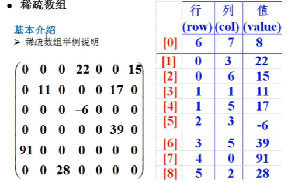
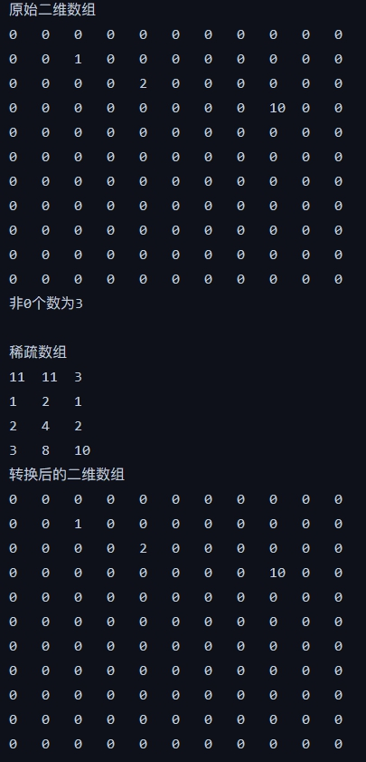
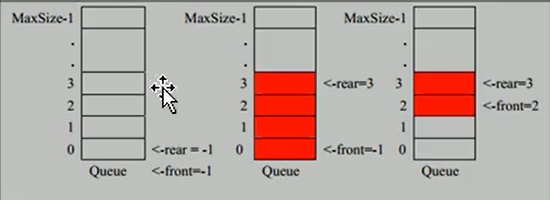
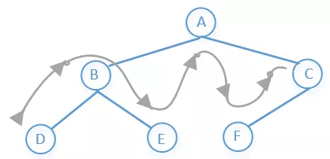
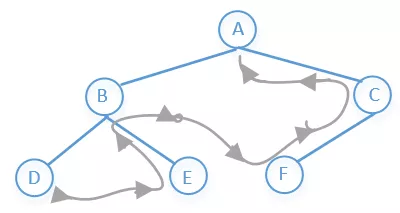

# 1. 时间复杂度计算


# 2. 算法


## 区别


### 动态规划和贪心算法的区别

相同点

- 动态规划和贪心算法都是一种递推算法 
- 均有局部最优解来推导全局最优解


不同点

- 贪心算法中，作出的每步贪心决策都无法改变，因为贪心策略是由上一步的最优解推导下一步的最优解，而上一部之前的最优解则不作保留。 
- 可以知道贪心法正确的条件是：每一步的最优解一定包含上一步的最优解。 
- 全局最优解中一定包含某个局部最优解，但不一定包含前一个局部最优解，因此需要记录之前的所有最优解 
- 动态规划的关键是状态转移方程，即如何由以求出的局部最优解来推导全局最优解 
- 边界条件：即最简单的，可以直接得出的局部最优解


# 3. 数据结构


## 3.1 稀疏数组

**只适用于大部分元素为相同时，比如五子棋**


**第一行记录总行和总列数和除0外有多少个非零数据，剩余的行则记录每个数据的位置和值**



**etc:五子棋**


**Java代码**

```java
public class SparseArray {
    public static void main(String[] args) {
        /*0：没有棋子，1：表示黑子，2：表示白子*/
        int chessArr[][] = new int[11][11];
        chessArr[1][2] = 1;
        chessArr[2][4] = 2;
        chessArr[3][8] = 10;
//        输出原始为二维数组
        System.out.println("原始二维数组");
        for(int[] row : chessArr){
            for(int data: row){
                System.out.printf("%d\t",data);
            }
            System.out.println();
        }

//        将二维数组转为稀疏数组
//        1.先遍历二维数组非0的个数
        int sum = 0;
        for(int i = 0; i < 11;i++){
            for(int j = 0; j < 11;j++){
                if(chessArr[i][j] != 0){
                    sum++;
                }
            }
        }

        System.out.println("非0个数为"+sum);

//        2.创建相应的稀疏数组
        int sparseArr[][] = new int[sum+1][3];
        sparseArr[0][0] = 11;
        sparseArr[0][1] = 11;
        sparseArr[0][2] = sum;

//        遍历二维数组，将非0的值存放到sparseArr中
        int count = 0;
        for(int i = 0; i < 11; i++){
            for(int j = 0; j < 11; j++){
                if(chessArr[i][j] != 0){
                    count++;
                    sparseArr[count][0] = i;
                    sparseArr[count][1] = j;
                    sparseArr[count][2] = chessArr[i][j];
                }
            }
        }

//        输出稀疏数组
        System.out.println();
        System.out.println("稀疏数组");
        for(int[] row : sparseArr){
            for(int data: row){
                System.out.printf("%d\t",data);
            }
            System.out.println();
        }

//        3.将稀疏数组转换为二维数组
//        声明数组
        int chessArry2[][] = new int[sparseArr[0][0]][sparseArr[0][1]];

        for(int i  = 1; i < sparseArr.length; i++){
            chessArry2[sparseArr[i][0]][sparseArr[i][1]] = sparseArr[i][2];
        }

        //        输出转换后的二维数组
        System.out.println("转换后的二维数组");
        for(int[] row : chessArr){
            for(int data: row){
                System.out.printf("%d\t",data);
            }
            System.out.println();
        }
    }

}
```


**运行结果**




## 3.2 队列

先进先出


### 用数组模拟队列实现


- 队列本身是**有序列表**,若使用数组的结构来存储队列的数据,则队列数组的声明如下图,其中**maxSize**是该队列的最大容量 

- 因为队列的输出、翰入是分别从前后端来处理,因此需要两个变量 **front** 及**rear**分别记录队列前后端的下标,**front会随着数据输出而改变,而rear则是随着数据输入而改变**,如图所示:  

  




1. **初始化队列**

```java
    private int maxSize;// 表示数组最大容量
    private int front; // 队列头指针指向队列头的前一个位置
    private int rear; // 队列尾指针
    private int[] arr; // 该数据用于存放数据，模拟队列

    //        创建队列的构造器
    public ArrayQueue(int arrMaxSize) {
        maxSize = arrMaxSize;
        arrQueue = new int[maxSize];
        front = -1; // 指向队列头部，分析出front是指向队列头的前一个位置，当队列执行出操作时++
        rear = -1; // 向队列队尾，指向队列尾的数据(队列最后一个数据)，当队列执行入操作时++
    }

```


2. **判断队列是否已满**

当 **rear = maxSize - 1** 时队列满

```java
    //        判断队列是否满
    public boolean isFull() {
        return rear == maxSize - 1;
    }
```


3. **判断队列是否为空**

当 **rear == front** 时队列为空

```java
    //        判断队列是否空
    public boolean isEmpty() {
        return rear == front;
    }
```


4. **入队操作 addQueue** 

**需要两个步骤**

- 先判断队列是否已满，当 **rear == maxSize-1** 时队列满无法插入
- 若尾指针 **rear** 小于队列的最大下标 **maxSize-1** ,则先将 **rear++**，再将数据n赋值给 **arrQueue[rear] = n**

```java
    //        入队操作
    public void addQueue(int n) {
        //        判断队列是否满
        if (isFull()) {
            System.out.println("队列已满");
            return;
        }
        rear++;
        arr[rear] = n;
    }
```


5. **出队操作 outQueue**

**需要两个步骤**

- 先判断队列是否为空，当 **rear == front** 时队列为空无法出队
- 若头指针 **front != rear** ，**front++** ，因为front指向队列头的前一个位置，所以返回的出队数据为 **arrQueue[front]**

```java
    //        出队操作
    public int outQueue() {
        //        判断队列是否满
        if (isEmpty()) {
            System.out.println("队列为空");
            throw new RuntimeException("队列为空");
        }
        front++;
        return arrQueue[front];
    }
```


6. **显示队列**

```java
    public void showQueue() {
        //遍历
        if (isEmpty()) {
            System.out.println("队列为空");
            return;
        }
        for (int i = front+1; i < rear+1; i++) {
            System.out.printf("arr[%d] = %d\n", i, arrQueue[i]);
        }
    }
```


7. **用数组实现队列模拟代码**

```java
public class ArrayQueue {
    private int maxSize;// 表示数组最大容量
    private int front; // 队列头指针指向队列头的前一个位置
    private int rear; // 队列尾指针
    private int[] arrQueue; // 该数据用于存放数据，模拟队列

    //        创建队列的构造器
    public ArrayQueue(int arrMaxSize) {
        maxSize = arrMaxSize;
        arrQueue = new int[maxSize];
        front = -1; // 指向队列头部，分析出front是指向队列头的前一个位置，当队列执行出操作时++
        rear = -1; // 向队列队尾，指向队列尾的数据(队列最后一个数据)，当队列执行入操作时++
    }

    //        判断队列是否满
    public boolean isFull() {
        return rear == maxSize - 1;
    }

    //        判断队列是否空
    public boolean isEmpty() {
        return rear == front;
    }

    //        入队操作
    public void addQueue(int n) {
        //        判断队列是否满
        if (isFull()) {
            System.out.println("队列已满");
            return;
        }
        rear++;
        arrQueue[rear] = n;
    }

    //        出队操作
    public int outQueue() {
        //        判断队列是否满
        if (isEmpty()) {
            System.out.println("队列为空");
            throw new RuntimeException("队列为空");
        }
        front++;
        return arrQueue[front];
    }

    //    查看未出队的数据
    public void showQueue() {
        //遍历
        if (isEmpty()) {
            System.out.println("队列为空");
            return;
        }
        for (int i = front+1; i < rear+1; i++) {
            System.out.printf("arr[%d] = %d\n", i, arrQueue[i]);
        }
    }

    //    显示队列的头数据，并不是取出操作
    public int headQueue() {
        if(isEmpty()) {
            throw new RuntimeException("队列为空");
        }
        return arrQueue[front + 1];
    }

    public static void main(String[] args) {
//        构造数组队列
        ArrayQueue arrayQueue = new ArrayQueue(2);
        char input;
        Scanner scanner = new Scanner(System.in);
        boolean loop = true;

        while (loop){
            System.out.println();
            System.out.println("a(add)：入队");
            System.out.println("g(get)：出队");
            System.out.println("s(show)：显示队列");
            System.out.println("h(head)：查看队列头数据");
            System.out.println("e(exit)：退出程序");

            input = scanner.next().charAt(0);
            switch (input){

                //输出队列
                case  's' :
                    arrayQueue.showQueue();
                    break;

                //入队操作
                case  'a' :
                    int value = scanner.nextInt();
                    arrayQueue.addQueue(value);
                    break;

                //出队操作
                case  'g' :
                    try {
                        System.out.println("出队的数据为 = " + arrayQueue.outQueue());
                    }catch (Exception e){
                        System.out.println(e.getMessage());
                    }
                    break;

                //输出队列头数据
                case  'h' :
                    try {
                        System.out.println("队列的头数据为 = " + arrayQueue.headQueue());
                    }catch (Exception e){
                        System.out.println(e.getMessage());
                    }
                    break;

                //退出
                case  'e' :
                    scanner.close();
                    loop = false;
                   break;

                default:
                    break;
            }
        }
    }
}
```


## 3.3 树


### 3.3.1 二叉树

参考

> - https://mp.weixin.qq.com/s/mBXfpH4nuIltyHm72zLryw


- 前序遍历：根结点 -> 左子树 -> 右子树 
- 中序遍历：左子树 -> 根结点 -> 右子树 
- 后序遍历：左子树 -> 右子树 -> 根结点


#### 结点构造

```java
public class TreeNode {
    public int val;
    public TreeNode left;
    public TreeNode right;
 
     public TreeNode(int x) {
         val = x;
     }
 
    public TreeNode() {
    }

    @Override
    public String toString() {
        return "[" + val + "]";
    }
}

```


#### 前序遍历


```java
static ArrayList<Integer> arrayList = new ArrayList();
public static void preOrder(TreeNode tree) {
    if (tree == null)
        return;
  	arrayList.add(tree.val)
    preOrder(tree.left);
    preOrder(tree.right);
}
```


#### 中序遍历



```java
static ArrayList<Integer> arrayList = new ArrayList();
public static void inOrderTraversal(TreeNode node) {
    if (node == null)
        return;
    inOrderTraversal(node.left);
    arrayList.add(tree.val)
    inOrderTraversal(node.right);
}
```


#### 后序遍历



```java
static ArrayList<Integer> arrayList = new ArrayList();
public static void inOrderTraversal(TreeNode node) {
    if (node == null)
        return;
    inOrderTraversal(node.left);  
    inOrderTraversal(node.right);
  	arrayList.add(tree.val)
}
```


#### 根据前序和中序遍历构建二叉树


```java
class Solution {
    HashMap<Integer, Integer> dic = new HashMap<>();
    int[] po;
    public TreeNode buildTree(int[] preorder, int[] inorder) {
        po = preorder;
        for(int i = 0; i < inorder.length; i++) 
            dic.put(inorder[i], i);
        return recur(0, 0, inorder.length - 1);
    }
    TreeNode recur(int pre_root, int in_left, int in_right) {
        if(in_left > in_right) return null;
        TreeNode root = new TreeNode(po[pre_root]);
        int i = dic.get(po[pre_root]);
        root.left = recur(pre_root + 1, in_left, i - 1);
        root.right = recur(pre_root + i - in_left + 1, i + 1, in_right);
        return root;
    }
}
```


#### BFS(广度优先搜索)

一层一层往下访问


- BFS代码

```java
public static void levelOrder(TreeNode tree) {
     if (tree == null)
         return;
     LinkedList<TreeNode> list = new LinkedList<>();//链表，这里我们可以把它看做队列
     list.add(tree);//相当于把数据加入到队列尾部
     while (!list.isEmpty()) {
         TreeNode node = list.poll();//poll方法相当于移除队列头部的元素
         System.out.println(node.val);
        if (node.left != null)
            list.add(node.left);
        if (node.right != null)
            list.add(node.right);
    }
}
```


- 递归的写法

```java
public static void levelOrder(TreeNode tree) {
     int depth = depth(tree);
     for (int level = 0; level < depth; level++) {
         printLevel(tree, level);
     }
 }
 
 private static int depth(TreeNode tree) {
     if (tree == null)
        return 0;
    int leftDepth = depth(tree.left);
    int rightDepth = depth(tree.right);
    return Math.max(leftDepth, rightDepth) + 1;
}


private static void printLevel(TreeNode tree, int level) {
    if (tree == null)
        return;
    if (level == 0) {
        System.out.print(" " + tree.val);
    } else {
        printLevel(tree.left, level - 1);
        printLevel(tree.right, level - 1);
    }
}
```


#### 如果想把遍历的结果存放到list中，我们还可以这样写

```java
public static List<List<Integer>> levelOrder(TreeNode tree) {
     if (tree == null)
         return null;
     List<List<Integer>> list = new ArrayList<>();
     bfs(tree, 0, list);
     return list;
 }
 
 private static void bfs(TreeNode tree, int level, List<List<Integer>> list) {
    if (tree == null)
        return;
    if (level >= list.size()) {
        List<Integer> subList = new ArrayList<>();
        subList.add(tree.val);
        list.add(subList);
    } else {
        list.get(level).add(tree.val);
    }
    bfs(tree.left, level + 1, list);
    bfs(tree.right, level + 1, list);
}
```


# 4. 排序


## 4.1 时间复杂度比较

| 排序方法     | 时间复杂度(平均) | 时间复杂度(最坏) | 时间复杂度(最好) | 空间复杂度 | 稳定性 | 复杂性 |
| ------------ | ---------------- | ---------------- | ---------------- | ---------- | ------ | ------ |
| 直接插入排序 | O(n2)            | O(n2)            | O(n)             | O(1)       | 稳定   | 简单   |
| 希尔排序     | O(nlog2n)        | O(n2)            | O(n1.3)          | O(1)       | 不稳定 | 较复杂 |
| 直接选择排序 | O(n2)            | O(n2)            | O(n2)            | O(1)       | 不稳定 | 简单   |
| 堆排序       | O(nlog2n)        | O(nlog2n)        | O(nlog2n)        | O(1)       | 不稳定 | 较复杂 |
| 冒泡排序     | O(n2)            | O(n2)            | O(n)             | O(1)       | 稳定   | 简单   |
| 快速排序     | O(nlog2n)        | O(n2)            | O(nlog2n)        | O(nlog2n)  | 不稳定 | 较复杂 |
| 归并排序     | O(nlog2n)        | O(nlog2n)        | O(nlog2n)        | O(n)       | 稳定   | 较复杂 |
| 基数排序     | O(d(n+r))        | O(d(n+r))        | O(d(n+r))        | O(n+r)     | 稳定   | 较复杂 |


## 4.2 快速排序


# 5. 查找


## 5.1 二分查找

参考

> - https://www.cnblogs.com/kyoner/p/11080078.html


### 5.1.1 最基本的二分查找算法

```java
    /*基本二分查找框架*/
    public static int binarySearch(int[] nums, int target) {
      if (nums.length == 0) return -1;
      	/*left指针指向下标为0，right指针指向最后一个元素*/
        int left = 0, right = nums.length - 1;
        while(left <= right) {
          /*mid赋值时防止当right + left数据过大时溢出*/
            int mid = left + (right - left) / 2;
            if (nums[mid] == target) {
                return mid;
            } else if (nums[mid] < target) {
                left = mid + 1;
            } else if (nums[mid] > target) {
                right = mid - 1;
            }
        }
        return -1;
    }
```


### 5.1.2 寻找左侧边界的二分查找

> 因为我们初始化 `right = nums.length` 所以决定了我们的「搜索区间」是 `[left, right)` 所以决定了 `while (left < right)` 同时也决定了 `left = mid+1` 和 `right = mid` 因为我们需找到 target 的最左侧索引 所以当 nums[mid] == target 时不要立即返回 而要收紧`右侧边界以锁定左侧边界`


```java
    /*查询最左侧索引*/
    public static int binarySearch_Left(int[] nums, int target){
        if (nums.length == 0){
            return -1;
        }

        int left = 0 , right = nums.length - 1;
        while (left <= right){
            int mid = left + (right - left) / 2;
            /*当相等时，并不是直接返回，而是收紧右侧区间在mid的前一个*/
            if(target == nums[mid]){
                right = mid - 1;
            }
            /*当target > nums[mid]时收紧左侧区间，即left = mid + 1*/
            else if(target > nums[mid]){
                left = mid + 1;
            }
            /*当target < nums[mid]时收紧右侧区间，即right = mid - 1*/
            else if(target < nums[mid]){
                right = mid - 1;
            }
        }
        return left;
    }
```


### 5.1.3 寻找右侧边界的二分查找

```java
    /*查询最右侧索引*/
    public static int binarySearch_Right(int[] nums, int target){
        if (nums.length == 0){
            return -1;
        }

        int left = 0 , right = nums.length - 1;
        System.out.println("nums.length : " + nums.length);

        while (left <= right){
            System.out.println("left : " + left);
            System.out.println("right : " + right);
            int mid = left + (right - left) / 2;
            /*当相等时，并不是直接返回，而是收紧左侧区间在mid的后一个，以此查找是否右边还有此值*/
            if(target == nums[mid]){
                left = mid + 1;
            }
            /*当target > nums[mid]时收紧左侧区间，即left = mid + 1*/
            else if(target > nums[mid]){
                left = mid + 1;
            }
            /*当target < nums[mid]时收紧右侧区间，即right = mid - 1*/
            else if(target < nums[mid]){
                right = mid - 1;
            }
        }
        return right;
    }
```


# tips


- 在写判定条件 && 运算时，尽量把简单的操作写在&&之前