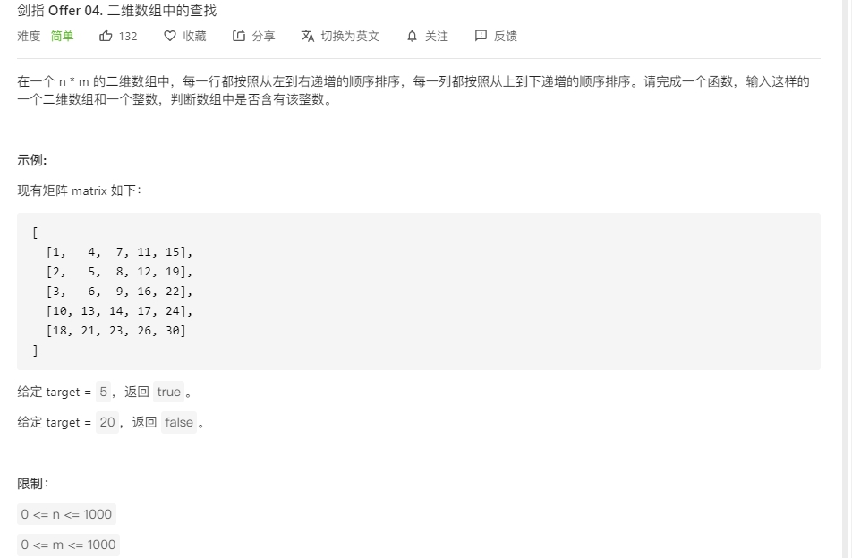
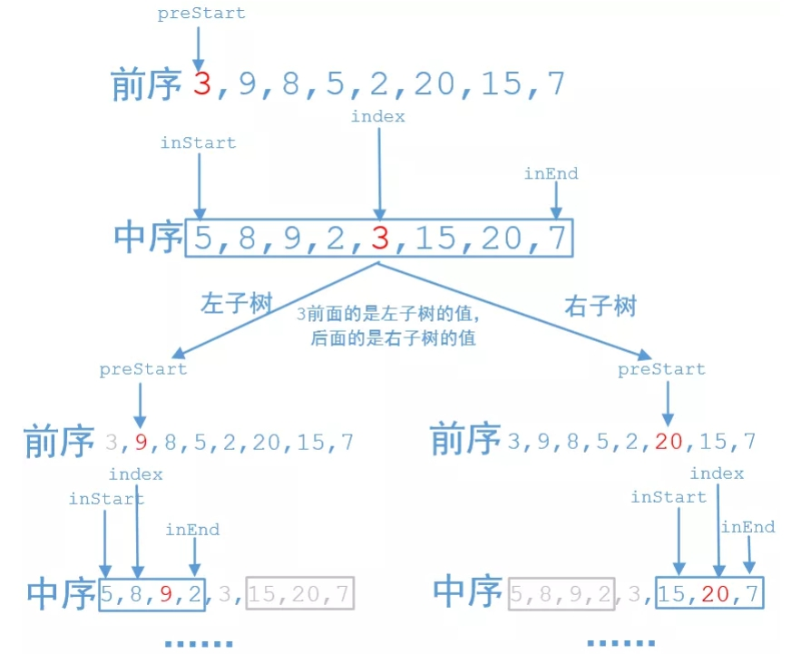

# 1. 常用基本操作


## 1.1 利用字符串输入不定长数组

输入时用`','`隔开

```java
        Scanner input = new Scanner(System.in);
        String str = input.nextLine().toString();
        String[] arr  = str.split(",");
        int[] nums = new int[arr.length];
        for(int j = 0; j<nums.length;j++) {
            nums[j] = Integer.parseInt(arr[j]);
        }
        int repeat = 0;
        System.out.println(Arrays.toString(nums));
```


## 1.2 将两个整数数组合并之后按照升序排序,并打印输出到控制台,注意不要去重


```java
public class 合并数组按照升序排序 {
    public static void main(String[] args) {
        int a[] = {1,3,5,7};
        int b[] = {2,4,5,8};
        int c[] = new int[a.length + b.length];
        int i =0, j = 0 , k = 0;
        while(i < a.length && j < b.length){
            if(a[i] < b[j]) {
                c[k++] = a[i++];
            }else{
                c[k++] = b[j++];
            }
        }
        while (i < a.length) {
            c[k++] = a[i++];
        }
        while (j < b.length) {
            c[k++] = b[j++];
        }
        System.out.println(Arrays.toString(c));
    }
}
```


## 1.3 给定一个数组，设计一个既高效又公平的方法随机打乱这个数组。


## 1.4 如何判断素数


# 2. Leetcode


## [05. 最长回文子串](https://leetcode-cn.com/problems/longest-palindromic-substring/)

当 `s.length() < 2` 时直接返回


### 暴力法

直接计算每个子字符串是否为回文数，是的话就将此子字符串长度与 `maxLen` 比较，如果大于 `maxLen` ，就覆盖 `maxLen` 并覆盖起始位置 `begin` ，最后的时候返回 `s.subString(begin , begin + maxLen)` 即可

```java
    /*暴力法，遍历所有子串*/
    public static String longestPalindrome(String s){
        int len = s.length();
        if(len < 2){
            return s;
        }
        int maxLen = 1;
        int begin = 0;
        char[] chars = s.toCharArray();
        for (int i = 0; i < len - 1; i++) {
            for (int j = i + 1; j < len; j++) {
                if(j - i + 1 > maxLen && validPalindrome(chars, i ,j)){
                    maxLen = j - i + 1;
                    begin = i;
                }
            }
        }
        return s.substring(begin, begin + maxLen);
    }
    public static boolean validPalindrome(char[] chars , int left , int right){
        while (left < right){
            if(chars[left] != chars[right]){
                return false;
            }
            left++;
            right--;
        }
        return true;
    }
```


### 中心扩展

遍历字符串，并以每个字符为中心比较左右两个字符是否相等，边界条件为 `left >=0 && right < s.length() && s.charAt(left) == s.charAt(right)` 。但是分两种情况

- 以一个字符为中心扩展
- 以两个字符为中心扩展

在每一次循环时比较上述两个长度的最大值，再与 `maxLen` 比较，大于则赋值给 `maxLen` 并赋值 `begin` 索引


```java
    /*中心扩展*/
    public static String longestPalindrome_expandCenter(String s){
        int maxLen = 0;
        int begin = 0;
        if(s.length() < 2){
            return s;
        }
        for (int i = 0; i < s.length(); i++) {
          
            int len = Math.max(expandAroundCenter(s , i , i),expandAroundCenter(s , i , i + 1));
            if(len > maxLen){
                begin = i - (len - 1)/2;//赋值给索引begin
                maxLen = len;//赋值给回文串最大长度
            }
        }
        return s.substring(begin, begin + maxLen);
    }

    public static int expandAroundCenter(String s , int left , int right){
        while (left >=0 && right < s.length() && s.charAt(left) == s.charAt(right)){
            left--;
            right++;
        }
        return right - left - 1;
    }
```


参考

> - [「 剑指 OFFER 系列题解 」 扬帆，起航](https://krahets.gitee.io/views/sword-for-offer/2020-05-20-sword-for-offer-00.html)


## [03. 剑指 Offer 03. 数组中重复的数字](https://leetcode-cn.com/problems/shu-zu-zhong-zhong-fu-de-shu-zi-lcof/)


`HashSet去重` 


### 第一种：使用HastSet去重，遍历添加时如果返回为`false`则说明重复则直接返回此数

```java
    public static int findRepeatNumber() {
        HashSet<Integer> dic = new HashSet<Integer>();
        int[] nums = {1,2,2,4};
        int repeat = 0;
        for(int num : nums){
            if( !dic.add(num)){
                repeat = num;
                break;
            }
        }
        return repeat;
    }
```


### 第二种：由于指定了里面的数范围为0 ~ n-1，可以用遍历添加到另一个数组，另一个数组下标为数组中的数，值为出现的次数，当次数大于2则返回

```java
 int[] nums = {1,2,2,3};
        int[] nums_2 = new int[nums.length];
        int repeat = -1;
        for (int i = 0; i < nums.length; i++) {
            if(++nums_2[nums[i]] > 1){
                repeat = nums[i];
              	break;
            }
        }
        return repeat;
    }
```


## [04. 剑指 Offer 04. 二维数组中的查找](https://leetcode-cn.com/problems/er-wei-shu-zu-zhong-de-cha-zhao-lcof/submissions/)


`标志位法` `线性查找`





### 线性查找

​		由于给定的二维数组具备每行从左到右递增以及每列从上到下递增的特点，当访问到一个元素时，可以排除数组中的部分元素。

从二维数组的右上角开始查找。如果当前元素等于目标值，则返回 true。如果当前元素大于目标值，则移到左边一列。如果当前元素小于目标值，则移到下边一行。

可以证明这种方法不会错过目标值。如果当前元素大于目标值，说明当前元素的下边的所有元素都一定大于目标值，因此往下查找不可能找到目标值，往左查找可能找到目标值。如果当前元素小于目标值，说明当前元素的左边的所有元素都一定小于目标值，因此往左查找不可能找到目标值，往下查找可能找到目标值。


- 若数组为空，返回 false

- 初始化行下标为 0，列下标为二维数组的列数减 1

- 重复下列步骤，直到行下标或列下标超出边界

- 获得当前下标位置的元素 num

  > - 如果 num 和 target 相等，返回 true
  > - 如果 num 大于 target，列下标减 1
  > - 如果 num 小于 target，行下标加 1

- 循环体执行完毕仍未找到元素等于 target ，说明不存在这样的元素，返回false


```java
class Solution {
    public boolean findNumberIn2DArray(int[][] matrix, int target) {
        if (matrix == null || matrix.length == 0 || matrix[0].length == 0) {
            return false;
        }
        int rows = matrix.length, columns = matrix[0].length;
        int row = 0, column = columns - 1;
        while (row < rows && column >= 0) {
            int num = matrix[row][column];
            if (num == target) {
                return true;
            } else if (num > target) {
                column--;
            } else {
                row++;
            }
        }
        return false;
    }
}

```


## [05. 剑指 Offer 05. 替换空格](https://leetcode-cn.com/problems/ti-huan-kong-ge-lcof/)


`字符串拼接` `StringBuilder`


```java
class Solution {
    public String replaceSpace(String s) {
        StringBuilder res = new StringBuilder();
        for(Character c : s.toCharArray())
        {
            if(c == ' ') res.append("%20");
            else res.append(c);
        }
        return res.toString();

    }
}
```


## [06. 剑指 Offer 06. 从尾到头打印链表](https://leetcode-cn.com/problems/cong-wei-dao-tou-da-yin-lian-biao-lcof/)


`栈` `遍历链表`


### 第一种：先算出数量再遍历赋值直到head.next == null

```java
    public int[] reversePrint(ListNode head) {
       //先获取链表长度，创建对应长度数组
        ListNode currNode = head;
        int len = 0;
        while(currNode != null){
            len ++;
            currNode = currNode.next;
        }
        int[] result = new int[len];
        
        //再次遍历链表，将值倒序填充至结果数组
        currNode = head;
        while(currNode != null){
            result[len - 1] = currNode.val;
            len --;
            currNode = currNode.next;
        }
        return result;
```


### 第二种：使用栈

```java
/**
 * Definition for singly-linked list.
 * public class ListNode {
 *     int val;
 *     ListNode next;
 *     ListNode(int x) { val = x; }
 * }
 */
class Solution {
    public int[] reversePrint(ListNode head) {
        Stack<ListNode> stack = new Stack<ListNode>();
        ListNode temp = head;
        while (temp != null) {
            stack.push(temp);
            temp = temp.next;
        }
        int size = stack.size();
        int[] print = new int[size];
        for (int i = 0; i < size; i++) {
            print[i] = stack.pop().val;
        }
        return print;
    }
}

```


### 第三种：使用集合等遍历逆序添加


## [07. 剑指 Offer 07. 重建二叉树](https://leetcode-cn.com/problems/zhong-jian-er-cha-shu-lcof/)

`递归法` `二叉树` `分治思想`





```java
class Solution {
    HashMap<Integer, Integer> dic = new HashMap<>();
    int[] po;
    public TreeNode buildTree(int[] preorder, int[] inorder) {
        po = preorder;
        for(int i = 0; i < inorder.length; i++) 
            dic.put(inorder[i], i);
        return recur(0, 0, inorder.length - 1);
    }
    TreeNode recur(int pre_root, int in_left, int in_right) {
        if(in_left > in_right) return null;
        TreeNode root = new TreeNode(po[pre_root]);
        int i = dic.get(po[pre_root]);
        root.left = recur(pre_root + 1, in_left, i - 1);
        root.right = recur(pre_root + i - in_left + 1, i + 1, in_right);
        return root;
    }
}
```


## [剑指 Offer 52. 两个链表的第一个公共节点](https://leetcode-cn.com/problems/liang-ge-lian-biao-de-di-yi-ge-gong-gong-jie-dian-lcof/)

`双指针`


使用双指针，注意结点的数字相同不代表结点对象相同

```java
    public static class ListNode {
      int val;
      ListNode next;
      ListNode(int val) {
          val = val;
          next = null;
      }
  }

    /*双指针*/
    public static ListNode getIntersectionNode(ListNode headA , ListNode headB){
                if (headA == null || headB == null) {
                    return null;
                }
                ListNode node1=headA;
                ListNode node2=headB;
                while (node1!=node2){
                    node1=(node1==null)?headB:node1.next;
                    node2=(node2==null)?headA:node2.next;
                }

                return node1;

    }
```


# 3. 牛客网


## 判断一个括号字符串是否匹配正确，如果括号有多种，怎么做？如（（[]））正确，[[(()错误。


