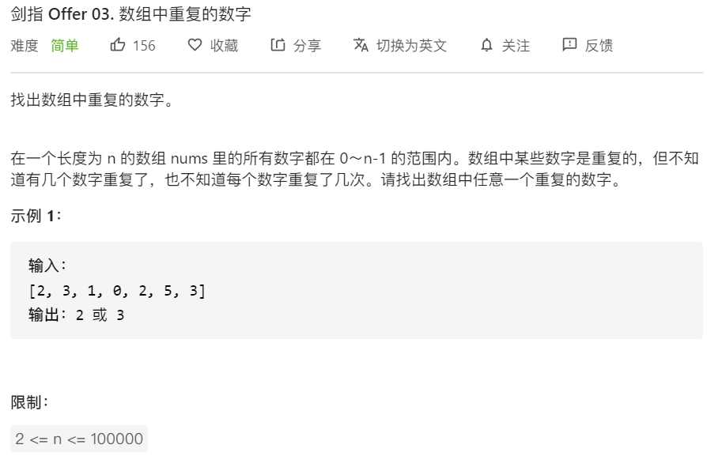

# 常用基本操作


## 利用字符串输入不定长数组

输入时用`','`隔开

```java
        Scanner input = new Scanner(System.in);
        String str = input.nextLine().toString();
        String[] arr  = str.split(",");
        int[] nums = new int[arr.length];
        for(int j = 0; j<nums.length;j++) {
            nums[j] = Integer.parseInt(arr[j]);
        }
        int repeat = 0;
        System.out.println(Arrays.toString(nums));
```


## 将两个整数数组合并之后按照升序排序,并打印输出到控制台,注意不要去重


```java
public class 合并数组按照升序排序 {
    public static void main(String[] args) {
        int a[] = {1,3,5,7};
        int b[] = {2,4,5,8};
        int c[] = new int[a.length + b.length];
        int i =0, j = 0 , k = 0;
        while(i < a.length && j < b.length){
            if(a[i] < b[j]) {
                c[k++] = a[i++];
            }else{
                c[k++] = b[j++];
            }
        }
        while (i < a.length) {
            c[k++] = a[i++];
        }
        while (j < b.length) {
            c[k++] = b[j++];
        }
        System.out.println(Arrays.toString(c));
    }
}
```


## 给定一个数组，设计一个既高效又公平的方法随机打乱这个数组。


# Leetcode


## 找出数组中重复的数字


> - https://leetcode-cn.com/problems/shu-zu-zhong-zhong-fu-de-shu-zi-lcof/





### 第一种：使用HastSet去重，遍历添加时如果返回为`false`则说明重复则直接返回此数

```java
    public static int findRepeatNumber() {
        HashSet<Integer> dic = new HashSet<Integer>();
        int[] nums = {1,2,2,4};
        int repeat = 0;
        for(int num : nums){
            if( !dic.add(num)){
                repeat = num;
                break;
            }
        }
        return repeat;
    }
```


### 第二种：由于指定了里面的数范围为0 ~ n-1，可以用遍历添加到另一个数组，另一个数组下标为数组中的数，值为出现的次数，当次数大于2则返回

```java
 int[] nums = {1,2,2,3};
        int[] nums_2 = new int[nums.length];
        int repeat = -1;
        for (int i = 0; i < nums.length; i++) {
            if(++nums_2[nums[i]] > 1){
                repeat = nums[i];
            }
        }
        return repeat;
    }
```

