# 学习路线


# Java基础


## JDK和JRE区别

- **<u>JDK（Java Development Kit）</u>**是针对Java开发员的产品，是整个Java的核心，包括了Java运行环境JRE、Java工具和Java基础类库。
- **<u>Java Runtime Environment（JRE）</u>**是运行JAVA程序所必须的环境的集合，包含JVM标准实现及Java核心类库。
- **<u>Java Virtual Machine（Java虚拟机JVM）</u>**的缩写，是整个java实现跨平台的最核心的部分，能够运行以Java语言写作的软件程序。

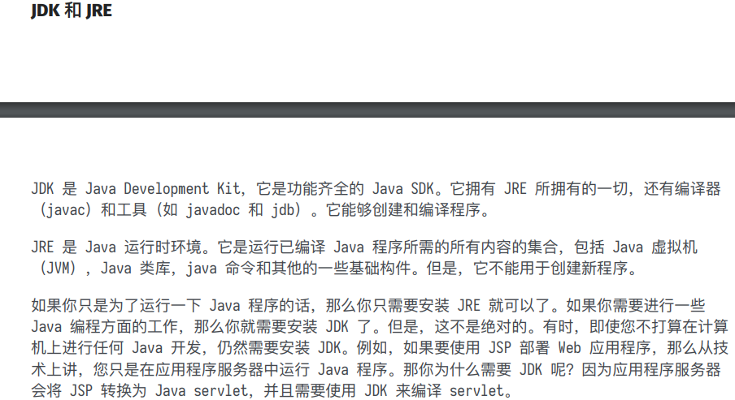


### JDK（Java Development Kit）

- JDK中包含JRE，在JDK的安装目录下有一个名为jre的目录，里面有两个文件夹bin和lib，在这里可以认为bin里的就是jvm，lib中则是jvm工作所需要的类库，而jvm和 lib和起来就称为jre。
- JDK是整个JAVA的核心，包括了Java运行环境JRE（Java Runtime Envirnment）、一堆Java工具（javac/java/jdb等）和Java基础的类库（即Java API 包括rt.jar）。

**类型**

- SE(J2SE)，standard edition，标准版，是我们通常用的一个版本，从JDK 5.0开始，改名为Java SE。
- EE(J2EE)，enterprise edition，企业版，使用这种JDK开发J2EE应用程序，从JDK 5.0开始，改名为Java EE。
- ME(J2ME)，micro edition，主要用于移动设备、嵌入式设备上的java应用程序，从JDK 5.0开始，改名为Java ME。


### JRE（Java Runtime Environment）

​		是运行基于Java语言编写的程序所不可缺少的运行环境。RE中包含了Java virtual machine（JVM），runtime class libraries和Java application launcher，这些是运行Java程序的必要组件。**但是在运行编译好的程序中包含Servlet时，需要JDK**


### JVM（Java Virtual Machine）

​		就是我们常说的java虚拟机，它是整个java实现跨平台的最核心的部分，所有的java程序会首先被编译为.class的类文件，这种类文件可以在虚拟机上执行。

也就是说class并不直接与机器的操作系统相对应，而是经过虚拟机间接与操作系统交互，由虚拟机将程序解释给本地系统执行。

只有JVM还不能成class的执行，因为在解释class的时候JVM需要调用解释所需要的类库lib，而jre包含lib类库。

JVM屏蔽了与具体操作系统平台相关的信息，使Java程序只需生成在Java虚拟机上运行的目标代码（字节码）,就可以在多种平台上不加修改地运行。JVM在执行字节码时，实际上最终还是把字节码解释成具体平台上的机器指令执行。


## 重载和重写


### 重载(Overload)

1. 重载Overload是一个类中多态性的一种表现或者一个类中多个构造器的实现
2. 重载要求同名方法的参数列表不同(参数类型，参数个数甚至是参数顺序)
3. 重载的时候，返回值类型可以相同也可以不相同。无法以返回型别作为重载函数的区分标准

```java
public class Father {

    public static void main(String[] args) {
        // TODO Auto-generated method stub
        Father s = new Father();
        s.sayHello();
        s.sayHello("wintershii");

    }

    public void sayHello() {
        System.out.println("Hello");
    }

    public void sayHello(String name) {
        System.out.println("Hello" + " " + name);
    }
}
```


### 重写(Override)

1. **发生在父类与子类之间**
2. **方法名，参数列表，返回类型（除过子类中方法的返回类型是父类中返回类型的子类）必须相同**
3. 访问修饰符的限制一定要**大于**被重写方法的访问修饰符（public>protected>default>private)
4. 重写方法一定不能抛出新的检查异常或者比被重写方法申明更加宽泛的检查型异常

```java
public class Father {

    public static void main(String[] args) {
        // TODO Auto-generated method stub
        Son s = new Son();
        s.sayHello();
    }

    public void sayHello() {
        System.out.println("Hello");
    }
}

class Son extends Father{

    @Override
    public void sayHello() {
        // TODO Auto-generated method stub
        System.out.println("hello by ");
    }

}
```


### 重载（Overload）和重写（Override）的区别

​		方法的重载和重写都是实现多态的方式，区别在于前者实现的是编译时的多态性，而后者实现的是运行时的多态性。重载发生在一个类中，同名的方法如果有不同的参数列表（参数类型不同、参数个数不同或者二者都不同）则视为重载；重写发生在子类与父类之间，重写要求子类被重写方法与父类被重写方法有相同的参数列表，有兼容的返回类型，比父类被重写方法更好访问，不能比父类被重写方法声明更多的异常（里氏代换原则）。重载对返回类型没有特殊的要求，不能根据返回类型进行区分。


## 构造器Constructor是否可被Override(重写)

​		构造器Constructor不能被继承，因此不能被**重写(Override)**，但是可以被**重载（Overload）**。如果父类自定义了有参构造函数，则子类无论定义构造函数与否，定义有参构造函数与否，都会报错，正确的做法是在子类的构造方法中添上super（参数），以表明子类构造之前先构造父类，而这句话必须放在第一句，否则报"Constructor call must be the first statement in a constructor"的错误。


### 类的加载顺序：

1. 父类的静态代码块/初始化静态变量（两者优先级相同）
2. 执行子类的静态代码/初始化静态变量（两者优先级相同，谁写在前面谁先执行）
3. 初始化父类成员变量/执行代码块{}（两者优先级相同），父类的构造器
4. 子类的成员变量/代码块，最后子类的构造器。


## 三大特性封装继承多态


### 封装

​		封装（Encapsulation）是面向对象方法的重要原则，就是把对象的属性和操作（或服务）结合为一个独立的整体，并尽可能隐藏对象的内部实现细节。实体类那些属性就是被封装

- 将类的某些信息隐藏在类的内部，不允许外部程序进行直接的访问调用。
- 通过该类提供的方法来实现对隐藏信息的操作和访问。
- 隐藏对象的信息。
- 留出访问的对外接口。


### 继承

​		继承就是子类继承父类的特征和行为，使得子类对象（实例）具有父类的实例域和方法，或子类从父类继承方法，使得子类具有父类相同的行为。当然，如果在父类中拥有私有属性(private修饰)，则子类是不能被继承的。

只支持单继承，即一个子类只允许有一个父类，但是可以实现多级继承，及子类拥有唯一的父类，而父类还可以再继承。

-  子类可以拥有父类的属性和方法。
-  子类可以拥有自己的属性和方法。
-  子类可以重写覆盖父类的方法。


**使用**

在父子类关系继承中，如果成员变量重名，则创建子类对象时，访问有两种方式。

- 直接通过子类对象访问成员变量

   等号左边是谁，就优先使用谁，如果没有就向上找。

- 间接通过成员方法访问成员变量

  该方法属于谁，谁就优先使用，如果没有就向上找。

```java
public class FU {
    int numFU = 10;
    int num = 100;
    public void method(){
        System.out.println("父类成员变量："+numFU);
    }
    public void methodFU(){
        System.out.println("父类成员方法!");
    }
}

public class Zi extends FU{
    int numZi = 20;
    int num = 200;
    public void method(){
        System.out.println("子类成员变量："+numFU);
    }
    public void methodZi(){
        System.out.println("子类方法！");
    }
}

public class ExtendDemo {
    public static void main(String[] args) {
        FU fu = new FU();
        // 父类的实体对象只能调用父类的成员变量
        System.out.println("父类：" + fu.numFU);   // 结果：10
        
        Zi zi = new Zi();
        System.out.println("调用父类：" + zi.numFU); // 结果：10
        System.out.println("子类：" + zi.numZi);   // 结果：20

        /** 输出结果为200，证明在重名情况下，如果子类中存在则优先使用，
         *  如果不存在则去父类查找，但如果父类也没有那么编译期就会报错。
         */
        System.out.println(zi.num); // 结果：200
        /**
         * 通过成员方法调用成员变量
         */
        zi.method();    // 结果：10
    }
}
```


### 多态

指允许不同类的对象对同一消息做出响应。即同一消息可以根据发送对象的不同而采用多种不同的行为方式。动态绑定（dynamic binding），是指在执行期间判断所引用对象的实际类型，根据其实际的类型调用其相应的方法。

**实现方式**

- 接口多态性。
- 继承多态性。
- 通过抽象类实现的多态性。


**向上转型**

```java
public class MultiDemo {
       public static void main(String[] args) {
           // 多态的引用，就是向上转型，此时无法使用之类中父类没有的方法
           Animals dog = new Dog();
           dog.eat();//狗在吃骨头！
           
           Animals cat = new Cat();
           cat.eat();//猫在吃鱼！
           
           // 如果要调用父类中没有的方法，则要向下转型
           Dog dogDown = (Dog)dog;
           dogDown.watchDoor();
   
       }
   }
   class Animals {
       public void eat(){
           System.out.println("动物吃饭！");
       }
   }
   class Dog extends Animals{
       public void eat(){
           System.out.println("狗在吃骨头！");
       }
       public void watchDoor(){
           System.out.println("狗看门！");
       }
   }
   class Cat extends Animals{
       public void eat(){
           System.out.println("猫在吃鱼！");
       }
   }
```


## this | super | final | static关键字


### this

- 本类成员方法中，访问**本类**的成员变量。
- 本类成员方法中，访问**本类**的另一个成员方法。
- 本类的构造方法中，访问**本类**的另一个构造方法。


### super

- 子类的成员方法中，访问**父类**的成员变量。
- 子类的成员方法中，访问**父类**的成员方法。
- 子类的构造方法中，访问**父类**的构造方法。


**注意**

- this关键字同super一样，必须在构造方法的第一个语句，且是唯一的。
- this与super不能同时存在。


### final

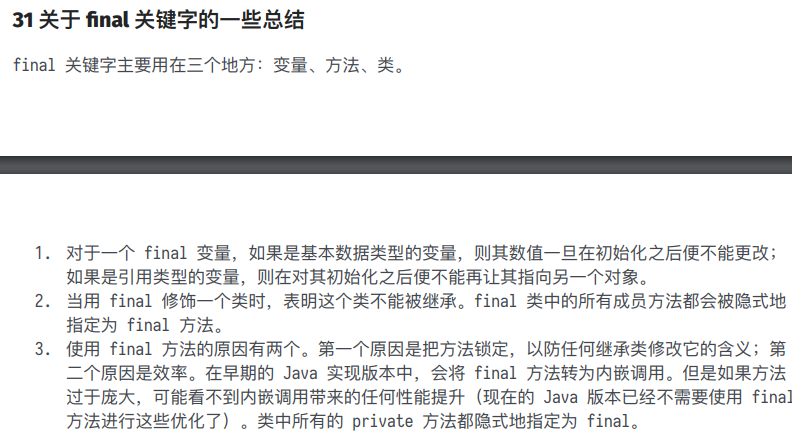


### static


## String StringBuffer 和 StringBuilder 的区别是什么? String 为什么是不可变的?


### Java String 类：String字符串常量

需要注意的是，String的值是不可变的，这就导致每次对String的操作都会生成**新的String对象**，这样不仅效率低下，而且大量浪费有限的内存空间。我们来看一下这张对String操作时内存变化的图：


我们可以看到，初始String值为“hello”，然后在这个字符串后面加上新的字符串“world”，这个过程是需要重新在栈堆内存中开辟内存空间的，最终得到了“hello world”字符串也相应的需要开辟内存空间，**这样短短的两个字符串，却需要开辟三次内存空间**，不得不说这是对内存空间的**极大浪费**。为了应对经常性的字符串相关的操作，就需要使用Java提供的其他两个操作字符串的类——StringBuffer类和StringBuild类来对此种变化字符串进行处理。


### StringBuffer 和 StringBuilder 类——StringBuffer、StringBuilder字符串变量


当对字符串进行修改的时候，需要使用 **StringBuffer(线程安全)** 和 **StringBuilder(线程不安全)** 类。

和 String 类不同的是，StringBuffer 和 StringBuilder 类的对象能够被多次的修改，并且不产生新的未使用对象。

StringBuilder 类在 Java 5 中被提出，它和 StringBuffer 之间的最大不同在于 **StringBuilder 的方法不是线程安全的（不能同步访问）**。

由于 StringBuilder 相较于 StringBuffer 有速度优势，所以多数情况下建议使用 StringBuilder 类。然而在应用程序要求线程安全的情况下，则必须使用 StringBuffer 类。


### 区别

- **String：**不可变字符串；
- **StringBuffer：**可变字符串、效率低、线程安全；
- **StringBuilder：**可变字符序列、效率高、线程不安全；

初始化上的区别，String可以空赋值，后者不行，报错

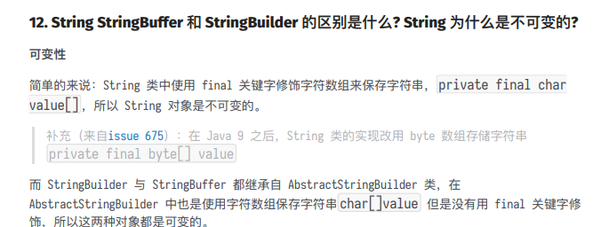


## 装箱与拆箱

https://www.cnblogs.com/dolphin0520/p/3780005.html


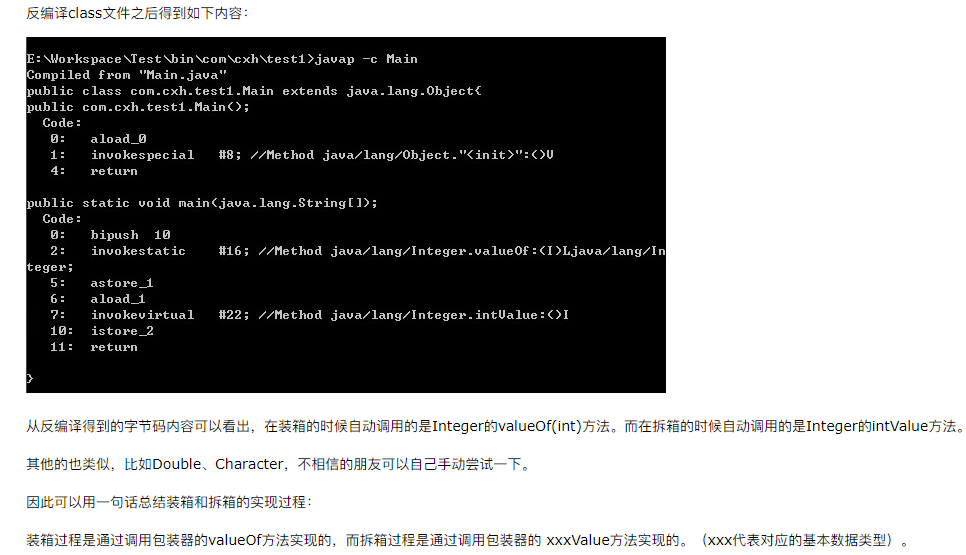


### 面试题


​		从这2段代码可以看出，在通过valueOf方法创建Integer对象的时候，如果数值在**[-128,127]**之间，便返回指向IntegerCache.cache中已经存在的对象的引用；否则创建一个新的Integer对象。

​		上面的代码中i1和i2的数值为100，因此会直接从cache中取已经存在的对象，所以i1和i2指向的是同一个对象，而i3和i4则是分别指向不同的对象。

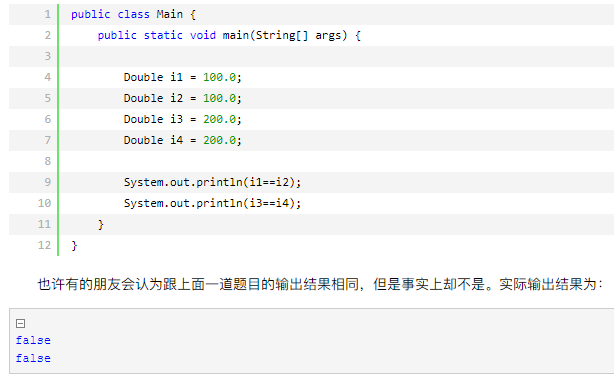


## 在 Java 中定义⼀个不做事且没有参数的构造⽅法的作⽤

​		Java 程序在执⾏⼦类的构造⽅法之前，如果没有⽤ **super()** 来调⽤⽗类特定的构造⽅法，则会调⽤ **⽗类中“没有参数的构造⽅法”**。因此，如果⽗类中只定义了有参数的构造⽅法，⽽在⼦类的构造⽅法中 ⼜没有⽤ super() 来调⽤⽗类中特定的构造⽅法，则编译时将发⽣错误，因为 Java 程序在⽗类中找 不到没有参数的构造⽅法可供执⾏。解决办法是在⽗类⾥加上⼀个不做事且没有参数的构造⽅法。


## 接⼝和抽象类

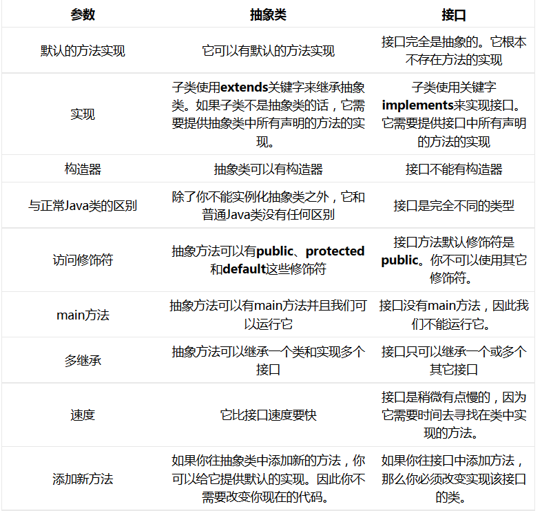


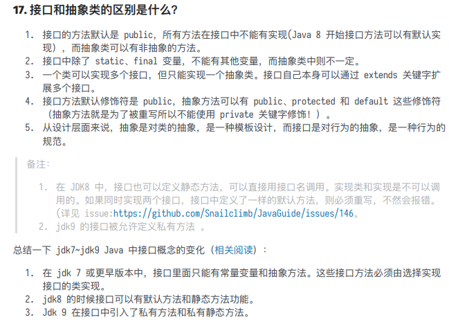


## 成员变量与局部变量的区别有哪些？


## 静态⽅法和实例⽅法有何不同

- 在外部调用静态方法时，可以使用**"类名.方法名"**的方式，也可以使用**"对象名.方法名"**的方式。而实例方法只有后面这种方式。也就是说，调用静态方法可以无需创建对象。
- 静态方法在访问本类的成员时，只允许访问静态成员（即静态成员变量和静态方法），而不允许访问实例成员变量和实例方法；实例方法则无此限制。


## ==与equals()

.png)


## 为什么 Java 中只有值传递？

参考

> https://blog.csdn.net/bjweimengshu/article/details/79799485


## Java中异常处理

参考

> https://blog.csdn.net/sugar_no1/article/details/88593255


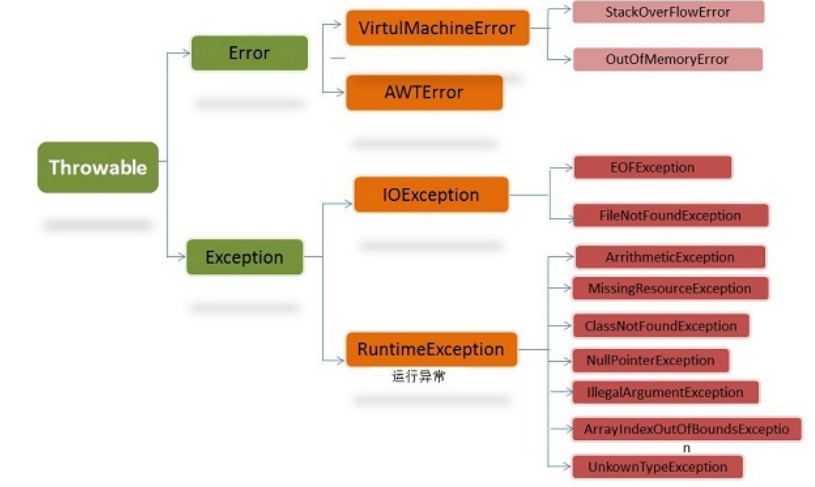


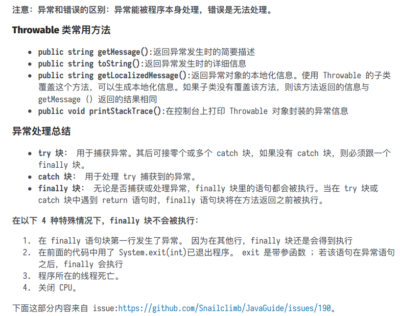

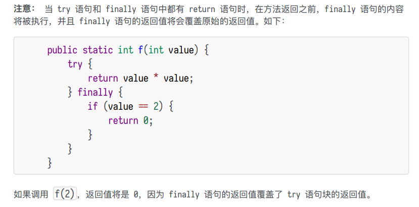


## 获取⽤键盘输⼊常⽤的两种⽅法

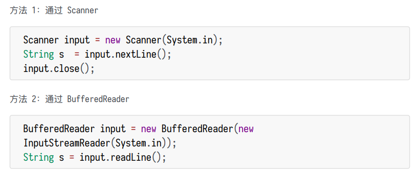


### 输入一个字符

```java
Scanner input = new Scanner(System.in);
char c = input.next().charAt(0);
```


### next()和nextLine()

- **next()：**不可以读取空格。它不能读两个由空格或符号隔开的单词。此外，next()在读取输入后将光标放在同一行中。(next()只读空格之前的数据,并且光标指向本行)
- **nextLine()：**可以读取空格，包括单词之间的空格和除回车以外的所有符号(即。它读到行尾)。读取输入后，nextLine()将光标定位在下一行。


## 泛型使用

参考

> https://www.cnblogs.com/jpfss/p/9928747.html


## 浅拷贝 | 深拷贝

- 浅拷贝（shallowCopy）只是增加了一个指针指向已存在的内存地址
- 深拷贝（deepCopy）是增加了一个指针并且申请了一个新的内存，使这个增加的指针指向这个新的内存


## synchronized 关键字


### 三种使用方式

- 修饰实例方法，作用于当前对象实例加锁，进入同步代码前要获得当前对象实例的锁
- 修饰静态方法，作用于当前类对象加锁，进入同步代码前要获得当前类对象的锁 。也就是给当前类加锁，会作
  用于类的所有对象实例，因为静态成员不属于任何一个实例对象，是类成员（ static 表明这是该类的一个静态
  资源，不管new了多少个对象，只有一份，所以对该类的所有对象都加了锁）。所以如果一个线程A调用一个实
  例对象的非静态 synchronized 方法，而线程B需要调用这个实例对象所属类的静态 synchronized 方法，是允
  许的，不会发生互斥现象，因为访问静态 synchronized 方法占用的锁是当前类的锁，而访问非静态
  synchronized 方法占用的锁是当前实例对象锁。
- 修饰代码块，指定加锁对象，对给定对象加锁，进入同步代码库前要获得给定对象的锁。 和 synchronized 方
  法一样，synchronized(this)代码块也是锁定当前对象的。synchronized 关键字加到 static 静态方法和
  synchronized(class)代码块上都是是给 Class 类上锁。这里再提一下：synchronized关键字加到非 static 静态
  方法上是给对象实例上锁。

### Synchronized在JDK 1.8做了哪些优化


## String


### 创建的两种方式

- 第一种是通过**“字面量”**赋值

  ```java
  String str="hello"
  ```

- 第二种是通过**new关键字创建新对象**，在内存中用构造器创建新对象形式

  ```java
  String str=new String("hello")
  ```

  

**案例：**

```java
String a = "abcd";
String b = "abcd";
System.out.println(a == b); // True
System.out.println(a.equals(b)); // True
```

a==b为真，是因为a和b都指向了方法区里面的同一个字符串，引用值相等；

当相同的字符串被创建多次，内存中只保存一份字符串常量值，这就是字符串的"驻留"


**案例二：**

```java
String c = new String("abcd");
String d = new String("abcd");
System.out.println(c == d); // False
System.out.println(c.equals(d)); // True
```

c==d 为假，是因为c和d引用了对内存中的两个不同的对象，不同的对象，引用值肯定不同

# Java集合


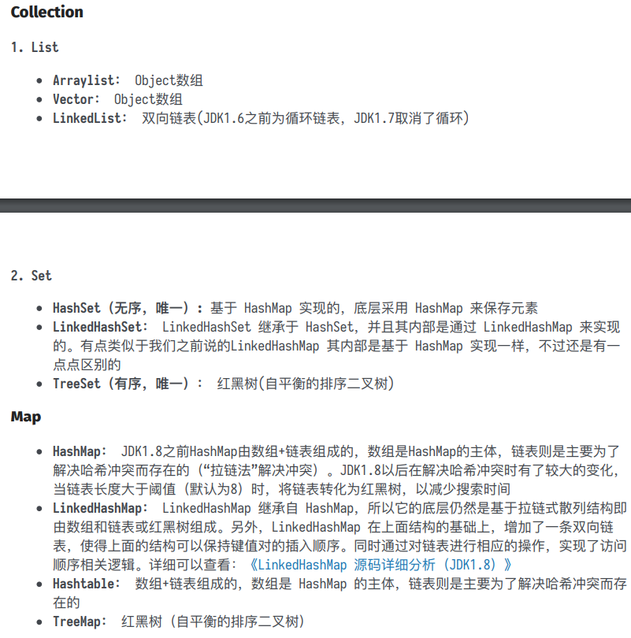


## 常用集合方法

参考

> https://wiki.lifeisgg.online/archives/Java%E6%96%B9%E6%B3%95%E6%B1%87%E6%80%BB/#toc_2


## ArrayList

参考

> ArrayList方法原理：https://www.cnblogs.com/lierabbit/p/8383683.html


### 构造方法

- 无参构造方法
- 有参构造方法
- 指定集合

```java
public ArrayList()//无参构造方法
public ArrayList(int initialCapacity)；//有参构造方法
public ArrayList(Collection<? extends E> c)//指定集合
```


**无参构造方法**

```java
/**
     * Shared empty array instance used for default sized empty instances. We
     * distinguish this from EMPTY_ELEMENTDATA to know how much to inflate when
     * first element is added.
     */
    private static final Object[] DEFAULTCAPACITY_EMPTY_ELEMENTDATA = {};
    /**
     * Constructs an empty list with an initial capacity of ten.
     */
    public ArrayList() {
        this.elementData = DEFAULTCAPACITY_EMPTY_ELEMENTDATA;
    }
```


**有参指定大小构造方法**

- 当指定的初始容量大于0，初始化指定大小的数组
- 当指定的初始容量等于0，初始化空数组
- 当指定的初始容量小于0，抛出IllegalArgumentException异常

```java
/**
     * Shared empty array instance used for empty instances.
     */
    private static final Object[] EMPTY_ELEMENTDATA = {};
    /**
     * Constructs an empty list with the specified initial capacity.
     *
     * @param  initialCapacity  the initial capacity of the list
     * @throws IllegalArgumentException if the specified initial capacity
     *         is negative
     */


    public ArrayList(int initialCapacity) {
        if (initialCapacity > 0) {
            this.elementData = new Object[initialCapacity];
        } else if (initialCapacity == 0) {
            this.elementData = EMPTY_ELEMENTDATA;
        } else {
            throw new IllegalArgumentException("Illegal Capacity: "+
                                               initialCapacity);
        }
    }
```


**指定集合**

当指定集合不为空即长度不为0，则复制该集合，否则初始化一个空数组

```java
/**
     * Constructs a list containing the elements of the specified
     * collection, in the order they are returned by the collection's
     * iterator.
     *
     * @param c the collection whose elements are to be placed into this list
     * @throws NullPointerException if the specified collection is null
     */
    public ArrayList(Collection<? extends E> c) {
        elementData = c.toArray();
        if ((size = elementData.length) != 0) {
            // c.toArray might (incorrectly) not return Object[] (see 6260652)
            if (elementData.getClass() != Object[].class)
                elementData = Arrays.copyOf(elementData, size, Object[].class);
        } else {
            // replace with empty array.
            this.elementData = EMPTY_ELEMENTDATA;
        }
    }
```


### E get(int index) ：获取index位置的元素

首先判断index是否越界，这里并没有判断是否小于0，因为下标小于0时数组会抛出异常。越界则抛出IndexOutOfBoundsException异常，反之返回数组对应index位置的元素

```java
// Positional Access Operations
    // 返回index下标的元素且强制转化为E（List<E>中的E）类型
    @SuppressWarnings("unchecked")
    E elementData(int index) {
        return (E) elementData[index];
    }

    /**
     * Returns the element at the specified position in this list.
     *
     * @param  index index of the element to return
     * @return the element at the specified position in this list
     * @throws IndexOutOfBoundsException {@inheritDoc}
     */
    public E get(int index) {
        // 检查index是否越界
        rangeCheck(index);
        // 返回index下标的元素
        return elementData(index);
    }

    /**
     * Checks if the given index is in range.  If not, throws an appropriate
     * runtime exception.  This method does *not* check if the index is
     * negative: It is always used immediately prior to an array access,
     * which throws an ArrayIndexOutOfBoundsException if index is negative.
     */
    private void rangeCheck(int index) {
        // 检查index是否大于等于size（数组的元素数量），因为数组下标从0开始计算，所以也不能等于元素数量
        // 这里没有检查index < 0的情况，因为index < 0时数组会自动抛出异常，所以并未检查index<0的情况
        if (index >= size)
            throw new IndexOutOfBoundsException(outOfBoundsMsg(index));
    }

    /**
     * Constructs an IndexOutOfBoundsException detail message.
     * Of the many possible refactorings of the error handling code,
     * this "outlining" performs best with both server and client VMs.
     */
    private String outOfBoundsMsg(int index) {
        return "Index: "+index+", Size: "+size;
    }
```


### E set(int index, E element)  ：设置（覆盖）index位置的元素

和get一样先判断index（下标）是否越界，不越界则先获取原来index位置上的元素，接着设置（覆盖）index位置上的元素，然后返回原来的元素，反之抛出IndexOutOfBoundsException异常

```java
/**
     * Replaces the element at the specified position in this list with
     * the specified element.
     *
     * @param index index of the element to replace
     * @param element element to be stored at the specified position
     * @return the element previously at the specified position
     * @throws IndexOutOfBoundsException {@inheritDoc}
     */
    public E set(int index, E element) {
        rangeCheck(index);

        E oldValue = elementData(index);
        elementData[index] = element;
        return oldValue;
    }
```


### boolean add(E e)  ：添加一个元素到列表尾/扩容机制

**参考**

> - https://www.cnblogs.com/dengrongzhang/p/9371551.html
> - https://blog.csdn.net/zymx14/article/details/78324464


添加一个元素到列表尾，当列表容量不足时自动扩容（通常是扩容至原来的1.5倍），添加成功返回true 。如果是新创建的对象且调用的无参构造方法，初始化时是将空数组**DEFAULTCAPACITY_EMPTY_ELEMENTDATA**赋给elementData，在第一次调用add方法时才会扩容，一般是默认值**DEFAULT_CAPACITY = 10**


**流程**

1. 调用**calculateCapacity(elementData, minCapacity)**方法计算返回需要扩容的最小值
2. 调用**ensureExplicitCapacity(calculateCapacity(elementData, minCapacity))**方法判断扩容的最小值是否大于数组的长度，大于则继续调用**grow(minCapacity)**方法，否则直接 **elementData[size++] = e;**
3. 调用**grow(minCapacity);**方法，先**newCapacity = oldCapacity + (oldCapacity >> 1);**计算扩容1.5倍后再与**minCapacity**对比，如果还是比**minCapacity**小就直接**newCapacity = minCapacity;** ，之后再将**newCapacity**与**MAX_ARRAY_SIZE**对比，如果比**MAX_ARRAY_SIZE**大那就调用**hugeCapacity(minCapacity);**重新计算大小，最后**elementData = Arrays.copyOf(elementData, newCapacity);**完成扩容，最后再将加的对象赋值给**elementData[size] , size++**

```java
/**
     * Appends the specified element to the end of this list.
     *
     * @param e element to be appended to this list
     * @return <tt>true</tt> (as specified by {@link Collection#add})
     */
    public boolean add(E e) {
        // 检查当前容量是否还可以容纳一个元素，不够则扩容
        ensureCapacityInternal(size + 1);  // Increments modCount!!
        // 添加到数组末尾
        // 这个语句可以分解为
        // elementData[size] = e;
        // size += 1;
        elementData[size++] = e;
        return true;
    }

    /**
     * Default initial capacity.
     */
    private static final int DEFAULT_CAPACITY = 10;  // 默认容量为10

   

    private void ensureCapacityInternal(int minCapacity) {
        ensureExplicitCapacity(calculateCapacity(elementData, minCapacity));
    }

    private void ensureExplicitCapacity(int minCapacity) {
        modCount++;  // 操作数+1

        // overflow-conscious code
        // 如果所需容量最小值大于实际数组的长度就扩大实际数组容量
        if (minCapacity - elementData.length > 0)
            grow(minCapacity);
    }

 // 如果数据等于默认数据，返回默认容量和minCapacity（所需容量最小值）的最大值，反之返回所需容量最小值
    private static int calculateCapacity(Object[] elementData, int minCapacity) {
        if (elementData == DEFAULTCAPACITY_EMPTY_ELEMENTDATA) {
            return Math.max(DEFAULT_CAPACITY, minCapacity);
        }
        return minCapacity;
    }

    /**
     * The maximum size of array to allocate.
     * Some VMs reserve some header words in an array.
     * Attempts to allocate larger arrays may result in
     * OutOfMemoryError: Requested array size exceeds VM limit
     */
    private static final int MAX_ARRAY_SIZE = Integer.MAX_VALUE - 8;  // 数组最大容量为Integer最大值-8

    /**
     * Increases the capacity to ensure that it can hold at least the
     * number of elements specified by the minimum capacity argument.
     *
     * @param minCapacity the desired minimum capacity
     */
    private void grow(int minCapacity) {
        // overflow-conscious code
        int oldCapacity = elementData.length;
        // 新的容量为旧的容量的1.5倍
        int newCapacity = oldCapacity + (oldCapacity >> 1);
        // 如果扩充容量后还是不够，则新的容量等于所需容量最小值（一般就是数组实际元素个数）
        if (newCapacity - minCapacity < 0)
            newCapacity = minCapacity;
        // 如果新的容量大于数组最大容量，再调用hugeCapacity计算新的容量
        if (newCapacity - MAX_ARRAY_SIZE > 0)
            newCapacity = hugeCapacity(minCapacity);
        // minCapacity is usually close to size, so this is a win:
        // 复制原来的数据到新的数组，数组容量为新的容量
        elementData = Arrays.copyOf(elementData, newCapacity);
    }

    private static int hugeCapacity(int minCapacity) {
        if (minCapacity < 0) // overflow
            throw new OutOfMemoryError();
        // 大于数组最大容量返回Integer最大值，反之返回数组最大容量
        return (minCapacity > MAX_ARRAY_SIZE) ?
                Integer.MAX_VALUE :
                MAX_ARRAY_SIZE;
    }
```


### void add(int index, E element) ：在index处放置元素

将elementData数组从index开始后面的元素往后移一位，接着在index处放置元素

**模拟添加数据(lierabbit)到index=4过程如下：**


```java
/**
     * Inserts the specified element at the specified position in this
     * list. Shifts the element currently at that position (if any) and
     * any subsequent elements to the right (adds one to their indices).
     *
     * @param index index at which the specified element is to be inserted
     * @param element element to be inserted
     * @throws IndexOutOfBoundsException {@inheritDoc}
     */
    public void add(int index, E element) {
        // 检查下标是否越界
        rangeCheckForAdd(index);
        // 检查当前容量是否还可以在容纳一个元素，不够则扩容
        ensureCapacityInternal(size + 1);  // Increments modCount!!
        // 将elementData从index开始后面的元素往后移一位
        System.arraycopy(elementData, index, elementData, index + 1,
                size - index);
        elementData[index] = element;
        size++;
    }

    /**
     * A version of rangeCheck used by add and addAll.
     */
    private void rangeCheckForAdd(int index) {
        // 当index等于size时相当于添加元素到列表尾
        if (index > size || index < 0)
            throw new IndexOutOfBoundsException(outOfBoundsMsg(index));
    }
```


### boolean addAll(Collection<? extends E> c) : 添加一个集合里的所有元素到列表尾

将要添加的集合变为数组，然后将其复制到elementData数组末尾 

```java
/**
     * Appends all of the elements in the specified collection to the end of
     * this list, in the order that they are returned by the
     * specified collection's Iterator.  The behavior of this operation is
     * undefined if the specified collection is modified while the operation
     * is in progress.  (This implies that the behavior of this call is
     * undefined if the specified collection is this list, and this
     * list is nonempty.)
     *
     * @param c collection containing elements to be added to this list
     * @return <tt>true</tt> if this list changed as a result of the call
     * @throws NullPointerException if the specified collection is null
     */
    public boolean addAll(Collection<? extends E> c) {
        Object[] a = c.toArray();
        int numNew = a.length;
        // 检查当前容量是否还可以在容纳a数组的元素，不够则扩容
        ensureCapacityInternal(size + numNew);  // Increments modCount
        // 将a数组里的元素添加到elementData末尾
        System.arraycopy(a, 0, elementData, size, numNew);
        size += numNew;
        // a数组不为空（长度不为0）时返回true，反之false
        return numNew != 0;
    }
```


### int indexOf(Object o)  ：查找o元素在列表第一次出现的位置

ArrayList中可以存放null元素，indexof是返回elementData数组中值相同的首个元素的下标，indexof中比较方法是equals而equals是比较元素的值，如果使用**null.equals(Object o)**会报错空指针，因此必须对null单独查找。如果未找到该元素则返回-1

```java
/**
     * Returns the index of the first occurrence of the specified element
     * in this list, or -1 if this list does not contain the element.
     * More formally, returns the lowest index <tt>i</tt> such that
     * <tt>(o==null ? get(i)==null : o.equals(get(i)))</tt>,
     * or -1 if there is no such index.
     */
    public int indexOf(Object o) {
        //元素可以为null，如果为null返回null的下标
        if (o == null) {
            for (int i = 0; i < size; i++)
                if (elementData[i]==null)
                    return i;
        } else {
            for (int i = 0; i < size; i++)
                if (o.equals(elementData[i]))
                    return i;
        }
        // 没有找到对应的元素返回-1
        return -1;
    }
```


### E remove(int index)  ：删除index位置上的元素

模拟删除index=4（值为lierabbit）过程如下


```java
/**
     * Removes the element at the specified position in this list.
     * Shifts any subsequent elements to the left (subtracts one from their
     * indices).
     *
     * @param index the index of the element to be removed
     * @return the element that was removed from the list
     * @throws IndexOutOfBoundsException {@inheritDoc}
     */
    public E remove(int index) {
        // 检查下标是否越界
        rangeCheck(index);

        modCount++;  // 操作数+1
        E oldValue = elementData(index);  // 获取index位置上的元素

        int numMoved = size - index - 1;  // 需要往前移动几个位置
        if (numMoved > 0)
            // 从index + 1开始，往后的元素向前移动1个位置
            System.arraycopy(elementData, index+1, elementData, index,
                    numMoved);
        // 将数组末尾元素置空
        elementData[--size] = null; // clear to let GC do its work

        return oldValue;
    }
```


### boolean remove(Object o)  ：删除o元素

通过寻找o元素，可以获得其下标，再根据下标删除o元素

```java
/**
     * Removes the first occurrence of the specified element from this list,
     * if it is present.  If the list does not contain the element, it is
     * unchanged.  More formally, removes the element with the lowest index
     * <tt>i</tt> such that
     * <tt>(o==null ? get(i)==null : o.equals(get(i)))</tt>
     * (if such an element exists).  Returns <tt>true</tt> if this list
     * contained the specified element (or equivalently, if this list
     * changed as a result of the call).
     *
     * @param o element to be removed from this list, if present
     * @return <tt>true</tt> if this list contained the specified element
     */
    public boolean remove(Object o) {
        // 元素可以为null，分开搜索o
        if (o == null) {
            for (int index = 0; index < size; index++)
                if (elementData[index] == null) {
                    fastRemove(index);
                    return true;
                }
        } else {
            for (int index = 0; index < size; index++)
                if (o.equals(elementData[index])) {
                    fastRemove(index);
                    return true;
                }
        }
        // 没有找到返回false
        return false;
    }

    /*
     * Private remove method that skips bounds checking and does not
     * return the value removed.
     */
    // 由于已经找到元素，则元素必定存在，则index必定合理，所以不需要在检查index是否越界
    private void fastRemove(int index) {
        modCount++;
        int numMoved = size - index - 1;
        if (numMoved > 0)
            System.arraycopy(elementData, index+1, elementData, index,
                    numMoved);
        elementData[--size] = null; // clear to let GC do its work
    }
```


### forEach(Consumer<? super E> action) ：遍历列表 

这里可以看到**modCount**的用处，当**modCount**发生改变后，立刻抛出**ConcurrentModificationException**异常。通过之前的分析可以知道当列表内容被修改时**modCount**会增加。也就是说如果在遍历**ArrayList**的过程中有其他线程修改了**ArrayList**，那么将抛出**ConcurrentModificationException**异常

```java
/**
     * The number of times this list has been <i>structurally modified</i>.
     * Structural modifications are those that change the size of the
     * list, or otherwise perturb it in such a fashion that iterations in
     * progress may yield incorrect results.
     *
     * <p>This field is used by the iterator and list iterator implementation
     * returned by the {@code iterator} and {@code listIterator} methods.
     * If the value of this field changes unexpectedly, the iterator (or list
     * iterator) will throw a {@code ConcurrentModificationException} in
     * response to the {@code next}, {@code remove}, {@code previous},
     * {@code set} or {@code add} operations.  This provides
     * <i>fail-fast</i> behavior, rather than non-deterministic behavior in
     * the face of concurrent modification during iteration.
     *
     * <p><b>Use of this field by subclasses is optional.</b> If a subclass
     * wishes to provide fail-fast iterators (and list iterators), then it
     * merely has to increment this field in its {@code add(int, E)} and
     * {@code remove(int)} methods (and any other methods that it overrides
     * that result in structural modifications to the list).  A single call to
     * {@code add(int, E)} or {@code remove(int)} must add no more than
     * one to this field, or the iterators (and list iterators) will throw
     * bogus {@code ConcurrentModificationExceptions}.  If an implementation
     * does not wish to provide fail-fast iterators, this field may be
     * ignored.
     */
    protected transient int modCount = 0;//操作数

    @Override
    public void forEach(Consumer<? super E> action) {
        // 确保不为空
        Objects.requireNonNull(action);
        final int expectedModCount = modCount;
        @SuppressWarnings("unchecked")
        final E[] elementData = (E[]) this.elementData;
        final int size = this.size;
        for (int i=0; modCount == expectedModCount && i < size; i++) {
            action.accept(elementData[i]);
        }
        if (modCount != expectedModCount) {
            throw new ConcurrentModificationException();
        }
    }

    /**
     * Checks that the specified object reference is not {@code null}. This
     * method is designed primarily for doing parameter validation in methods
     * and constructors, as demonstrated below:
     * <blockquote><pre>
     * public Foo(Bar bar) {
     *     this.bar = Objects.requireNonNull(bar);
     * }
     * </pre></blockquote>
     *
     * @param obj the object reference to check for nullity
     * @param <T> the type of the reference
     * @return {@code obj} if not {@code null}
     * @throws NullPointerException if {@code obj} is {@code null}
     */
    public static <T> T requireNonNull(T obj) {
        if (obj == null)
            throw new NullPointerException();
        return obj;
    }
```


## HashSet

**HashSet**实现**Set**接口，由哈希表（实际上是一个**HashMap**实例）支持。它不保证set 的迭代顺序；特别是它不保证该顺序恒久不变。此类允许使用null元素。对于**HashSet**而言，它是基于**HashMap**实现的，HashSet底层使用**HashMap**来保存所有元素，因此**HashSet** 的实现比较简单，相关**HashSet**的操作，基本上都是直接调用底层**HashMap**的相关方法来完成， **HashSet**的源代码如下：


### 构造器

```java
public class HashSet<E>  
    extends AbstractSet<E>  
    implements Set<E>, Cloneable, java.io.Serializable  
{  
    static final long serialVersionUID = -5024744406713321676L;  
  
    // 底层使用HashMap来保存HashSet中所有元素。  
    private transient HashMap<E,Object> map;  
      
    // 定义一个虚拟的Object对象作为HashMap的value，将此对象定义为static final。  
    private static final Object PRESENT = new Object();  
  
    /** 
     * 默认的无参构造器，构造一个空的HashSet。 
     *  
     * 实际底层会初始化一个空的HashMap，并使用默认初始容量为16和加载因子0.75。 
     */  
    public HashSet() {  
    map = new HashMap<E,Object>();  
    }  
  
    /** 
     * 构造一个包含指定collection中的元素的新set。 
     * 
     * 实际底层使用默认的加载因子0.75和足以包含指定 
     * collection中所有元素的初始容量来创建一个HashMap。 
     * @param c 其中的元素将存放在此set中的collection。 
     */  
    public HashSet(Collection<? extends E> c) {  
    map = new HashMap<E,Object>(Math.max((int) (c.size()/.75f) + 1, 16));  
    addAll(c);  
    }  
  
    /** 
     * 以指定的initialCapacity和loadFactor构造一个空的HashSet。 
     * 
     * 实际底层以相应的参数构造一个空的HashMap。 
     * @param initialCapacity 初始容量。 
     * @param loadFactor 加载因子。 
     */  
    public HashSet(int initialCapacity, float loadFactor) {  
    map = new HashMap<E,Object>(initialCapacity, loadFactor);  
    }  
  
    /** 
     * 以指定的initialCapacity构造一个空的HashSet。 
     * 
     * 实际底层以相应的参数及加载因子loadFactor为0.75构造一个空的HashMap。 
     * @param initialCapacity 初始容量。 
     */  
    public HashSet(int initialCapacity) {  
    map = new HashMap<E,Object>(initialCapacity);  
    }  
  
    /** 
     * 以指定的initialCapacity和loadFactor构造一个新的空链接哈希集合。 
     * 此构造函数为包访问权限，不对外公开，实际只是是对LinkedHashSet的支持。 
     * 
     * 实际底层会以指定的参数构造一个空LinkedHashMap实例来实现。 
     * @param initialCapacity 初始容量。 
     * @param loadFactor 加载因子。 
     * @param dummy 标记。 
     */  
    HashSet(int initialCapacity, float loadFactor, boolean dummy) {  
    map = new LinkedHashMap<E,Object>(initialCapacity, loadFactor);  
    }  
  

  
    /** 
     * 返回此HashSet实例的浅表副本：并没有复制这些元素本身。 
     * 
     * 底层实际调用HashMap的clone()方法，获取HashMap的浅表副本，并设置到HashSet中。 
     */  
    public Object clone() {  
        try {  
            HashSet<E> newSet = (HashSet<E>) super.clone();  
            newSet.map = (HashMap<E, Object>) map.clone();  
            return newSet;  
        } catch (CloneNotSupportedException e) {  
            throw new InternalError();  
        }  
    }  
}  
```


### 调用add方法

```java
    /** 
     * 如果此set中尚未包含指定元素，则添加指定元素。 
     * 更确切地讲，如果此 set 没有包含满足(e==null ? e2==null : e.equals(e2)) 
     * 的元素e2，则向此set 添加指定的元素e。 
     * 如果此set已包含该元素，则该调用不更改set并返回false。 
     * 
     * 底层实际将将该元素作为key放入HashMap。 
     * 由于HashMap的put()方法添加key-value对时，当新放入HashMap的Entry中key 
     * 与集合中原有Entry的key相同（hashCode()返回值相等，通过equals比较也返回true）， 
     * 新添加的Entry的value会将覆盖原来Entry的value，但key不会有任何改变， 
     * 因此如果向HashSet中添加一个已经存在的元素时，新添加的集合元素将不会被放入HashMap中， 
     * 原来的元素也不会有任何改变，这也就满足了Set中元素不重复的特性。 
     * @param e 将添加到此set中的元素。 
     * @return 如果此set尚未包含指定元素，则返回true。 
     */  
    public boolean add(E e) {  
    return map.put(e, PRESENT)==null;  
    }  
```


### 调用remove方法

```java
 /** 
     * 如果指定元素存在于此set中，则将其移除。 
     * 更确切地讲，如果此set包含一个满足(o==null ? e==null : o.equals(e))的元素e， 
     * 则将其移除。如果此set已包含该元素，则返回true 
     * （或者：如果此set因调用而发生更改，则返回true）。（一旦调用返回，则此set不再包含该元素）。 
     * 
     * 底层实际调用HashMap的remove方法删除指定Entry。 
     * @param o 如果存在于此set中则需要将其移除的对象。 
     * @return 如果set包含指定元素，则返回true。 
     */  
    public boolean remove(Object o) {  
    return map.remove(o)==PRESENT;
    }  
```


### 调用clear方法

```java
    /** 
     * 从此set中移除所有元素。此调用返回后，该set将为空。 
     * 
     * 底层实际调用HashMap的clear方法清空Entry中所有元素。 
     */  
    public void clear() {  
    map.clear();  
    }  
```


### 迭代器遍历

底层实际调用底层**HashMap**的**keySet**来返回所有的key。

```java
/** 
     * 返回对此set中元素进行迭代的迭代器。返回元素的顺序并不是特定的。 
     *  
     * 底层实际调用底层HashMap的keySet来返回所有的key。 
     * 可见HashSet中的元素，只是存放在了底层HashMap的key上， 
     * value使用一个static final的Object对象标识。 
     * @return 对此set中元素进行迭代的Iterator。 
     */  
    public Iterator<E> iterator() {  
    return map.keySet().iterator();  
    }  
  
```


### size大小

底层实际调用**HashMap**的**size()**方法返回Entry的数量，就得到该Set中元素的个数

```java
/** 
     * 返回此set中的元素的数量（set的容量）。 
     * 
     * 底层实际调用HashMap的size()方法返回Entry的数量，就得到该Set中元素的个数。 
     * @return 此set中的元素的数量（set的容量）。 
     */  
    public int size() {
    return map.size();  
    }  
```


### 判断空

```java
    /** 
     * 如果此set不包含任何元素，则返回true。 
     * 
     * 底层实际调用HashMap的isEmpty()判断该HashSet是否为空。 
     * @return 如果此set不包含任何元素，则返回true。 
     */  
    public boolean isEmpty() {  
    return map.isEmpty();  
    }  
```


### 判断是否存在某个对象

```java

    /** 
     * 如果此set包含指定元素，则返回true。 
     * 更确切地讲，当且仅当此set包含一个满足(o==null ? e==null : o.equals(e)) 
     * 的e元素时，返回true。 
     * 
     * 底层实际调用HashMap的containsKey判断是否包含指定key。 
     * @param o 在此set中的存在已得到测试的元素。 
     * @return 如果此set包含指定元素，则返回true。 
     */  
    public boolean contains(Object o) {  
    return map.containsKey(o);  
    }  
```


## HashMap


### 参考

> - https://www.cnblogs.com/chentang/p/12670462.html
> - https://www.cnblogs.com/wytiger/p/10731082.html
> - https://www.cnblogs.com/yuanblog/p/4441017.html


### 哈希表&哈希冲突

​		在数组中根据下标查找某个元素，一次定位就可以达到，哈希表利用了这种特性，**哈希表的主干就是数组**。比如我们要新增或查找某个元素，我们通过把当前元素的关键字 通过某个函数映射到数组中的某个位置，通过数组下标一次定位就可完成操作。

> **存储位置 = f(关键字)**

其中，这个函数f一般称为**哈希函数**，这个函数的设计好坏会直接影响到哈希表的优劣。举个例子，比如我们要在哈希表中执行插入操作：

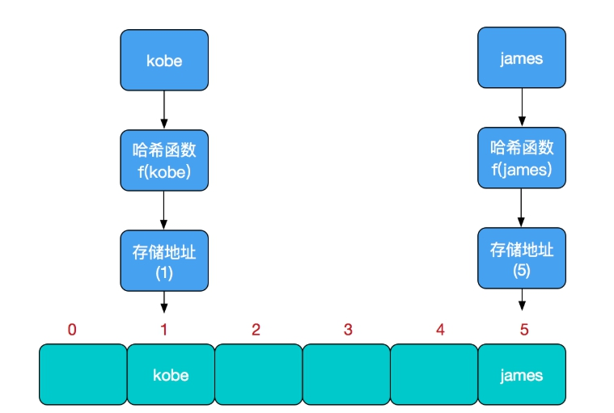

查找操作同理，先通过哈希函数计算出实际存储地址，然后从数组中对应地址取出即可。

​		然而万事无完美，如果两个不同的元素，通过哈希函数得出的实际存储地址相同怎么办？也就是说，当我们对某个元素进行哈希运算，得到一个存储地址，然后要进行插入的时候，发现已经被其他元素占用了，其实这就是所谓的**哈希冲突**，也叫哈希碰撞。前面我们提到过，哈希函数的设计至关重要，好的哈希函数会尽可能地保证 **计算简单**和**散列地址分布均匀,**但是，我们需要清楚的是，数组是一块连续的固定长度的内存空间，再好的哈希函数也不能保证得到的存储地址绝对不发生冲突。那么哈希冲突如何解决呢？

- **链地址法：**将哈希表的每个单元作为链表的头结点，所有哈希地址为 i 的元素构成一个同义词链表。即发生冲突时就把该关键字链在以该单元为头结点的链表的尾部。


### HashMap源码关键字

- **initialCapacity：**初始容量。指的是 HashMap 集合初始化的时候自身的容量。可以在构造方法中指定；如果不指定的话，总容量默认值是 **16** 。需要注意的是初始容量必须是 2 的幂次方。
- **size：**当前 HashMap 中已经存储着的键值对数量，即 HashMap.size()
- **loadFactor：**加载因子。所谓的加载因子就是 HashMap (当前的容量/总容量) 到达一定值的时候，HashMap 会实施扩容。加载因子也可以通过构造方法中指定，默认的值是 0.75 。举个例子，假设有一个 HashMap 的初始容量为 16 ，那么扩容的阀值就是 0.75 * 16 = 12 。也就是说，在你打算存入第 13 个值的时候，HashMap 会先执行扩容。
- **threshold：**扩容阀值。即 扩容阀值 = HashMap 总容量 * 加载因子。当前 HashMap 的容量大于或等于扩容阀值的时候就会去执行扩容。扩容的容量为当前 HashMap 总容量的两倍。比如，当前 HashMap 的总容量为 16 ，那么扩容之后为 32 。
- **table：**Entry 数组。我们都知道 HashMap 内部存储 key/value 是通过 Entry 这个介质来实现的。而 table 就是 Entry 数组。


### HashMap数据结构

​	**HashMap**的主干是一个变量名为**table**的**Entry数组**。**Entry**是**HashMap**的基本组成单元，每一个**Entry**包含一个**key-value**键值对。

```java
//HashMap的主干数组，可以看到就是一个Entry数组，初始值为空数组{}，主干数组的长度一定是2的次幂
transient Entry<K,V>[] table = (Entry<K,V>[]) EMPTY_TABLE;
```


### put() | get()原理/底层


### HashMap扩容机制


### 为什么HashMap线程不安全


### ConcurrentHashMap1.8如何实现线程安全


# Java多线程


##  简述线程、程序、进程的基本概念。以及他们之间关系是什么?


## Java多线程的四种实现方式


## Java线程池


### 线程池执行流程


# JVM

​		JVM屏蔽了与具体操作系统平台相关的信息，使Java程序只需生成在Java虚拟机上运行的目标代码（字节码）,就可以在多种平台上不加修改地运行。JVM在执行字节码时，实际上最终还是把字节码解释成具体平台上的机器指令执行。


## JVM组成


### 线程共享

- **方法区：**用于存储虚拟机加载的类信息，常量，静态变量等数据
- **堆：**存放对象实例，所有的对象和数组都要在堆上分配。是JVM所管理的

### 线程私有

- **栈：**Java方法执行的内存模型，存储局部变量表，操作数栈，动态链接，方法出口信息。随线程创建和销毁
- **本地方法栈：**与虚拟机栈相似，不同点本地方法栈为native方法执行服务，虚拟机栈为虚拟机栈执行的Java方法服务
- **程序计数器：**当前线程所执行的行号指示器。是JVM内存区域最小的一块区域。执行字节码工作时就是利用程序计数器来选取下一条需要执行的字节码指令