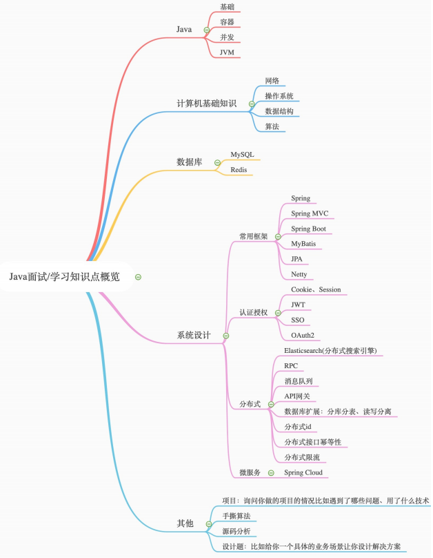
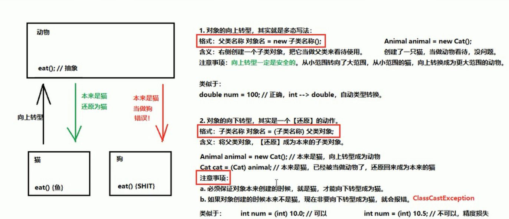
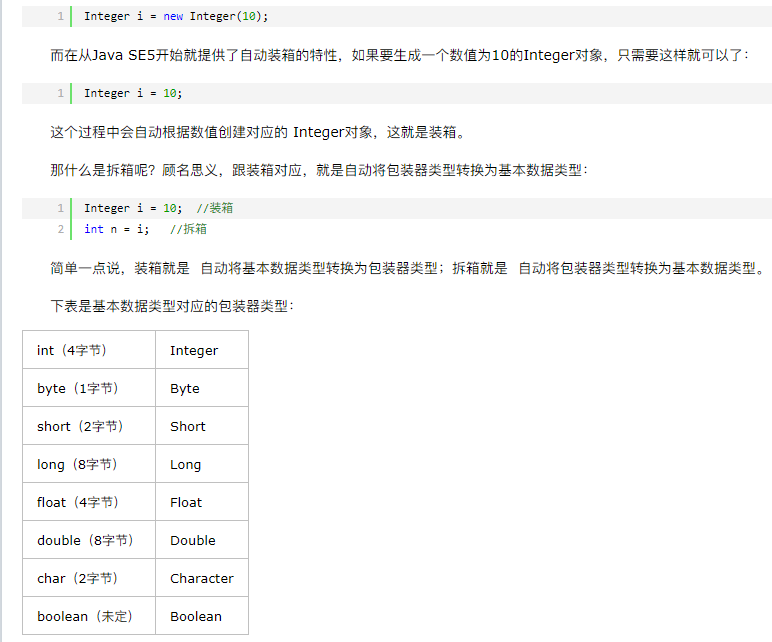
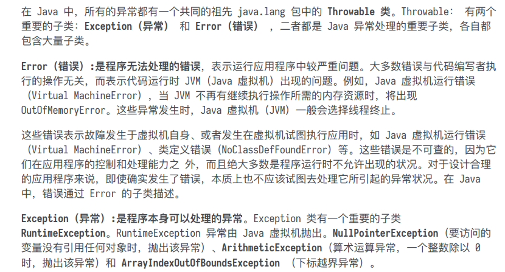
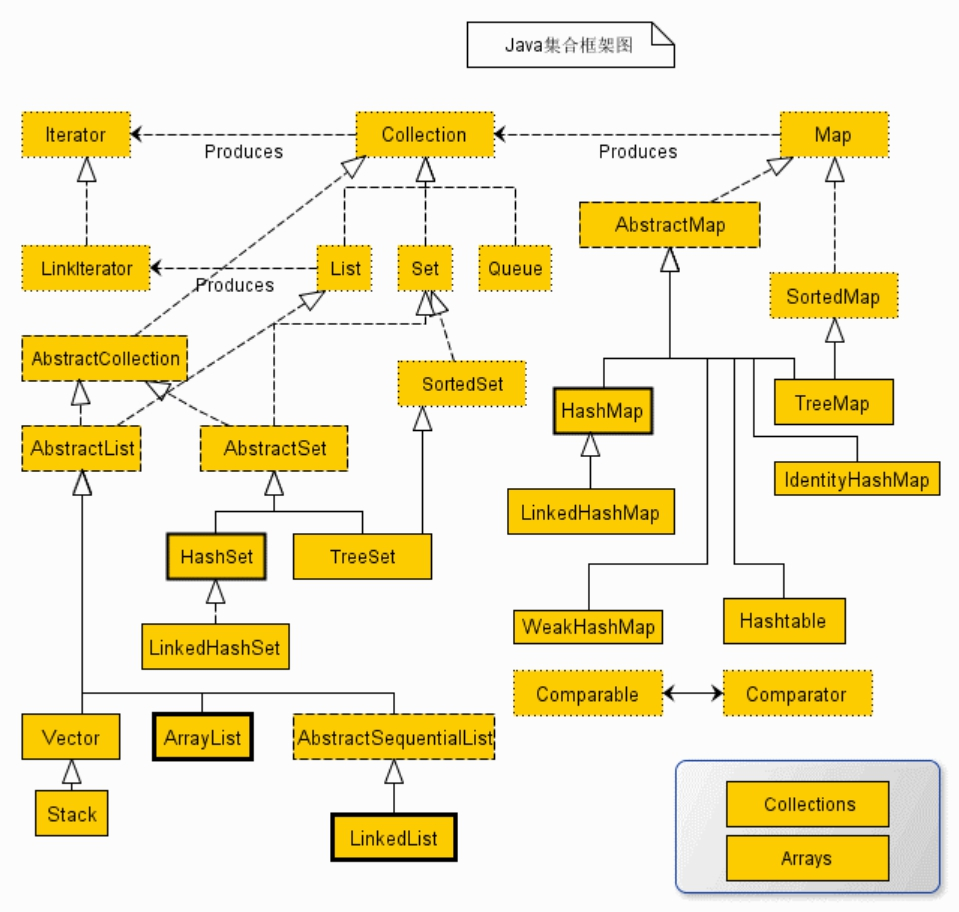
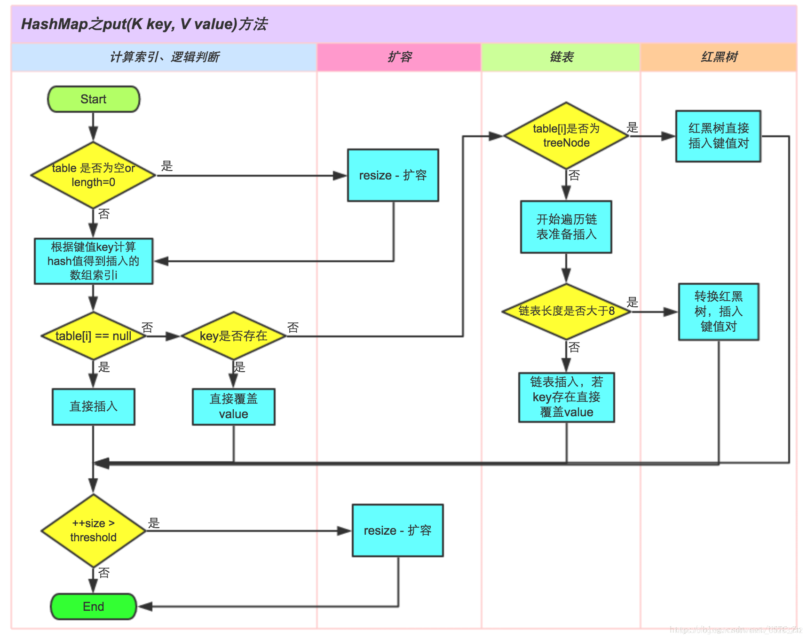

# 学习路线




# Java基础


## JDK和JRE区别

- **<u>JDK（Java Development Kit）</u>**是针对Java开发员的产品，是整个Java的核心，包括了Java运行环境JRE、Java工具和Java基础类库。
- **<u>Java Runtime Environment（JRE）</u>**是运行JAVA程序所必须的环境的集合，包含JVM标准实现及Java核心类库。
- **<u>Java Virtual Machine（Java虚拟机JVM）</u>**的缩写，是整个java实现跨平台的最核心的部分，能够运行以Java语言写作的软件程序。


### JDK（Java Development Kit）

- JDK中包含JRE，在JDK的安装目录下有一个名为jre的目录，里面有两个文件夹bin和lib，在这里可以认为bin里的就是jvm，lib中则是jvm工作所需要的类库，而jvm和 lib和起来就称为jre。
- JDK是整个JAVA的核心，包括了Java运行环境JRE（Java Runtime Envirnment）、一堆Java工具（javac/java/jdb等）和Java基础的类库（即Java API 包括rt.jar）。

**类型**

- SE(J2SE)，standard edition，标准版，是我们通常用的一个版本，从JDK 5.0开始，改名为Java SE。
- EE(J2EE)，enterprise edition，企业版，使用这种JDK开发J2EE应用程序，从JDK 5.0开始，改名为Java EE。
- ME(J2ME)，micro edition，主要用于移动设备、嵌入式设备上的java应用程序，从JDK 5.0开始，改名为Java ME。


### JRE（Java Runtime Environment）

​		是运行基于Java语言编写的程序所不可缺少的运行环境。RE中包含了Java virtual machine（JVM），runtime class libraries和Java application launcher，这些是运行Java程序的必要组件。**但是在运行编译好的程序中包含Servlet时，需要JDK**


### JVM（Java Virtual Machine）

​		就是我们常说的java虚拟机，它是整个java实现跨平台的最核心的部分，所有的java程序会首先被编译为.class的类文件，这种类文件可以在虚拟机上执行。

也就是说class并不直接与机器的操作系统相对应，而是经过虚拟机间接与操作系统交互，由虚拟机将程序解释给本地系统执行。

只有JVM还不能成class的执行，因为在解释class的时候JVM需要调用解释所需要的类库lib，而jre包含lib类库。

JVM屏蔽了与具体操作系统平台相关的信息，使Java程序只需生成在Java虚拟机上运行的目标代码（字节码）,就可以在多种平台上不加修改地运行。JVM在执行字节码时，实际上最终还是把字节码解释成具体平台上的机器指令执行。


## 重载和重写


### 重载(Overload)

1. **重载Overload是一个类中多态性的一种表现或者一个类中多个构造器的实现**
2. 重载要求同名方法的参数列表不同(参数类型，参数个数甚至是参数顺序)
3. 重载的时候，返回值类型可以相同也可以不相同。无法以返回型别作为重载函数的区分标准

```java
public class Father {

    public static void main(String[] args) {
        // TODO Auto-generated method stub
        Father s = new Father();
        s.sayHello();
        s.sayHello("wintershii");

    }

    public void sayHello() {
        System.out.println("Hello");
    }

    public void sayHello(String name) {
        System.out.println("Hello" + " " + name);
    }
}
```


### 重写(Override)

1. **发生在父类与子类之间**
2. **方法名，参数列表，返回类型（除过子类中方法的返回类型是父类中返回类型的子类）必须相同**
3. 访问修饰符的限制一定要**大于**被重写方法的访问修饰符（public>protected>default>private)
4. 重写方法一定不能抛出新的检查异常或者比被重写方法申明更加宽泛的检查型异常

```java
public class Father {

    public static void main(String[] args) {
        // TODO Auto-generated method stub
        Son s = new Son();
        s.sayHello();
    }

    public void sayHello() {
        System.out.println("Hello");
    }
}

class Son extends Father{

    @Override
    public void sayHello() {
        // TODO Auto-generated method stub
        System.out.println("hello by ");
    }

}
```


### 重载（Overload）和重写（Override）的区别

​		方法的重载和重写都是实现多态的方式，区别在于前者实现的是编译时的多态性，而后者实现的是运行时的多态性。重载发生在一个类中，同名的方法如果有不同的参数列表（参数类型不同、参数个数不同或者二者都不同）则视为重载；重写发生在子类与父类之间，重写要求子类被重写方法与父类被重写方法有相同的参数列表，有兼容的返回类型，比父类被重写方法更好访问，不能比父类被重写方法声明更多的异常（里氏代换原则）。重载对返回类型没有特殊的要求，不能根据返回类型进行区分。


## 构造器Constructor是否可被Override(重写)

​		构造器Constructor不能被继承，因此不能被**重写(Override)**，但是可以被**重载（Overload）**。如果父类自定义了有参构造函数，则子类无论定义构造函数与否，定义有参构造函数与否，都会报错，正确的做法是在子类的构造方法中添上super（参数），以表明子类构造之前先构造父类，而这句话必须放在第一句，否则报"Constructor call must be the first statement in a constructor"的错误。


### 类的加载顺序：

1. 父类的静态代码块/初始化静态变量（两者优先级相同）
2. 执行子类的静态代码/初始化静态变量（两者优先级相同，谁写在前面谁先执行）
3. 初始化父类成员变量/执行代码块{}（两者优先级相同），父类的构造器
4. 子类的成员变量/代码块，最后子类的构造器。


## 三大特性封装继承多态


### 封装

​		封装（Encapsulation）是面向对象方法的重要原则，就是把对象的属性和操作（或服务）结合为一个独立的整体，并尽可能隐藏对象的内部实现细节。实体类那些属性就是被封装

- 将类的某些信息隐藏在类的内部，不允许外部程序进行直接的访问调用。
- 通过该类提供的方法来实现对隐藏信息的操作和访问。
- 隐藏对象的信息。
- 留出访问的对外接口。


### 继承

​		继承就是子类继承父类的特征和行为，使得子类对象（实例）具有父类的实例域和方法，或子类从父类继承方法，使得子类具有父类相同的行为。当然，如果在父类中拥有私有属性(private修饰)，则子类是不能被继承的。

只支持单继承，即一个子类只允许有一个父类，但是可以实现多级继承，及子类拥有唯一的父类，而父类还可以再继承。

-  子类可以拥有父类的属性和方法。
-  子类可以拥有自己的属性和方法。
-  子类可以重写覆盖父类的方法。


**使用**

在父子类关系继承中，如果成员变量重名，则创建子类对象时，访问有两种方式。

- 直接通过子类对象访问成员变量

   等号左边是谁，就优先使用谁，如果没有就向上找。

- 间接通过成员方法访问成员变量

  该方法属于谁，谁就优先使用，如果没有就向上找。

```java
public class FU {
    int numFU = 10;
    int num = 100;
    public void method(){
        System.out.println("父类成员变量："+numFU);
    }
    public void methodFU(){
        System.out.println("父类成员方法!");
    }
}

public class Zi extends FU{
    int numZi = 20;
    int num = 200;
    public void method(){
        System.out.println("子类成员变量："+numFU);
    }
    public void methodZi(){
        System.out.println("子类方法！");
    }
}

public class ExtendDemo {
    public static void main(String[] args) {
        FU fu = new FU();
        // 父类的实体对象只能调用父类的成员变量
        System.out.println("父类：" + fu.numFU);   // 结果：10
        
        Zi zi = new Zi();
        System.out.println("调用父类：" + zi.numFU); // 结果：10
        System.out.println("子类：" + zi.numZi);   // 结果：20

        /** 输出结果为200，证明在重名情况下，如果子类中存在则优先使用，
         *  如果不存在则去父类查找，但如果父类也没有那么编译期就会报错。
         */
        System.out.println(zi.num); // 结果：200
        /**
         * 通过成员方法调用成员变量
         */
        zi.method();    // 结果：10
    }
}
```


### 多态

指允许不同类的对象对同一消息做出响应。即同一消息可以根据发送对象的不同而采用多种不同的行为方式。动态绑定（dynamic binding），是指在执行期间判断所引用对象的实际类型，根据其实际的类型调用其相应的方法。

**实现方式**

- 接口多态性。
- 继承多态性。
- 通过抽象类实现的多态性。


**向上转型**

```java
public class MultiDemo {
       public static void main(String[] args) {
           // 多态的引用，就是向上转型，此时无法使用之类中父类没有的方法
           Animals dog = new Dog();
           dog.eat();//狗在吃骨头！
           
           Animals cat = new Cat();
           cat.eat();//猫在吃鱼！
           
           // 如果要调用父类中没有的方法，则要向下转型
           Dog dogDown = (Dog)dog;
           dogDown.watchDoor();
   
       }
   }
   class Animals {
       public void eat(){
           System.out.println("动物吃饭！");
       }
   }
   class Dog extends Animals{
       public void eat(){
           System.out.println("狗在吃骨头！");
       }
       public void watchDoor(){
           System.out.println("狗看门！");
       }
   }
   class Cat extends Animals{
       public void eat(){
           System.out.println("猫在吃鱼！");
       }
   }
```





## this | super | final | static关键字


### this

- 本类成员方法中，访问**本类**的成员变量。
- 本类成员方法中，访问**本类**的另一个成员方法。
- 本类的构造方法中，访问**本类**的另一个构造方法。


### super

- 子类的成员方法中，访问**父类**的成员变量。
- 子类的成员方法中，访问**父类**的成员方法。
- 子类的构造方法中，访问**父类**的构造方法。


**注意**

- this关键字同super一样，必须在构造方法的第一个语句，且是唯一的。
- this与super不能同时存在。


### final


### static


## String StringBuffer 和 StringBuilder 的区别是什么? String 为什么是不可变的?


### Java String 类：String字符串常量

需要注意的是，String的值是不可变的，这就导致每次对String的操作都会生成**新的String对象**，这样不仅效率低下，而且大量浪费有限的内存空间。我们来看一下这张对String操作时内存变化的图：


我们可以看到，初始String值为“hello”，然后在这个字符串后面加上新的字符串“world”，这个过程是需要重新在栈堆内存中开辟内存空间的，最终得到了“hello world”字符串也相应的需要开辟内存空间，**这样短短的两个字符串，却需要开辟三次内存空间**，不得不说这是对内存空间的**极大浪费**。为了应对经常性的字符串相关的操作，就需要使用Java提供的其他两个操作字符串的类——StringBuffer类和StringBuild类来对此种变化字符串进行处理。


### StringBuffer 和 StringBuilder 类——StringBuffer、StringBuilder字符串变量


当对字符串进行修改的时候，需要使用 **StringBuffer(线程安全)** 和 **StringBuilder(线程不安全)** 类。

和 String 类不同的是，StringBuffer 和 StringBuilder 类的对象能够被多次的修改，并且不产生新的未使用对象。

StringBuilder 类在 Java 5 中被提出，它和 StringBuffer 之间的最大不同在于 **StringBuilder 的方法不是线程安全的（不能同步访问）**。

由于 StringBuilder 相较于 StringBuffer 有速度优势，所以多数情况下建议使用 StringBuilder 类。然而在应用程序要求线程安全的情况下，则必须使用 StringBuffer 类。


### 区别

- **String：**不可变字符串；
- **StringBuffer：**可变字符串、效率低、线程安全；
- **StringBuilder：**可变字符序列、效率高、线程不安全；

初始化上的区别，String可以空赋值，后者不行，报错


## 装箱与拆箱

https://www.cnblogs.com/dolphin0520/p/3780005.html




### 面试题


​		从这2段代码可以看出，在通过valueOf方法创建Integer对象的时候，如果数值在**[-128,127]**之间，便返回指向IntegerCache.cache中已经存在的对象的引用；否则创建一个新的Integer对象。

​		上面的代码中i1和i2的数值为100，因此会直接从cache中取已经存在的对象，所以i1和i2指向的是同一个对象，而i3和i4则是分别指向不同的对象。


## 在 Java 中定义⼀个不做事且没有参数的构造⽅法的作⽤

​		Java 程序在执⾏⼦类的构造⽅法之前，如果没有⽤ **super()** 来调⽤⽗类特定的构造⽅法，则会调⽤ **⽗类中“没有参数的构造⽅法”**。因此，如果⽗类中只定义了有参数的构造⽅法，⽽在⼦类的构造⽅法中 ⼜没有⽤ super() 来调⽤⽗类中特定的构造⽅法，则编译时将发⽣错误，因为 Java 程序在⽗类中找 不到没有参数的构造⽅法可供执⾏。解决办法是在⽗类⾥加上⼀个不做事且没有参数的构造⽅法。


## 接⼝和抽象类


## 成员变量与局部变量的区别有哪些？


## 静态⽅法和实例⽅法有何不同

- 在外部调用静态方法时，可以使用**"类名.方法名"**的方式，也可以使用**"对象名.方法名"**的方式。而实例方法只有后面这种方式。也就是说，调用静态方法可以无需创建对象。
- 静态方法在访问本类的成员时，只允许访问静态成员（即静态成员变量和静态方法），而不允许访问实例成员变量和实例方法；实例方法则无此限制。


## ==与equals()

.png)


## 为什么 Java 中只有值传递？

参考

> https://blog.csdn.net/bjweimengshu/article/details/79799485


## Java中异常处理

参考

> https://blog.csdn.net/sugar_no1/article/details/88593255





## 获取⽤键盘输⼊常⽤的两种⽅法


### 输入一个字符

```java
Scanner input = new Scanner(System.in);
char c = input.next().charAt(0);
```


### next()和nextLine()

- **next()：**不可以读取空格。它不能读两个由空格或符号隔开的单词。此外，next()在读取输入后将光标放在同一行中。(next()只读空格之前的数据,并且光标指向本行)
- **nextLine()：**可以读取空格，包括单词之间的空格和除回车以外的所有符号(即。它读到行尾)。读取输入后，nextLine()将光标定位在下一行。


## 泛型使用

参考

> https://www.cnblogs.com/jpfss/p/9928747.html


## 浅拷贝 | 深拷贝

- 浅拷贝（shallowCopy）只是增加了一个指针指向已存在的内存地址
- 深拷贝（deepCopy）是增加了一个指针并且申请了一个新的内存，使这个增加的指针指向这个新的内存


## synchronized 关键字


### Synchronized在JDK 1.8做了哪些优化


# Java集合




## 常用集合方法

参考

> https://wiki.lifeisgg.online/archives/Java%E6%96%B9%E6%B3%95%E6%B1%87%E6%80%BB/#toc_2


## ArrayList


### ArrayList是如何扩容的/扩容机制?

参考

> https://www.cnblogs.com/dengrongzhang/p/9371551.html


## HashMap


### put() | get()原理/底层




### HashMap扩容机制


### 为什么HashMap线程不安全


### ConcurrentHashMap1.8如何实现线程安全


# Java多线程


## 简述线程、程序、进程的基本概念。以及他们之间关系是什么?


## Java线程池


### 线程池执行流程


# JVM


​		JVM屏蔽了与具体操作系统平台相关的信息，使Java程序只需生成在Java虚拟机上运行的目标代码（字节码）,就可以在多种平台上不加修改地运行。JVM在执行字节码时，实际上最终还是把字节码解释成具体平台上的机器指令执行。


## JVM组成


### 线程共享

- **方法区：**用于存储虚拟机加载的类信息，常量，静态变量等数据
- **堆：**存放对象实例，所有的对象和数组都要在堆上分配。是JVM所管理的


### 线程私有

- **栈：**Java方法执行的内存模型，存储局部变量表，操作数栈，动态链接，方法出口信息。随线程创建和销毁
- **本地方法栈：**与虚拟机栈相似，不同点本地方法栈为native方法执行服务，虚拟机栈为虚拟机栈执行的Java方法服务
- **程序计数器：**当前线程所执行的行号指示器。是JVM内存区域最小的一块区域。执行字节码工作时就是利用程序计数器来选取下一条需要执行的字节码指令


# 