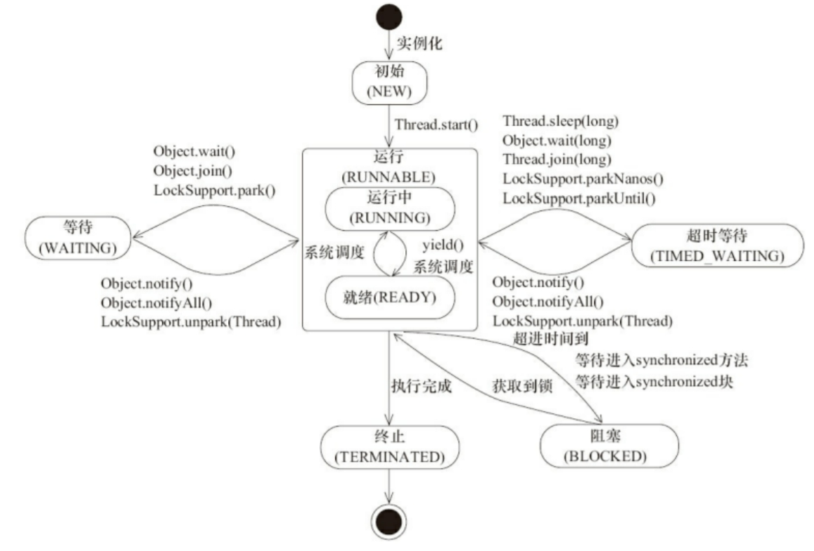

# 操作系统

## 进程和线程以及它们的区别

- 进程是对运行时程序的封装，是系统进行资源调度和分配的的基本单位，实现了操作系统的并发；
- 线程是进程的子任务，是CPU调度和分派的基本单位，用于保证程序的 实时性，实现进程内部的并发；
- 一个程序至少有一个进程，一个进程至少有一个线程，线程依赖于进程而存在；
- 进程在执行过程中拥有独立的内存单元，而多个线程共享进程的内存。

线程是进程划分成的更⼩的运⾏单位,⼀个进程在其执⾏的过程中可以产⽣多个线程。线程和进 程最⼤的不同在于基本上各进程是独⽴的，⽽各线程则不⼀定，因为同⼀进程中的线程极有可能会相互 影响。线程执⾏开销⼩，但不利于资源的管理和保护；⽽进程正相反

## 进程

### 进程的状态

- 创建状态(new) ：进程正在被创建，尚未到就绪状态。 
- 就绪状态(ready) ：进程已处于准备运⾏状态，即进程获得了除了处理器之外的⼀切所需资源， ⼀旦得到处理器资源(处理器分配的时间⽚)即可运⾏。 
- 运⾏状态(running) ：进程正在处理器上上运⾏(单核 CPU 下任意时刻只有⼀个进程处于运⾏状 态)。 
- 阻塞状态(waiting) ：⼜称为等待状态，进程正在等待某⼀事件⽽暂停运⾏如等待某资源为可⽤ 或等待 IO 操作完成。即使处理器空闲，该进程也不能运⾏。 
- 结束状态(terminated) ：进程正在从系统中消失。可能是进程正常结束或其他原因中断退出运 ⾏。

### 进程的七种通信方式

参考

> - https://www.jianshu.com/p/c1015f5ffa74

1. **管道/匿名管道(Pipes) ：**⽤于具有亲缘关系的⽗⼦进程间或者兄弟进程之间的通信。 
2. **有名管道(Names Pipes) :** 匿名管道由于没有名字，只能⽤于亲缘关系的进程间通信。为了克服 这个缺点，提出了有名管道。有名管道严格遵循先进先出(first in first out)。有名管道以磁 盘⽂件的⽅式存在，可以实现本机任意两个进程通信。 
3. **信号(Signal) ：**信号是⼀种⽐较复杂的通信⽅式，⽤于通知接收进程某个事件已经发⽣； 
4. **消息队列(Message Queuing) ：**消息队列是消息的链表,具有特定的格式,存放在内存中并由消息 队列标识符标识。管道和消息队列的通信数据都是先进先出**的**原则。与管道（⽆名管道：只存在 于内存中的⽂件；命名管道：存在于实际的磁盘介质或者⽂件系统）不同的是消息队列存放在内 核中，只有在内核重启(即，操作系统重启)或者显示地删除⼀个消息队列时，该消息队列才会被 真正的删除。消息队列可以实现消息的随机查询,消息不⼀定要以先进先出的次序读取,也可以按 消息的类型读取.⽐ FIFO 更有优势。消息队列克服了信号承载信息量少，管道只能承载⽆格式 字 节流以及缓冲区⼤⼩受限等缺。 
5. **信号量(Semaphores) ：**信号量是⼀个计数器，⽤于多进程对共享数据的访问，信号量的意图在 于进程间同步。这种通信⽅式主要⽤于解决与同步相关的问题并避免竞争条件。
6. **共享内存(Shared memory) ：**使得多个进程可以访问同⼀块内存空间，不同进程可以及时看到对 ⽅进程中对共享内存中数据的更新。这种⽅式需要依靠某种同步操作，如互斥锁和信号量等。可 以说这是最有⽤的进程间通信⽅式。
7. **套接字(Sockets) :** 此⽅法主要⽤于在客户端和服务器之间通过⽹络进⾏通信。套接字是⽀持 TCP/IP 的⽹络通信的基本操作单元，可以看做是不同主机之间的进程进⾏双向通信的端点，简 单的说就是通信的两⽅的⼀种约定，⽤套接字中的相关函数来完成通信过程。

### 进程的调度算法

- **先到先服务(FCFS)调度算法 :** 从就绪队列中选择⼀个最先进⼊该队列的进程为之分配资源，使 它⽴即执⾏并⼀直执⾏到完成或发⽣某事件⽽被阻塞放弃占⽤ CPU 时再重新调度。 
- **短作业优先(SJF)的调度算法 :** 从就绪队列中选出⼀个估计运⾏时间最短的进程为之分配资源， 使它⽴即执⾏并⼀直执⾏到完成或发⽣某事件⽽被阻塞放弃占⽤ CPU 时再重新调度。 
- **时间⽚轮转调度算法 :** 时间⽚轮转调度是⼀种最古⽼，最简单，最公平且使⽤最⼴的算法，⼜ 称 RR(Round robin)调度。每个进程被分配⼀个时间段，称作它的时间⽚，即该进程允许运⾏的 时间。 
- **多级反馈队列调度算法 ：**前⾯介绍的⼏种进程调度的算法都有⼀定的局限性。如短进程优先的 调度算法，仅照顾了短进程⽽忽略了⻓进程 。多级反馈队列调度算法既能使⾼优先级的作业得 到响应⼜能使短作业（进程）迅速完成。，因⽽它是⽬前被公认的⼀种较好的进程调度算法， UNIX 操作系统采取的便是这种调度算法。 
- **优先级调度 ：** 为每个流程分配优先级，⾸先执⾏具有最⾼优先级的进程，依此类推。具有相同 优先级的进程以 FCFS ⽅式执⾏。可以根据内存要求，时间要求或任何其他资源要求来确定优先 级。

## 线程

### 线程的状态/⽣命周期和状态

线程在⽣命周期中并不是固定处于某⼀个状态⽽是随着代码的执⾏在不同状态之间切换。Java 线程状 态变迁如下图所示（图源《Java 并发编程艺术》4.1.4 节）：

由上图可以看出：线程创建之后它将处于 NEW（新建） 状态，调⽤ start() ⽅法后开始运⾏，线程 这时候处于 READY（可运⾏） 状态。可运⾏状态的线程获得了 CPU 时间⽚（timeslice）后就处于 RUNNING（运⾏） 状态。

​		当线程执⾏ **wait()** ⽅法之后，线程进⼊ **WAITING（等待）** 状态。进⼊等待状态的线程需要依靠其他 线程的通知才能够返回到运⾏状态，⽽ TIME_WAITING(超时等待) 状态相当于在等待状态的基础上增加 了超时限制，⽐如通过 sleep（long millis） ⽅法或 wait（long millis） ⽅法可以将 Java 线程置于 TIMED WAITING 状态。当超时时间到达后 Java 线程将会返回到 RUNNABLE 状态。当线程调 ⽤同步⽅法时，在没有获取到锁的情况下，线程将会进⼊到 BLOCKED（阻塞） 状态。线程在执⾏ Runnable 的 run() ⽅法之后将会进⼊到 TERMINATED（终⽌） 状态。

### 线程等待的两种方法

- sleep() 
- wait()

#### 相同不同点

两者最主要的区别在于：sleep ⽅法没有释放锁，⽽ wait ⽅法释放了锁 。 

两者都可以暂停线程的执⾏。 Wait 通常被⽤于线程间交互/通信，sleep 通常被⽤于暂停执⾏。 

wait() ⽅法被调⽤后，线程不会⾃动苏醒，需要别的线程调⽤同⼀个对象上的 notify() 或者 notifyAll() ⽅法。

sleep() ⽅法执⾏完成后，线程会⾃动苏醒。或者可以使⽤ wait(long timeout)超时后线程会⾃动苏醒。

### 线程间的同步的⽅式

​		线程同步是两个或多个共享关键资源的线程的并发执⾏。应该同步线程以避免关键的资源使 ⽤冲突。操作系统⼀般有下⾯三种线程同步的⽅式：

1. **互斥量(Mutex)：**采⽤互斥对象机制，只有拥有互斥对象的线程才有访问公共资源的权限。因为 互斥对象只有⼀个，所以可以保证公共资源不会被多个线程同时访问。⽐如 Java 中的 synchronized 关键词和各种 Lock 都是这种机制。 
2. **信号量(Semphares) ：**它允许同⼀时刻多个线程访问同⼀资源，但是需要控制同⼀时刻访问此资 源的最⼤线程数量 
3. **事件(Event) :Wait/Notify：**通过通知操作的⽅式来保持多线程同步，还可以⽅便的实现多线程 优先级的⽐᫾操

# 计算机网络

## OSI与TCP/IP各层的结构与功能,都有哪些协议?

## Http | Https

参考

> - https://blog.csdn.net/qq_38289815/article/details/80969419

### Http

​		超文本传输协议，是一个基于请求与响应，无状态的，应用层的协议，常基于TCP/IP协议传输数据，互联网上应用最为广泛的一种网络协议,所有的WWW文件都必须遵守这个标准。设计HTTP的初衷是为了提供一种发布和接收HTML页面的方法。

**原理/过程**

- 客户端的浏览器首先要通过网络与服务器建立连接，该连接是通过 TCP 来完成的，一般 TCP 连接的端口号是80。 建立连接后，客户机发送一个请求给服务器，请求方式的格式为：统一资源标识符（URL）、协议版本号，后边是 MIME 信息包括请求修饰符、客户机信息和许可内容。
- 服务器接到请求后，给予相应的响应信息，其格式为一个状态行，包括信息的协议版本号、一个成功或错误的代码，后边是 MIME 信息包括服务器信息、实体信息和可能的内容。

**特点**

- http协议支持客户端/服务端模式，也是一种请求/响应模式的协议。
- 简单快速：客户向服务器请求服务时，只需传送请求方法和路径。请求方法常用的有GET、HEAD、POST。
- 灵活：HTTP允许传输任意类型的数据对象。传输的类型由Content-Type加以标记。
- 无连接：限制每次连接只处理一个请求。服务器处理完请求，并收到客户的应答后，即断开连接，但是却不利于客户端与服务器保持会话连接，为了弥补这种不足，产生了两项记录http状态的技术，一个叫做Cookie,一个叫做Session。
- 无状态：无状态是指协议对于事务处理没有记忆，后续处理需要前面的信息，则必须重传。

### Https

​		《图解HTTP》这本书中曾提过HTTPS是身披SSL外壳的HTTP。HTTPS是一种通过计算机网络进行安全通信的传输协议，经由HTTP进行通信，利用SSL/TLS建立全信道，加密数据包。HTTPS使用的主要目的是提供对网站服务器的身份认证，同时保护交换数据的隐私与完整性。基于HTTP协议，通过SSL或TLS提供加密处理数据、验证对方身份以及数据完整性保护

**原理/过程**

- 首先服务端给客户端传输证书,这个证书就是公钥,只是包含了很多的信息,比如说证书的办法机构,证书的过期时间
- 客户端进行证书的解析,比如说验证办法机构,过期时间,如果发现没有任何问题,就生成一个随机值(私钥),然后用证书对这个私钥进行加密,并发送给服务端
- 服务端使用私钥将这个信息进行解密,得到客户端的私钥,然后客户端和服务端就可以通过这个私钥进行通信了
- 服务端将消息进行对称加密(简单来说就是讲消息和私钥进行混合,除非知道私钥否则服务进行解密),私钥正好只有客户端和服务端知道,所以信息就比较安全了
- 服务端将进行对称加密后的消息进行传送
- 客户端使用私钥进行信息的解密

**特点**

- **数据保密性：**保证数据内容在传输的过程中不会被第三方查看。就像快递员传递包裹一样，都进行了封装，别人无法获知里面装了什么 。
- **数据完整性：**及时发现被第三方篡改的传输内容。就像快递员虽然不知道包裹里装了什么东西，但他有可能中途掉包，数据完整性就是指如果被掉包，我们能轻松发现并拒收 。
- **身份校验安全性：**保证数据到达用户期望的目的地。就像我们邮寄包裹时，虽然是一个封装好的未掉包的包裹，但必须确定这个包裹不会送错地方，通过身份校验来确保送对了地方 。

**缺点**

- HTTPS 协议握手阶段比较费时，会使页面的加载时间延长近。
- HTTPS 连接缓存不如 HTTP 高效，会增加数据开销，甚至已有的安全措施也会因此而受到影响。
- HTTPS 协议的安全是有范围的，在黑客攻击、拒绝服务攻击和服务器劫持等方面几乎起不到什么作用。
- SSL 证书通常需要绑定 IP，不能在同一 IP 上绑定多个域名，IPv4 资源不可能支撑这个消耗。
- 成本增加。部署 HTTPS 后，因为 HTTPS 协议的工作要增加额外的计算资源消耗，例如 SSL 协议加密算法和 SSL 交互次数将占用一定的计算资源和服务器成本。
- HTTPS 协议的加密范围也比较有限。最关键的，SSL 证书的信用链体系并不安全，特别是在某些国家可以控制 CA 根证书的情况下，中间人攻击一样可行。

### Http | Https的不同

Http协议运行在TCP之上，明文传输，客户端与服务器端都无法验证对方的身份；Https是身披SSL(Secure Socket Layer)外壳的Http，运行于SSL上，SSL运行于TCP之上，是添加了加密和认证机制的HTTP。HTTP 的连接很简单，是无状态的。HTTPS 协议是由 SSL+HTTP 协议构建的可进行加密传输、身份认证的网络协议，比 HTTP 协议安全。(无状态的意思是其数据包的发送、传输和接收都是相互独立的。无连接的意思是指通信双方都不长久的维持对方的任何信息。)

- 端口不同：Http与Http使用不同的连接方式，用的端口也不一样，前者是80，后者是443；
- 资源消耗：和HTTP通信相比，Https通信会由于加减密处理消耗更多的CPU和内存资源；
- 开销：Https通信需要证书，而证书一般需要向认证机构购买；

## TCP | UDP

### TCP/IP网络模型

​		计算机与网络设备要相互通信，双方就必须基于相同的方法。比如，如何探测到通信目标、由哪一边先发起通信、使用哪种语言进行通信、怎样结束通信等规则都需要事先确定。不同的硬件、操作系统之间的通信，所有的这一切都需要一种规则。而我们就把这种规则称为**协议（protocol）**。

**TCP/IP** 是互联网相关的各类协议族的总称，比如：**TCP，UDP，IP，FTP，HTTP，ICMP，SMTP** 等都属于 TCP/IP 族内的协议。

**TCP/IP**模型是互联网的基础，它是一系列网络协议的总称。这些协议可以划分为四层，分别为**链路层、网络层、传输层和应用层**。

- **链路层：**负责封装和解封装IP报文，发送和接受ARP/RARP报文等。
- **网络层：**负责路由以及把分组报文发送给目标网络或主机。
- **传输层：**负责对报文进行分组和重组，并以TCP或UDP协议格式封装报文。
- **应用层：**负责向用户提供应用程序，比如HTTP、FTP、Telnet、DNS、SMTP等。

### TCP

​		当一台计算机想要与另一台计算机通讯时，两台计算机之间的通信需要畅通且可靠，这样才能保证正确收发数据。例如，当你想查看网页或查看电子邮件时，希望完整且按顺序查看网页，而不丢失任何内容。当你下载文件时，希望获得的是完整的文件，而不仅仅是文件的一部分，因为如果数据丢失或乱序，都不是你希望得到的结果，于是就用到了**TCP**。

​		TCP协议**全称是传输控制协议是一种面向连接的、可靠的、基于字节流的传输层通信协议**，由 IETF 的RFC 793定义。TCP 是面向连接的、可靠的流协议。流就是指不间断的数据结构，你可以把它想象成排水管中的水流。

#### TCP连接：三次握手

​		三次握⼿的⽬的是建⽴可靠的通信信道，说到通讯，简单来说就是数据的发送与接收，⽽三次握⼿最主 要的⽬的就是双⽅确认⾃⼰与对⽅的发送与接收是正常的。发送SYN用来请求连接，发送ACK表示发过来的SYN已接收，从发送SYN端到发送ACK端这边的通信正常

- **第一次握手：SYN-SENT**

  客户端向服务端发送连接请求报文段和**syn=1**请求标志。该报文段中包含自身的数据通讯初始序号。请求发送后，客户端便进入 **SYN-SENT** 状态。

- **第二次握手：SYN-RECEIVED**

  服务端收到连接请求报文段后，如果同意连接，则会发送一个应答，该应答中也会包含自身的数据通讯初始序号，**服务器发送请求标志syn，发送确认标志ACK，发送自己的序号seq=y，发送客户端的确认序号ack=x+1**，发送完成后便进入 **SYN-RECEIVED** 状态。

- **第三次握手：ESTABLISHED**

  当客户端收到连接同意的应答后，还要向服务端发送一个确认报文，**客户端发送ACK确认号，发送自己的序号seq=x+1，发送对方的确认号ack=y+1**。客户端发完这个报文段后便进入 ESTABLISHED 状态，服务端收到这个应答后也进入 ESTABLISHED 状态，此时连接建立成功。

##### 为什么要传回 SYN

接收端传回发送端所发送的 SYN 是为了告诉发送端，我接收到的信息确实就是你所发送的信号了。

> SYN 是 TCP/IP 建⽴连接时使⽤的握⼿信号。在客户机和服务器之间建⽴正常的 TCP ⽹络连接时， 客户机⾸先发出⼀个 SYN 消息，服务器使⽤ **SYN-ACK** 应答表示接收到了这个消息，最后客户机再 以 **ACK(Acknowledgement**[汉译：确认字符 ,在数据通信传输中，接收站发给发送站的⼀种传输控制 字符。它表示确认发来的数据已经接受⽆误。 ]）消息响应。这样在客户机和服务器之间才能建⽴ 起可靠的TCP连接，数据才可以在客户机和服务器之间传递。

##### 传了 SYN,为啥还要传 ACK

双⽅通信⽆误必须是两者互相发送信息都⽆误。传了 SYN，证明发送⽅到接收⽅的通道没有问题，但是 接收⽅到发送⽅的通道还需要 ACK 信号来进⾏验证。

#### TCP断开：四次挥手

- 第一次挥手：客户端发出释放FIN=1，自己序列号seq=u，进入FIN-WAIT-1状态
- 第二次挥手：服务器收到客户端的后，发出ACK=1确认标志和客户端的确认号ack=u+1，自己的序列号seq=v，进入CLOSE-WAIT状态
- 第三次挥手：客户端收到服务器确认结果后，进入FIN-WAIT-2状态。此时服务器发送释放FIN=1信号，确认标志ACK=1，确认序号ack=u+1，自己序号seq=w，服务器进入LAST-ACK（最后确认态）
- 第四次挥手：客户端收到回复后，发送确认ACK=1，ack=w+1，自己的seq=u+1，客户端进入TIME-WAIT（时间等待）。客户端经过2个最长报文段寿命后，客户端CLOSE；服务器收到确认后，立刻进入CLOSE状态。

#### 为什么 TCP 建立连接需要三次握手，而不是两次？

- 为了实现可靠数据传输， TCP 协议的通信双方， 都必须维护一个序列号， 以标识发送出去的数据包中， 哪些是已经被对方收到的。 三次握手的过程即是通信双方相互告知序列号起始值， 并确认对方已经收到了序列号起始值的必经步骤
- 如果只是两次握手， 至多只有连接发起方的起始序列号能被确认， 另一方选择的序列号则得不到确认

#### TCP协议如何保证可靠传输

- 应用数据被分割成TCP认为最适合发送的数据块。
- 超时重传：当TCP发出一个段后，它启动一个定时器，等待目的端确认收到这个报文段。如果不能及时收到一个确认，将重发这个报文段。
- TCP给发送的每一个包进行编号，接收方对数据包进行排序，把有序数据传送给应用层。
- 校验和：TCP将保持它首部和数据的检验和。这是一个端到端的检验和，目的是检测数据在传输过程中的任何变化。如果收到段的检验和有差错，TCP将丢弃这个报文段和不确认收到此报文段。
- TCP的接收端会丢弃重复的数据。
- 流量控制：TCP连接的每一方都有固定大小的缓冲空间，TCP的接收端只允许发送端发送接收端缓冲区能接纳的我数据。当接收方来不及处理发送方的数据，能提示发送方降低发送的速率，防止包丢失。TCP使用的流量控制协议是可变大小的滑动窗口协议。
- 拥塞控制：当网络拥塞时，减少数据的发送。

#### TCP滑动窗⼝和流量控制

参考

> - https://blog.csdn.net/qq_37653144/article/details/82765098

​		TCP 利⽤滑动窗⼝实现流量控制。流量控制是为了控制发送⽅发送速率，保证接收⽅来得及接收。 接 收⽅发送的确认报⽂中的窗⼝字段可以⽤来控制发送⽅窗⼝⼤⼩，从⽽影响发送⽅的发送速率。将窗⼝ 字段设置为 0，则发送⽅不能发送数据。

### UDP

​		UDP协议全称是**用户数据报协议**，在网络中它与TCP协议一样用于处理数据包，是一种无连接的协议。**在OSI模型中，在第四层——传输层，处于IP协议的上一层**。**UDP有不提供数据包分组、组装和不能对数据包进行排序的缺点**，也就是说，当报文发送之后，是无法得知其是否安全完整到达的。

#### 特点

1. **面向无连接**

首先 UDP 是不需要和 TCP一样在发送数据前进行三次握手建立连接的，想发数据就可以开始发送了。并且也只是数据报文的搬运工，不会对数据报文进行任何拆分和拼接操作。

具体来说就是：

- 在发送端，应用层将数据传递给传输层的 UDP 协议，UDP 只会给数据增加一个 UDP 头标识下是 UDP 协议，然后就传递给网络层了
- 在接收端，网络层将数据传递给传输层，UDP 只去除 IP 报文头就传递给应用层，不会任何拼接操作

2. **有单播，多播，广播的功能**

UDP 不止支持一对一的传输方式，同样支持一对多，多对多，多对一的方式，也就是说 UDP 提供了单播，多播，广播的功能。

3. **UDP是面向报文的**

发送方的UDP对应用程序交下来的报文，在添加首部后就向下交付IP层。UDP对应用层交下来的报文，既不合并，也不拆分，而是保留这些报文的边界。因此，应用程序必须选择合适大小的报文

4. **不可靠性**

首先不可靠性体现在无连接上，通信都不需要建立连接，想发就发，这样的情况肯定不可靠。

并且收到什么数据就传递什么数据，并且也不会备份数据，发送数据也不会关心对方是否已经正确接收到数据了。

再者网络环境时好时坏，但是 UDP 因为没有拥塞控制，一直会以恒定的速度发送数据。即使网络条件不好，也不会对发送速率进行调整。这样实现的弊端就是在网络条件不好的情况下可能会导致丢包，但是优点也很明显，在某些实时性要求高的场景（比如电话会议）就需要使用 UDP 而不是 TCP。

5. **头部开销小，传输数据报文时是很高效的。**

### TCP | UDP 区别

|              |                    UDP                     |                  TCP                   |
| :----------: | :----------------------------------------: | :------------------------------------: |
|   是否连接   |                   无连接                   |                面向连接                |
|   是否可靠   |    不可靠传输，不使用流量控制和拥塞控制    |    可靠传输，使用流量控制和拥塞控制    |
| 连接对象个数 | 支持一对一，一对多，多对一和多对多交互通信 |            只能是一对一通信            |
|   传输方式   |                  面向报文                  |               面向字节流               |
|   首部开销   |            首部开销小，仅8字节             |       首部最小20字节，最大60字节       |
|   适用场景   | 适用于实时应用（IP电话、视频会议、直播等） | 适用于要求可靠传输的应用，例如文件传输 |

- TCP向上层提供面向连接的可靠服务 ，UDP向上层提供无连接不可靠服务。
- 虽然 UDP 并没有 TCP 传输来的准确，但是也能在很多实时性要求高的地方有所作为
- 对数据准确性要求高，速度可以相对较慢的，可以选用TCP

## SSL握手协议

参考

> - http://www.ruanyifeng.com/blog/2014/09/illustration-ssl.html
> - https://www.cnblogs.com/sunfb/p/3443221.html

SSL的握手过程严格说是SSL协议的子协议，RFC5246(SSL V1.2）分为三个子协议，握手协议，记录协议（加密传输数据）和告警协议（用于告警和关闭连接）。握手过程实际就是握手协议的内容。

1. 客户端与服务器需要就一组用于保护数据的算法达成一致；
2. 它们需要确立一组由那些算法所使用的加密密钥；
3. 握手还可以选择对客户端进行认证。

### 1. Client Hello

客户端发起会话，里面有以下两个信息最为重要

1. 客户端随机数，用于生成主密钥；
2. 客户端支持的密码套件列表，具体不展开，提供很多内容，关键看服务器端选哪个组合。

### 2. Server Hello

服务端产生第一次应答，里面同样有两个信息很重要

1. 服务端随机数，用于生成主密钥；
2. 确定密码套件（下图红框所示），这里就看出服务器将使用DH算法作为密钥交换算法，这在握手过程中会和RSA有所区别，注意这不是加密算法，AES_128_GCM才是，不在本文讨论范围内。

### 3. Certificate

服务端向客户端发送自己的证书，当前显示这是一个自签的证书（keytool工具生成）证书更多的是验证身份，其中包含了公钥，可用于RSA密钥交换算法的加密。

# 数据结构

# Linux

